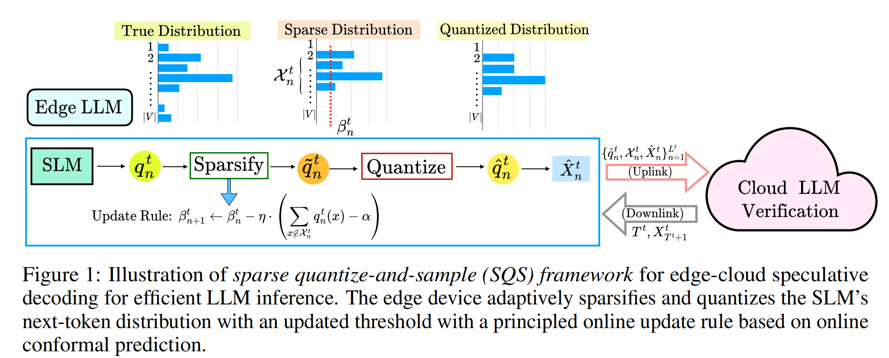

# 论文阅读

## 投稿

neurips workshop 
ccf a

## 问题

这篇论文的问题和Q-S的基本上是一样的，不过进一步说明尽管传输量化后的概率向量，但是由于词表很大 
> Qwen3：约 151,936
> Llama 3：128,000 (128K)

尽管传输量化后的概率分布依然是一个不小的传输量

所以论文呢的方法上是对Q-S的进一步改进。

## 方法

论文观察到SLM 的下一个 token 概率通常很稀疏，大部分概率集中在少数几个高概率 token 上。根据这个观察提出了一个框架 Sparse Quantize-and-Sample Speculative Decoding (SQS-SD)，也就是先稀疏化，然后进行量化，最后采样的投机解码

$$SLM 输出完整概率分布 \rightarrow 保留重要 token，删除低概率 token
\rightarrow
对保留的概率进行量化
\rightarrow
从量化后的分布中采样候选 token
\rightarrow
把候选 token 和稀疏概率分布传给云端
\rightarrow
云端 LLM 验证$$
###  K-SQS：固定 Top-K

稀疏化的时候保留概率Top-K的token

优点：
- 实现简单；
- 额外控制参数少；
- 在预测分布很尖锐时效果好；
- Top-K 集合的大小固定，通信格式相对容易设计。
缺点
- 固定 K 无法适应不同上下文。

### C-SQS：自适应稀疏化

不直接规定固定的 K，而是使用动态阈值：就是相当于 Top-p优化
$$ \mathcal{X}_n(\beta_n) = \{x:q_n(x)\geq\beta_n\} $$
论文使用如下更新规则去更新阈值：

$$ \beta_{n+1} = \beta_n - \eta \left( \sum_{x\notin\mathcal{X}_n}q_n(x)-\alpha \right) $$

其中：

- $\eta$：学习率；
- $\alpha$：目标删除概率质量；
- $\sum_{x\notin\mathcal{X}_n}q_n(x)$：当前被删除 token 的总概率。

直观理解：

- 如果删除的概率质量超过目标 $\alpha$，说明删得太多，需要降低阈值，保留更多 token；
- 如果删除的概率质量低于目标，说明可以更激进地稀疏化，提高阈值；
- 随着 token 持续生成，阈值会在线调整。

这就是论文中“conformal”的主要思想：通过在线反馈控制稀疏化误差，使长期平均的删除概率质量受到约束。

论文理论上证明：

$$ \frac{1}{T}\sum_{n=1}^{T}\alpha_n \leq \alpha+ \frac{|\beta_1|+1+\eta\alpha}{\eta T} $$

当生成 token 数 $T$ 足够大时，平均稀疏化误差接近目标值 $\alpha$。

### 实验

论文的实验不比较生成文本的文学质量，而是验证两个效率问题：
1. 在边缘设备和云端之间带宽有限时，稀疏化概率分布能不能降低推理延迟？
2. 固定保留 Top-K 的 K-SQS 和自适应阈值的 C-SQS，分别适合什么场景？
> 候选 token 的概率分布应该保留多少信息，才能既省通信，又不让云端频繁拒绝候选 token？

主要比较的方法
- `K-SQS (K=2)`
- `K-SQS (K=3)`
- `C-SQS (β=0.1)`
- `C-SQS (β=0.2)`