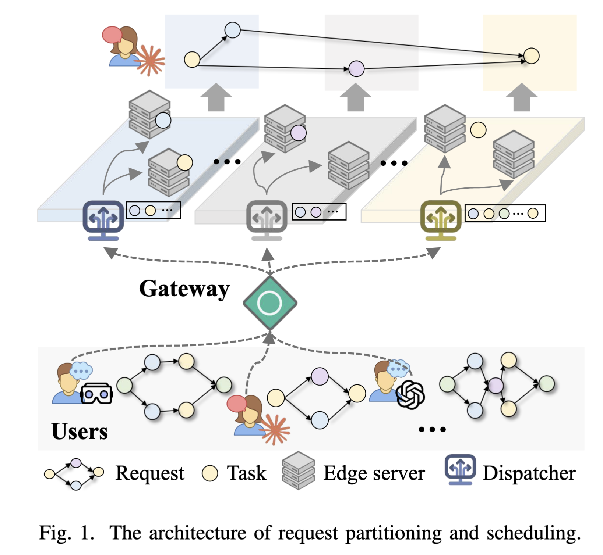
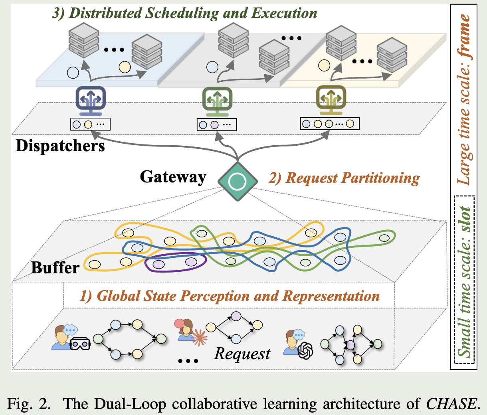
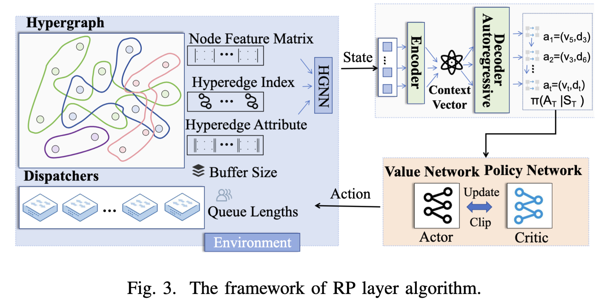
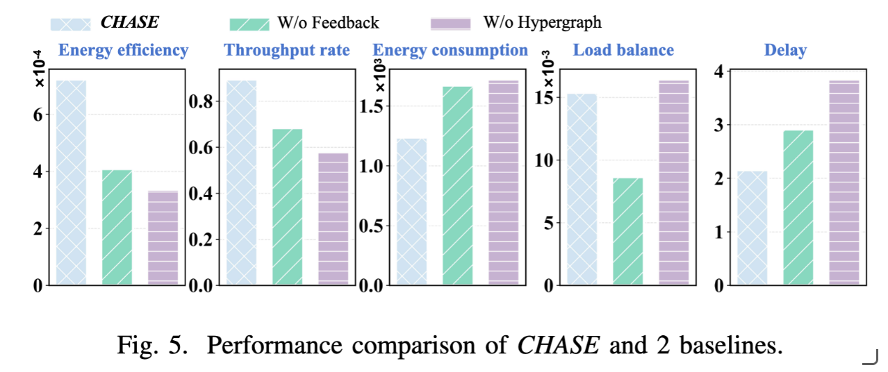
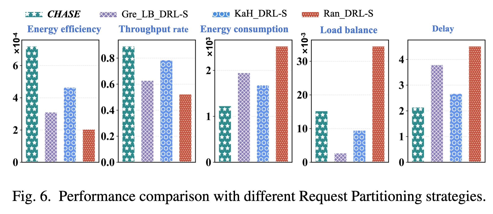
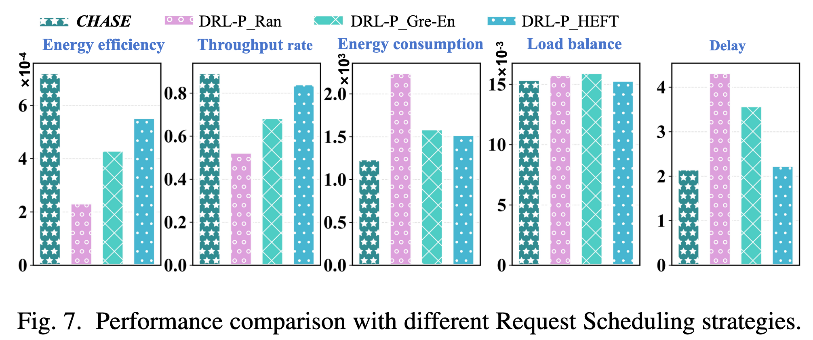

# 一、abstract

随着人工智能（AI）服务推动计算任务向边缘侧迁移，分布式边缘计算（Distributed Edge Computing，DEC）已成为一种重要的计算范式。在该范式中，一个中心逻辑实体负责将服务请求分解为多个任务，并将其分配至不同的分布式资源池。

然而，由于该中心实体（本文将其建模为网关）的决策通常没有与各异构资源池内部的本地调度进行联合优化，系统的全局性能受到根本性限制。采用分层强化学习（Hierarchical Reinforcement Learning，HRL）实现这种联合优化面临两个核心挑战：一是状态表示不充分造成严重的资源浪费，二是决策不准确导致过高的能源消耗。

为此，本文提出了一种名为 CHASE 的协同超图任务调度框架。针对状态表示不充分的问题，本文采用基于超图的状态表示方法，以捕获复杂的多元任务关系，从而实现更加全面且具有能耗感知能力的任务划分。针对决策不准确的问题，本文构建了一种带有跨层反馈机制的分层协同学习架构，使网关的任务划分方案能够与各调度器的实时调度动作动态同步。

最后，基于真实运行轨迹数据的实验结果表明，CHASE能够显著提升系统的能源效率。

# 二、INTRODUCTION

随着人工智能（AI）服务对快速响应的需求不断提高，为满足严格的时延和能耗要求，计算任务正逐渐从集中式云端向边缘侧迁移[1]。分布式边缘计算（Distributed Edge Computing，DEC）融合了边缘计算与并行计算，使一个服务请求能够被分解为多个相互依赖的任务，并将这些任务分配到不同的边缘资源池中并行执行[2]。任务分解与路由通常由一个中心逻辑实体负责[3]，本文将其建模为网关。该过程能够利用分散的计算资源，提高系统响应速度和能源效率[4]。

然而，现有大多数研究主要集中于资源池内部的调度优化，即由调度器决定如何将接收到的任务分配给资源池中的本地服务器。例如，Shi 等人[5]提出了一种基于深度强化学习的多用户分布式任务卸载方法，显著降低了处理时延；Shabariram 等人[6]则提出了一种面向移动用户的服务器分配方法，其性能优于博弈论基线方法。这些研究忽略了一个关键事实：系统的全局性能可能已经受到上游次优任务划分决策的限制，并且默认任务已经被路由到了合适的资源池。

实际上，由于计算能力、数据局部性和通信成本存在差异，不同任务与异构资源池之间的匹配程度也会显著不同[7]。如果不对任务分解和路由进行联合考虑，那么即使每个资源池都能够实现最优的本地调度，分布式边缘计算系统的整体性能上限仍然会受到根本性制约。因此，网关需要根据请求特征将任务分配到不同的资源池，而每个资源池中的调度器还需要进一步选择合适的服务器执行这些任务，从而共同提高能源效率，如图1所示。

分层强化学习（Hierarchical Reinforcement Learning，HRL）为解决这一联合优化问题提供了一个有力框架，因为其架构天然适合处理任务划分和任务调度这两种不同角色。然而，要实现全局最优，HRL仍受到以下两个系统性挑战的限制。

**（1）状态表示不充分导致严重的资源浪费。**

现有任务划分策略通常采用有向无环图（Directed Acyclic Graph，DAG）[8]，只能表示任务之间的先后依赖关系，却忽略了共享硬件需求等重要的高阶关联关系。这种不完善的表示方式阻碍了能源感知的资源分配，导致逻辑上相互关联的任务被不必要地分散到不同集群中。这种分散会造成硬件利用率低下和空闲功耗增加，进而直接带来严重的资源浪费。

**（2）决策不准确导致过高的能源消耗。**

在HRL框架中，任务划分和任务调度之间的必要解耦会造成严重的信息缺口。由于网关无法掌握调度器的细粒度实时状态，其任务划分决策不可避免地会出现偏差，表现为网关规划方案与实际资源状态之间的策略不匹配[9]。这种不匹配会直接导致资源竞争、任务拥塞，并最终造成过高的能源消耗。

针对上述问题，本文提出了一种新的协同超图任务调度框架，称为 **CHASE**。该框架通过以下两种核心方法解决状态表示不足和决策不准确问题。

- **基于超图的状态表示：** 本文提出一种动态超图，其超边可以连接多个顶点，不仅表示任务之间的顺序依赖关系，还表示基于共享任务属性形成的重要高阶关联关系。通过捕获这些被现有方法忽略的关联关系，可以实现更加节能的资源分配。

- **分层协同学习架构：** 本文提出一种分层协同学习架构，通过跨层反馈机制将调度器的执行反馈传递给上层，使系统能够动态调整并解决任务划分决策不准确的问题。该机制能够使网关的任务划分方案与资源的实时状态保持一致，从而避免持续进行低效率、高能耗的计算。

# 三、SYSTEM MODEL AND PROBLEM FORMULATION

本文面向异构分层边缘计算环境，通过构建一种智能任务划分与调度框架，解决系统能耗最小化问题。

### A. 系统描述

系统由一个网关 $G$、$D$ 个调度器组成的集合 $\mathcal{D}$，以及 $S$ 台边缘服务器组成的集合 $\mathcal{S}$ 构成。系统支持全局服务类型集合 $\mathcal{K}$，用于处理用户请求集合 $\mathcal{R}$。

每个请求 $r\in\mathcal{R}$ 都被表示为一个由相互依赖任务构成的有向无环图：

$$ G_r=\{\mathcal{M}_r,\mathcal{E}_r\} $$

所有任务构成集合 $\mathcal{M}=\bigcup_{r\in\mathcal{R}}\mathcal{M}_r$，其中 $m_{i,r}$ 表示请求 $r$ 中的第 $i$ 个任务。每个任务 $m_{i,r}$ 都需要集合 $\mathcal{K}$ 中的一种服务类型 $k(m_{i,r})$。

任务依赖边集合定义为：

$$ \mathcal{E}_r=\left\{(m_{i,r},m_{j,r})\mid m_{i,r},m_{j,r}\in\mathcal{M}_r,\ r\in\mathcal{R}\right\} $$

这些边表示任务之间的先后约束，即任务 $m_{i,r}$ 必须先于任务 $m_{j,r}$ 执行。网关 $G$ 负责将任务路由至不同调度器。每个调度器 $D_d\in\mathcal{D}$ 通过局域网络管理其对应的边缘服务器集合 $\mathcal{S}_d$，并负责调度任务。全部服务器构成集合 $\mathcal{S}=\bigcup_{D_d\in\mathcal{D}}\mathcal{S}_d$，每台服务器 $s\in\mathcal{S}$ 只能处理服务类型子集 $\mathcal{K}_s\subseteq\mathcal{K}$。

### B. 系统模型

系统包含两个密切相关的过程。

1. **请求划分（Request Partitioning，RP）**：决定请求中的任务被路由至哪个调度器：

$$\mathcal{X}\triangleq\left\{x_{i,r,d}\in\{0,1\}\mid m_{i,r}\in\mathcal{M}_r,\ r\in\mathcal{R},\ D_d\in\mathcal{D}\right\} $$

当 $x_{i,r,d}=1$ 时，任务 $m_{i,r}$ 被路由至调度器 $D_d$；否则 $x_{i,r,d}=0$。

2. **请求调度（Request Scheduling，RS）**：将请求中的任务分配至具体服务器：

$$ \mathcal{Y}\triangleq\left\{y_{i,r,d}\in\mathcal{S}_d\mid m_{i,r}\in\mathcal{M}_r,\ r\in\mathcal{R},\ D_d\in\mathcal{D}\right\} $$

$\mathbb{I}{y_{i,r,d}=s_d}=1$ 表示任务 $m_{i,r}$ 被调度至边缘服务器 $s_d$。每个任务只能被调度至一台边缘服务器：

$$ \sum_{s_d\in\mathcal{S}_d}\mathbb{I}\{y_{i,r,d}=s_d\}=1 $$

系统采用两级时间尺度：请求划分以“帧”为单位进行，本地调度则以“时隙”为单位进行。

#### 1. 时延模型

一个请求的完成时延取决于其中各任务的依赖关系，并定义为该请求所有任务完成时间的最大值：

$$ T_r=\max_{m_{i,r}\in\mathcal{M}_r}\left\{T^F_{i,r}\right\} \tag{1} $$

其中，$T^F_{i,r}$ 表示任务 $m_{i,r}$ 的完成时间，可计算为：

$$ T^F_{i,r}=T^{\mathrm{tr}}_{i,r}+\max\left\{T^A_{i,r},\ \max_{j\in AL(i)}\left(T^F_{j,r}+T^{\mathrm{out}}_{i,j,r}\right)\right\}+T^{\mathrm{co}}_{i,r,s_d} \tag{2} $$

$T^{\mathrm{tr}}_{i,r}=D_{j,r}/F_d$ 表示任务数据从网关传输至调度器 $D_d$ 的时延，其中 $D_{j,r}$ 为任务数据量，$F_d$ 为网关与调度器 $D_d$ 之间的传输速率。$T^A_{i,r}$ 表示任务 $m_{i,r}$ 在调度器中可以开始被调度的时间。

$T^{\mathrm{out}}_{i,j,r}$ 表示任务 $m_{i,r}$ 与 $m_{j,r}$ 之间中间结果的传输时延。如果两个任务分别被调度至调度器 $D_d$ 和 $D_q$，则：

$$ T^{\mathrm{out}}_{i,j,r}=\frac{O_{i,j,r}}{F_{d,q}} $$

其中，$O_{i,j,r}$ 是从任务 $m_{i,r}$ 传递至任务 $m_{j,r}$ 的输出数据量，$F_{d,q}$ 是调度器 $D_d$ 与 $D_q$ 之间的传输速率。如果两个任务被分配至同一调度器，则 $T^{\mathrm{out}}_{i,j,r}=0$。

任务计算时延 $T^{\mathrm{co}}_{i,r,s_d}$ 取决于任务资源需求 $C_{i,r}$ 和服务器计算能力 $F_{s_d}$：

$$ T^{\mathrm{co}}_{i,r,s_d}=\frac{C_{i,r}}{F_{s_d}} $$

#### 2. 能耗模型

请求总能耗由计算能耗、网关到调度器的传输能耗，以及调度器之间的中间结果传输能耗组成。计算能耗定义为：

$$ E_r^{\mathrm{co}}=\sum_{m_{i,r}\in\mathcal{M}_r}E_{i,r}^{\mathrm{co}}=\sum_{m_{i,r}\in\mathcal{M}_r}\left[\kappa(s_d)\,F(s_d)^\alpha T^{\mathrm{co}}_{i,r,s_d}\right] \tag{3} $$

其中，$\kappa(s_d)$ 是服务器 $s_d$ 的功率系数，$\alpha$ 是描述计算能力与功耗之间非线性关系的常数指数。

网关到调度器的传输能耗为：

$$ E_r^{\mathrm{tr}}=\sum_{m_{i,r}\in\mathcal{M}_r}E_{i,r}^{\mathrm{tr}}=\sum_{m_{i,r}\in\mathcal{M}_r}T^{\mathrm{tr}}_{i,r}P_{i,r,d} \tag{4} $$

其中，$P_{i,r,d}$ 表示网关向调度器 $D_d$ 传输任务时的传输功率。调度器之间传输中间结果所产生的能耗为：

$$ E_r^{\mathrm{out}}=\sum_{m_{i,r},m_{j,r}\in\mathcal{M}_r}T^{\mathrm{out}}_{i,j,r}P_{d,q} \tag{5} $$

其中，$P_{d,q}$ 表示调度器 $D_d$ 与 $D_q$ 之间的传输功率。因此，请求 $r$ 的总能耗为：

$$ E_r=E_r^{\mathrm{co}}+E_r^{\mathrm{tr}}+E_r^{\mathrm{out}} $$

### C. 问题表述

系统目标是在实现高系统吞吐率的同时降低能源消耗。长期系统吞吐率定义为在时延容限内完成的请求数占所有到达请求数的比例：

$$ \Theta=\frac{\displaystyle\sum_t^\infty\sum_{r\in\mathcal{R}}\mathbb{I}\{T_r\leq\tau_r\}}{\displaystyle\sum_t^\infty\Gamma(Q)} \tag{6} $$

其中，$\tau_r$ 是请求 $r$ 的时延容限，$\Gamma(Q)$ 是到达网关的请求数量。长期系统能耗定义为所有在时延容限内完成的请求所消耗的总能量：

$$ \Upsilon=\sum_t^\infty\sum_{r\in\mathcal{R}}E_r \tag{7} $$

负载均衡指标用于衡量不同调度器之间的工作负载分布：

$$ l=\frac{1}{1+\exp(-a)} $$

其中，$a$ 是不同调度器资源利用率的标准差。请求划分与请求调度的联合优化问题被定义为：

$$ \mathcal{P}:\quad \max_{\{x_{i,r,d}\},\{y_{i,r,d}\}}\;w_1\frac{\Theta}{\Upsilon}-w_2l \tag{8a}$$
$$\text{s.t.}\quad \sum_{D_d\in\mathcal{D}}x_{i,r,d}=1,\quad \forall m_{i,r}\in \mathcal{M}, \tag{8b}$$$$ \sum_{s_d\in\mathcal{S}_d}\mathbb{I}\{y_{i,r,d}=s_d\}=1,\qquad \forall m_{i,r}\in\mathcal{M}_r. \tag{8c} $$

其中，$w_1$ 和 $w_2$ 为权重参数。该问题是一个复杂的非线性规划问题，具有计算复杂度高，以及网关与调度器之间状态信息不完全等特点。

### D. 两阶段问题分解

为求解上述问题，本文将联合优化问题分解为请求划分和请求调度两个子问题。

**1. 请求划分子问题：** 将相互依赖的任务分配至不同调度器会产生通信能耗。因此，网关的任务划分策略需要在降低能耗的同时维持较高吞吐率并实现调度器之间的负载均衡：

$$ \mathcal{P}_1:\quad \max_{x_{i,r,d}}\;w_1\Theta-w_2\left(\sum_t^\infty\sum_{r\in\mathcal{R}}\sum_{m_{i,r}\in\mathcal{M}_r}\left(E_{i,r}^{\mathrm{tr}}+E_{i,r}^{\mathrm{out}}\right)\right)-w_3l,\qquad \text{s.t.}\;(8b). \tag{9} $$

**2. 请求调度子问题：** 从调度器的角度看，需要更加高效地调度已经分配的任务，使每个请求都能在时延阈值内完成，同时降低计算能耗：

$$ \mathcal{P}_2:\quad \max_{y_{i,r,d}}\;\beta_1\Theta-\beta_2\sum_t^\infty\sum_{r\in\mathcal{R}}\sum_{m_{i,r}\in\mathcal{M}_r}E_{i,r}^{\mathrm{co}},\qquad \text{s.t.}\;(8c). \tag{10} $$

# 四、THE CHASE STRATEGY

CHASE采用分层强化学习（HRL）框架，将请求划分与任务调度解耦。网关基于能够捕获高阶任务依赖关系的动态超图执行任务划分，而各调度器负责具体的任务调度。两个层次通过协同反馈机制进行联合训练，以提高能源效率。

### A. 双循环协同架构

CHASE的工作流程是一个周期性的多阶段过程，用于同步请求划分决策与请求调度动作。如图2所示，每个主要帧包含以下阶段。

**1）全局状态感知与表示**

在每个帧开始时，系统首先构建一个超图，用于描述网关缓冲区中所有待处理任务之间复杂的高阶依赖关系。随后，系统对这些结构信息进行编码，并将其与其他实时系统指标结合，形成全面的状态表示，为决策智能体提供全局上下文。

**2）请求划分与策略学习**

网关利用全局状态生成任务分配方案。该学习过程包含两个方面：一方面，根据任务划分方案的结构属性获得即时奖励；另一方面，网关还根据延迟反馈信号进行学习。该反馈信号在一个帧结束时计算，用于反映调度器执行网关决策后所取得的真实全局性能。

**3）分布式调度与执行**

任务划分方案决定每个调度器需要处理哪些任务。各调度器根据分配给自己的任务以及所管理服务器的状态，实时、事件驱动地做出调度决策。所有调度器共享一个团队奖励，以协同优化系统目标。

### B. 请求划分层：基于超图的方法

如图3所示，网关的任务划分过程包含两个阶段。首先，系统构建动态超图：

$$ \mathcal{H}_T=(\mathcal{V}_T,\mathcal{E}_T,\mathcal{W}_T) $$

用于表示系统中的高阶关联关系。随后，将任务划分问题建模为马尔可夫决策过程（MDP），并通过自回归指针式策略网络求解[10]。

#### 1. 超图的增量构建

在每个帧 $T$ 开始时，系统更新顶点集合 $\mathcal{V}_T$，以反映当前待处理的任务；同时重建超边集合 $\mathcal{E}_T$，以捕获任务之间的关系。完整的超边集合由以下两类超边组成：

$$ \mathcal{E}_T=\mathcal{E}_{\mathrm{seq}}\cup\mathcal{E}_{\mathrm{assoc}} $$

**顺序依赖超边 $\mathcal{E}_{\mathrm{seq}}$：**

这类超边是二元超边，用于表示由原始任务DAG导出的直接先后约束：

$$ \mathcal{E}_{\mathrm{seq}}=\left\{\{v_j,v_i\}\mid(m_j,m_i)\in\mathcal{E}_r,\ \forall r\in\mathcal{R}\right\} \tag{11} $$

**关联依赖超边 $\mathcal{E}_{\mathrm{assoc}}$：**

这类多元超边用于表示非顺序的、基于任务属性的关系。本文根据任务的服务类型构造这种关联关系。具有相同服务类型属性的顶点构成集合：

$$ \mathcal{V}_k=\left\{v_i\in\mathcal{V}_T\mid\operatorname{service\_type}(v_i)=k\right\} $$

关联超边集合定义为：

$$ \mathcal{E}_{\mathrm{assoc}}=\left\{\mathcal{V}_k\mid\forall k\in\mathcal{K}_{\mathrm{buff}}\right\} \tag{12} $$

其中，$\mathcal{K}_{\mathrm{buff}}$ 表示当前待处理任务中出现的所有不同服务类型的集合。

超图的表达能力来自动态计算的属性，这些属性能够将实时系统状态映射到图的拓扑结构中。在每个帧中，系统都会更新顶点特征和超边权重。

每个顶点 $v_i\in\mathcal{V}_T$ 都具有一个特征向量 $x_i\in\mathbb{R}^{d_v}$。该向量结合了静态属性和动态属性，其中包括用于衡量任务紧迫程度的松弛时间：

$$ slack_i=\max\left(0,deadline_i-t_{\mathrm{current}}\right) $$

该特征向量还包含两个 $M$ 维成本向量。

动态计算成本向量 $e_i^{\mathrm{comp}}$ 用于预测将任务分配给各个调度器 $D_j$ 所产生的能耗：

$$ \left[e_i^{\mathrm{comp}}\right]_j= \left(\kappa_jF_j^\alpha\frac{C_i}{F_j}\right) \left(1+\lambda\cdot\operatorname{load}_j\right) \tag{13} $$

其中，$F_j$ 和 $\kappa_j$ 分别表示调度器 $D_j$ 所属服务器集群的平均计算能力和功率系数；$\operatorname{load}_j$ 表示该集群的实时利用率；$\lambda$ 是负载影响系数。

网关传输成本向量 $e_i^{\mathrm{gw}}$ 用于预测从网关向各调度器 $D_j$ 传输任务时产生的能耗。该成本取决于任务大小 $D_{i,r}$、调度器的计算能力 $F_j$ 以及传输功率 $P_{i,r,j}$。

对于顺序依赖超边 $e_i^j\in\mathcal{E}_{\mathrm{seq}}$，其权重是一个 $M\times M$ 的通信成本矩阵 $W(e_i^j)$，用于量化将具有依赖关系的任务分配到不同调度器时产生的惩罚。

矩阵中的每个元素 $\left[W(e_i^j)\right]_{ab}$ 表示将父任务分配给调度器 $D_a$、子任务分配给调度器 $D_b$ 时产生的通信能耗：

$$ \left[W(e_i^j)\right]_{ab} = \mu_{ji}P_{a,b}\frac{O_{i,j,r}}{F_{a,b}}, \qquad a\neq b \tag{14} $$

其中，$\mu_{ji}$ 用于惩罚大规模数据传输：当 $O_{i,j,r}>\theta_{\mathrm{data}}$ 时，$\mu_{ji}>1$；否则 $\mu_{ji}=1$。

对于关联超边，其权重被设计为一个鼓励相关任务共同部署的激励矩阵。

#### 2. 基于PPO的任务划分策略学习

本文将任务划分策略建模为MDP，并使用基于PPO训练的编码器-解码器架构进行学习。

编码器通过超图神经网络（HGNN）处理超图结构，并结合系统指标生成全面的状态嵌入。自回归解码器则利用该嵌入，并结合门控循环单元（GRU）[11]和注意力机制，按顺序生成任务分配方案，同时根据之前已经生成的决策调整后续决策。

**状态 $S$：**

在帧 $T$ 开始时，状态 $s_T$ 由实时系统指标和超图嵌入共同构成：

$$s_T=\left(\{q_d\}_{d\in\mathcal{D}},q_g,H_T^{\mathrm{embed}}\right) \tag{15} $$
其中，${q_d}_{d\in\mathcal{D}}$ 表示各调度器的队列长度，$q_g$ 表示网关缓冲区大小，$H_T^{\mathrm{embed}}$ 表示由HGNN生成的超图嵌入集合。

这些嵌入由原始超图结构生成：

$$ H_T^{\mathrm{embed}} = \Phi_{\mathrm{HGNN}} \left(X,E_{\mathrm{idx}},E_{\mathrm{attr}}\right) \tag{16} $$

其中，$X$ 是顶点特征矩阵，$E_{\mathrm{idx}}$ 是定义超边连接关系的超边索引张量，$E_{\mathrm{attr}}$ 是超边属性矩阵。

每个顶点特征向量 $x_{i,r}\in X$ 由任务的静态属性和动态成本向量拼接而成：

$$ x_{i,r} = \left(D_{i,r},k_{i,r},\tau_{i,r}, e_{i,r}^{\mathrm{comp}},e_{i,r}^{\mathrm{gw}}\right) $$

其中，$D_{i,r}$ 表示任务大小，$k_{i,r}$ 表示服务类型，$\tau_{i,r}$ 表示时延容限。与此同时，$E_{\mathrm{attr}}$ 中的每个超边属性都是一个 $M\times M$ 的通信成本矩阵 $W(e_i^j)$。

**动作 $A$：**

帧 $T$ 的完整动作 $A_T$ 是一个最多包含 $K$ 个任务分配决策的序列。每个分配决策表示为任务与调度器组成的二元组：

$$ \left(m_{i,r},D_d\right) $$

整个动作序列定义了任务划分方案 $\mathcal{X}$，即确定哪些 $x_{i,r,d}$ 的值为1。

**奖励 $R$：**

在状态 $s_T$ 下执行动作 $A_T$ 后，系统获得奖励 $R_{\mathrm{router}}(s_T,A_T)$。设 $\mathcal{M}_T$ 表示帧 $T$ 中需要进行任务划分的任务集合，则奖励函数定义为：

$$ R_{\mathrm{router}} = w_{\mathrm{energy}} \left( \sum_{e\in\mathcal{E}_{T,\mathrm{uncut}}}w(e) - \sum_{m_{i,r}\in\mathcal{M}_T}E_{i,r}^{\mathrm{tr}} \right) - w_{\mathrm{balance}}l + w_{\mathrm{feedback}}\Theta \tag{17} $$

其中，$w_{\mathrm{energy}}$、$w_{\mathrm{balance}}$ 和 $w_{\mathrm{feedback}}$ 是可调节的权重参数。

第一项通过奖励未被切分的超边 $\sum w(e)$，并惩罚网关到调度器的总传输能耗 $\sum E_{i,r}^{\mathrm{tr}}$，从而共同优化通信成本。

超边的重要性权重 $w(e)$ 根据其属性矩阵计算。对于顺序依赖超边 $e_i^j$，其标量权重是所有潜在跨调度器通信成本的平均值：

$$ w(e_i^j) = \frac{1}{M(M-1)} \sum_{a\neq b} \left[W(e_i^j)\right]_{ab} $$

第二项是对负载不均衡的直接惩罚，与系统模型中定义的负载均衡指标相对应。具体而言：

$$ l=\frac{1}{1+\exp(-a)} $$

其中：

$$ a=std \left(\{L_{D_d}\}\right) $$

$L_{D_d}$ 表示调度器 $D_d$ 的预测工作负载，其计算方式为被分配给该调度器的所有任务的计算成本之和：

$$ L_{D_d} = \sum_{m_{i,r}\ \mathrm{assigned\ to}\ D_d} \left[e_{i,r}^{\mathrm{comp}}\right]_d $$

最后一项是延迟奖励，它直接引入当前帧的全局吞吐率 $\Theta$。

该智能体的目标是学习一个任务划分策略 $\pi^{\mathrm{RP}}(A_T\mid s_T)$，使期望折扣累计奖励最大化：

$$ J\left(\pi^{\mathrm{RP}}\right) = \mathbb{E} \left[ \sum_{T=0}^{\infty} \gamma^T R_{\mathrm{router},T} \right] $$

该策略通过PPO的截断代理目标函数进行更新。

### C. 请求调度层：协同多智能体方法

请求调度问题被建模为一个协同多智能体任务，具体形式为去中心化部分可观测马尔可夫决策过程（Decentralized Partially Observable Markov Decision Process，Dec-POMDP）[12]。

**状态 $S$：**

在每个时隙中，每个智能体 $d$ 都会构造一个局部观测：
$$ o_d= \left( X_d^{\mathrm{task}}, X_d^{\mathrm{server}} \right) $$

其中，任务特征矩阵 $X_d^{\mathrm{task}}$ 描述每个就绪任务的属性，包括：

- 任务大小；
- 剩余时延；
- 服务类型；
- 依赖任务数量。

服务器状态矩阵 $X_d^{\mathrm{server}}$ 描述该调度器所管理服务器的实时状态，包括服务器可用性和计算能力。

全局状态由所有局部观测组成：

$$ s=\left\{o_d\mid d\in\mathcal{I}\right\} $$

该全局状态仅用于集中式评论家网络的训练。

**动作 $A$：**

动作空间是离散的。每个智能体 $d$ 的单独动作 $a_d$ 是一个索引，用于选择一个有效的“任务-服务器”组合进行调度。

所有智能体在同一时隙内采取的动作共同构成联合动作：

$$ a=\{a_d\mid d\in\mathcal{I}\} $$

**奖励 $R$：**

由于这是一个完全协同的任务，所有智能体共享同一个团队奖励。在每个时隙中，该奖励定义为：

$$ R_{\mathrm{inner}}(s,a) = w_{\mathrm{task}}\Delta N_{\mathrm{completed\ task}} - w_e\Delta E_{\mathrm{comp}} \tag{18} $$

其中，$\Delta N_{\mathrm{completed\ task}}$ 表示当前时隙中新完成的任务数量，$\Delta E_{\mathrm{comp}}$ 表示当前时隙消耗的计算能量，$w_{\mathrm{task}}$ 和 $w_e$ 是用于平衡任务完成数量与能耗的可调权重。

# 五、EXPERIMENTAL EVALUATION

### A. 实验环境

**服务与请求。** 本文采用阿里巴巴集群运行轨迹数据集（Alibaba Cluster Trace）[13]。该数据集中的每个DAG包含10至120个任务。在保留原始任务依赖关系的基础上，本文根据符合实际情况的分布对任务数据量等属性进行采样。请求按照参数 $\lambda=0.045$ 的泊松过程到达系统[14]。

**边缘服务器与网关。** 实验基础设施包含1个网关、3个调度器和8台异构服务器。服务器CPU频率从1.2至4.0 GHz范围内均匀采样，功率系数 $\kappa$ 的取值范围为0.3至0.9。

3条网关到调度器链路的传输速率分别为500 Mbps、700 Mbps和1000 Mbps，对应传输功率分别为3.0 W、5.0 W和7.0 W。调度器之间链路的传输速率统一设置为1000 Mbps，传输功率设置为5.0 W。

**算法设置。** 所有智能体均使用PyTorch实现，并采用Adam优化器进行训练。学习率设置为 $10^{-3}$，折扣因子 $\gamma$ 设置为0.99，PPO截断参数 $\epsilon$ 设置为0.2。

RP智能体采用三层超图编码器，其中包含4个注意力头和128个隐藏单元，并配合一个基于GRU的解码器。RS智能体则采用多头注意力模块。

> GRU用于自回归决策

### B. 超图与反馈奖励的作用

#### 1. 基于超图的状态表示的有效性
![[CHASE_4.png]]

如图4所示，本文将CHASE与不使用超图的DAG版本（W/o Hypergraph）进行比较，以验证超图状态表示的作用。

通过建模DAG无法表示的关联依赖关系，超图方法使RP层的奖励提高了15.7%，从而学习到更优的通信感知任务划分策略。

这种优势在RS层中进一步扩大，RS层奖励提高了32.6%。该结果表明，超图能够为任务调度构建结构化环境，并且对于实现全局优化具有重要作用。

#### 2. 延迟反馈奖励的必要性

如图4所示，只使用即时奖励进行训练的变体（W/o Feedback）会学习到一种短视策略。该策略过度优化任务划分方案的结构指标，却忽略了实际资源的异构性。

因此，W/o Feedback在RP层收敛到次优奖励，其最终奖励比CHASE低24.6%。这种短视的上层规划还会在下游形成严重瓶颈，妨碍RS智能体的学习，使系统性能下降119.2%。

上述结果证明，反馈信号是必要的。它能够推动RP智能体超越表面的结构指标，根据真实执行结果学习全局最优策略。

>RP动作向下传递
>RS状态与执行效果向上反馈，反馈的内容是RP的输入

#### 3. 整体性能评估

如图5所示，与W/o Feedback和W/o Hypergraph相比，CHASE的能源效率分别提高了76.8%和115.1%。

W/o Hypergraph忽略了任务之间的关联依赖关系，因此产生过高的通信开销，并造成78.4%的时延惩罚。

W/o Feedback表现出短视优化特征。虽然该方法将负载方差降低了43.8%，但由于不能适应资源异构性，其时延增加了35.2%。

相比之下，CHASE能够在局部负载均衡和全局最优之间进行权衡。通过全面的超图状态表示和端到端反馈学习，与W/o Feedback相比，CHASE使时延和能耗降低了26.0%。

### C. 分层架构性能分析

#### 1. RP学习层的有效性

如图6所示，本文通过将学习得到的RP层替换为以下三种基线方法，验证RP策略的有效性：

- **KaH_DRL-S**[15]：采用KaHyPar静态超图优化器；
- **Gre-LB_DRL-S**[16]：采用贪心负载均衡启发式算法；
- **Ran_DRL-S**：采用随机任务划分策略。

本文方法在所有基线上均取得了显著优势。与性能较强的KaHyPar变体相比，本文策略的能源效率提高了54.6%。

这种优势来自端到端训练机制。该机制能够突破KaHyPar等离线优化器的静态限制，寻找全局最优策略。同时，它能够处理短视启发式方法难以解决的复杂权衡，避免了仅关注负载均衡的Gre-LB_DRL-S所产生的77.0%时延惩罚。

#### 2. RS学习层的有效性

如图7所示，本文固定RP智能体，并分别使用以下三种基线方法替换RS层，以验证学习得到的调度策略：

- **DRL-P_HEFT**[17]：经典的最早完成时间最小化算法；
- **DRL-P_Gre-En**[18]：贪心节能算法；
- **DRL-P_Ran**：随机调度策略。

RS智能体再次取得了最佳的综合性能。与DRL-P_HEFT相比，本文方法的能源效率提高了30.7%。

实验结果表明，本文智能体能够有效处理执行层面的多目标权衡：一方面抑制以时延为中心的HEFT算法所产生的高能耗；另一方面避免短视的Gre-En算法造成严重时延恶化。