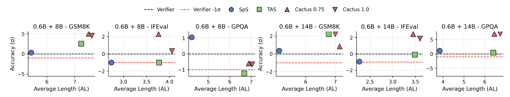

# 论文阅读

## 论文信息

- **论文题目**：Cactus: Accelerating Auto-Regressive Decoding with Constrained Acceptance Speculative Sampling
- **中文题目**：Cactus：用受约束的接受式投机采样加速自回归解码
- **作者**：Yongchang Hao、Lili Mou
- **单位**：University of Alberta
- **会议**：ICLR 2026
- **研究方向**：大语言模型推理加速、投机采样
- **论文类型**：方法型/系统型论文

## 概括

Cactus 允许投机采样在可控范围内偏离大模型分布，从而接受更多小模型草稿、减少大模型调用，并提高生成速度。

## 背景与问题
### 背景

大语言模型通常采用自回归方式生成文本，即一次生成一个 token。每生成一个 token，都需要运行一次大模型，因此推理速度较慢、计算成本较高。

投机采样（Speculative Sampling, SpS）试图解决这个问题：
1. 小模型先生成一串候选 token；
2. 大模型一次性验证这些 token；
3. 如果候选质量较好，就一次接受多个 token。

这样可以减少大模型调用次数。

### 现有方法的问题

传统 SpS 要求最终输出分布与大模型完全一致，因此比较保守：

- 小模型只要对某个 token 过于自信；
- 大模型认为这个 token 的概率没那么高；
- 该 token 就可能被拒绝；
- 后面的草稿也可能被丢弃。

TAS 可以放宽接受条件，提高接受率，但它没有严格控制输出分布的变化，可能导致：

- 接受一些“看起来合理但实际上不合适”的 token；
- 后续推理方向发生变化；
- 在 GPQA 等困难任务上准确率下降。

本文研究的问题是：
> 如何在提高 token 接受率、加速生成的同时，控制生成结果不要偏离大模型太多？

## 核心方法
### 4.1 直觉理解

这个过程：

- 小模型先写草稿；
- 大模型审核；
- 传统 SpS 过于严格；
- Cactus 给大模型设置有限的“容错预算”。

在这个预算内，Cactus 会适当提高当前候选 token 被接受的概率，不会大幅改变大模型整体的概率分布。
Cactus 把问题写成一个约束优化：
- 给每轮一个 KL 散度预算 δ，表示“允许偏离大模型多少”；
	- δ = 0：退化为传统 SpS；
	- δ 越大：通常接受更多 token、生成更快；
	- δ 太大：可能接受低质量内容，导致回答变长或出错。
- 只稍微提高当前候选 token 的概率；
- 其他 token 按比例缩小，尽量保持大模型原来的分布形状；
- 再根据这个调整后的分布进行接受或拒绝。

### 4.2 Cactus 的基本流程

1. 小模型生成 `m` 个候选 token；
2. 大模型并行计算这些候选 token 的概率；
3. 找到当前正在检查的候选 token；
4. Cactus 临时提高该 token 的概率；
5. 按新的接受概率决定是否保留；
6. 如果接受了更多连续 token，就减少下一次大模型调用。

### 4.3 关键参数 δ

`δ` 表示允许分布偏离大模型的程度。
- `δ = 0`：基本退化为传统 SpS；
- `δ` 较小：更接近大模型，速度提升较保守；
- `δ` 较大：接受更多 token，但可能损害质量；
- `δ` 过大：可能导致推理变长甚至答错。
因此，`δ` 是一个“速度—质量”调节旋钮。

### 4.4 关键公式的直观含义

如果大模型给当前候选 token 的概率是 `q(n)`，Cactus 会把它提高到近似：

$$γ = q(n) + \sqrt {[2δq(n)(1-q(n))]}$$

然后按比例降低其他 token 的概率，使总概率仍然为 1。

这意味着 Cactus 不是完全改写大模型分布，而是：

> 只给当前候选 token 一个受控的小幅奖励。

## 关键结果

Figure 1 展示了准确率和平均接受长度之间的关系。Cactus 的点通常位于更高的接受长度区域，同时准确率保持在 verifier 的置信范围内；TAS 虽然接受长度更高，但在 GPQA 等困难任务上出现明显准确率下降。这说明 Cactus 在速度和质量之间取得了更稳定的折中。

## 论文贡献

### 7.1 理论贡献

把投机采样重新表述为一个优化问题：

> 在控制分布偏离程度的前提下，尽量提高候选 token 的接受率。

### 7.2 方法贡献

提出 Cactus，一种：
- 不需要额外训练；
- 计算开销较低；
- 可以控制分布偏离；
- 能提高接受率的投机采样方法。

### 7.3 实验贡献

在多个模型、多个数据集和多个任务上验证了 Cactus 的有效性和泛化能力。

## 局限性

主要局限包括：
- 最大只测试到 32B 模型；
- 没有进一步研究模型训练或校准；
- 额外的小模型和缓存会增加显存占用；
- 最终的整体分布偏差只有理论上界，实际参数 `δ` 仍需要调节；
- 当 `δ` 过大时，可能接受低质量草稿，导致冗长或错误推理。