# 一、abstract

云与边缘的协同合作充分释放了边云系统的潜力。然而，边云平台带来了显著的去中心化、异构性、复杂性和不稳定性。这些特性给边云系统的最优调度问题带来了前所未有的挑战，主要表现为决策不准确和收敛速度慢。

本文提出了一种面向边云系统的**好奇心驱动协同请求调度**方案，即Cur-CoEdge。
- 针对决策不准确的挑战，我们引入了一种时间尺度与决策层级交互机制。该机制采用小-大时间尺度调度学习框架，促进不同决策层级之间的相互学习。
- 针对收敛慢的挑战，我们深入探究其根本原因（如强化学习中的稀疏奖励设置），并提出了一种好奇心驱动的协同探索方法。该方法在云端激发内在好奇心，同时驱动调度器对环境进行个体和集体双层探索。此外，该协同探索方法的有效性也得到了理论收敛性证明的支撑。

最后，我们在网络硬件系统上结合两个真实世界的 trace 实现了原型系统。实验评估表明，该方案取得了显著改进：时间效率最高提升 26%，系统吞吐量最高提升 40%，收敛速度最高提升 71%。

# 二、introduction

随着联网设备感知和采集的数据呈指数级增长，集中式云计算目前正面临计算能力、处理效率、时延以及隐私等方面的重大性能挑战 [1]、[2]。元宇宙、在线游戏和 VR/AR 等时延敏感型应用的需求不断上升，使能够为终端用户提供邻近计算资源的边云系统受到广泛关注 [3]。

与集中式云计算不同，边云系统具有多样化的部署方式，其中一种极具代表性的形式是众包式部署 [4]。具体而言，边缘服务器由第三方提供，并通过商业激励模式聚合起来。当参与者愿意时，便可以将其资源贡献给边云系统；这些边缘服务器也可以随时退出或重新加入服务。此外，由于缺乏统一的监管规范，众包式边缘服务器更容易发生故障。因此，边云系统具有分布式、异构、复杂和不稳定等特点 [5]。

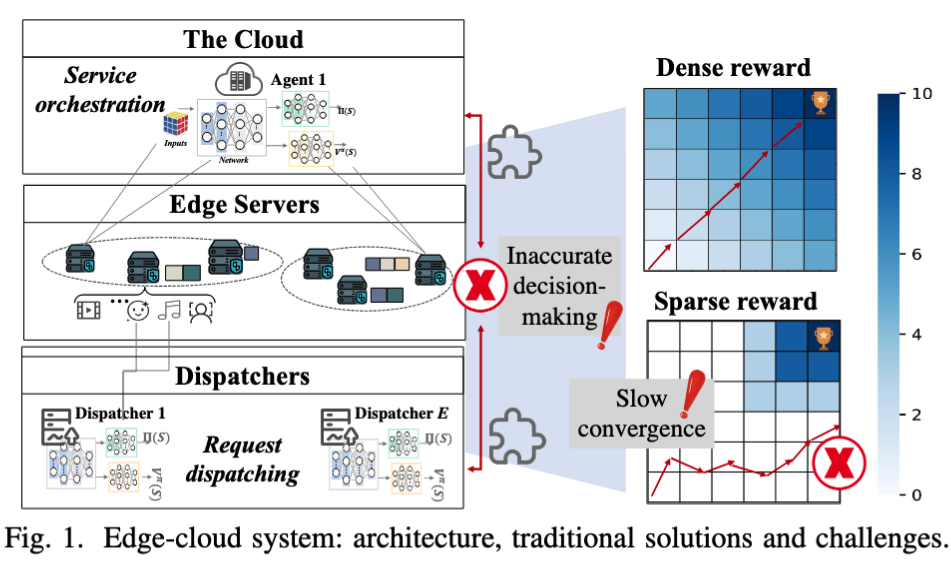

此外，实现高效边云系统的根本挑战在于如何解决最优调度问题，其中包括请求分派和服务编排（部署）[6]，如图 1 左侧所示。为了满足多样化的请求，云端需要有效管理边缘服务器和调度器中的相应服务实体，同时合理决定这些请求应当在何处处理。

考虑到边云系统的上述复杂性，现有先进研究通常利用各种分解理论和智能算法解决最优调度问题，其中最常用的算法是深度强化学习（DRL）[7]-[9]。此外，考虑到边缘服务器在资源和数据方面的局限性，以及系统对实时决策的需求，一些研究采用分布式协同算法解决最优调度问题 [10]、[11]。然而，在众包式且结构复杂的边云系统中，上述条件并不总能得到满足，由此带来了决策不准确和收敛缓慢等问题，如图 1 所示。

（i）决策不准确源于请求分派与服务编排之间相互隔离的决策过程。边云系统具有复杂的层次结构，涉及调度器、边缘服务器和云端。其中，请求分派发生在下层，服务编排发生在上层。大多数传统模型将二者视为彼此独立的过程，忽略了它们之间的相互依赖关系 [12]。例如，某些请求可能会在边缘侧被分派到没有部署相应服务的服务器上，从而违反服务等级协议SLA，并产生相应的服务惩罚。

（ii）收敛缓慢是强化学习中奖励稀疏设置所造成的结果。鉴于边云系统的复杂性，大多数研究尝试使用强化学习解决调度问题 [13]。然而，研究人员经常面临收敛速度缓慢的挑战，其根本原因之一是奖励稀疏：智能体只有在到达环境中难以到达的区域，或者在任务后期阶段，才能获得奖励。在任务早期，智能体很少获得有关如何行动的反馈，因此缺乏有效探索复杂边云系统所必需的动机和指导。这种由奖励稀疏导致的收敛问题，在大规模、高度动态的边云系统中尤为突出 [14]。

在本文中，我们提出了一种面向边云系统的好奇心驱动协同调度方法，称为 Cur-CoEdge。该方法分别通过以下两种方案解决决策不准确和收敛缓慢问题，如图 2 所示。
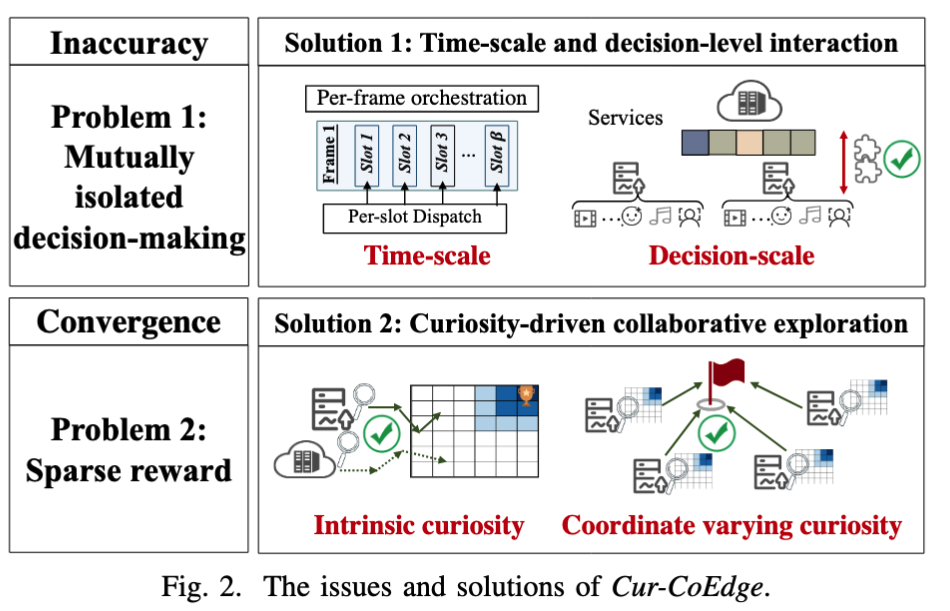
- **时间尺度与决策层级交互：** 在时间尺度方面，我们针对请求分派构建了基于小时间尺度算法的多智能体优势演员-评论家（MAA2C）模型，并针对服务编排构建了基于大时间尺度算法的图卷积网络（GCN）-A2C 模型。在决策层级方面，受到领导者与下属之间社会关系的启发，我们提出了一种跨层决策适配机制，包括自上而下细化（U2L refining）、自下而上细化（L2U refining）以及下层面向上层适配（L4U catering）。该机制能够促进不同决策层级之间的相互学习，从而优化决策过程并减少不必要的数据传输。
- **好奇心驱动的协同探索：** 该方法建立在好奇心概念之上。我们将好奇心定义为一种内在动机，它驱动调度器和云端在奖励稀疏的条件下寻找新颖体验或降低不确定性。考虑到不同调度器具有不同程度的好奇心，我们提出了一种个性化、好奇心驱动的多智能体协同探索方法。该方法旨在激励调度器以个体和集体两种方式探索环境，其收敛性也通过理论证明得到了验证。

最后，我们在第五节所述的、基于边缘计算的网络硬件系统上实现了一个原型系统。我们使用两组真实世界的轨迹数据，在不同场景下对 Cur-CoEdge 进行了评估，其中包括阿里巴巴集群轨迹（Alibaba Cluster Trace）和 PPIO 轨迹。实验结果表明，Cur-CoEdge 能够带来显著的性能提升：时间效率提高约 26%，系统吞吐量提高约 40%，收敛速度提高 71%。

# 三、SYSTEM MODEL AND PROBLEM FORMULATION

# II. 系统模型与问题形式化

我们的目标是优化边云系统中的调度，提高系统吞吐量、降低时延并保证负载均衡。考虑到边缘服务器具有动态性，本文重点关注负载均衡，以维持系统稳定性并尽可能降低时延。

## A. 边云系统

边云系统由 $N$ 台边缘服务器组成的集合 $\mathcal{N}$、$E$ 个调度器组成的集合 $\mathcal{E}$，以及一个云端 $\mathcal{C}$ 构成。

每个调度器 $e\in\mathcal{E}$ 被分配一个边缘服务器集群 $\mathcal{N}_e$，并负责管理和路由该集群中的请求集合 $\mathcal{R}_e$。所有集群中的边缘服务器共同构成：

$$
\mathcal{N}=\bigcup_{e\in\mathcal{E}}\mathcal{N}_e
$$

每台边缘服务器都通过局域网连接到相应的调度器。边缘服务器 $n_e\in\mathcal{N}_e$ 的最大计算能力（CPU）和存储容量分别表示为 $J_{n_e}$ 和 $\delta_{n_e}$。

系统中包含一组可能的服务：

$$
\mathcal{M}=\{1,\ldots,m,\ldots,M\}
$$

其中，每种服务 $m$ 需要占用 $D_m$ 的存储资源。受存储容量限制，一台边缘服务器在任意时刻只能托管部分服务。

所有请求组成集合：

$$
\mathcal{R}=\bigcup_{e\in\mathcal{E}}\mathcal{R}_e
$$

$r_{i,e}$ 表示调度器 $e$ 接收到的第 $i$ 个请求。每个请求表示为一个元组：

$$
\{D_{i,e},C_{i,e},\delta_{i,e},\tau_{i,e},m_{i,e}\}
$$

其中各元素依次表示输入数据大小、CPU 需求、存储需求、时延容忍度和请求的服务类型。时延容忍度 $\tau_{i,e}$ 是衡量服务质量（QoS）的一个重要指标。

## B. 系统模型

边云系统中包含两个相互关联的任务。

### 1. 服务编排

服务编排（Service Orchestration，SO）决定每台边缘服务器上存储哪些服务，其决策集合定义为：

$$
Y\triangleq
\left\{
y_{n_e,m}\in\{-1,0,1\}
\mid
n_e\in\mathcal{N},\ m\in\mathcal{M}
\right\}
$$

其中：

- $y_{n_e,m}=1$ 表示在边缘服务器 $n_e$ 上部署服务 $m$；
- $y_{n_e,m}=-1$ 表示从边缘服务器 $n_e$ 上删除服务 $m$；
- $y_{n_e,m}=0$ 表示既不部署也不删除该服务。

服务编排决策受到边缘服务器剩余存储容量的约束：

$$
\sum_{m\in\mathcal{M}}
\mathbb{I}_{\{y_{n_e,m}=1\}}D_m
\leq
\bar{\delta}_{n_e}
$$

其中，$\bar{\delta}_{n_e}$ 表示边缘服务器 $n_e$ 的剩余存储容量，$\mathbb{I}_{\{\cdot\}}$ 表示示性函数。

### 2. 请求分派

请求分派（Request Dispatch，RD）将请求分配给合适的边缘服务器，其决策集合定义为：

$$
X\triangleq
\left\{
x_{i,e}\in\mathcal{N}_e
\mid
r_{i,e}\in\mathcal{R}_e,\ e\in\mathcal{E}
\right\}
$$

$x_{i,e}$ 表示请求 $r_{i,e}$ 被分派到哪一台边缘服务器。每个请求只能被分派到一台边缘服务器：

$$
\sum_{n_e\in\mathcal{N}}
\mathbb{I}_{\{x_{i,e}=n_e\}}
=1
$$

边缘服务器的计算容量和存储容量限制了其能够处理的请求数量：

$$
\sum_{n_e\in\mathcal{N}}
\mathbb{I}_{\{x_{i,e}=n_e\}}D_{i,e}
\leq
\bar{\delta}_{n_e}
$$

$$
\sum_{n_e\in\mathcal{N}}
\mathbb{I}_{\{x_{i,e}=n_e\}}C_{i,e}
\leq
\bar{J}_{n_e}
$$

其中，$\bar{J}_{n_e}$ 表示边缘服务器 $n_e$ 的剩余 CPU 容量。

### 3. 时延模型

调度器 $e$ 接收一个时延敏感型请求 $r_{i,e}\in\mathcal{R}_e$，并使用队列 $Q_e$ 保存到达的请求。处理一个请求产生的时延由三部分组成。

**计算时延**定义为：

$$
L_{i,e}^{\mathrm{co}}
=
\frac{C_{i,e}}{J_{n_e,i}}
$$

它由请求的 CPU 需求与边缘服务器 $n_e$ 为该请求分配的计算资源 $J_{n_e,i}$ 之间的比值决定。

**传输时延**定义为：

$$
L_{i,e}^{\mathrm{tr}}
=
\frac{D_{i,e}}{V_{e,n_e}}
$$

它来自调度器与边缘服务器之间的请求传输，其中 $V_{e,n_e}$ 表示调度器 $e$ 与边缘服务器 $n_e$ 之间的传输速率。

**排队时延**表示为 $L_{i,e}^{\mathrm{qu}}$。当多个请求被并行分派时，由于可用资源有限，请求可能需要等待，从而产生排队时延。

因此，请求 $r_{i,e}$ 的总时延为三部分之和 [15]：

$$
L_{i,e}
=
L_{i,e}^{\mathrm{co}}
+
L_{i,e}^{\mathrm{tr}}
+
L_{i,e}^{\mathrm{qu}}
$$

## C. 优化指标的形式化定义

根据上述系统模型，本文使用以下三个指标描述系统优化目标。

### 1. 长期系统吞吐率

长期系统吞吐率 $\ddot{\Phi}$ 表示在时延容忍范围内完成的请求数占总请求数的比例：

$$
\ddot{\Phi}
=
\frac{
\displaystyle
\sum_{\kappa=1}^{\infty}
\sum_{e\in\mathcal{E}}
\sum_{r_{i,e}\in\mathcal{R}_e}
\mathbb{I}^{\kappa}_{\{L_{i,e}\leq\tau_{i,e}\}}
}{
\displaystyle
\sum_{\kappa=1}^{\infty}
\sum_{e\in\mathcal{E}}
\Upsilon^{\kappa}(Q_e)
}
$$

其中，$\mathbb{I}^{\kappa}_{\{\cdot\}}$ 是示性函数，$\Upsilon^{\kappa}(Q_e)$ 表示在时间帧 $\kappa$ 内到达调度器 $e$ 的请求数量。

### 2. 长期系统时间利用率

长期系统时间利用率 $\ddot{\Psi}$ 表示成功完成请求所实际消耗的总时间与这些请求的总时延容忍度之比：

$$
\ddot{\Psi}
=
\frac{
\displaystyle
\sum_{\kappa=1}^{\infty}
\sum_{e\in\mathcal{E}}
\sum_{r_{i,e}\in\mathcal{R}_e}
\mathbb{I}^{\kappa}_{\{L_{i,e}\leq\tau_{i,e}\}}
L_{i,e}
}{
\displaystyle
\sum_{\kappa=1}^{\infty}
\sum_{e\in\mathcal{E}}
\sum_{r_{i,e}\in\mathcal{R}_e}
\tau_{i,e}
}
$$

### 3. 负载均衡

负载均衡指标 $\nu$ 通过评估不同边缘服务器之间的工作负载分布来衡量系统稳定性 [16]：

$$
\nu
=
\frac{1}{1+\exp(-\xi)}
$$

其中，$\xi$ 表示所有边缘服务器的 CPU 使用率和存储使用率的标准差。$\nu$ 越小，说明边缘服务器之间的负载越均衡。

本文进一步定义时间效率 $\eta$ [17]，即长期系统吞吐率与时间利用率之比：

$$
\eta
=
\frac{\ddot{\Phi}}{\ddot{\Psi}}
$$

该指标也反映了实际吞吐速度与基准吞吐速度之间的比值。

## D. 问题形式化

本文需要对服务编排（SO）和请求分派（RD）进行联合优化，并将该问题称为 SORD。其目标是在时间效率和边缘服务器负载均衡之间取得平衡：

$$
\begin{aligned}
\mathrm{SORD:}\quad
\max_{\{y_{n_e,m},x_{i,e}\}}
&\quad
\omega_1\eta-\omega_2\nu, \\
&\quad
\forall\ \kappa,n_e,i,e.
\end{aligned}
$$

约束条件为：

$$
\sum_{n_e\in\mathcal{N}}
\mathbb{I}_{\{x_{i,e}=n_e\}}C_{i,e}
\leq
\bar{J}_{n_e}
$$

$$
\sum_{m\in\mathcal{M}}
\mathbb{I}_{\{y_{n_e,m}=1\}}D_m
+
\sum_{n_e\in\mathcal{N}}
\mathbb{I}_{\{x_{i,e}=n_e\}}D_{i,e}
\leq
\bar{\delta}_{n_e}
$$

$$
y_{n_e,m}\in\{-1,0,1\},
\qquad
x_{i,e}\in\mathcal{N}
$$

$$
\sum_{n_e\in\mathcal{N}}
\mathbb{I}_{\{x_{i,e}=n_e\}}
=1
$$

$\omega_1$ 和 $\omega_2$ 是权重因子，其取值需要根据具体场景确定。

由于计算复杂度较高，SORD 是一个难以求解的非线性规划问题。此外，不同层级设备的可观测范围并不相同。例如，云端只能观察边缘服务器上的请求队列，而调度器无法感知服务编排对系统性能产生的影响。这种相互隔离的决策方式经常导致决策不准确。

## E. 两阶段问题分解

为了解决上述问题，本文将 SORD 分解为请求分派（RD）和服务编排（SO）两个子问题。

### 1. RD 子问题

由于请求不能被推迟处理，因此必须施加严格的资源约束，确保分派到边缘服务器的请求可以在时延阈值内完成。调度器需要为每个请求确定分派策略，在提高时间效率的同时保证负载均衡：

$$
\mathrm{RD:}\quad
\max_{\{x_{i,e},\ e\in\mathcal{E}\}}
\left(
-\omega_1\frac{\lambda}{\psi}
-\omega_2\nu
\right)
$$

其约束和辅助变量为：

$$
\lambda
=
\frac{
\displaystyle
\sum_{e\in\mathcal{E}}
\sum_{r_{i,e}\in\mathcal{R}_e}
\mathbb{I}_{\{L_{i,e}>\tau_{i,e}\}}
}{
\displaystyle
\sum_{e\in\mathcal{E}}\Upsilon(Q_e)
}
$$

$$
\psi
=
\frac{
\displaystyle
\sum_{e\in\mathcal{E}}
\sum_{r_{i,e}\in\mathcal{R}_e}
\mathbb{I}_{\{L_{i,e}>\tau_{i,e}\}}L_{i,e}
}{
\displaystyle
\sum_{e\in\mathcal{E}}
\sum_{r_{i,e}\in\mathcal{R}_e}
\tau_{i,e}
}
$$

同时满足约束 (1b)、(1c)、(1d) 和 (1e)。以上共同构成式 **(2)**。

其中，$\lambda\in[0,1]$ 表示违反时延容忍度的请求比例，$\psi\in[0,1]$ 表示时间利用率。

### 2. SO 子问题

从云端角度直接提高时间效率较为困难，因为上层云端无法直接观察下层的请求吞吐量。为此，本文采用一种间接方法：监测尚未处理的请求队列长度 $|Q_{n_e}|$。

服务编排子问题定义为：

$$
\mathrm{SO:}\quad
\max_{\{y_{n_e,m}\}}
\left(
-
\frac{
\displaystyle
\sum_{n_e\in\mathcal{N}}|Q_{n_e}|
}{
\displaystyle
\sum_{e\in\mathcal{E}}
\sum_{r_{i,e}\in Q_{n_e}}
\tau_{i,e}
}
\right)
$$

约束条件为 (1c) 和 (1d)。以上构成式 **(3)**。

也就是说，云端通过优化服务部署，尽可能减少归一化后的未处理请求队列长度。

# 四、TIME-SCALE AND DECISION-LEVEL INTERACTION MECHANISM

> 本节提出两类交互：首先让请求分派（RD）与服务编排（SO）在不同时间尺度上运行；随后通过 U2L、L2U 和 L4U 三种机制，在上下决策层之间传递约束和需求信息。

为解决决策不准确的问题，我们从时间尺度和决策层级两个方面提出一种交互机制。该方法促进请求分派（RD）与服务编排（SO）之间的双向学习。

## A. 时间尺度交互机制

为了提高决策准确性并及时提供服务，我们采用一种时间尺度交互机制。如图 3 所示，RD 在小时间尺度（时隙 $t$）上执行，而 SO 在大时间尺度（时间帧 $\kappa=\beta t$，$\beta\in\mathbb{N}^{+}$）上执行。这样可以缓解频繁执行 SO 所带来的系统不稳定和额外开销 [7]。本文将 RD 和 SO 都建模为马尔可夫决策过程（Markov Decision Process，MDP）。
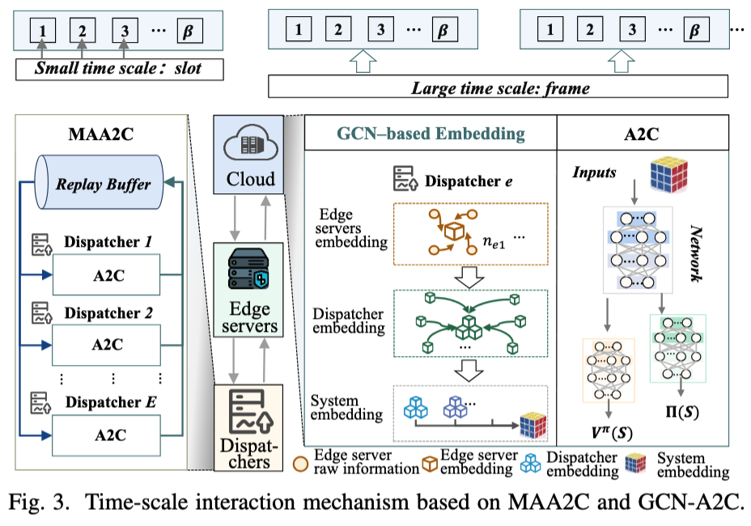

**图 3：基于 MAA2C 和 GCN-A2C 的时间尺度交互机制。**

### 1. 用于 RD 的小时间尺度 MAA2C

调度器使用多智能体优势演员-评论家算法（Multi-Agent Advantage Actor-Critic，MAA2C），在最大化时间效率的同时平衡不同边缘服务器之间的工作负载。MAA2C 使调度器能够有效地学习和适应环境，并在考虑其他调度器动作的情况下制定策略。

#### 状态 $S$

对于时间隙 $t$ 中的请求 $r_{i,e}$，每个调度器 $e$ 都对应一个状态 $s_{i,e}^{t}$：

$$
s_{i,e}^{t}
=
\left\{
m_{i,e},
\tau_{i,e},
\left[
Q_{e}^{t},
Q_{n_e}^{t},
\bar{J}_{n_e}^{t},
\bar{\delta}_{n_e}^{t}
\mid n_e\in\mathcal{N}_{e}
\right],
N_e
\right\}
$$

该状态由以下信息构成：请求的服务类型、时延容忍度、调度器队列信息、边缘服务器上未处理请求的队列信息、剩余 CPU 和存储资源，以及调度器所管理的边缘服务器数量。

全局状态定义为：

$$
S^{t}
=
\left\{
s_{i,e}^{t}
\mid e\in\mathcal{E}
\right\}
$$

该全局状态用于集中式评论家（centralized critic）的训练。

#### 动作 $A$

决策空间包含离散动作 $a_{i,e}^{t}$，用于表示请求被分派到哪一台边缘服务器。联合 RD 决策为：

$$
A^{t}
=
\left\{
a_{i,e}^{t}
=
x_{i,e}^{t}
\in\mathcal{N}_{e}
\mid e\in\mathcal{E}
\right\}
$$

#### 稀疏奖励 $R(S,A)$

在完全协作的系统中，所有调度器共享相同的外在奖励。在时间隙 $t$ 结束时，该奖励为：

$$
R^{t}
=
-\omega_{1}\frac{\lambda}{\psi}
-\omega_{2}\nu
$$

#### 状态转移 $T$

状态转移函数通过概率 $P(S'\mid S,A)$ 描述：系统在状态 $S$ 下采取动作 $A$ 后，转移到下一状态 $S'$ 的概率。

每个调度器的目标是学习策略 $\pi_e(a_e\mid s_e)$，从而共同最大化团队性能。所有调度器组成的联合策略为：

$$
\pi
=
\left\langle
\pi_e,
e\in\mathcal{E}
\right\rangle
$$

该联合策略诱导出外在动作价值函数：

$$
Q^{\mathrm{ext},\pi}(S,A)
=
\mathbb{E}_{t}
\left[
\left.
\sum_{t=0}^{H}R^{t}(S,A)
\right|
S^{0}=S,
A^{0}=A,
\pi
\right]
$$

相应的价值函数为：

$$
V^{\mathrm{ext},\pi}(S)
=
\max_{A}Q^{\mathrm{ext},\pi}(S,A)
$$

其中，$H$ 表示决策时域。MAA2C 采用集中式评论家和分布式演员，以实现多个调度器之间的协同学习。

### 2. 用于 SO 的大时间尺度 GCN-A2C

本文使用 GCN-A2C 执行服务编排、处理系统状态信息，并降低高维特征向量带来的训练复杂度。该模型擅长捕捉服务与边缘服务器之间的关系动态，因此尤其适合本文系统中的服务编排决策。

云端使用图卷积网络（Graph Convolutional Network，GCN）将系统状态编码为一系列分层嵌入。在时间帧 $\kappa$ 中，各边缘服务器的状态由向量集合 $\{s_{n_e}^{\kappa},n_e\in\mathcal{N}\}$ 表示，其中包含可用 CPU 和存储资源、调度器与边缘服务器之间的时延、积压请求信息、已经部署的服务类型以及服务副本数量。

具体而言，如图 3 所示，云端针对边缘服务器 $n_e\in\mathcal{N}_e$ 构建虚拟图，并将同一集群中的其他边缘服务器 $\mathcal{N}_e\setminus\{n_e\}$ 视为其邻居。每台边缘服务器的原始状态 $s_{n_e}^{\kappa}$ 被嵌入为 $\Gamma_{n_e}^{\kappa}$：

$$
s_{n_e}^{\kappa}
\longrightarrow
\Gamma_{n_e}^{\kappa}
$$

其计算方式为：

$$
\Gamma_{n_e}^{\kappa}
=
h_{1}
\left[
\sum_{n'_e\in\mathcal{N}_e\setminus\{n_e\}}
b_{1}\left(\Gamma_{n'_e}^{\kappa}\right)
\right]
+
s_{n_e}^{\kappa}
$$

其中，$h_1(\cdot)$ 和 $b_1(\cdot)$ 表示由不同神经网络实现的非线性变换，以支持不同的聚合操作。

随后，云端对与调度器 $e$ 有关的信息进行进一步嵌入：

$$
\left\{
\Gamma_{n_e}^{\kappa}
:
n_e\in\mathcal{N}_e
\right\}
\longrightarrow
\Lambda_e^{\kappa}
$$

对于所有调度器，云端继续计算系统级聚合嵌入：

$$
\left\{
\Lambda_e^{\kappa}
:
e\in\mathcal{E}
\right\}
\longrightarrow
\Delta^{\kappa}
$$

生成这些嵌入后，云端依次为每台边缘服务器执行服务编排。相关 MDP 要素定义如下。

#### 状态 $S^{S}$

SO 的状态由 GCN 生成的嵌入向量构成。在时间帧 $\kappa$ 中：

$$
S^{S,\kappa}
=
\left\{
\left[
\Gamma_{n_e}^{\kappa},
n_e\in\mathcal{N}_e
\right],
\left[
\Lambda_e^{\kappa},
e\in\mathcal{E}
\right],
\Delta^{\kappa}
\right\}
$$

#### 动作 $A^{S}$

对于边缘服务器 $n_e$ 和服务 $m$，云端在时间帧 $\kappa$ 中的动作定义为：

$$
A^{S,\kappa}
=
\left\{
a_{n_e,m}^{S,\kappa}
=
y_{n_e,m}^{\kappa}
\in\{-1,0,1\}
\right\}
$$

#### 稀疏奖励 $R^{S}(S^{S},A^{S})$

在时间帧 $\kappa$ 中，云端获得由动作 $A^{S,\kappa}$ 所产生的外在奖励：

$$
R^{S,\kappa}
=
-
\frac{
\displaystyle
\sum_{n_e\in\mathcal{N}}|Q_{n_e}|
}{
\displaystyle
\sum_{e\in\mathcal{E}}
\sum_{r_{i,e}\in Q_{n_e}}
\tau_{i,e}
}
$$

#### 状态转移 $T^{S}$

状态转移函数通过概率 $P(S'^{S}\mid S^{S},A^{S})$ 描述：系统在状态 $S^{S}$ 下采取动作 $A^{S}$ 后，转移到下一状态 $S'^{S}$ 的概率。

上层云端的目标是学习策略 $\pi^{S}(A^{S}\mid S^{S})$，以最大化系统性能。该策略诱导出外在动作价值函数：

$$
Q^{\mathrm{ext},\pi^{S}}(S^{S},A^{S})
=
\mathbb{E}_{\kappa}
\left[
\left.
\sum_{\kappa=0}^{H}
R^{S,\kappa}(S^{S},A^{S})
\right|
S^{S,0}=S^{S},
A^{S,0}=A^{S},
\pi^{S}
\right]
$$

相应的价值函数为：

$$
V^{\mathrm{ext},\pi^{S}}(S^{S})
=
\max_{A^{S}}
Q^{\mathrm{ext},\pi^{S}}(S^{S},A^{S})
$$

通过上述设计，GCN-A2C 将逐渐提高服务编排的准确性，从而改善系统性能。

## B. 决策层级交互机制

受到领导者与下属之间社会关系的启发，本文提出决策层级交互机制，如图 4 所示。该机制使数据和决策能够在不同系统层级之间高效流动，从而缓解数据过载、简化决策过程，并提高系统效率和稳定性。
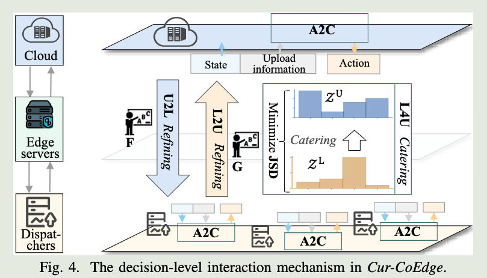
**图 4：Cur-CoEdge 中的决策层级交互机制。**

### 1. U2L 自上而下细化机制

为了提高决策准确性，每个调度器 $e$ 将其决策 $x_{i,e}$ 发送到云端，从而帮助系统避免把请求发送给资源不足的边缘服务器。云端利用这些信息生成二值引导向量：

$$
F_{i,e}^{t}\in\{0,1\}
$$

该向量用于引导调度器避开不可行的决策。对于第 $e$ 个调度器的状态 $s_{i,e}^{t}$，策略网络原始输出的 logits 为 $p(s_{i,e}^{t})$。云端通过逐元素乘法使用引导向量对其进行修正，得到：

$$
\widetilde{p}(s_{i,e}^{t})
=
p(s_{i,e}^{t})\cdot F_{i,e}^{t}
$$

随后，云端将修正后的引导向量、调度器上报的资源与队列状态以及先前的决策结合起来，构造下一系统状态。该更新通过变换函数 $\phi(\cdot)$ 作用于先前状态和决策完成：

$$
K_{e}^{\kappa-1}
=
\left[
\bar{J}_{n_e}^{\kappa-1},
\bar{\delta}_{n_e}^{\kappa-1},
Q_{n_e}^{\kappa-1}
\right]
$$

$$
\left[
\bar{J}_{n_e}^{\kappa},
\bar{\delta}_{n_e}^{\kappa},
Q_{n_e}^{\kappa}
\right]
=
\phi
\left(
K_{e}^{\kappa-1},
x_{i,e}^{t},
t\in[\beta(\kappa-1),\beta\kappa)
\right)
$$

以上两式共同构成式 **(4)**。

U2L 细化机制使边缘服务器不必持续上传其资源状态和队列状态，从而减轻系统负载，并帮助下层做出更有效的决策。

### 2. L2U 自下而上细化机制

类似地，为了提高云端决策的准确性，本文引入 L2U 细化方法，使云端能够利用来自下层的引导信息。在执行 SO 之前，调度器处理从上层接收到的决策 $y_{n_e,m}^{\kappa}$，并为 SO 生成二值引导向量：

$$
G_{n_e,m}^{\kappa}\in\{0,1\}
$$

在给定状态 $S^{S,\kappa}$ 时，对于边缘服务器 $n_e$ 上的服务 $m$，云端策略网络原始输出的 logits 为：

$$
p(S^{S,\kappa},n_e,m)\in\mathbb{R}
$$

云端根据引导向量对该输出进行修正：

$$
\widetilde{p}(S^{S,\kappa},n_e,m)
=
p(S^{S,\kappa},n_e,m)
\cdot
G_{n_e,m}^{\kappa}
$$

来自下层的引导显著提高了上层决策的准确性，降低了云端做出不审慎决策的风险。

L2U 细化与社会决策过程类似：领导者会吸收下属提供的信息，以更全面地了解局部情况。该方法利用下层掌握的具体知识修正上层决策，从而提高系统效率和性能。

### 3. L4U 下层面向上层适配机制

L4U 适配机制用于保证调度器与云端在请求处理方面保持一致，减少不同层级在资源管理上的偏差。本文为已经处理的请求建立服务类型分布模型。

$z_{n_e,m}^{L}$ 表示已经分派到边缘服务器 $n_e$ 且需要服务 $m$ 的请求数量。下层对服务 $m$ 的请求总量表示为：

$$
Z_{m}^{'L}
=
\sum_{n_e\in\mathcal{N}}
z_{n_e,m}^{L}
$$

归一化后，得到已处理请求的服务类型分布：

$$
\mathcal{Z}^{L}
=
\left\{
Z_{m}^{'L}
\mid m\in\mathcal{M}
\right\}
$$

与此同时，云端维护另一个分布 $\mathcal{Z}^{U}$，用于表示边缘服务器上已编排服务的类型分布。L4U 机制的目标是最小化 Jensen-Shannon 散度（JSD），以衡量 $\mathcal{Z}^{L}$ 与 $\mathcal{Z}^{U}$ 的相似程度：

$$
\operatorname{JSD}
\left(
\mathcal{Z}^{L}
\parallel
\mathcal{Z}^{U}
\right)
=
\frac{1}{2}
\sum
\mathcal{Z}^{L}
\log
\frac{2\mathcal{Z}^{L}}
{\mathcal{Z}^{L}+\mathcal{Z}^{U}}
+
\frac{1}{2}
\sum
\mathcal{Z}^{U}
\log
\frac{2\mathcal{Z}^{U}}
{\mathcal{Z}^{L}+\mathcal{Z}^{U}}
$$

**(5)**

JSD 越小，说明调度器与云端的决策越一致，从而使服务供给与请求需求更加匹配，优化资源分配，并减少不必要的服务调整。

## 术语说明

- **U2L（Upper-to-Lower）refining**：译为“自上而下细化”，表示上层云端对下层请求分派动作进行可行性筛选。
- **L2U（Lower-to-Upper）refining**：译为“自下而上细化”，表示下层调度器利用局部知识筛选上层服务编排动作。
- **L4U（Lower-for-Upper）catering**：译为“下层面向上层适配”，表示让下层请求需求分布与上层服务供给分布相匹配。
- 原文将大时间尺度写为 $\kappa=\beta t$，但结合图 3 和算法 1，其实际含义是每 $\beta$ 个时隙形成一个时间帧；这里在正文中保留原文写法。
# 五、CURIOSITY-DRIVEN COLLABORATIVE EXPLORATION

为解决 MAA2C 和 GCN-A2C 中稀疏奖励导致的收敛效率问题，我们引入好奇心驱动的探索机制。图 5 给出了一个使用示例。

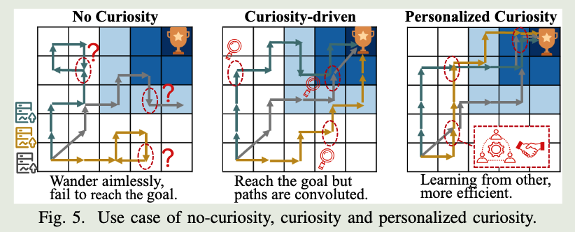

**图 5：无好奇心、好奇心驱动和个性化好奇心三种情形的示例。**

## A. 好奇心驱动的探索

我们利用内在动机激发调度器和云端的好奇心。这样可以促进对环境的深入探索，并推动智能体针对较难预测的状态进行决策，从而通过提高学习经验的多样性改善训练过程。本文将这种好奇心具体实现为一种内在奖励。

为便于说明，我们以调度器 $e$ 为代表，计算好奇心驱动的内在奖励，即该调度器的好奇心，并将其表示为 $u_e(s_e,a_e)$。它是调度器状态 $s_e$ 和动作 $a_e$ 的函数，同样的计算方式适用于每个调度器和云端。

随后，我们同时引入外在奖励 $R(S,A)$ 和内在奖励，对价值函数 $V_e^{\pi}(S)$ 与动作价值函数 $Q_e^{\pi}(S,A)$ 进行增强。重新定义后：

$$

\widetilde{R}_e(S,A)

=

R(S,A)

+

\epsilon u_e(s_e,a_e)

$$

$$

V_e^{\pi}(S)

=

V^{\mathrm{ext},\pi}(S)

+

\epsilon V_e^{\mathrm{int},\pi}(S)

$$

$$

Q_e^{\pi}(S,A)

=

\widetilde{R}_e(S,A)

+

\sum_{S'}

P(S'\mid S,A)

V_e^{\pi}(S')

$$

以上三式共同构成式 **(6)**。其中，$\epsilon$ 是权重，$V_e^{\mathrm{int},\pi}(S)$ 是内在价值函数。

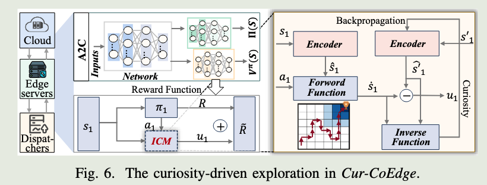

如图 6 所示，本文使用由神经网络 $F_e$ 实现的内在好奇心模块（Intrinsic Curiosity Module，ICM），促进智能体在稀疏奖励环境中的探索 [18]。

ICM 根据调度器 $e$ 当前的状态-动作对 $(s_e,a_e)$ 预测其下一状态 $s'_e$。预测状态表示为：

$$

\dot{s}_e

=

F_e(s_e,a_e)

$$

预测状态与真实下一状态之间的差异构成新颖度函数 $g(\cdot)$，并产生内在奖励 $u_e(s_e,a_e)$。同时，系统通过最小化以下损失训练 ICM：

$$

\operatorname{Loss}_e^{\mathrm{ICM}}

=

\left\|

\dot{s}_e-s'_e

\right\|_2^2

$$

好奇心内在奖励定义为：

$$

u_e(s_e,a_e)

=

g(\dot{s}_e,s'_e)

=

\left\|

\dot{s}_e-s'_e

\right\|_2^2

$$

以上为式 **(7)**。
## B. 个性化、好奇心驱动的协同探索

本文进一步提出一种同时由个体好奇心和集体好奇心驱动探索的机制，从而促进不同调度器之间的协作。
### 1. 个性化协同探索

为了更清晰地说明个性化、好奇心驱动的协同探索，我们将调度器 $e$ 的优化目标定义为：

$$

J_{\theta_e}

\left[

\pi_e

\mid

\pi_{-e},p^0

\right]

\equiv

V^{\mathrm{ext},\pi}(S^0)

+

\epsilon\cdot

RI_{e,-e}^{\pi}

$$

以上为式 **(8)**。
  
其中，$p^0(S^0)$ 是初始状态分布，$\theta_e$ 是策略网络参数，$\pi_{-e}$ 是不包含调度器 $e$ 的其他调度器联合策略，$RI_{e,-e}^{\pi}$ 是调度器 $e$ 的个性化内在好奇心价值函数。

使用式 (6) 的修正记号，个性化价值函数表示为：

$$

V_e^{\pi}(S)

=

V^{\mathrm{ext},\pi}(S)

+

\epsilon

\sum_{j\in\mathcal{E}}

\alpha_{ej}

V_j^{\mathrm{int},\pi}(S)

$$

以上为式 **(9)**。

其中，$\alpha_{ej}$ 衡量调度器 $j$ 的好奇心对调度器 $e$ 探索行为的影响，具体计算将在第 IV-B2 节介绍。通过对所有调度器的内在价值函数进行加权组合，可以生成个性化的内在价值函数，从而加强协作。
 
如何量化个性化的内在好奇心价值是一个重要挑战。为此，本文提出以下定义：

$$

\begin{aligned}

RI_{e,-e}^{\pi}

&=

RI_{-e\mid e}

\left(

S'_{-e};s_e,a_e

\mid

S_{-e},A_{-e}

\right)

\\

&=

\sum_{S,A}

P^{\pi}(S,A)

\left[

\widetilde{R}_{-e}(S,A)

-

\widetilde{R}_{-e}(S_{-e},A_{-e})

\right]

\end{aligned}

$$

其中，函数 $RI_{-e\mid e}(\cdot)$ 用于衡量调度器 $e$ 的好奇心相对于其他调度器好奇心的影响。

当系统中存在两个以上的调度器时，调度器间的交互通常可以简化为两两交互。所有成对交互之和可以近似表示整体交互：

$$

\begin{aligned}

&RI_{-e\mid e}

\left(

S'_{-e};s_e,a_e

\mid

S_{-e},A_{-e}

\right)

\\

&\qquad\approx

\sum_{j\in\mathcal{E}\setminus\{e\}}

RI_{j\mid e}

\left(

s'_j;s_e,a_e

\mid

s_j,a_j

\right)

\end{aligned}

$$

为简化说明，本文首先考虑两个调度器的情形，并提出一种度量方法，用于评估一个调度器的好奇心对另一个调度器学习过程的影响。从调度器 $e$ 的视角出发，定义：

$$

\begin{aligned}

RI_{e,-e}^{\pi}

&=

RI_{j\mid e}

\left(

s'_j;s_e,a_e

\mid

s_j,a_j

\right)

\\

&=

\sum_{S,A}

P^{\pi}(S,A)

\left[

\widetilde{R}_j(S,A)

-

\widetilde{R}_j(s_j,a_j)

\right]

\end{aligned}

$$

  
以上为式 **(10)**，用于描述调度器 $e$ 与调度器 $j$ 之间的交互。

将式 (10) 代入式 (8) 会带来一个优化难题：需要对一个依赖 $\theta_e$ 的分布计算期望。不过，这个问题并非无法处理。重要的是，这些目标函数在学习过程中只会周期性更新，因此可以近似忽略关于 $\theta_e$ 的部分梯度。

具体考虑以下关系：

  
$$

\begin{aligned}

&\nabla_{\theta_e}

RI_{j\mid e}

\left(

s'_j;s_e,a_e

\mid

s_j,a_j

\right)

\\

&=

\sum_{S,A}

\nabla_{\theta_e}P^{\pi}(S,A)

\widetilde{R}_j(S,A)

\\

&\quad-

\sum_{S,A}

\nabla_{\theta_e}P^{\pi}(S,A)

\widetilde{R}_j(s_j,a_j)

\end{aligned}

$$

其中，第二项是关于好奇心的期望，可以证明其为零。本文通过引理 1 说明这一点，从而解决上述优化困难。
#### 引理 1

好奇心的期望可以认为等于零，即：

$$

\sum_{S,A}

\nabla_{\theta_e}P^{\pi}(S,A)

\widetilde{R}_j(s_j,a_j)

=0

$$

  
#### 证明
与文献 [20] 中的策略梯度定理证明类似，有：

$$

\begin{aligned}

&\sum_{S,A}

\nabla_{\theta_e}P^{\pi}(S,A)

\widetilde{R}_j(s_j,a_j)

\\

&=

\sum_{S,A}

P^{\pi}(S,A)

\left(

\nabla_{\theta_e}

\log\pi(a_e,a_j\mid s_e,s_j)

\right)

\widetilde{R}_j(s_j,a_j)

\\

&=

\sum_{s_j,a_j}

p^{\pi}(s_j,a_j)

\widetilde{R}_j(s_j,a_j)

\sum_{s_e,a_e}

\frac{

p^{\pi}(s_e,a_e\mid s_j,a_j)

}{

\pi(a_e\mid s_e,s_j)

}

\left(

\nabla_{\theta_e}

\pi(a_e\mid s_e,s_j)

\right)

\\

&=

\sum_{s_j,a_j}

P^{\pi}(s_j,a_j)

\widetilde{R}_j(s_j,a_j)

\sum_{s_e}

P^{\pi}(s_e\mid s_j,a_j)

\left(

\nabla_{\theta_e}1

\right)

\\

&=0

\end{aligned}

$$

由于篇幅限制，论文省略了部分细节。因此，可以得到：

$$

\nabla_{\theta_e}J_{\theta_e}(t)

\approx

\left(

\widehat{R}_e^{t}

-

\widehat{V}_e^{\pi}(S^{t})

\right)

\nabla_{\theta_e}

\log

\pi_{\theta_e}

\left(

a_e^{t}\mid s_e^{t}

\right)

$$

其中，$\widehat{V}_e^{\pi}(S^t)$ 是累计回报 $\widehat{R}_e^t$ 对应的增强价值函数：

$$

\widehat{R}_e^{t}

=

\sum_{t'=t}^{H}

\widehat{R}_e^{t'}

$$
即时奖励定义为：

$$

\widehat{R}_e^{t}

=

R^{t}(S,A)

+

\epsilon

\sum_{j\in\mathcal{E}}

\alpha_{ej}

u_j(s_j^{t},a_j^{t})

$$

以上为式 **(11)**。

### 2. 实现设计

为了促进调度器之间的协作，本文设计了一个多头神经网络，称为个性化好奇心模块（Personalized Curiosity Module，PCM）。该模块用于计算不同预测误差的加权和。

如图 7 所示，每个调度器 $e$ 都对应一个 PCM：

  

$$

\left\{

F_e,

f_{e1},

\ldots,

f_{eE}

\right\}

$$

PCM 在第 $e$ 个头 $f_{ee}$ 中预测调度器自身的下一状态：
$$

\dot{s}_e

=

f_{ee}(s_e,a_e)

$$

此外，PCM 还在第 $j$ 个头 $f_{ej}$ 中预测调度器 $j$ 的下一状态 $\ddot{s}_j^e$：

$$

\ddot{s}_j^e

=

f_{ej}(s_e,a_e,s_j,a_j)

$$

网络 $\{F_e,f_{e1},\ldots,f_{eE}\}$ 通过最小化以下损失函数进行训练：

$$

\operatorname{Loss}_e^{\mathrm{PCM}}

=

\frac{1}{E}

\left(

\left\|

\dot{s}_e-s'_e

\right\|

+

\sum_{j\in\mathcal{E}\setminus\{e\}}

\left\|

\ddot{s}_j^e-s'_j

\right\|

\right)

$$

  

为了确定权重 $\alpha_{ej}$，本文采用一种基于距离的方法，评估不同调度器好奇心之间的相似程度。每个调度器好奇心的权重取决于预测好奇心与实际好奇心之间的距离。

调度器 $e$ 对调度器 $j$ 的预测好奇心为：

$$

\left\|

\ddot{s}_j^e-s'_j

\right\|

$$

调度器 $j$ 的实际好奇心为：

$$

\left\|

\dot{s}_j^j-s'_j

\right\|

$$

两者之间的距离定义为：

$$

\widetilde{\alpha}_{ej}

=

\operatorname{Dis}

\left(

\left\|\ddot{s}_j^e-s'_j\right\|,

\left\|\dot{s}_j^j-s'_j\right\|

\right)

$$

根据具体任务，可以使用余弦距离、Kullback-Leibler 散度或 JSD 等距离度量。距离越小，分配的权重越大。

随后，根据这些距离计算距离矩阵：

$$

\widetilde{\alpha}

\in

\mathbb{R}^{E\times E}

=

\left[

\widetilde{\alpha}_{ej}

\mid

e,j\in\mathcal{E}

\right]

$$

为了确保得到的权重成比例且总和为 1，论文对矩阵的每个行向量 $\widetilde{\alpha}[i,:]$ 进行归一化，得到：

$$

\widehat{\alpha}[i,:]

=

\frac{

\left(

\mathbf{1}-\widetilde{\alpha}[i,:]

\right)

-

\min

\left\{

\mathbf{1}-\widetilde{\alpha}[i,:]

\right\}

}{

\max

\left\{

\mathbf{1}-\widetilde{\alpha}[i,:]

\right\}

-

\min

\left\{

\mathbf{1}-\widetilde{\alpha}[i,:]

\right\}

}

$$

其中，$\mathbf{1}$ 表示所有元素均为 1 的向量。

计算得到的 $\widehat{\alpha}$ 可能不对称，从而影响调度器之间的一致性和模型的泛化能力。为解决这一问题，本文使用归一化矩阵 $\widehat{\alpha}$ 与其转置的内积构造对称相似度矩阵，以提高调度器协作的稳定性和连续性：

$$

\alpha

=

\sqrt{

\widehat{\alpha}

\times

\widehat{\alpha}^{T}

}

=

\left[

\alpha_{ej}

\right]

$$

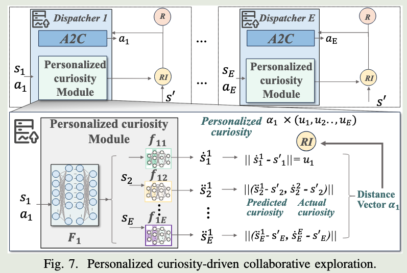
**图 7：个性化、好奇心驱动的协同探索。**

## C. 协同探索的收敛性分析

本文给出收敛性分析，以保证系统最终能够到达表示最优解或最优策略的稳定状态。该结论建立在语义映射函数 [21] 的应用之上，并通过压缩映射定理 [22] 给出证明。

在复杂环境中，不同调度器最初具有不同的状态空间。这种差异会妨碍高效协作，因为各调度器可能以不同方式理解环境。为了对齐它们的认知，本文引入语义映射函数 $\varrho(\cdot)$。

该函数将各调度器的独立状态空间转换到共享的语义状态空间中，从而促进调度器之间的有效知识迁移 [23]。如定义 1 所述，该方法会为状态距离较小的调度器赋予更高权重。在后续分析中，假设所有状态空间均已完成 $\varrho(\cdot)$ 映射。
### 定义 1：语义映射函数
  
$\varrho(\cdot)$ 对不同调度器的状态空间进行变换，使语义相似的状态在向量距离上更加接近，而语义信息不同的状态在向量距离上更加远离 [21]。

本文利用压缩映射定理 [22] 证明所提出机制的收敛性。该定理刻画了所提机制的价值迭代算子 $T^C$ 的压缩性质及其收敛性，并保证完全度量空间中的严格压缩映射会收敛到唯一不动点。

### 定理 1：价值迭代的压缩性

给定任意两个价值函数 $u$ 和 $v$，以及将一个价值函数映射为另一个价值函数的压缩算子 $T^C$，有：

$$

\left\|

T^C(u)-T^C(v)

\right\|

\leq

\gamma

\left\|

u-v

\right\|

$$

其中，$\gamma$ 是折扣因子。

### 证明

对于任意状态 $S$ 和动作 $A$，有：

$$

\begin{aligned}

T^C(v)

&=

\sum_A

\pi(A\mid S)

R^{\pi}(S,A)

\\

&\quad+

\gamma

\sum_A

\pi(A\mid S)

\sum_{S'}

P(S'\mid S,A)

\left[

D_v(S')

+

v^{\pi}(S')

\right]

\end{aligned}

$$

其中，$D_v(S')$ 是所有调度器的好奇心驱动内在价值函数的加权和，与式 (9) 类似。
  
进一步有：

$$

\begin{aligned}

&\left\|

T^{C,\pi}(u)

-

T^{C,\pi}(v)

\right\|_{\infty}

\\

&=

\max_{S,A}

\Bigg\|

\gamma

\sum_A

\pi(A\mid S)

\sum_{S'}

P(S'\mid S,A)

\left[

D_u(S')+u^{\pi}(S')

\right]

\\

&\qquad-

\gamma

\sum_A

\pi(A\mid S)

\sum_{S'}

P(S'\mid S,A)

\left[

D_v(S')+v^{\pi}(S')

\right]

\Bigg\|

\\

&\leq

\max_{S,A}

\left\|

\gamma

\sum_{S'}

P(S'\mid S,A)

u^{\pi}(S')

-

\gamma

\sum_{S'}

P(S'\mid S,A)

v^{\pi}(S')

\right\|

\\

&\leq

\max_S

\left\|

\gamma

\max_{S'}

\left\|

u^{\pi}(S')-v^{\pi}(S')

\right\|

\right\|

\\

&\leq

\gamma

\max

\left\|

u-v

\right\|

\end{aligned}

$$

根据压缩映射定理和定理 1，可以保证所有调度器上的个性化、好奇心驱动协同探索方法收敛。Cur-CoEdge 的训练过程详见算法 1。

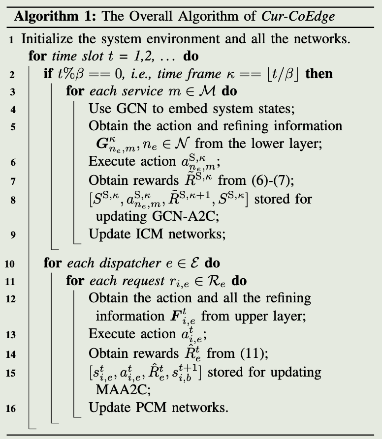

# 六、EXPERIMENTAL EVALUATION

我们在两种不同的工作负载场景下评估 Cur-CoEdge 的性能。
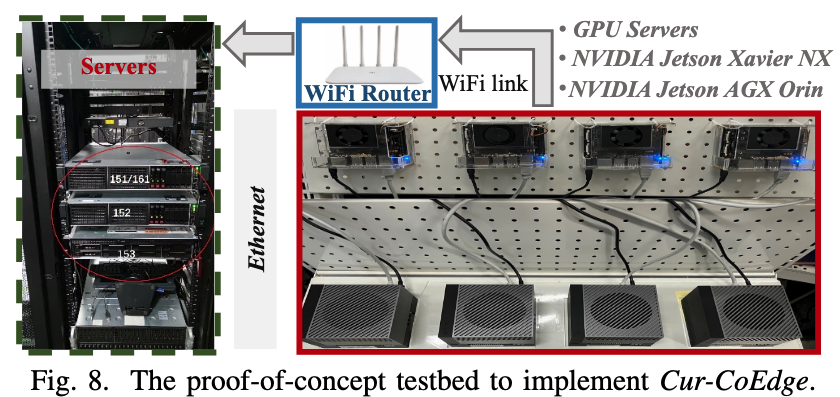

**测试平台概述。** 如图 8 所示，我们在一个网络硬件系统上实现了原型系统。该系统包含调度器、边缘服务器以及由机架式 GPU 服务器模拟的云端。调度器与边缘服务器采用异构配置，包括 Nvidia Jetson Xavier NX 和 Nvidia Jetson AGX Orin，并通过无线网络和以太网建立连接。

**图 8：用于实现 Cur-CoEdge 的概念验证测试平台。**

## A. 边云系统配置

**服务与请求。** 数据与请求分布根据来自边云服务提供商的两个真实数据集生成，分别为 PPIO Trace [4] 和 Alibaba Cluster Trace [24]。我们实现了一个请求生成器，用于生成请求并依次将其转发给各调度器。

**边缘服务器与云端。** 为模拟地理分布，测试平台设置了三个边缘服务器集群，每个集群包含位于不同区域的六台边缘服务器。每台边缘服务器 $n_e$ 配置 $J_{n_e}=[2,4]$ 个 CPU，磁盘容量为 $\delta_{n_e}=0.3\ \mathrm{TB}$。

此外，我们还使用一台云虚拟机（VM），其配置为 8 个虚拟 CPU、16 GB 存储空间和 1 TB 磁盘容量。该虚拟机中预先部署了一定数量的 Docker 容器副本，分别对应六种资源需求不同的服务类型。

**算法设置。** 我们基于 Python 3.9 和 PyTorch 1.10.2 实现算法 1。模型使用 Adam 优化器进行训练，学习率为 $10^{-3}$。

GCN 网络由两层神经网络构成，每层包含 64 个单元；A2C 网络由三层 ReLU 神经网络构成，每层包含 64 个神经元。输出层为一个得分向量，并使用 softmax 函数作为激活函数。

## B. 与基线方法的性能比较

### 1. 训练效率

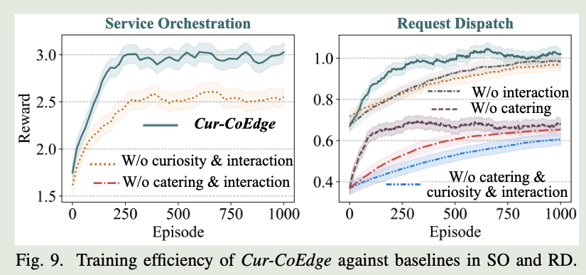
图 9 分别在服务编排（SO）阶段和请求分派（RD）阶段，将 Cur-CoEdge 与五种基线模型进行比较。这些基线是 Cur-CoEdge 的不同删减版本：

1. **W/o catering**：移除 L4U 适配机制；
2. **W/o interaction**：移除个性化好奇心交互；
3. **W/o catering & interaction**：同时移除 L4U 适配机制和个性化好奇心交互；
4. **W/o curiosity & interaction**：只保留 L4U 适配机制；
5. **W/o catering & curiosity & interaction**：移除上述三项组件。

Cur-CoEdge 表现出较快的收敛速度，相较于基线 ii)-v) 分别取得了 66.6%、67.3%、62.2% 和 71% 的显著提升。其收敛速度与基线 iv) 相当，这表明好奇心驱动模块带来的额外探索不会影响收敛速度。

Cur-CoEdge 所取得的高效收敛和较高奖励表明，它能够有效优化决策并减少不必要的数据传输，从而应对决策不准确和收敛缓慢的问题。
### 2. 学习性能

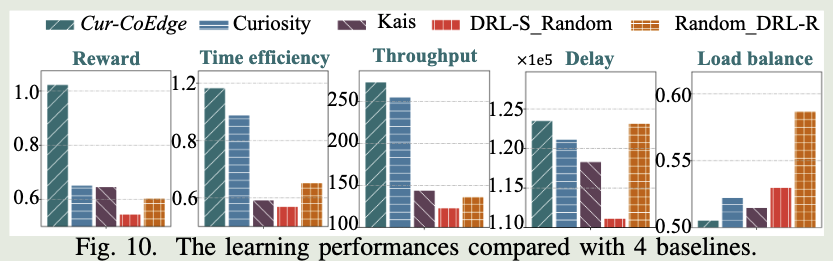
如图 10 所示，我们将 Cur-CoEdge 与以下基线进行比较：

1. **KaiS [16]**：使用 GNN 和 DRL 共同完成 SO 与 RD；
2. **Curiosity [25]**：使用好奇心驱动的 DRL；
3. **DRL-S Random [26]**：使用 DRL 完成 SO，并随机分派请求；
4. **Random DRL-R [27]**：使用 DRL 完成 RD，并随机执行服务编排。

Cur-CoEdge 在几乎所有性能指标上都优于其他方法。其平均奖励提高了 40.2%，说明决策更加准确；时间效率提高了 26%，表明系统处理能力得到显著增强。

尽管 Cur-CoEdge 的时延高出 4.1%，但其吞吐量比其他基线的平均值高 39.6%，在吞吐量与时延之间实现了较优折中。此外，其负载均衡性能提高了 6.5%，说明系统可以更有效地分配请求并管理处理时间。

### 3. 交互机制

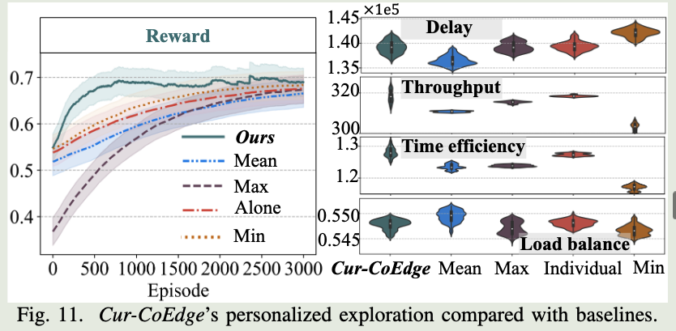
如图 11 所示，我们将个性化协同探索机制与以下四种基线进行比较：

1. **Mean [28]**：使用所有调度器好奇心的平均值；
2. **Max [29]**：使用最大的好奇心；
3. **Min [30]**：使用最小的好奇心；
4. **Individual [18]**：不进行调度器之间的交互。

Cur-CoEdge 获得了更高的奖励和更快的收敛速度。小提琴图表明，Cur-CoEdge 在吞吐量、时延和负载均衡之间取得了较优平衡。

尽管 Mean 方法的时延略低，但 Cur-CoEdge 在时间效率和吞吐量方面表现更好，而这两项指标对于维持系统性能十分重要。Individual 方法虽然能够有效减小负载不均衡，但在其他指标上表现不足。这说明，与固定的好奇心选择策略相比，Cur-CoEdge 的好奇心选择策略具有更强的适应性。

## C. 关键参数对 Cur-CoEdge 的影响

### 1. 交互频率

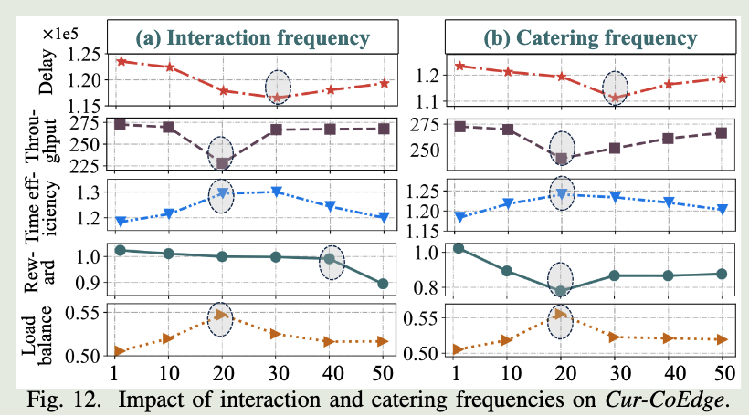
图 12(a) 展示了 Cur-CoEdge 中存在的一项性能折中。图中的横轴表示交互间隔，数值越大意味着信息交换越不频繁。

当交互间隔达到 30 时，时间效率达到峰值，但吞吐量下降、系统不稳定性上升，进而损害总体奖励。交互过少可能造成资源使用效率降低。当交互间隔继续增大时，由于系统适应延迟、信息交换不足和不稳定性加剧，性能下降速度进一步加快。

### 2. 适配频率

图 12(b) 展示了适配频率与系统性能之间的复杂关系。当适配参数取 20 时，时间效率达到最大值，但总体奖励达到最低值。

这种折中表明，虽然频繁执行适配可以提高时间效率，但也会引入系统不稳定性，从而降低总体奖励。其潜在原因可能是：在较高频率下，调度器会对云端偏好的微小变化进行过度调整。

## D. 不同场景下的性能

### 1. 不同系统参数设置

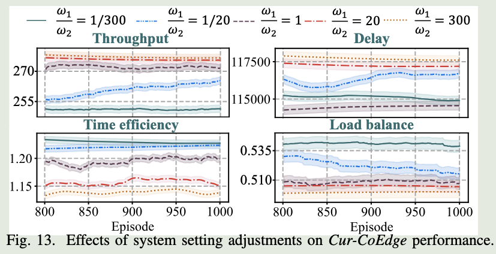

如图 13 所示，调整 Cur-CoEdge 中的权重 $\omega_1$ 和 $\omega_2$ 会带来明显的性能变化，使系统分别更加侧重时间效率或负载均衡。

当系统优先考虑时间效率时，为了更快地处理请求，吞吐量和时延都会提高。相反，当系统更重视负载均衡时，可以减轻资源压力、提高系统稳定性，但可能以降低处理速度为代价。

权重之间的相互作用揭示了系统设计中的基本折中：优化速度通常会牺牲稳定性，反之亦然。

### 2. 系统资源动态性

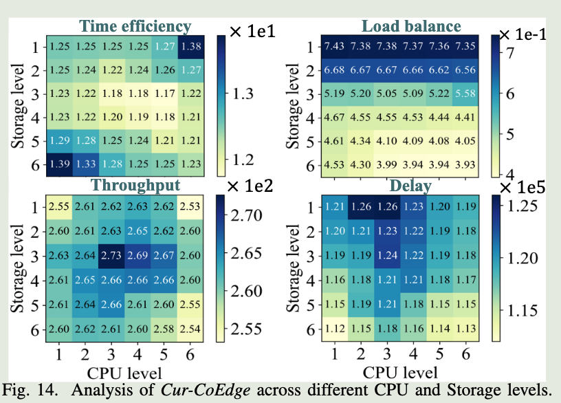

图 14 展示了 Cur-CoEdge 在不同 CPU 和存储资源等级下的系统行为，其中等级越高表示可用资源越多。

随着 CPU 等级提高，时间效率总体上升；但在某些存储等级下出现的波动表明，系统可能受到数据访问方面的限制。吞吐量在资源等级的两端达到峰值，这意味着中等资源配置下可能存在负载不均衡。

随着 CPU 和存储等级提高，负载均衡性能持续改善，说明并行处理能够带来收益。图中部区域较高的时延表明可能存在处理瓶颈或数据访问瓶颈，而增加资源可以缓解这些问题。
## E. 辅助验证

为了进一步验证 Cur-CoEdge，我们在 Alibaba 数据集上进行了测试。如图 15 所示，Cur-CoEdge 在不同数据集上都能保持良好表现。

图 16 表明，与基线方法相比，Cur-CoEdge 的平均奖励提高了 34.6%，时间效率提高了 17.1%，吞吐量提高了 34%。虽然其时延提高了 3%，但负载均衡指标降低了 2.5%。

Cur-CoEdge 的动态适应能力使其能够在高吞吐量、低时延和负载均衡之间取得较优平衡。实验结果验证了它能够优先优化关键目标，并适应不同数据集和系统需求。

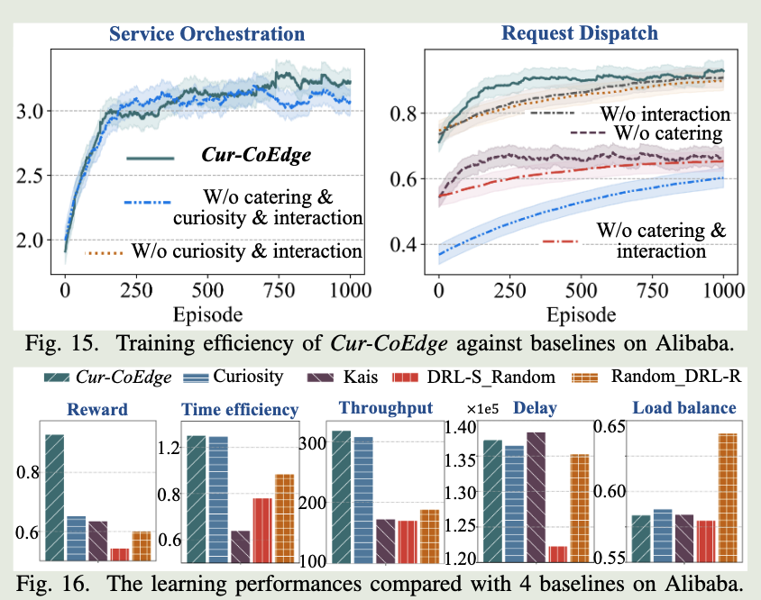

