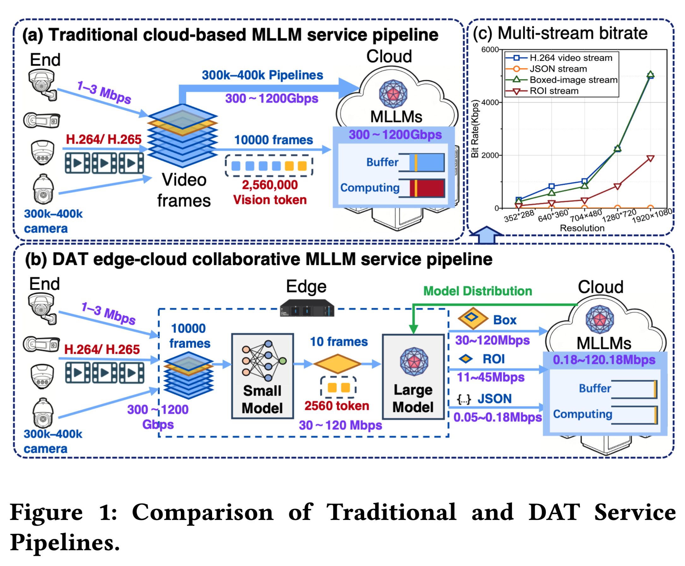
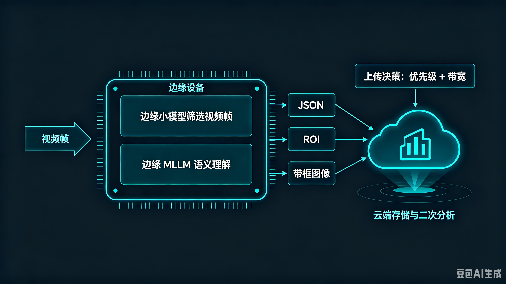
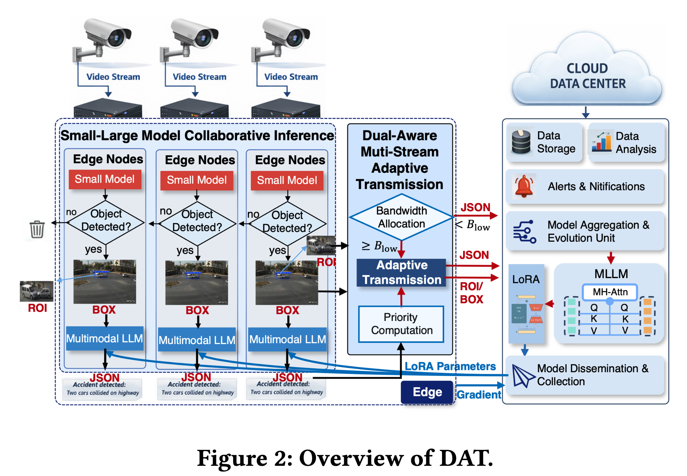
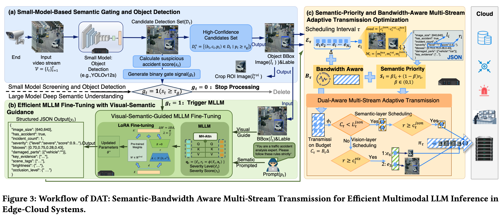
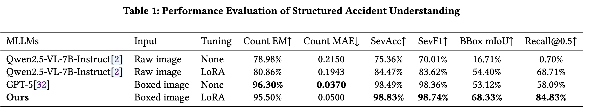
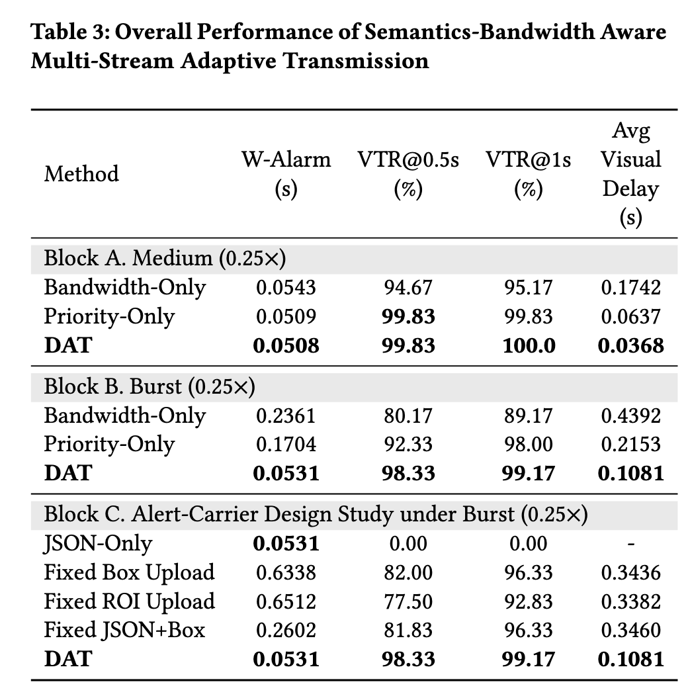

# 论文阅读

## 问题

论文要解决的核心问题是：

>在带宽受限、网络状态不断变化的边缘—云系统中，如何让多模态大语言模型（MLLM）高效处理连续视频，并同时做到“告警足够快、语义结果足够准、关键画面也能及时送到云端”。

这篇论文研究的是一个边缘摄像头场景：摄像头持续产生视频，边缘设备和云端的大模型负责判断其中是否发生了重要事件，比如交通事故，以及事故的严重程度和位置。问题在于，如果把每一帧视频都交给多模态大语言模型处理，计算量会非常大，因为大多数画面其实没有目标事件；但如果把所有原始视频都上传到云端，又会迅速耗尽网络带宽，造成拥塞和告警延迟。

所以，论文要解决是“如何以较低成本完成识别，并在网络拥塞时合理传输结果”。它采用的基本设想是：先由边缘侧的小模型快速筛选视频帧，只有发现可疑目标时，才调用较大的多模态模型进行深入理解。大模型处理后会产生不同类型的信息：一份很小的结构化语义结果，例如“发生严重事故”，以及较大的 ROI 图像或带框图像，用来作为后续视觉证据。

真正困难的是带宽不够时应该先传什么。论文认为，语义告警和视觉证据不能被同等对待：事故告警应该尽快送到云端，而用于人工确认的图像可以稍后补充。因此，它把传输过程设计成一种优先级调度：先根据事件重要程度传输 JSON 语义结果，保证关键告警及时到达；如果还有剩余带宽，再传输 ROI 或带框图像。

>对多路连续视频，在边缘算力有限、上行带宽动态变化的条件下，决定哪些帧需要调用 MLLM，以及每个事件产生的 JSON、ROI 图像和带框图像应该选择哪些、按照什么顺序上传。

## 系统



这篇论文的系统模型可以理解成一个“摄像头端—边缘节点—云数据中心”的三层系统。它的关键是让边缘节点先进行筛选和理解，只把有价值的信息按照当前网络情况传输到云端。

首先看最左边的摄像头。系统假设有多个摄像头持续产生视频流，每一路视频先进入对应的边缘节点。论文没有把摄像头、边缘节点之间的具体部署数量和拓扑讲得很细，但从图中可以看出，多个摄像头和多个边缘节点共同接入一个中心云端。

边缘节点是系统的主要在线处理位置。它里面有两个模型。第一个是轻量级的小模型，例如论文实验使用的 YOLOv12s。这个模型持续处理视频帧，主要判断画面中有没有感兴趣的目标。对于交通事故场景，它可以判断是否出现疑似事故目标，并输出目标类别、位置框和置信度。

如果小模型认为当前帧没有目标，这一帧就不会继续进入多模态大模型，相当于在边缘处被过滤掉。这样可以避免让大模型反复处理大量没有价值的背景帧。如果小模型认为当前帧可能包含目标，就会触发边缘侧的多模态大模型。论文把这个过程称为小模型和大模型的级联推理。

小模型还会把检测结果转化成两种视觉辅助信息：一种是带检测框的图像，另一种是从原图中裁剪出的 ROI，也就是感兴趣区域。边缘侧的多模态大模型不再只看一张未经处理的原始图像，而是结合这些检测框、ROI 和任务提示词来理解事件。这样做的目的，是让大模型更集中地关注目标区域，减少复杂背景对它的干扰。

大模型处理之后，会为每个事件生成三类输出。第一类是结构化的 JSON 语义结果，例如“发生严重事故”“有两个目标”等；第二类是 ROI 图像；第三类是带检测框的图像。三者的作用不同：JSON 体积小，可以直接触发告警；ROI 和带框图像数据量更大，主要用于云端或人工后续确认。

因此，边缘节点后面还有一个自适应传输模块。它同时观察两个因素：一个是事件的语义优先级，另一个是当前上行链路的可用带宽。如果网络拥塞，模块会优先传输高优先级事件的 JSON，确保严重事件先被云端知道；如果还有剩余带宽，再传输 ROI 或带框图像作为视觉证据。也就是说，系统传输的不是简单的“整段视频”，而是事件对应的多条信息流，并且不同信息流有不同的优先级。

云端主要承担三类工作。第一类是接收边缘上传的 JSON、ROI 和带框图像，并进行数据存储、分析和告警；第二类是进行模型的进一步演化和任务适配；第三类是把训练得到的轻量参数更新分发回边缘节点。

这里的模型更新路径和日常视频处理路径是两条不同的路径。日常运行时，边缘节点使用小模型和已经适配好的 MLLM 快速处理视频。模型需要更新时，云端不必把完整的大模型发送到每个边缘节点，而是通过 LoRA 等参数高效微调方法，只分发较小的适配参数。边缘节点也可以上传参数增量，云端再进行聚合。这条路径是低频的辅助维护过程，不是论文主要优化的实时数据传输过程。

所以，系统模型中最重要的分工是：

- 摄像头负责持续产生视频；
- 边缘小模型负责快速筛选；
- 边缘大模型负责对可疑帧进行深层语义理解；
- 传输模块负责根据优先级和带宽决定传什么、先传什么；
- 云端负责接收结果、告警、存储、分析和模型更新。

这也是论文标题中两个关键词的来源：一方面，它对“推理”有感知，通过小模型筛选和大模型级联减少计算；另一方面，它对“传输”有感知，根据语义重要性和带宽动态调度 JSON、ROI 和带框图像。系统真正优化的是这两部分的协同，而不是只优化模型推理或只优化网络传输。

> 本文不是那种典型的协同推理，边缘小模型（yolo）、vlm都是部署在边缘的 ，边缘先通过小模型进行帧的筛选，然后决定上传三类数据
> 云端会有下面三类操作：
> 1. 第一类是模型训练和维护。论文明确说，云端部署了一个多模态大模型，并针对下游任务进行 LoRA 微调，使它能够理解交通事故、判断严重程度、生成结构化 JSON 结果。微调完成后，云端不会把完整大模型发送到边缘，而是把 LoRA 等轻量适配参数异步分发给边缘节点，让边缘端的大模型具备相应任务能力。因此，本文中的 LoRA 微调主要是在云端完成的。
> 2. 第二类是接收和处理边缘上传的数据。边缘端推理后会根据带宽和事件优先级上传三类内容：JSON 语义结果、ROI 图像和带检测框的图像。云端接收 JSON 后，可以解析并触发告警；接收 ROI 或带框图像后，可以进行数据存储、可视化、人工确认或后续分析。论文图中也把云端功能画成了数据存储、数据分析、告警通知和模型维护。
> 3. 第三类是模型更新。如果边缘端需要根据本地数据进行适配，它只上传参数增量，云端进行聚合，再把更新后的适配参数发回边缘。这部分类似一种联邦式的模型维护机制，但论文明确说它是辅助过程，不是实时推理流程的主要优化目标。



>本文中的 LoRA 微调主要是系统运行前的任务适配过程；系统运行时，边缘端使用已经适配好的 MLLM 做推理，DAT 在线执行的是视频筛选和结果传输调度。论文还设计了一个“必要时进行异步更新”的维护机制，但没有明确实现持续在线微调，也没有用实验验证它。

## 方法



DAT（Dual-Aware Adaptive Transmission）的核心思想是：**只让重要视频帧进入大模型，并且只优先传输最重要的结果**。这里的“Dual-Aware”指它同时考虑两件事：事件的语义重要性，以及当前网络的可用带宽。

系统处理视频时，边缘侧的小模型会先检查每一帧。以论文中的 YOLOv12s 为例，它输出目标位置、类别和置信度。如果某一帧的目标置信度低于阈值，系统认为这一帧没有明显事件，不调用 MLLM；如果置信度超过阈值，才触发后续的大模型推理。对于被触发的帧，小模型还会生成带检测框的图像和 ROI 区域，作为大模型的视觉提示。这样，MLLM 不需要处理所有视频帧，也不必完全依赖复杂的原始背景进行判断。

接下来，边缘侧的 MLLM 使用带框图像和任务提示词，生成结构化的事件结果。例如，它可以输出事故是否发生、事故严重程度、目标数量和位置等信息。论文使用 LoRA 对 MLLM 进行任务适配，使输出更稳定、更符合预定义的 JSON 格式。除了具体的识别结果，MLLM 还会为事件生成优先级。这个优先级由一个离散等级和一个连续分数组成：离散等级表示事件的大致重要程度，连续分数用于区分同一等级中的不同事件。两者结合后得到最终的语义优先级 $S_i$。

对每个事件，DAT 不把所有结果简单地打包上传，而是把它拆成三种传输单元：JSON 语义结果、ROI 图像和带检测框的图像。JSON 数据量最小，可以直接用于告警；ROI 和带框图像主要是视觉证据，方便云端或人工后续确认。

当网络带宽不足时，DAT 会先计算当前时间窗口的传输预算：
$$传输预算 = 当前可用带宽 × 调度时间窗口$$
然后进行两阶段调度。第一阶段只处理 JSON，根据“事件优先级 / JSON 数据大小”排序，优先上传重要且开销较小的语义结果。这样做的目标是让高优先级事件尽快触发云端告警。第二阶段使用剩余带宽传输视觉证据。对于已经上传 JSON 的事件，DAT 会在 ROI 和带框图像中选择数据量更小的一个，并检查它能否在规定的视觉截止时间内到达。如果可以，就继续传输；如果不能，就暂时跳过。

这里的关键是它采用了“词典序目标”，不是把告警延迟和视觉证据简单加权。它严格遵循：
- 第一优先级：最小化重要事件的告警延迟
- 第二优先级：最大化及时到达的视觉证据

例如网络突然拥塞时，系统不会为了传输一张大图而延迟严重事故的 JSON。它会先传输严重事故的语义结果，保证告警及时；有剩余带宽时，再传输该事故的 ROI 或带框图像。普通事件的画面则可以延后。

所以，DAT 可以概括成三步：

```text
小模型筛帧
    → MLLM 生成结构化语义和事件优先级
    → 根据语义优先级和带宽调度 JSON、ROI、Box
```


### 系统运行时：DAT 在线调度传输

边缘 MLLM 处理完事件后，每个事件有三类候选传输内容：
$$\begin{align}
m_i^{json}：结构化语义结果 \\
m_i^{roi} ：ROI 图像 \\
m_i^{box} ：带框图像 \\
\end{align}$$

DAT 不会默认全部上传。它在每个调度时间窗口 $\tau$ 中读取当前带宽 $Bτ$，计算该时间窗口能传输的数据量：
$$Cτ = Bτ × Δ$$
其中 `Δ` 是调度窗口长度。

同时，DAT 根据 MLLM 输出的离散优先级 $l_i$ 和连续严重程度分数 $r_i$，计算事件语义优先级:
$$S_i = β l_i + (1 - β) r_i$$
然后进行两层调度。

第一层只调度 JSON。它为每个事件计算：
$$φ_i = \frac{S_i}{c_i^{json}}$$

其中 $c_i^{json}$ 是 JSON 的传输大小。这个分数表示“单位 JSON 数据带来的优先级收益”。系统按照 $φ_i$ 从高到低排序，只要剩余带宽足够，就优先上传该事件的 JSON。

这样做的目的，是保证重要告警尽快到达云端。论文定义告警延迟时，主要计算 JSON 在队列中等待和上传所需的时间；云端 JSON 解析和告警触发时间被认为很小。因此，告警路径基本是：


第二层调度视觉证据。只有已经上传 JSON 的事件才有资格进入这一层。对于每个事件，ROI 和带框图像最多选择一个，并优先选择数据量更小的那个：
$$c_i^{vis} = min(c_i^{roi}, c_i^{box})$$
然后计算：
$$ψ_i = \frac{S_i}{c_i^{vis}}$$
系统按照 $ψ_i$ 排序，检查两个条件：
1. 剩余带宽足够
2. 并且能够在视觉截止时间 Dvis 前传输完成

满足条件的视觉证据才会上传，否则暂时跳过。因此 DAT 的实际策略是：
- 先传高优先级事件的 JSON
- 再利用剩余带宽补充视觉证据

它使用的是“词典序优化”，也就是说，视觉证据不能以牺牲告警及时性为代价。不是简单地把“告警延迟”和“图像传输量”放进一个加权公式，而是明确规定：
- 第一目标：告警尽可能快
- 第二目标：视觉证据尽可能按时到达




## 实验

作者采用分块验证

先验证边缘级联 MLLM 能不能生成可靠结果，再验证传输调度是否有效，最后用消融和对照实验确认效果确实来自 DAT 的设计。

### 1. 先验证 MLLM 的识别和结构化输出

作者使用交通事故数据作为应用场景。主要数据集被划分为训练集、验证集和测试集，数量分别是 10,469、1,004 和 649 张图像；另外加入了 508 张非事故图像作为外部负样本。实验模型是：

```
边缘小模型：YOLOv12s
多模态大模型：Qwen2.5-VL-7B-Instruct
云端 GPU：NVIDIA A100 40GB
边缘 GPU：NVIDIA RTX 5090 32GB
```

作者首先比较了几种 MLLM 配置：
- 原始 Qwen，输入原始图像，不做 LoRA；
- Qwen + LoRA，输入原始图像；
- Qwen + LoRA，输入小模型生成的带框图像，也就是 DAT 的配置；
- GPT-5，输入带框图像，作为一个较强的外部对比。

这部分实验主要回答两个问题：LoRA 是否有用，视觉引导是否有用。

结果显示，原始 Qwen 输入原图时，事故严重程度识别准确率是 75.36%，严重程度 F1 是 70.01%，边界框 mIoU 只有 16.71%，实例召回率只有 0.7%。加入 LoRA 后，严重程度准确率提高到 84.47%，F1 提高到 83.62%，边界框 mIoU 提高到 54.40%，召回率提高到 68.71%。
 


> 这里说的比较模糊的是没有说到底监督数据是哪里来的，Accidents Detection Dataset和Accident Detection From CCTV Footage这两个数据集汇总只有常规的目标检测标注（边界框、类别），不包含模型需要生成的**优先级**、严重程度这些结构化的数据
### 2. 再验证 DAT 的传输调度

传输实验使用 5G Traffic Dataset 中的 Zoom1 带宽轨迹。作者把网络设置成不同状态：
- `low`：事件稀疏到达；
- `medium`：事件连续到达；
- `burst`：事件突然大量到达。

同时把原始带宽缩放为：1.0 倍、0.5 倍、0.25 倍

其中 `0.25 倍`表示严重拥塞。每一秒进行一次调度，视觉证据的有效截止时间设置为 1.5 秒。

传输实验比较了这些方法

1. Fixed Box Upload：总是传带框图像
2. Fixed ROI Upload：总是传 ROI
3. Fixed JSON+Box：JSON 和带框图像一起传，但不动态调度
4. Bandwidth-Only：只根据带宽调度
5. Priority-Only：只根据事件优先级调度
6. DAT：同时考虑带宽和事件优先级
7. JSON-Only：只传 JSON，作为辅助参照

评价指标主要有三个：
- `W-Alarm`：加权语义告警延迟；
- `VTR@0.5s` 和 `VTR@1s`：在 0.5 秒或 1 秒内到达的视觉证据比例；
- `Avg_Visual_Delay`：视觉证据平均到达延迟。

在中等负载、0.25 倍带宽下，DAT 的告警延迟是 0.0508 秒，和 Priority-Only 的 0.0509 秒接近，但视觉证据平均延迟从 0.0637 秒降低到 0.0368 秒。这说明只看事件优先级还不够，DAT 能更好地利用剩余带宽补充视觉信息。

更关键的是严重拥塞场景，也就是 `burst + 0.25 倍带宽`。结果如下：

W-Alarm    VTR@0.5s    Avg_Visual_Delay
Bandwidth-Only   0.2361     80.17%      0.4392 s
Priority-Only    0.1704     92.33%      0.2153 s
DAT              0.0531     98.33%      0.1081 s

相较于 Bandwidth-Only，DAT 将告警延迟降低了 77.5%；相较于 Priority-Only，降低了 68.8%。视觉证据平均延迟相较于两者分别降低 75.4% 和 49.8%。

这部分实验主要证明：在网络严重拥塞时，DAT 先传重要事件的 JSON，再利用剩余带宽传视觉证据，比“只看带宽”或“只看优先级”更有效。

