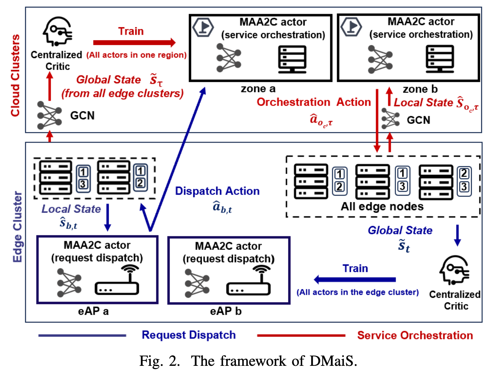
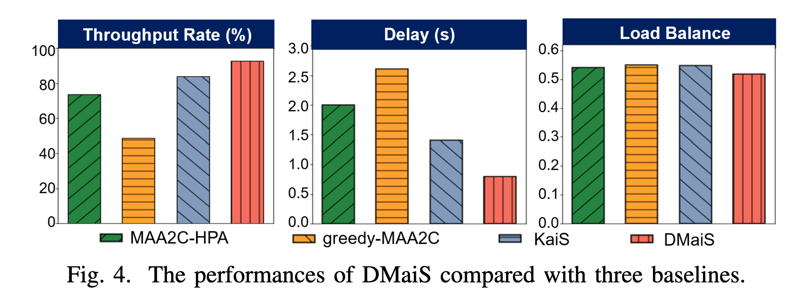
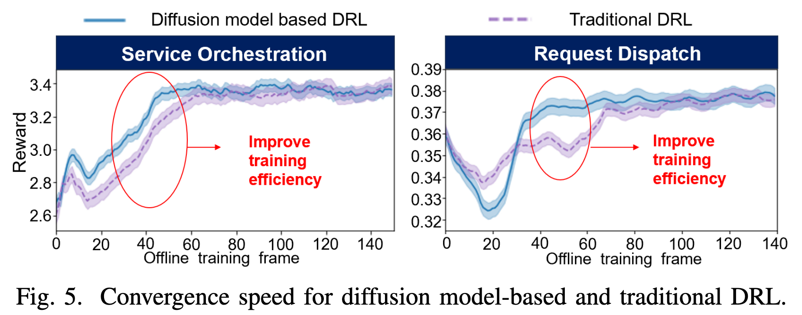
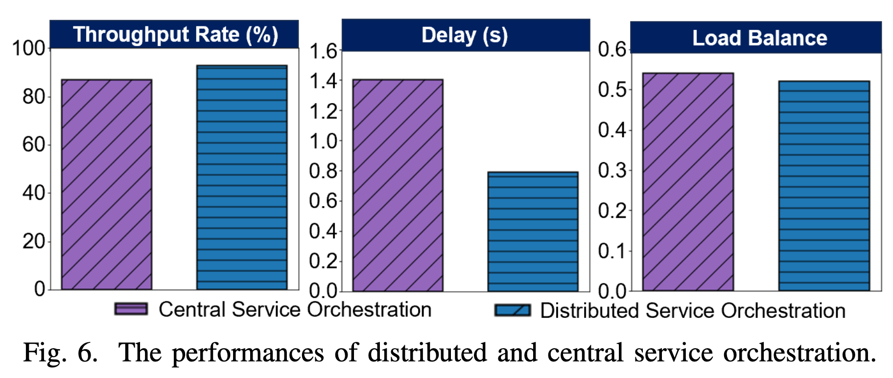
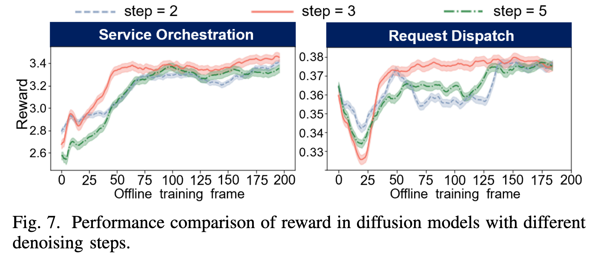
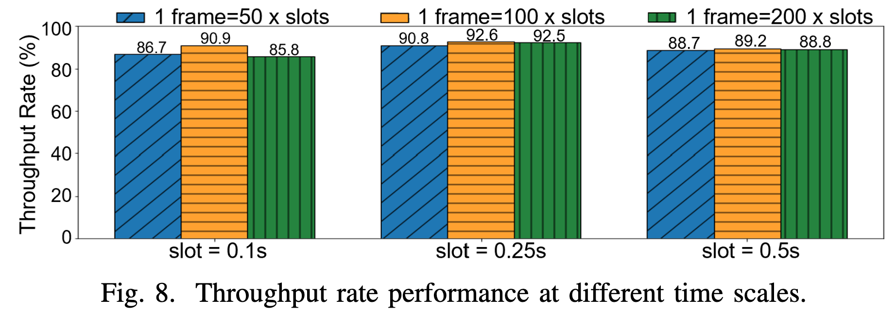

# 论文阅读

论文题目：DMaiS: Diffusion Model-Based Scheduling in  Edge-Cloud Systems
## 摘要

随着物联网（IoT）等技术的持续发展，边云系统中的调度问题正逐渐成为研究热点。深度强化学习（DRL）能够与环境交互并进行自适应学习，从而解决复杂的决策问题，因此已经成为处理边云系统调度问题的一种有效方法。然而，随着边云系统规模不断扩大，传统深度强化学习在调度过程中仍然面临收敛速度慢、计算资源需求高等挑战。

为解决这些问题，本文提出了一种基于扩散模型的深度强化学习算法 DMaiS。该算法将扩散模型用作优势演员-评论家算法（Advantage Actor-Critic，A2C）中的策略网络，以加快策略学习过程。此外，本文还基于多智能体优势演员-评论家算法（Multi-Agent Advantage Actor-Critic，MAA2C），设计了一种分布式服务编排方法，用于有效、灵活地管理规模庞大且结构复杂的云服务资源。

基于真实数据的实验结果表明，与基线算法相比，DMaiS 在执行边云系统调度时能够获得更高的系统吞吐率和更低的调度延迟。与传统深度强化学习算法相比，DMaiS 还表现出了更快的收敛速度。

## I. 引言

随着智能手机、平板电脑、可穿戴设备以及其他物联网设备数量的持续增长 [1]，边云系统的规模也在不断扩大，具体表现为需要处理的请求数量持续增加，以及需要进行编排的服务数量不断增多 [2]-[4]。因此，高效的调度算法，包括请求分发算法和服务编排算法，对于管理不断涌入的请求以及分配边云系统中的资源至关重要。

然而，由于请求模式具有不确定性，资源状态的变化也十分复杂，轮询调度和水平 Pod 自动伸缩器（Horizontal Pod Autoscaler，HPA）[5] 等传统调度算法难以满足系统对于吞吐率和延迟的要求。相比之下，深度强化学习（DRL）是一种面向复杂决策问题的人工智能算法，更适合用于边云系统中的调度。它能够持续与环境进行交互并开展自适应学习，从高维、非线性的状态空间和动作空间中有效地学习调度策略。

然而，在边云系统中应用深度强化学习进行调度仍然面临以下几个挑战。

**1. 在复杂环境中难以实现快速收敛**

边云系统规模的扩大意味着深度强化学习需要探索更加复杂的环境，并在维度更高的状态空间和动作空间中进行探索与学习。深度强化学习依靠与环境交互来完成学习，因此需要大量数据和计算资源。

面对复杂任务时，深度强化学习往往存在学习效率较低、难以收敛等问题。由于难以快速收敛，它在大型边云系统中运行时无法迅速学习出有效的调度策略，进而导致系统性能下降。

**2. 分布式大规模服务资源的编排具有挑战性**

许多现有研究主要关注中心化服务编排。然而，随着边云系统中服务种类和服务数量不断增加，中心化服务编排算法将面临越来越大的困难。云资源在地理和逻辑上的分布式特征进一步增加了问题的复杂性，对于只使用单个智能体的深度强化学习算法尤其如此。

这类算法无法根据边云系统规模灵活调整服务编排范围。与此同时，状态空间和动作空间的扩大会增加决策难度，使算法难以生成合适的服务编排动作。

一些研究已经尝试使用深度强化学习解决边云系统中的调度问题。例如，Han 等人提出了 KaiS [6]。为了缓解深度强化学习在复杂环境中的收敛问题，Du 等人在文献 [7] 中尝试使用扩散模型增强深度强化学习。此外，Malazi 等人在文献 [8] 中提出了一种部署于边缘服务器的分布式服务编排方法，以改善响应时间并减少回传网络流量。然而，上述工作并未同时、全面地解决前面提到的两个问题。

为解决这些挑战，本文提出了一种基于扩散模型的深度强化学习算法 DMaiS。DMaiS 通过结合生成式扩散模型和分布式调度方法来处理上述问题。本文的主要贡献如下：

- 本文使用扩散模型解决传统深度强化学习在复杂环境调度中学习能力有限、难以收敛的问题。扩散模型被用作优势演员-评论家算法（A2C）中的策略网络，从而更加高效地生成调度策略。

- 本文设计了一种分布式服务编排方法。DMaiS 使用多智能体 A2C（MAA2C），在云计算数据中心的每个可用区中将 Actor 部署为服务编排器，并采用集中式训练。这种方法提高了调度的灵活性，同时缩小了状态空间和动作空间的规模。

- 大量实验结果表明，与基线方法相比，DMaiS 将系统吞吐率提高了 `8.73%`，将系统延迟降低了 `43%`。此外，与传统深度强化学习相比，DMaiS 的收敛速度提高了 `60%`。

其中，“扩散模型作为策略网络”是理解这篇论文的关键：它不是用来生成图像，而是通过逐步去噪生成强化学习的调度动作概率分布。

## II. 调度问题描述

### A. 边云系统

如图 1 所示，边云系统由两个层级组成：云集群和边缘集群。边缘集群负责接收并处理来自终端设备的请求；云集群负责对边缘集群中的服务资源进行编排，同时处理边缘集群无法完成的请求。

**边缘集群与边缘节点。** 边云系统中的一个边缘集群由边缘接入点（Edge Access Point，eAP）和边缘节点组成。边缘接入点的集合表示为

$$ \mathcal{B}=\{1,\ldots,b,\ldots,B\}, $$

边缘节点的集合表示为

$$ \mathcal{N}=\{1,\ldots,n,\ldots,N\}, $$

其中，与边缘接入点 $b$ 相连的边缘节点集合记为 $\mathcal{N}_b$。

所有边缘接入点以及与它们相连的边缘节点均通过局域网（Local Area Network，LAN）进行通信。当一个请求到达边缘接入点后，系统需要作出分配决策，确定该请求应该由某个边缘节点处理，还是应被转发至云集群进行进一步计算。

**云集群。** 在该系统中，区域数据中心的每个可用区都被视为一个云集群。云集群的集合表示为

$$ \mathcal{C}=\{1,\ldots,c,\ldots,C\}. $$

这些云集群通过专用高速网络相互连接。每个云集群都具备充足的计算资源和存储资源，能够处理大规模数据和复杂计算任务。

每个云集群内部都部署了一个服务编排器，用于编排该云集群所管理的边缘集群中的服务资源。服务编排器的集合表示为

$$ \mathcal{O}=\{o_c\mid c\in\mathcal{C}\}. $$

### B. 调度方法

本文采用一种称为“双时间尺度调度”[9] 的机制。具体来说，请求分发在时间槽 $t$ 上执行，而服务编排则在时间帧

$$ \tau=\beta t,\qquad \beta\in\mathbb{N}^{+} $$

上执行。

**云集群中的服务编排。** 由于边缘节点的计算和存储资源有限 [10]，它们能够为各类服务实体维护的副本数量受到限制。服务实体集合表示为

$$ \mathcal{W}=\{1,\ldots,w,\ldots,W\}. $$

为解决这一问题，本文引入分布式服务编排策略

$$ \tilde{\pi}_{o_c,\tau}. $$

根据该策略，在每个时间帧 $\tau$，云集群 $c$ 中的每个服务编排器 $o_c$ 都会独立决定：其管理的边缘节点 $n$ 应当维护多少个服务实体 $w$ 的副本。

系统按照动态调度策略 $\tilde{\pi}_{o_c,\tau}$，以时间帧为单位执行服务编排动作，以减少频繁、大规模服务编排可能引起的系统不稳定。

**边缘接入点处的请求分发。** 进入边云系统的请求首先被发送至边缘集群中的边缘接入点。每个边缘接入点 $b$ 都维护一个队列 $Q_b$，用于保存其接收到的请求。

在较小的时间尺度，即每个时间槽 $t$，边缘接入点依据请求分发策略

$$ \hat{\pi}_{b,t} $$

将请求分发至相应的边缘节点或云端。未能及时得到处理的请求将在时间槽 $t$ 被系统丢弃。

此外，为了尽可能降低调度延迟，理想情况下，每个边缘接入点 $b$ 都应当独立处理其接收到的请求。这可以通过分布式请求调度算法实现。

### C. 调度优化目标

调度优化的目标是提高边云系统的长期系统吞吐量，从而增强系统高效处理请求的能力。

为了避免原始吞吐量数值过大，本文采用了一个更符合实际情况的指标，即长期系统吞吐率

$$ \Phi'\in[0,1]. $$

该指标表示：在系统接收到的全部请求中，满足指定延迟要求的请求所占的比例。

系统吞吐量定义为

$$ \Phi= \sum_{\tau}^{\infty} \sum_{n\in\mathcal{N}} \left( \Gamma_{\tau}(Q_n)+\Gamma_{\tau}(Q_c) \right), \tag{1} $$

长期系统吞吐率定义为

$$ \Phi' = \frac{\Phi} {\displaystyle \sum_{\tau}^{\infty} \sum_{b\in\mathcal{B}} \Gamma_{\tau}(Q_b) }. \tag{2} $$

其中：

- $\Gamma_{\tau}(Q_n)$ 表示边缘节点 $n$ 在时间帧 $\tau$ 内处理的请求数量；
- $\Gamma_{\tau}(Q_c)$ 表示云集群 $c$ 在时间帧 $\tau$ 内处理的请求数量；
- $\Gamma_{\tau}(Q_b)$ 表示边缘接入点 $b$ 在时间帧 $\tau$ 内接收到的请求总数。

因此，系统的调度优化目标可以写为

$$ \mathcal{O}: \quad \max_{\{\hat{\pi}_{b,t}:b\in\mathcal{B}\},\, \tilde{\pi}_{o_c,\tau}} \Phi'. \tag{3} $$

其中，$\hat{\pi}_{b,t}$ 表示边缘接入点 $b$ 在时间槽 $t$ 上采用的请求分发策略；$\tilde{\pi}_{o_c,\tau}$表示服务编排器 $o_c$ 在时间帧 $\tau$ 上采用的服务编排策略，该服务编排器负责管理相应的边缘集群。

## III. DIFFUSION MODEL-BASED DRL FOR SCHEDULING

本文将扩散模型作为 MAA2C 中的策略网络，设计了一种分布式调度方法。算法框架如图 2 所示。

### A. MAA2C 的马尔可夫博弈建模

下面对本文采用的、基于深度强化学习的调度方法进行马尔可夫博弈建模。
#### 1. 状态

状态空间记为 $\tilde{\mathcal S}$。

**请求分发状态。** 在每个时间槽 \(t\)，为每个边缘接入点 \(b\) 保存一个局部状态：

$$ \hat{s}_{b,t}= \left\{ r_{b,t},|\mathcal N_b|,D'_{\mathrm{trans}},Q_{b,t}, [Q_{n_b,t},f_{n_b,t},m_{n_b,t}\mid n_b\in\mathcal N_b] \right\}. $$

各项依次表示：

1. 请求信息，包括延迟要求和任务类型；
2. 该 eAP 管理的边缘节点数量；
3. eAP 与云端之间的网络延迟；
4. eAP $b$ 中等待分发的请求队列信息；
5. 与 eAP $b$ 相连的边缘节点中尚未处理的请求队列信息；
6. 边缘节点 $n_b$ 剩余的 CPU 和内存资源。

系统还维护一个全局状态：

$$ \tilde S_t=\{\hat{s}_{b,t}\mid b\in\mathcal B\}. $$

**服务编排状态。** 在每个时间帧 $\tau$，每个边缘节点 $n\in\mathcal N$ 的状态表示为

$$ \hat{s}_{n,\tau} = \{Q_{n,\tau},f_{n,\tau},m_{n,\tau},\Omega_{n,\tau}\}, $$

分别表示边缘节点 $n$ 的未处理请求队列、剩余 CPU 与内存资源，以及服务部署状态。

服务编排器 $o_c$ 的局部状态表示为

$$ \tilde S_{o_c,\tau} = \{\zeta_{n_c,\tau}\mid n_c\in\mathcal N_c\}, $$

其中，$\mathcal N_c$ 表示云集群 $c$ 管理的边缘节点集合，$\zeta_{n_c,\tau}$ 表示经过图卷积网络（GCN）编码后的边缘节点状态。系统还保存全局状态

$$ \tilde S_\tau=\{\tilde S_{o,\tau}\mid o\in\mathcal O\}. $$

#### 2. 动作

联合动作空间由所有 eAP 或所有服务编排器的动作空间共同组成：

$$ \hat{\mathcal A} = \hat{\mathcal A}_1\times\cdots\times \hat{\mathcal A}_\kappa\times\cdots\times \hat{\mathcal A}_K, $$

其中，$\hat{\mathcal A}_\kappa$ 表示某个 eAP 或服务编排器对应的动作空间。

**请求分发动作。** 由于边缘集群中的 $N$ 个边缘节点共同构成一个资源池，因此每个 eAP $b$ 的动作空间 $\hat{\mathcal A}_b$ 包含 $N+1$ 个离散动作，其中额外的一个动作表示将请求卸载到云端。在时间槽 $t$，所有 eAP 的联合请求分发动作表示为

$$ \hat a_t=(\hat a_{b,t}\mid b\in\mathcal B). $$

**服务编排动作。** 每个服务编排动作 $\hat a_{o_c,\tau}$ 会选择 $H$ 个边缘节点，其中 $H$ 取决于边缘集群的规模。对于每个被选中的节点，编排器可以增加、减少或保持其服务实体 $w$ 的数量，并且每次只能增加或删除一个服务实体。在时间帧 $\tau$，联合服务编排动作表示为

$$ \hat a_\tau=(\hat a_{o_c,\tau}\mid o_c\in\mathcal O). $$

#### 3. 奖励

同一边缘集群中的智能体共享一个奖励函数；同一区域中的服务编排器也共享一个奖励函数。

**请求分发奖励。** eAP 共享如下即时奖励：

$$ \hat u_{b,t} = e^{-\frac{\lambda}{\mu}-\omega\nu}. $$

其中：

- $\mu$ 表示在时间槽 $t$ 内，所有 eAP 接收到的请求的延迟要求总和，与超时请求实际延迟总和之间的比值；
- $\lambda$ 表示在区间 $[t,t+1]$ 内未满足延迟要求的请求比例；
- $\nu$ 表示负载均衡指标：

$$ \nu=\frac{1}{1+e^{-\xi}}, $$

其中，$\xi$ 表示所有边缘节点 CPU 和内存利用率的标准差；

- $\omega$ 是用于调节边缘节点负载均衡程度的权重。

**服务编排奖励。** 服务编排奖励设置为

$$ \hat u_{o_c,\tau} = e^{-\sum_{n\in\mathcal N_c}|Q_{n_c,\tau}|} + e^{1-\lambda}, $$

用于引导算法减少边缘节点上的请求积压。其中，$|Q_{n_c,\tau}|$ 表示边缘节点 $n_c$ 在时间帧 $\tau$ 上的未处理请求队列长度。

### B. 将扩散模型用作策略网络

为解决传统 DRL 调度算法难以收敛的问题，本文将生成式扩散模型用作 MAA2C 中的策略网络，以加快算法收敛。

扩散模型由前向和反向参数化马尔可夫链组成，可以从噪声中生成目标数据样本 [11]。

#### 1. 用于生成策略的反向过程

本文使用扩散模型的反向过程生成策略，即通过 \(I\) 个步骤对纯高斯噪声进行去噪，最终得到目标样本。扩散模型内部使用多层感知机（MLP）预测每一步需要去除的噪声。去噪公式为

$$ x_{i-1} = \frac{1}{\sqrt{\alpha_i}} \left( x_i- \frac{1-\alpha_i}{\sqrt{1-\bar{\alpha}_i}} \epsilon_\theta(x_i,i) \right) +\sigma_i z. \tag{4} $$

其中，$\epsilon_\theta(x_i,i)$ 表示扩散模型内部神经网络预测的噪声；$\alpha_i$ 和 $\sigma_i z$ 是经验参数 [11]；$x_i$ 和 $x_{i-1}$ 分别表示去噪前后的数据样本。经过 $I$ 个去噪步骤后，初始高斯噪声 $x_I$ 被逐步转换成所需的动作概率分布 $x_0$。

#### 2. 在 MAA2C 中使用扩散模型

**推理过程。** 对于请求分发，将观测到的系统状态 $\hat s_{b,t}$ 和目标动作空间大小 $d_{\mathcal A_b}$ 输入扩散模型；对于服务编排，则输入状态 $\tilde S_{o_c,t}$ 和动作空间大小 $d_{\mathcal A_{o_c}}$。

扩散模型首先生成一个与目标动作维度相同的高斯噪声，然后执行 \(I\) 次去噪。每一步中，MLP 对系统状态和当前去噪步骤进行编码，并预测该步骤需要减去的噪声，从而逐步生成目标动作概率分布。

**训练过程。** 在基于扩散模型的策略网络中，只有内部 MLP 的参数是可学习的。策略网络通过梯度下降训练该 MLP。MAA2C 计算的梯度记为

$$ \nabla_{\theta_p}J(\theta_p), $$

其中，$\theta_p$ 表示 Actor 策略网络的参数，即扩散模型内部 MLP 的参数。

### C. 用于分布式请求分配的 MAA2C

#### 1. MAA2C 的目标函数

请求分发和服务编排两种算法都采用集中式 Critic 进行训练。根据贝尔曼方程 [12]，状态价值网络的损失函数为

$$ L(\theta_v) = \left( V_{\theta_v}(\hat s_{b,t}) - V^*(\hat S_{t+1};\theta'_v,\pi) \right)^2, \tag{5} $$

其中目标价值为

$$ V^*(\hat S_{t+1};\theta'_v,\pi) = \sum_{\hat a_{b,t}} \pi(\hat a_{b,t}\mid\hat s_{b,t}) \left( \hat u_{b,t+1} + \gamma V_{\theta'_v}(\hat s_{b,t+1}) \right). \tag{6} $$

$\theta_v$ 和 $\theta'_v$ 分别表示价值网络和目标价值网络的参数。

MAA2C 使用以下优势函数和策略梯度：

$$ \nabla_{\theta_p}J(\theta_p) = \nabla_{\theta_p} \log\pi_{\theta_p}(\hat a_{b,t}\mid\hat s_{b,t}) A(\hat s_{b,t},\hat a_{b,t}), \tag{7}$$ $$A(\hat s_{b,t},\hat a_{b,t}) = \hat u_{b,t+1} + \gamma V_{\theta'_v}(\hat s_{b,t+1}) - V_{\theta_v}(\hat s_{b,t}). \tag{8} $$

其中，$\theta_p$ 是 Actor 策略网络参数，$\nabla_{\theta_p}J(\theta_p)$ 是策略梯度，$A(\hat s_{b,t},\hat a_{b,t})$ 是优势函数。

以上公式针对请求调度算法。对于服务编排算法，只需将 $b,t$ 分别替换为 $o_c,\tau$。请求分发和服务编排使用相互独立的策略网络与价值网络参数。

#### 2. 请求分发

- 分布式 Actor：在每个 eAP $b$ 内部署一个基于扩散模型的请求分发 Actor。它观察局部状态 $\hat s_{b,t}$，并独立生成请求分发动作 $\hat a_{b,t}$。所有 Actor 共享即时奖励 $\hat u_{b,t}$，并根据公式（7）和（8）进行训练。

- 策略上下文过滤由于边缘节点资源和所能维护的服务数量有限，需要通过资源上下文过滤不可用节点：

$$ [F_{b,t}]_j= \begin{cases} 1,&\text{边缘节点 }j\text{ 可用},\\ 0,&\text{否则}. \end{cases} \tag{9} $$

其中，$[F_{b,t}]_j$ 表示边缘节点 $j$ 是否部署了与 eAP $b$ 当前请求类型相匹配的服务。$F_{b,t}$ 标记不可用节点，保证请求调度算法生成有效动作。

- 集中式状态价值函数：同一边缘集群内所有 eAP 的 Actor 使用价值网络和目标价值网络进行训练。集中式 Critic 观察系统全局状态 $\tilde S_t$，并根据公式（5）和（6）指导各个 Actor 训练。

#### 3. 服务编排

由于边云系统包含多个云集群，因此需要采用分布式服务编排算法：在每个云集群中部署服务编排器，并进行集中式训练。

- 边云系统状态嵌入：为降低状态空间维度并描述边云系统的图结构，本文采用一个基于消息传递的两层 GCN，将系统状态编码成嵌入向量。这能够降低 MAA2C 的计算负担，并提供更加完整的系统状态表示。

- 分布式服务编排器：在每个云集群 $c$ 中部署一个服务编排器 $o_c$。该编排器观察所在云集群的局部状态 $\tilde S_{o_c,\tau}$，并独立生成服务编排动作 $\hat a_{o_c,\tau}$。同一区域内的所有服务编排器使用同一个 Critic 进行训练，其训练方法和公式与前述请求调度算法相同。

- 跨边缘节点扩缩容：频繁、大规模的服务编排会造成系统不稳定，因此服务编排器只从一个边缘集群中选择 \(H\) 个边缘节点进行服务扩缩容 [9]，即增加或减少节点所维护的服务或服务副本，也可以保持当前状态不变。

## IV. 性能评估

本节使用从真实环境中收集的数据，对本文算法进行全面评估。实验结果从吞吐率、延迟、负载均衡和算法收敛速度等方面，展示了 DMaiS 相比现有方法的性能提升。

### A. 实验设置

#### 1. 数据集选择

为了在真实条件下模拟边云系统中的调度方法，本文采用阿里巴巴真实生产环境中收集的请求数据 [13]。

#### 2. 边云系统配置

对于边缘集群，每个边缘集群包含 2 个 eAP 和 6 个边缘节点，每个 eAP 管理 3 个边缘节点。

每个边缘节点采用以下两种配置之一：

- 2 个 vCPU 和 4 GB 内存；
- 4 个 vCPU 和 8 GB 内存。

每个边缘节点还配备 0.3 TB 磁盘。

对于云集群，实验建立了 2 个云集群。每个云集群配置：

- 12 个 vCPU；
- 16 GB 内存；
- 1 TB 磁盘。

此外，研究人员手动构建了 6 种服务类型，并使用 Docker 容器部署这些服务。

#### 3. 训练设置

实验基于 PyTorch 1.11.0 和 Ubuntu 20.04 实现。请求分发和服务编排算法均采用 MAA2C。

Actor 网络使用扩散模型，扩散模型内部包含一个 MLP。Critic 使用两层神经网络，两层分别包含 64 个和 32 个神经元，并采用 ReLU 激活函数。

服务编排算法使用 GCN 编码系统状态信息。该 GCN 同样采用两层神经网络，两层分别包含 64 个和 32 个隐藏单元。

所有神经网络均使用 Adam 优化器训练，初始学习率为
$$ 10^{-4}, $$

并在训练过程中逐步衰减至

$$ 10^{-6}. $$

### B. 与基线方法的性能比较

为了验证算法的学习能力和系统长期吞吐性能，本文采用以下指标：

- 每个时间帧的吞吐率，记为 $\phi_f$；
- 负载均衡程度；
- 延迟，即请求从被卸载到完成处理所经历的时间。

实验将 DMaiS 与以下基线方法比较：

- 请求分发采用贪心算法；
- 服务编排采用 HPA；
- 请求分发和服务编排均采用 KaiS [6]。

实验共使用四种算法配置，以展示 DMaiS 的性能。结合图 4 的图例，这四种配置分别是 MAA2C-HPA、Greedy-MAA2C、KaiS 和 DMaiS。

图 4 展示了 DMaiS 在吞吐率、延迟和负载均衡方面的性能。与基线方法相比，DMaiS 的吞吐率提高了 `8.72%～43.9%`，延迟最多降低了 `69.7%`。此外，DMaiS 获得了最均衡的负载分布，其负载均衡指标为 `0.52`。

作者认为，这种性能提升来自两个方面：首先，DRL 中引入扩散模型后，算法能够更快地优化调度策略；其次，分布式服务编排能够及时响应局部环境变化。

### C. 扩散模型对 MAA2C 的影响

图 5 表明，在请求分发和服务编排两项任务中，基于扩散模型的方法都比传统 DRL 收敛得更快。

作者将其原因归结为：扩散模型将策略学习由传统的直接参数优化方式转变为生成式策略生成方式，从而帮助算法更快地从环境中学习。

### D. 分布式服务编排的有效性

为了保证系统稳定，并缓解服务编排算法中的动作空间爆炸问题，中心化服务编排方法在每个时间帧开始时，只从边缘集群中选择少量节点进行服务编排。

然而，在大规模边云系统中，这种方式可能导致服务编排延迟。

图 6 表明，分布式服务编排能够使边云系统获得更高的吞吐率。与中心化服务编排相比，分布式方法中的多个 Actor 可以快速收集局部数据并适应局部变化。

此外，分布式编排缩小了每个 Actor 面对的状态空间和动作空间，因此更容易学习有效的服务编排策略。

### E. 关键参数的影响

#### 1. 去噪步数

图 7 表明，为扩散模型选择合适的去噪步数，对于获得最佳收敛性能十分重要。

在测试请求分发算法时，实验固定服务编排算法的去噪步数；在测试服务编排算法时，则固定请求分发算法的去噪步数。

实验结果显示：
- 去噪步数为 3 时，模型表现最好；
- 去噪步数为 2 时，去噪不充分；
- 去噪步数为 5 时，过度去噪会导致过拟合。
因此，步数为 2 和 5 时，模型都表现出较差的收敛性能。

#### 2. 双时间尺度调度

时间槽长度和调度频率的不同会影响系统性能。图 8 表明，当时间槽长度为 `0.25 秒`，且每个时间帧包含 `100 个时间槽`时，系统获得了最佳吞吐率。

过短的时间槽可能妨碍调度算法学习，而过长的时间槽可能导致过拟合。适中的调度频率非常重要：
- 服务编排过于频繁，可能破坏系统稳定性；
- 服务编排过慢，则可能无法及时感知环境变化。

# 总结与思考

可以借鉴的点主要是双时间尺度，扩散模型作为AC框架的Actor网络，关于eAP管理边缘节点的划分，eAP调度的时候决策是可以在所有的边缘节点这部分感觉建模不是很清楚