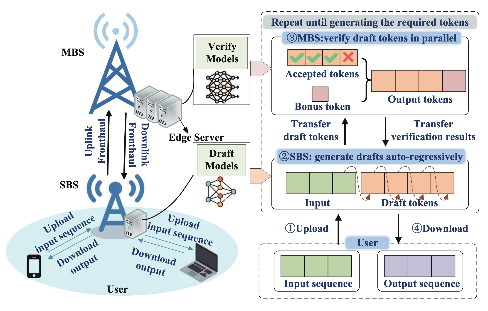
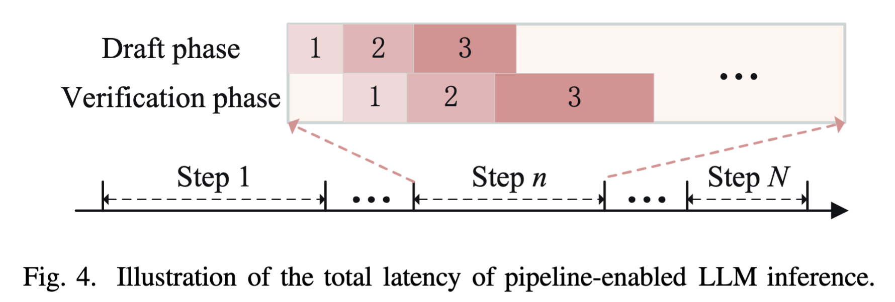
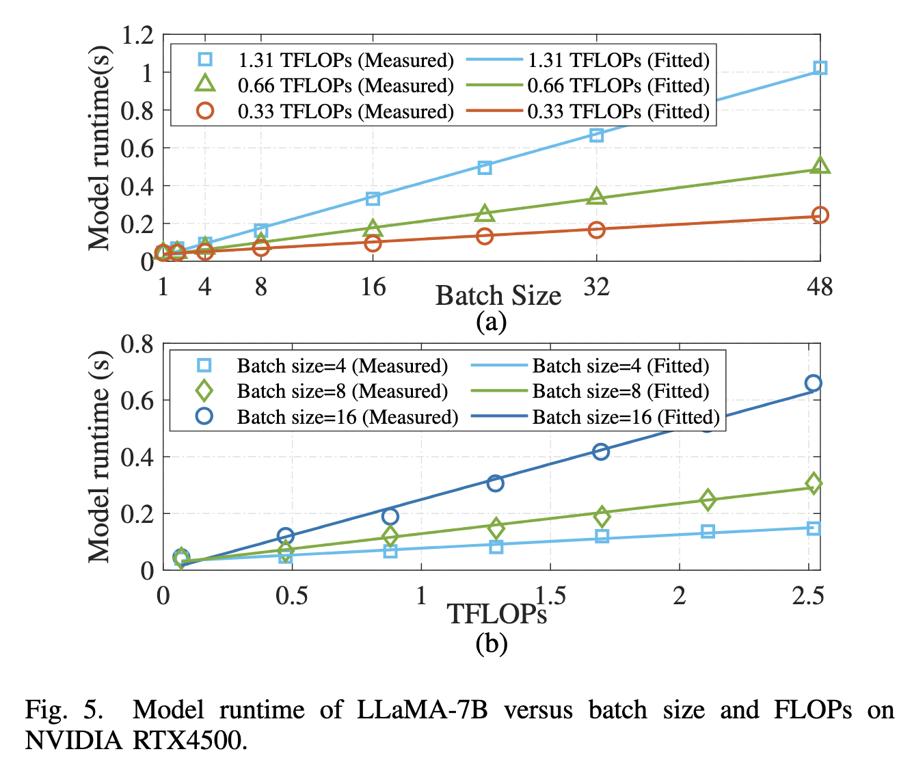
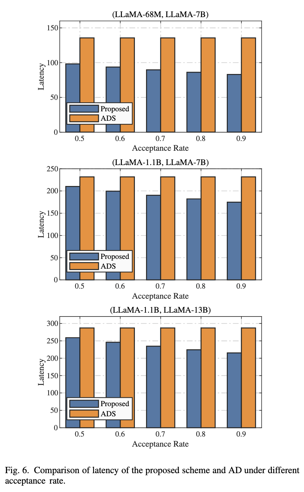
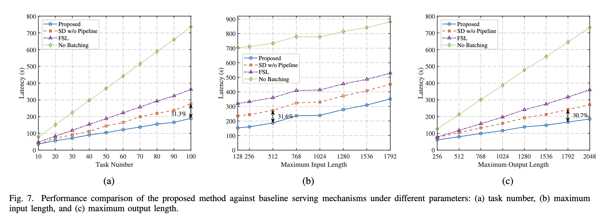
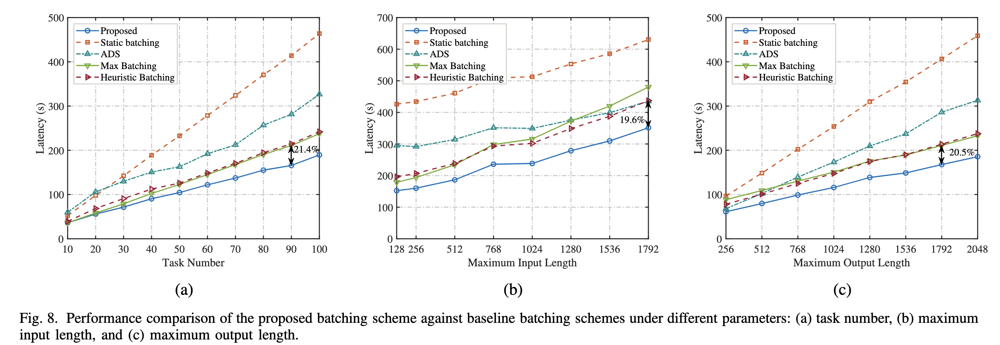
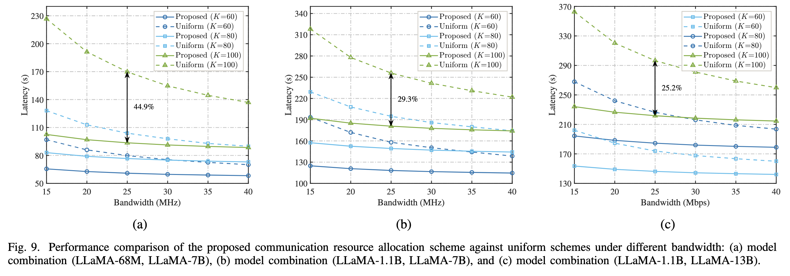

# 论文阅读

## 论文信息

论文题目：Efficient LLM Inference over Heterogeneous Edge Networks with Speculative Decoding
中文翻译：基于推测解码的异构边缘网络高效大语言模型推理
作者： Bingjie Zhu、Zhixiong Chen、Liqiang Zhao、Hyundong Shin 和 Arumugam Nallanathan，来自西安电子科技大学、伦敦玛丽女王大学和庆熙大学等机构。
期刊：IEEE Transactions on Communications（TCOM） CCF B类期刊
## 背景与问题

### 1. 为什么要在边缘运行 LLM？

目前大语言模型主要部署在云数据中心。用户把输入发送到云端，云端运行模型后返回结果。

这种方式存在两个问题：

- 用户距离云端较远，传输延迟较大；
- 用户的输入可能包含医疗、位置或个人信息，存在隐私风险。

边缘计算可以在靠近用户的基站或边缘服务器上运行模型，从而减少传输距离并保护隐私。

但是边缘节点通常存在：

- GPU 算力有限；
- 显存有限；
- 无线带宽有限；
- 同时需要服务多个用户。

因此，很难直接把完整的大模型部署在普通边缘节点上。

### 2. 自回归解码为什么慢？

传统 LLM 使用**自回归解码 (Autoregressive Decoding, AD)**：一次前向传播只能生成一个 token。如果回答包含 1000 个 token，大模型就需要反复执行大量前向传播。这个过程高度串行，即使 GPU 有很强的并行计算能力，也难以充分发挥。

### 3. 已有边缘 LLM 方法有什么不足？

已有研究主要采用：

- 模型量化；
- 模型切分；
- 张量并行；
- 云边协同；
- 任务卸载和资源调度。

这些方法虽然能减少模型部署成本，但通常仍然使用自回归解码，因此没有解决逐 token 串行生成的问题。模型切分还可能产生频繁的节点间同步，而量化可能影响模型精度。

### 4. 论文解决的核心问题

论文希望解决：

> 在多个用户、有限无线带宽、有限边缘内存和异构算力条件下，如何利用推测解码降低所有 LLM 任务的总服务延迟？

需要同时决定：

- 哪些任务放在同一个 batch；
- 一共划分多少个 batch；
- 每轮让小模型推测多少个 token；
- 每个用户应该分配多少上行带宽。

## 方法

### 系统架构


系统包含两个主要节点：

- **SBS，小基站**：资源较少，部署小型 draft model；
- **MBS，宏基站**：资源较强，部署大型 verify model。

用户连接到 SBS，SBS 与 MBS 之间通过高速有线 fronthaul 连接。

### 云边协同的推测解码

推理过程：

1. 用户把输入上传到 SBS。
2. SBS 的小模型自回归生成 `l` 个候选 token。
3. SBS 将候选 token 及其概率分布发送到 MBS。
4. MBS 的大模型一次前向传播，并行验证这些候选 token。
5. 被接受的 token 和一个额外的 bonus token 返回 SBS。
6. SBS 将结果流式发送给用户，并开始下一轮推测。

候选 token 的接受概率为：

$$min(1, \frac{p}{q})$$

其中 $q$ 是小模型概率，$p$ 是大模型概率。因此，最终输出仍由大模型的分布控制，不会因为使用小模型起草而直接降低目标模型精度。

一次验证平均生成的有效 token 数为：
$$L = \frac{(1 - \alpha^{(l+1)})}{(1 - \alpha)}$$
其中：
- $l$：每轮推测的 token 数；
- $\alpha$：平均接受率；
- $L$：一次验证平均产生的输出 token 数。

### 两阶段流水线



作者把推理过程分成两个流水线阶段：

- 阶段一：SBS 使用小模型生成 draft tokens；
- 阶段二：MBS 使用大模型验证 draft tokens。

多个用户任务先被划分成多个 batch，然后流水执行：

```
时间 1：SBS 起草 Batch 1
时间 2：SBS 起草 Batch 2，同时 MBS 验证 Batch 1
时间 3：SBS 起草 Batch 3，同时 MBS 验证 Batch 2
```

这样，SBS 和 MBS 不需要完全串行等待，可以同时处理不同 batch。

作者的故事是：

> 小模型起草时大模型空闲、大模型验证时小模型空闲的问题。


### 总服务延迟模型

$$总服务延迟 = 通信延迟 + 推理延迟$$
通信延迟：用户通过无线链路上传输入。由于开始 batch 推理前需要等待相关任务全部上传，通信延迟由最慢的用户决定：

$$T_{com} = max(T_1,com, T_2,com, …, T_k,com)$$
上传时间与以下因素有关：

- 输入序列长度；
- 用户获得的带宽；
- 发射功率；
- 无线信道质量

推理延迟：作者首先根据 Transformer 的矩阵乘法计算量，估计：
- draft model 的 prefill 和 decoding FLOPs；
- verify model 的验证 FLOPs；
- KV cache 的显存占用。

然后通过真实 GPU 测量，将模型运行时间近似为：

$$T(b,F) = c_1Fb + c_2$$
其中：
- $b$ 是 batch size；
- $F$ 是所需 FLOPs；
- $c_1$、$c_2$ 是由具体 GPU 测量拟合得到的参数。

最后，根据两阶段流水线的先后依赖关系，递推计算每个 batch 的完成时间。

### 联合优化资源和调度

作者联合优化四类变量：

- 每个 batch 包含哪些任务；
- batch 的总数量；
- 每轮推测多少个 token，即 speculation length；
- 每个用户分配多少无线带宽。

优化目标是：

$$最小化所有任务的总服务延迟$$

同时满足：

- 总带宽不能超过系统可用带宽；
- SBS 的模型权重和 KV cache 不能超过显存；
- 每个任务只能被分配到一个 batch；
- 推测长度不能超过最大值。

由于该问题是混合整数非线性问题，作者将它拆成三个子问题求解。
#### 第一步：带宽分配的闭式解

为了最小化最慢用户的上传时间，最优带宽分配满足：
$$w_k ∝ \frac{I_k}{log_2(1 + SNR_k)}$$
也就是说：

- 输入越长，带宽越多；
- 信道越差，带宽越多；
- 信道越好，完成相同上传任务所需的带宽越少。

最终目的是让所有用户尽量同时完成上传。

> 带宽的分配策略是由于慢任务效应决定的，系统必须等所有任务上传完才能进入后面的batch推理，随意总上传时间由最慢的任务决定，所以对于信道差的、输入长的，分配更多的带宽，这种能够尽快上传使计算尽快开始

#### 第二步：动态规划划分 batch

作者先按照输入长度从短到长排序，然后考虑所有可能的 batch 边界。

例如：
```
排序后任务：1 2 3 4 5 6
候选划分：[1,2] [3,4,5] [6]
```

对于每种候选 batch，算法计算：

- padding 带来的计算开销；
- draft 和 verify 阶段的延迟；
- 流水线等待时间；
- KV cache 和模型的显存占用。

超过 SBS 显存的分组会被直接排除。动态规划最终选择总推理延迟最小的划分，复杂度为：$O(K^2N)$

### 第三步：枚举推测长度

由于最大推测长度通常只有 10～20，作者直接枚举：

$$l = 1, 2, …, l_{max}$$


对于每个 $l$：

1. 计算平均有效 token 数；
2. 运行动态规划寻找最优 batch；
3. 计算完整流水线延迟；
4. 选择总延迟最低的 $l$。


## 实验


验证仿真所依赖的计算时间模型，这张图是直接在真实 GPU 上测出来的。作者在 RTX 4500 上运行 LLaMA-7B。

- 图 5(a)：计算量基本固定时，batch 越大，运行时间越长，近似线性。
- 图 5(b)：batch 固定时，FLOPs 越大，运行时间也近似线性增加。
- 图中的实测点和拟合直线比较接近。

因此认为，可以用一个简单线性模型，根据“batch 大小和计算量”估算执行时间。



横轴是接受率 $\alpha$，可以理解为：小模型猜出的 token 有多大比例能被大模型接受。

例如 $\alpha=0.8$，大致意味着小模型猜出的 token 中有 80% 可以保留。

- Proposed：论文提出的推测解码方案。
- ADS：普通的大模型自回归解码，不让小模型提前猜。
- Proposed 的延迟随着接受率提高而下降。
- ADS 基本不受接受率影响，因为它根本没有“接受草稿 token”这个过程。

原因很直观：接受率越高，大模型每验证一次能够拿到的有效 token 越多，验证轮数就越少。右图使用 13B 大模型，因此整体延迟更高。



这里设置接受率为 0.8，使用 LLaMA-1.1B 作为草稿模型、LLaMA-7B 作为验证模型。
三张子图分别增加：

- (a) 同时到达的任务数量 \(K\)
- (b) 最大输入长度
- (c) 最大输出长度

任务越多、输入越长、输出越长，总延迟都会上升。但 Proposed 基本始终最低，最高大约降低 31%。

几个基线的含义是：

- `SD w/o Pipeline`：使用推测解码，但没有边云流水线。
- `FSL`：推测长度固定为 7，不动态选择。
- `No Batching`：不对任务做合理的 batch 分组。

因此图 7 说明“流水线 + 动态推测长度 + batching”组合起来有效。



作者把自己的 batching 算法与固定 batching、最大 batching、启发式 batching 等方法比较。

Proposed 的核心是：

1. 尽量把输入长度接近的任务放进同一个 batch，减少 padding。
2. batch 不能超过边缘 GPU 显存。
3. 同时考虑小模型生成和大模型验证的速度，让流水线两侧尽量平衡。

结果显示，Proposed 在三组负载变化下都更低，延迟大约降低 19.6% 到 21.4%。

这里最值得注意的是：**batch 并非越大越好**。batch 过大可能包含长度差异很大的任务，短任务需要大量补零；还可能导致流水线一边很快、另一边很慢。



横轴是总无线带宽，纵轴是总延迟。不同曲线对应不同任务数 \(K\)。

- 带宽越大，上传越快，所以延迟下降。
- 任务越多，竞争带宽越严重，所以延迟上升。
- Uniform 给每个用户差不多的带宽。
- Proposed 会给输入更长、信道更差的用户更多带宽，让各任务尽量同时上传完成。

当 \(K=100\)、带宽为 25 MHz 时，相比平均分配，三种模型组合分别降低约 44.9%、29.3% 和 25.2%。

这里的 44.9% 只代表“动态带宽分配相对平均分配”的收益，不是整个系统相对普通解码的总收益。

## 我的理解

论文的场景是假设已经给出 `K` 个任务，怎样分 batch、选推测长度和分配带宽，才能最快完成？

关于SBS和MBS之间的通信作者这里直接假设是高速光纤前传链路，不是用户使用的无线链路，然后直接把这里的通信耗时给忽略了

论文里面区分了两类通信：

| 通信                       | 网络                | 是否优化        |
| ------------------------ | ----------------- | ----------- |
| 用户输入 $\rightarrow$ SBS   | 无线链路，20 MHz       | 动态分配带宽      |
| 草稿 SBS $\rightarrow$ MBS | 高速前传链路，假设 10 Gbps | 不优化，延迟近似为 0 |
ls
