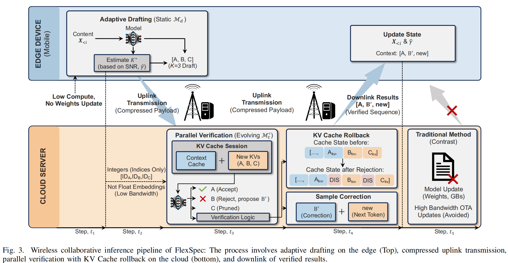
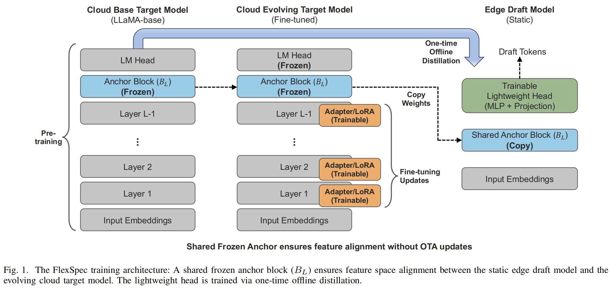
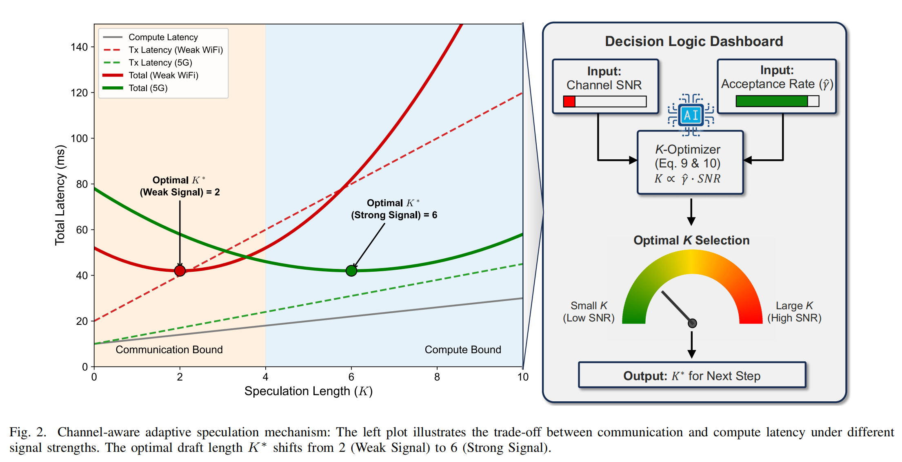
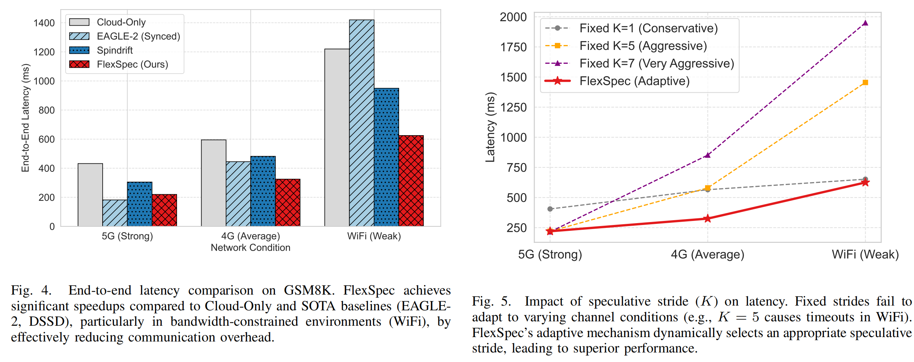

# 论文阅读

## 提出问题

作者提出的关于云边投机解码的三个问题：

1. 云端模型更新导致草稿模型同步，也就是 update storm；
2. 草稿模型固定后，和云端模型之间出现 distribution shift；
3. 无线网络变化使固定 `K` 不再适合。

## 方法

针对上面的问题作者提出了几个模块

### 模型

针对云端模型更新导致草稿模型同步作者设置了一套模型

云端大模型微调只微调前面的0～L层，对于第L层冻结和最后的LM Head冻结，然后边缘同时部署冻结的这一层，在边缘进行训练的时候训练一个Lightweight Head，只进行一次训练。

作者声称的一次训练然后就固定草稿模型不变，这个方法为什么能适应云端更新导致草稿模型的不同步不对齐感觉没有太多道理

### 在线自适应草稿

每生成一轮 token，就重新估计一次最优草稿长度 `K*`

输入：信道信噪比 SNR和一个指数平滑的历史接受率
输出：一个选择出来的最优K

### 通信

关于通信的模块感觉作者并没有解决，作者建模部分写的是传输的内容是token id，这样默认是进行贪心解码了，不然没办法进行重采样修正，但是后面做实验又有关于温度的内容，前后内容相矛盾。

## 实验

作者做实验感觉也是分开做的，虽然有网络感知的部分，但是作者并没有设置时变网络进行实验，而是每次固定一种网络环境运行算法，每次都是在不同的固定网络环境下进行的实验

关于能耗的实验作者是分成了通信能耗和计算能耗两部分计算的，但具体怎么算的论文里面也没有讲清楚