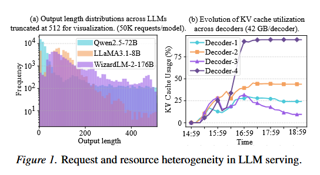
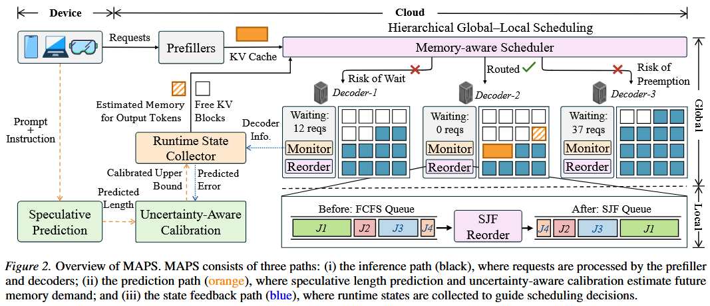
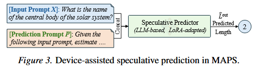
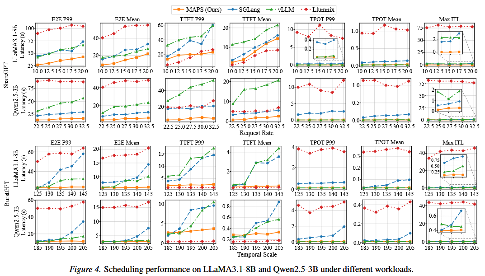
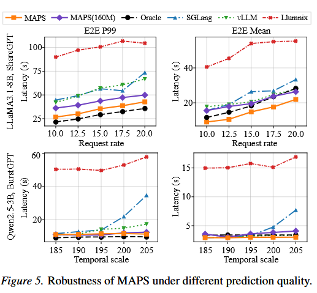
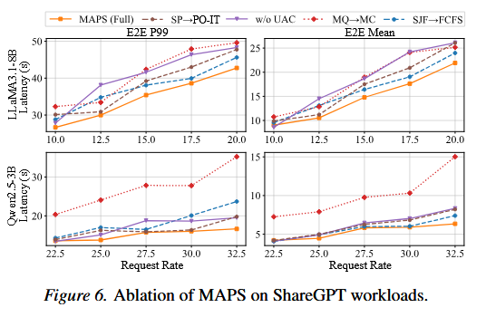
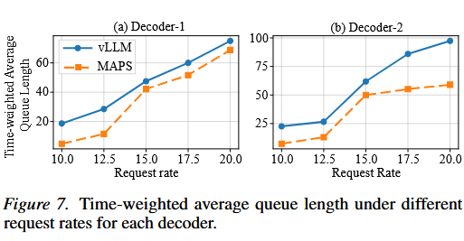

[TOC]

# 一、abstract

个人设备上大语言模型（LLM）应用的激增，给云端推理服务基础设施带来了海量且具突发性的工作负载。尽管预填-解码分离（Prefill-Decode Disaggregation）提升了系统的吞吐量与可扩展性，但由于请求到达云端时输出长度未知，受内存瓶颈限制的解码实例（Decode Instances）往往面临持续的负载不均衡问题。

为了解决这一难题，我们提出了 **MAPS**——一种专为分离式 LLM 推理服务定制的**内存感知预测调度框架（Memory-Aware Predictive Scheduling）**。MAPS 实现了端侧（设备端）辅助的推测性输出长度预测，并将其与云端的预填（Prefill）阶段并行重叠运行，由此产生的延迟开销几乎可以忽略不计。针对模型生成的不确定性，MAPS 引入了不确定性感知校准，推导出具备目标覆盖率的输出长度上限，从而保障安全的调度决策。基于这些长度上限，MAPS 进一步采用了“全局-局部”分层调度策略，有效缓解了解码器间的队列积压以及解码器内部的线头阻塞（Head-of-Line Blocking）。

在两种真实工作负载和两个大语言模型上的大量实验表明，MAPS 的性能显著优于三种现有的 SOTA（最先进）系统，将**平均端到端延迟降低了 42.6%**，**尾部延迟（Tail Latency）最高降低了 84.8%**。

> 写作思路：
>
> 遵循了“提出问题 → 剖析瓶颈 → 给出方案 → 拆解机制 → 数据验证”的思路
>
> 1. 铺垫背景与趋势（Context & Trend）
> 2. 分析现状并指出痛点（Gap & Main Challenge）
> 3. 亮出核心解决方案（Proposed Solution）
> 4. 拆解技术实现机制（Technical Contributions）
> 5. 数据与效果证明（Evaluation & Results）

# 二、Introduction

大语言模型（LLM）正越来越多地部署在移动设备和个人设备上的交互式应用中（Wang et al., 2025a），涵盖对话助手与问答系统（Yan et al., 2025）。为了提高可扩展性和资源利用效率，现代 LLM 服务系统采用了预填-解码（prefill-decode, PD）分离架构（Zhong et al., 2024），其中预填阶段（prefill）受限于计算能力（compute-bound），而解码阶段（decode）则因 KV cache 随生成 Token 增长而受限于内存带宽（memory-bound）。虽然在预填实例上进行调度因输入长度已知而相对直接，但解码实例面临的则是未知且高度可变的输出长度，这些长度在生成过程中才逐渐暴露。因此，现有系统依赖于无状态路由策略，如轮询（Round-Robin, RR）或最少请求（Least-Request, LR）路由，这些策略避开了请求层面的需求信息。尽管 LR 看起来更具负载感知能力，但它将请求数量等同于负载，忽略了解码服务时间，这使其在面对长生成请求时极易发生饱和。因此，像 vLLM（Kwon et al., 2023）和 SGLang（Zheng et al., 2024）等最先进的推理引擎仍然继续沿用更为保守的 RR 策略。

然而，随着实际应用中 LLM 输出长度的增加，RR 的局限性变得日益突出。如图 1(a) 所示，真实世界的负载呈现出高度偏斜且具有长尾特征的输出长度分布（Aubakirova et al., 2026），这导致解码需求存在显著异质性，并引发 KV cache 随时间消耗不均的问题。结果，配置相同的解码器在 KV cache 利用率上可能会逐渐产生分化，部分解码器持续处于饱和状态，而其他解码器则处于低利用率状态（Hu et al., 2024b），如图 1(b) 所示，并在附录 A 中通过排队论分析得到了进一步验证。在这种情况下，RR 不仅无法平衡解码器之间的负载，还会加剧队列积压并增加频繁的抢占事件（Sun et al., 2024）。云集群中的弹性部署和异构解码器容量进一步放大了这一问题，从而促使人们寻求更有效的调度机制。  

为了缓解这些局限性，先前的研究探索了通过输出长度估计来进行感知长度的调度（Jin et al., 2023）。PO-IT（Zheng et al., 2023）和 Ranking（Fu et al., 2024）利用长度预测或相对排序，在单个解码实例内实现了短作业优先（SJF）调度。然而，这些方法仍局限于易于实现的实例内调度，无法扩展到跨实例的请求放置，因为后者需要额外的运行时状态监控，这导致长生成请求容易被分发到高负载的解码器上。此外，在关键推理路径上进行预测本身会引入额外的开销，从而给对延迟敏感的 LLM 推理带来负担；同时，LLM 生成中固有的不确定性进一步限制了预测调度的效率。相比之下，诸如 Llumnix（Sun et al., 2024）等工作尝试在不平衡发生后通过请求迁移来重新平衡负载。尽管在某些情况下有效，但事后迁移（post hoc migration）会为具有庞大 KV cache 的长生成请求带来巨大的开销。  

综上所述，在 PD 分离的 LLM 服务中实现预测性调度面临三大核心挑战：  

1. **输出长度预测的设计必须确保在推理过程中仅产生极小的额外延迟**。  
2. **鉴于 LLM 生成中固有的不确定性，预测结果必须提供覆盖率保证，以支持低风险的调度决策**。  
3. **有效的调度必须同时作用于实例内和实例间两个层级，从而在高并发负载下实现低延迟推理**。  

为了解决这些挑战，我们提出了 MAPS——一种专为 PD 分离 LLM 服务定制的**内存感知预测调度框架（Memory-Aware Predictive Scheduling framework）**。MAPS 引入了一种推测性预测机制，通过微调部署在请求发起设备端（端侧）的轻量级 LLM，使预测过程与云端预填并行执行，从而掩盖延迟。为了应对 LLM 生成中的不确定性，MAPS 在云端构建了一个不确定性感知校准模块，通过共形校准（conformal calibration）基于历史预测导出具有覆盖率保证的输出长度上界。通过限制少估风险（underestimation risk），这些校准后的上界可以防止在解码器内存不足时接纳请求，从而避免过度的排队和抢占。基于校准后的预测，MAPS 采用了一种层级化的全局-局部调度策略。在实例间（全局）层级，MAPS 进行内存感知调度，以平衡解码器队列负载，同时基于预测长度确保足够的资源，从而减少排队延迟和抢占风险。在实例内（局部）层级，每个解码器应用 SJF 重新排序，以缓解队头阻塞（head-of-line, HOL）并提高局部执行效率。  

我们的主要贡献如下：

- **我们设计了一种端侧辅助的推测性预测机制**：将输出长度估计与云端预填相互重叠，从而以微乎其微的延迟开销实现了对请求级资源需求的早期可见性。  
- **我们开发了一个不确定性感知校准模块**：基于共形校准，将原始长度估计值转化为可靠的上界，降低少估风险，以确保后续调度决策的安全性与内存可行性。  
- **我们引入了层级化的全局-局部调度策略**：基于校准后的上界，联合缓解解码器间的队列积压和解码器内的队头阻塞，从而显著改善高并发条件下的推理延迟与尾部稳定性。  

在多种 LLM 和负载上的广泛实验表明，与三种最先进的系统相比，MAPS 显著优于对比基线，将平均端到端延迟降低了 42.6%，尾部延迟最多降低了 84.8%。

> 写作思路：
>
> introduction是abstract的扩充内容
>
> [ 1. 广阔背景与研究价值 ]  （大入口：这个领域很重要）
>             ↓
>   [ 2. 现状与旧方法的瓶颈 ]  （缩小：主流方法遇到新瓶颈了）
>             ↓
>   [ 3. 前人探索与已有空白 ]  （聚焦：前人的解法有缺陷 / Gap）
>             ↓
>   [ 4. 本文核心思路与挑战 ]  （突破：我们看到了什么 Insights，面临什么 Challenge）
>             ↓
>   [ 5. 本文方案与贡献总结 ]  （出口：MAPS 框架，三大贡献，实验效果）

1. 图 1(a)：真实负载的输出长度分布（高度偏斜与长尾特征）

- **内容**：统计并展示真实世界 LLM 服务应用中，用户请求的输出 Token 长度分布。  
- **现象**：负载呈现出显著的**高度偏斜（Skewed）与长尾（Long-tailed）特征**。即绝大多数请求只需要生成较短的回复，但少数请求需要生成极其冗长的内容。  
- **问题**：这种长度上的巨大差异，意味着不同请求对解码器（Decoder）显存（KV Cache）的占用时间和空间是完全不一样的，导致解码层面的资源需求存在极强的**异质性（Heterogeneity）**。  

2. 图 1(b)：传统轮询（RR）策略下 KV Cache 利用率严重分化

- **内容**：追踪在采用默认的轮询（Round-Robin, RR）路由策略下，多个配置完全相同的解码器（Decoder Instances）随时间的 KV Cache 显存利用率变化曲线。  

- **现象**：不同解码器之间的显存利用率随着时间推移发生了严重**分化（Divergence）**。  

  1. **部分解码器持续处于饱和状态**：因为运气不好，连续被分发到了几个长文本生成的请求，导致显存被撑满。  

  2. **部分解码器处于低利用率状态**：因为分到的都是短文本请求，显存大量闲置。  

- **问题**：

  1. **队列积压与抢占（Preemption）**：处于饱和状态的解码器无法容纳新请求，导致请求在队列中长期等待，甚至因为显存不足触发抢占事件（即把正在生成的请求挤出显存），严重损害性能。  
  2. **资源浪费**：低利用率节点的 GPU 显存没有得到充分发挥。 

# 三、Related Work

**LLM 服务系统。** 近期的 LLM 服务系统主要关注在大规模下提升推理效率，尤其强调高并发场景下的低延迟。在系统层面，SpotServe (Miao et al., 2024)、FastServe (Wu et al., 2026) 和 AlpaServe (Li et al., 2023) 探索了成本高效执行、抢占式调度和流水线并行，以改善突发负载下的延迟；而 DistServe (Zhong et al., 2024) 则采用预填充-解码（PD）分离架构，以缓解严格延迟约束下的阶段间干扰。

以往的系统主要通过优化单个实例内的执行来提升推理效率。Orca (Yu et al., 2022) 引入了连续批处理（continuous batching），DeepSpeed-MII (Microsoft, 2023) 通过模型并行支持大型模型执行，vLLM (Kwon et al., 2023) 利用 PagedAttention 提升内存效率，SGLang (Zheng et al., 2024) 则通过 RadixAttention 减少冗余的预填充计算。然而，在多实例部署中，这些系统依赖反应式调度策略（例如轮询 RR），因为在请求分发时最终生成长度是未知的。在异构负载下，这类策略可能导致内存争用和排队延迟。Llumnix (Sun et al., 2024) 通过运行时重调度和请求迁移部分缓解了这一问题，但其方式仍是反应式的，而非预测式的。

**长度感知调度。** 早期的输出长度预测方法主要针对非自回归生成任务 (Gu & Tan, 2022; Shu et al., 2020)，例如机器翻译，其中输出长度与输入长度密切相关，因此不能直接推广到具有高度可变且不确定的生成长度的自回归 LLM 推理场景。

近期研究开始探索为 LLM 预测输出长度以提升服务效率 (Jin et al., 2023; Hu et al., 2024a; Stojkovic et al., 2025)。一些方法依赖数据集级别的统计信息或轻量级学习预测器 (Qiu et al., 2024b;a; Sanh et al., 2019; Zhang et al., 2022; Cheng et al., 2024)，通常将长度预测建模为分类任务。PO-IT (Zheng et al., 2023) 提示 LLM 自身估计输出长度，而 Ranking (Fu et al., 2024) 则通过请求的相对排序来近似最短作业优先（SJF）调度，无需显式长度预测。然而，这些方法隐含地假设预测长度或排序能够可靠地反映请求级别的资源需求，但在输出长度高度不确定的真实负载下，这一假设经常不成立。

**设备与云端的协同 LLM 推理。** 近年来，硬件能力的提升和模型压缩技术的进步使得在终端设备上运行小型或量化 LLM 越来越可行 (Lin et al., 2024)，这激发了设备-云端协同 LLM 推理的日益增长的兴趣。该领域现有工作主要聚焦于执行层面的协作，包括将 LLM 执行在设备与云之间拆分以提升吞吐量 (Mudvari et al., 2024; Yang et al., 2024)，以及在动态网络条件下进行自适应执行划分 (Younesi et al., 2025)。相比之下，很少有研究关注利用设备端推理来辅助云端 LLM 服务的预测性调度决策，而这正是本文的工作重点。

# 四、Method

**图 2：MAPS 概览。** MAPS 包含三条路径：(i) 推理路径（黑色），请求由预填充节点和解码器处理；(ii) 预测路径（橙色），通过推测式长度预测和面向不确定性的校准来估计未来的内存需求；(iii) 状态反馈路径（蓝色），收集运行时状态以指导调度决策。

MAPS 利用设备端与云端的互补作用，构建了三条相互协同的路径，以实现内存感知的预测式调度，如图 2 所示。每个请求提交后，会沿两条并行路径执行。在推理路径上，请求被转发至云端预填充节点，执行提示词预填充。与此同时，在预测路径上，MAPS 直接在请求发起设备上执行推测式预测，无须额外传输数据。预测得到的长度随后被发送至云端的面向不确定性的校准模块；该模块将其修正为具有统计覆盖率保证的校准后上界，并把结果存入运行时状态收集器。预填充完成后，内存感知调度器读取该校准上界，同时考虑预测的内存需求以及所有解码器可用的 KV 缓存容量。随后，请求会被路由至一个具有足够空闲 KV 块且等待队列较短的可行解码器。在选中的解码器内，MAPS 对已接纳的请求按照最短作业优先（SJF）策略重新排序。连续批处理、KV 缓存管理等基础机制则由底层 vLLM 运行时负责。

## 1 设备辅助的推测式预测

为了实现主动式的内存感知调度，MAPS 需要在解码开始前，提前估计每个请求的输出长度。这一估计必须在准确性与效率之间取得平衡：预测不准会降低后续调度决策的质量，而高时延的预测推理又会直接增加首 Token 时延（TTFT）。

使用大语言模型预测输出长度是一种自然的选择（Zheng et al., 2023），因为生成长度不仅取决于提示词的表层统计特征，还取决于输入中更高层次的语义意图。大语言模型经过专门训练，能够捕捉此类语义意图，而简单的统计方法或基于回归的预测器很难对其建模。然而，直接调用大语言模型进行预测会引入额外时延，因而不适合在线服务。

因此，MAPS 采用设备辅助的推测式预测器（Speculative Predictor, SP）：在请求发起设备上运行一个轻量级大语言模型，提前生成长度估计，并使这一过程与云端预填充重叠，从而在预测可靠性与时延之间取得实用的平衡。

**图 3：MAPS 中设备辅助的推测式预测。**

如图 3 所示，SP 将输入提示词 $X$ 与预测提示词 $P$ 一同作为输入，在完成一次预填充前向计算后，输出一个标量 $ \hat{L}^{\mathrm{out}} $，用于估计将要生成的 Token 数：
$$
\hat{L}^{\mathrm{out}} = f_{\mathrm{pred}}([X;P]). \tag{1}
$$

预测器并不是预测自身回答的长度，而是被要求估计大语言模型针对该输入可能生成的最大输出长度。这样可以提高预测结果在异构模型和不同解码行为下的稳健性。预测提示词 $P$ 如下：

> 给定以下输入，请估计大语言模型在回答该输入时可能生成的最大输出 Token 数。只返回一个非负整数。

然而，仅靠基于提示词的推理，仍不足以稳健地捕捉不同下游模型之间的生成差异。因此，MAPS 使用参数高效微调来适配 SP：采用 LoRA（Hu et al., 2022），并使用汇总自多个大语言模型的监督数据。具体而言，每个训练目标都被设为 LLaMA 和 Qwen 模型在多种温度设置下观测到的最大输出长度，以促使预测器学习适合安全内存感知调度的保守上界。训练细节见附录 B。

在当前实现中，MAPS 使用一个统一的 SP 来估计不同下游模型的输出长度。更一般地说，也可以采用与服务模型相匹配的轻量级变体来实现 SP，从而保持与云端推理的兼容性并支持高效部署。

## 2 面向不确定性的校准

尽管 SP 被训练为给出保守的最大值估计，但在高度非平稳的真实工作负载下，大语言模型的生成过程仍具有内在随机性。用户行为、解码温度和工作负载漂移所造成的变化，使输出长度难以被可靠预测。在生产系统中，低估可能造成队列积压和抢占，进而使时延成倍增加（Kwon et al., 2023）。因此，单纯追求预测准确率并不足够；对于内存感知调度而言，关键在于预测结果在不确定性下是否可靠。

为了让长度预测可用于在线服务，MAPS 引入了面向不确定性的校准模块（Uncertainty-Aware Calibration, UAC）。该模块根据近期运行时预测误差对预测结果进行校准，从而把生成不确定性纳入考虑。具体而言，MAPS 采用保形预测（Angelopoulos & Bates, 2023）。这是一种与数据分布无关的框架，可将点估计转换为面向不确定性的长度区间，以用于内存预算和调度。保形预测不需要对数据分布作任何假设，并提供有限样本保证，因此非常适合异构大语言模型工作负载。为适应非平稳服务环境中的分布漂移，MAPS 针对近期请求维护一个滑动校准窗口；实证结果显示，其实际覆盖率接近目标覆盖率。

系统维护校准集

$$
\mathcal{D}_{\mathrm{cal}} = \{(X_i,L_i^{\mathrm{out}},\hat{L}_i^{\mathrm{out}})\}_{i=1}^{n},
$$

其中包含最近完成的 $n$ 个请求；$L_i^{\mathrm{out}}$ 表示实际观测到的生成长度，$\hat{L}_i^{\mathrm{out}}$ 表示对应的预测值。对于每个样本，系统定义一个单侧非一致性分数，用来度量低估误差：

$$
s_i = \left(L_i^{\mathrm{out}}-\hat{L}_i^{\mathrm{out}}\right)_+
= \max\left(0,L_i^{\mathrm{out}}-\hat{L}_i^{\mathrm{out}}\right), \tag{2}
$$

只有当预测器低估真实输出长度时，该分数才为正。给定目标未覆盖率 $\alpha\in(0,1)$，系统计算单侧非一致性分数的经验 $(1-\alpha)$ 分位数：

$$
q_\alpha = \mathrm{Quantile}\left(\{s_1,\ldots,s_n\},\left\lceil(1-\alpha)(n+1)\right\rceil\right). \tag{3}
$$

给定推测式预测值 $\hat{L}^{\mathrm{out}}$，输出长度的校准后上界 $\hat{L}^{\mathrm{up}}$ 定义为：

$$
\hat{L}^{\mathrm{up}} = \hat{L}^{\mathrm{out}} + q_\alpha. \tag{4}
$$

在可交换性假设下（Vovk et al., 2005），该校准上界满足以下保证：

$$
\mathbb{P}\left(L^{\mathrm{out}}\leq\hat{L}^{\mathrm{up}}\right)\geq 1-\alpha, \tag{5}
$$

即低估率不超过 $\alpha$。

## 3 分层全局-局部调度

MAPS 的调度重点是受内存约束的解码阶段。系统将解码集群建模为一组解码器 $\mathcal{D}=\{d_1,\ldots,d_K\}$，其中每个解码器 $d_k$的 KV 缓存容量为$ C_k$。借助 PagedAttention，该容量被虚拟化为固定大小的块，每块大小为 $S$，即对应 $S$ 个 Token；解码器 $d_k$ 的可用资源以其空闲块数量衡量。对于每个请求 i，定义作业元组 $J_i=(t_i^{\mathrm{arr}},L_i^{\mathrm{prom}})$，其中 $t_i^{\mathrm{arr}}$ 为到达时间，$L_i^{\mathrm{prom}}$ 为提示词长度。

### 运行时状态收集器（RSC）

MAPS 维护一个轻量级运行时状态收集器（Runtime State Collection, RSC）来支持调度决策。每个解码器 $d_k$ 都内置一个本地监控器，定期上报其运行状态，包括空闲块数量 $B_k^{\mathrm{free}}$、已分配给正在处理请求的预留块数量 $B_k^{\mathrm{res}}$、可用于调度的有效块数量 $B_k^{\mathrm{eff}}=B_k^{\mathrm{free}}-B_k^{\mathrm{res}}$，以及当前队列长度 $Q_k$。这些信号共同反映每个解码器实时的内存可用量与内存压力。对于每个到达的请求 $i$，RSC 接收其校准后上界 $$ \hat{L}_i^{\mathrm{up}} $$，同时维护近期请求结果的滑动窗口，以支持在线校准。

### 内存感知调度器

请求到达后，MAPS 首先从 UAC 获取校准后上界 $\hat{L}_i^{\mathrm{up}}$。随后，调度器将作业元组扩展为 $J_i=(t_i^{\mathrm{arr}},L_i^{\mathrm{prom}},\hat{L}_i^{\mathrm{up}})$。如果此时上界尚不可用，调度器最多等待一个预定义的超时时间 $\beta$；超时后则回退到轮询（Round Robin, RR）分派，以免阻塞推理流水线。构造出 $J_i$ 后，MAPS 按下式估计该请求的 KV 缓存需求：

$$
B_i^{\mathrm{need}} = \left\lceil\frac{L_i^{\mathrm{prom}}+\hat{L}_i^{\mathrm{up}}}{S}\right\rceil. \tag{6}
$$

如果解码器 $d_k$ 的 $B_k^{\mathrm{eff}}$ 足以容纳 $B_i^{\mathrm{need}}$，则认为它对于作业 $J_i$ 是可行的，具体定义见附录 C 的算法 1。该可行性检查确保请求优先被分派至内存容量充足的解码器，从而避免在解码期间发生资源超额分配和抢占。在所有可行解码器 $\mathcal{D}_{\mathrm{feasible}}$ 中，MAPS 选择等待队列长度 $Q_k$ 最小的解码器。这一设计直接针对排队时延，而在高负载下，排队时延是尾时延的主要来源。

从内存均衡的角度看，按最大可用容量进行路由似乎很直观，但这种方式忽略了排队动态，可能会把突发请求集中到某个暂时拥有大量空闲内存的解码器上，从而增加等待时间和 KV 缓存传输开销。消融实验也观察到了这一现象。只有在最坏情况下，即没有任何解码器满足可行性条件时，MAPS 才会回退到这一策略。该回退策略优先考虑内存可用量，以最大限度提高系统继续向前执行的可能性。选定目标解码器后，MAPS 会以原子方式预留 $B_i^{\mathrm{need}}$，从而避免并发请求到达时出现竞争条件，并确保执行过程中始终满足内存可行性条件。

### 本地 SJF 重排序

请求被路由至 $d_k$ 后，会进入执行队列。本地调度通过最小化平均时延，并缓解长请求造成的队头（Head-of-Line, HOL）阻塞，来提高时间效率。

对于输出长度各不相同的工作负载，传统的先来先服务（FCFS）策略并非最优；尤其在高负载下，短请求可能排在长请求之后并长时间等待（Fu et al., 2024）。尽管最短作业优先（SJF）调度在许多系统中都能最小化平均等待时间（Harchol-Balter, 2013），但它很少被用于大语言模型服务。原因在于，现有系统通常不了解新到达请求的执行时间。

在模型架构固定时，解码逐 Token 进行，且每个 Token 的处理时延较为稳定。因此，总解码时间与输出长度近似成正比，这使预测长度 $\hat{L}_i^{\mathrm{up}}$ 可以作为调度决策中执行时长 $T(J_i)$ 的实用代理，即 $T(J_i)\propto\hat{L}_i^{\mathrm{up}}$。每个解码器维护一个就绪队列 $Q_k$，并按照 $\hat{L}_i^{\mathrm{up}}$ 动态重排：

$$

\mathrm{Order}(Q_k) = \underset{J_i \in Q_k}{\mathrm{arg\,sort}}\left(\hat{L}_i^{\mathrm{up}}\right). \tag{7}
$$

为避免请求饥饿，MAPS 设置最大等待时间约束：等待时间超过预设阈值的请求会被提升优先级。附录 E 分析了该阈值的敏感性。本地调度器在优先处理  $\hat{L}_i^{\mathrm{up}}$  较小的作业的同时限制最长等待时间，从而在不使长生成请求饥饿的前提下降低平均完成时间。

## 4 时间线分析

为了说明 MAPS 的时延收益来自何处，作者在附录 D 中分析了端到端推理时间线。MAPS 让设备端预测与校准同云端预填充重叠，从而有效地将预测开销隐藏在关键路径之外。尽管 MAPS 增加了一步内存感知调度，但与解码时延相比，其开销可以忽略不计。主要的时延缩减发生在解码阶段：分层全局-局部调度显著降低了解码器之间的排队时延和队头阻塞。

# 五、Experiments

## 实现细节

我们基于 vLLM 推理引擎（v0.13.0）实现 MAPS，并在一个配备 6 块 NVIDIA A6000 GPU 的云端部署上完成全部实验。该系统采用预填充-解码（PD）解耦架构，包含一个预填充节点和两个解码器。预填充节点与解码器之间的 KV 缓存通过 Mooncake 传输。在设备端，推测式预测器（SP）部署于 NVIDIA Jetson Orin NX 设备上。

考虑到边缘设备的资源预算各不相同，我们部署了两个不同规模的 SP 变体：SP-7B 以 Vicuna-7B 为骨干模型，反映现代边缘硬件日益增强的端侧运行能力；SP-160M 是基于 Vicuna-160M 构建的轻量级变体，面向内存更受限的设备。除非另有说明，后续实验均以 SP-7B 作为默认预测器，文中的 MAPS 也指采用 SP-7B 实例化的系统。

面向不确定性的校准模块（UAC）使用最近 500 个请求构成的滑动窗口，以 $\alpha=0.1$ 执行保形校准。MAPS 使用一个由 Redis（v7.1.0）实现的轻量级运行时状态收集器，聚合解码器运行状态与预测信号。最大等待时间与预定义超时时间 $\beta$ 均设为 1 秒。

如引言所述，在长时间运行的大语言模型服务中，由于请求长度各异以及 KV 缓存不断累积，解码器之间会自然产生负载分化。为了隔离并系统研究这一影响，我们有意为不同实例设置不同的 GPU 有效内存利用率上限，在服务环境中构造受控的内存异构性。具体而言，对于 LLaMA3.1-8B，预填充节点和其中一个解码器的利用率上限设为 0.8，另一个解码器限制为 0.5；对于 Qwen2.5-3B，相应上限分别为 0.6 和 0.2。除非另有说明，其余系统参数均采用 vLLM 默认配置。

### 基线方法

在预测方面，我们与两种具有代表性的方法进行比较：PO-IT（Zheng et al., 2023）通过指令微调采用大语言模型辅助的纯感知策略；S3（Jin et al., 2023）则将长度预测表述为对离散区间进行分类的问题。

在调度性能方面，我们将 MAPS 与三个广泛使用的开源推理框架进行比较：vLLM（v0.13.0；Kwon et al., 2023）、SGLang（v0.5.5；Zheng et al., 2024）和 Llumnix（Sun et al., 2024）。vLLM 与 SGLang 均采用其官方的、基于 Mooncake 的 PD 解耦部署进行评测，Llumnix 则采用默认的、基于 Ray 的 PD 配置。

### 工作负载与模型

我们在两种真实世界工作负载上评测 MAPS。沿用已有研究（Kwon et al., 2023）的方法，我们从 ShareGPT（RyokoAI, 2023）构造合成工作负载，并将请求到达过程建模为到达率可配置的泊松过程。为了捕捉真实的突发行为，我们还使用 BurstGPT（Wang et al., 2025b）轨迹进行评测。该轨迹记录了 Azure OpenAI 生产环境中的突发请求到达情况；实验**通过时间缩放**重放轨迹，以改变负载强度。

实验采用两个广泛使用的大语言模型：LLaMA3.1-8B（Touvron et al., 2023）和 Qwen2.5-3B（Qwen Team, 2024）。二者在模型规模和解码特性上存在显著差异，因此可以用来评估 MAPS 面对异构大语言模型后端时的稳健性。

## 1 输出长度预测性能

### 点预测准确性

本节评估 SP 的预测准确性。为保证公平比较，我们沿用 PO-IT 的设置，从 Alpaca 数据集（Taori et al., 2023）中随机抽取 2 万条提示词进行实验。前 1 万条用于微调，其余 1 万条用于评测。SP-7B 和 SP-160M 使用相同的数据划分。对于 S3，我们遵循其原始设置，使用相同的 1 万条提示词微调 DistilBERT。由于 S3 将长度预测表述为一个包含 10 个区间的分类问题，为进行保守比较，我们使用预测区间的上界作为长度估计。

**表 1：Alpaca 数据集上的预测准确性。Acc-$k$ 表示预测误差不超过 $k$ 个 Token 的请求比例。**

| 方法      | 骨干模型    |  MAE ↓ | Acc-50 ↑ | Acc-100 ↑ |
| --------- | ----------- | -----: | -------: | --------: |
| **SP-7B** | Vicuna-7B   | **56** |  **58%** |   **85%** |
| SP-160M   | Vicuna-160M |   92.2 |      45% |       65% |
| PO-IT     | Vicuna-7B   |     63 |      56% |       81% |
| S3        | DistilBERT  |     71 |      48% |       64% |

表 1 将 SP 与现有预测方法进行了比较。在平均绝对误差（MAE）方面，SP-7B 相比 PO-IT 和 S3 分别将误差降低了 11.1% 和 21.1%，说明其点估计更准确。沿用 PO-IT 的做法，我们还报告 Acc-50 和 Acc-100 来评估预测可靠性；SP-7B 在这两项指标上始终具有更高的准确率。

正如预期，由于容量小得多，轻量级 SP-160M 的 MAE 更高、Acc-$k$ 更低。尽管如此，其预测仍能为后续调度提供有用信号，并可由 UAC 进一步修正。因此，即使预测器预算受到严格限制，MAPS 仍能保持有效，4.3 节将对此进行说明。总体而言，这些结果表明，SP 同时改善了平均准确性以及实用误差容限内的预测可靠性。附录 B 给出了更详细的误差分布分析。

### 面向安全调度的校准

在大语言模型服务的输出长度预测中，由于固有的不确定性，预测误差不可避免。其中，低估远比高估危害更大，因为低估可能引起队列积压、请求抢占和严重的尾时延膨胀。相比之下，适度高估主要导致较保守的资源分配，而 PagedAttention 等技术还能进一步缓解这种影响。因此，本节重点研究与低估相关的风险。

为量化该风险，我们同时报告低估概率与最大低估误差。

**表 2：输出长度预测的低估风险分析。**

| 设置         | 低估概率 ↓ | 最大低估误差 ↓ |
| ------------ | ---------: | -------------: |
| SP           |        64% |            503 |
| SP + Offset  |        56% |            501 |
| **SP + UAC** |     **9%** |        **377** |

如表 2 所示，未经校准的预测器具有不可忽视的低估概率，并且在部分请求上会产生严重误差。简单的单侧偏移启发式方法（SP + Offset）将预测值固定增加 10%，但只能略微降低低估概率，也无法有效约束低估的严重程度。

相比之下，应用 UAC（SP + UAC）能大幅降低低估概率，并通过校准后的上界有效限制剩余误差。即便仍然发生低估，其影响也会受到约束，使系统最差仅退化至与无状态分派相近的行为。

## 2 调度性能

如图 4 所示，调度性能主要使用端到端时延（E2E）评估。该指标测量从请求提交到完成的总时间，直接反映服务层面的响应能力。我们还报告两个更细粒度的时延指标：首 Token 时延（TTFT），定义为请求到达后直到生成第一个 Token 的时延；每输出 Token 时间（TPOT），即每个 Token 的平均解码时延。此外，我们报告最大 Token 间时延（max ITL），以刻画突发工作负载下最严重的解码中断。本节采用默认配置，即使用 SP-7B 作为 MAPS 的预测器。

**图 4：不同工作负载下，LLaMA3.1-8B 与 Qwen2.5-3B 的调度性能。**

### 端到端时延

在 ShareGPT 工作负载下，MAPS 在所有请求到达率下始终取得最低的 P99 和平均 E2E 时延。尽管随着负载增加，所有系统的 E2E 时延都会上升，但各基线系统的尾时延膨胀明显更陡，尤其是 P99；相比之下，MAPS 的时延保持稳定。与三个基线相比，MAPS 在多个请求到达率下最多可将 P99 E2E 时延降低 70.3%，说明它能够在高负载下有效抑制队列积压和尾时延放大。

MAPS 的优势在请求到达高度突发的 BurstGPT 工作负载下更加明显。随着时间缩放因子增大，所有基线都会出现严重的尾时延膨胀：不断加剧的排队延迟使 P99 E2E 时延急剧上升。相比之下，MAPS 能持续约束 P99 E2E 时延，相对所有基线平均最多降低 36.8%。这些结果表明，在高度突发的工作负载下，由预测引导的分层全局-局部调度对于缓解最坏情况下的请求延迟至关重要。

综合两种工作负载和所有评测负载水平，MAPS 相较现有系统将平均 E2E 时延降低 42.6%，将尾部（P99）E2E 时延最多降低 84.8%。

### TTFT 与 TPOT 分析

为了理解 E2E 时延改善的来源，我们进一步分析 TTFT 与 TPOT。在 ShareGPT 工作负载下，对于中等和较高请求到达率，MAPS 始终取得最低的 P99 TTFT，尽管其平均 TTFT 略高于 Llumnix。这说明 MAPS 通过避免请求排在内存受限的解码器之后，有效控制了尾部接纳时延。

相比之下，Llumnix 优先将请求分派到最空闲的解码器，因此可以降低平均 TTFT。然而，随着解码推进、输出长度增加，分配到某个解码器上的 KV 缓存消耗可能逐渐超出其可用内存预算。此类内存压力迫使系统阻塞解码或触发请求迁移，从而产生大量开销。这些影响表现为明显的尾时延放大，即 P99 TTFT 升高、TPOT 极大。

SGLang 和 vLLM 则呈现相反的行为：在高负载下，它们的 TTFT 相对 TPOT 增长得更快。这是因为无状态轮询（RR）路由可能把请求接纳到已经饱和的解码器，导致请求在解码开始前长时间等待。MAPS 在 TPOT 上同样具有优势，尤其是在尾部表现方面。尽管各系统的平均 TPOT 相近，但随着负载加重，基线系统的 P99 TPOT 不断上升，表明其解码过程不稳定，并频繁出现 Token 级停顿。

### 最大 Token 间时延

在不同工作负载和模型上，Llumnix 始终具有最大的 max ITL，这与它在内存压力下依赖请求迁移的机制一致。一旦触发迁移，特别是对于已经生成大部分输出的请求，中断必然导致极大的 Token 级时延。

SGLang 和 vLLM 的 max ITL 也较高。尽管二者不依赖显式迁移，但其无状态 RR 路由可能把请求分派给已处于高负载的解码器，导致 KV 缓存和解码槽位竞争。相比之下，MAPS 在所有设置下均保持较低且稳定的 max ITL，说明严重的 Token 级中断基本得以避免。这体现了由预测引导的内存感知调度在高负载下稳定 Token 生成进度的有效性。

## 3 对预测质量的稳健性

**图 5：不同预测质量下 MAPS 的稳健性。**

如图 5 所示，我们使用两种对比鲜明的预测质量评估 MAPS，以检验它是否严重依赖高容量预测器：一种是使用轻量级 SP-160M 的降级变体 MAPS-160M；另一种是使用真实输出长度作为参考的 Oracle 调度器。我们报告 LLaMA3.1-8B 在 ShareGPT 工作负载下，以及 Qwen2.5-3B 在 BurstGPT 工作负载下的 E2E P99 与 E2E 平均时延。

### MAPS 在预测质量下降时依然表现强劲

尽管预测准确性显著降低，MAPS-160M 仍始终优于所有基线。与 SGLang、vLLM 和 Llumnix 相比，其 E2E P99 时延分别改善 21.5%、21.0% 和 56.8%，平均时延分别改善 12.9%、6.6% 和 59.1%。得益于后续 UAC 和调度设计，它与完整 MAPS 之间的差距也较小。

### MAPS 接近 Oracle

MAPS 的尾时延与 Oracle 非常接近，E2E P99 的相对差距不超过 19.8%，并且在高并发下进一步缩小。有趣的是，MAPS 的平均时延甚至略低于 Oracle。这可能是因为 Oracle 使用真实长度进行完全精确的内存匹配，从而把长请求限制在少数可行解码器上，可能影响负载均衡。相比之下，不完美的预测可能使长请求被更广泛地分派，但代价是竞争加剧，从而影响尾时延。总体来看，MAPS 已达到接近 Oracle 的性能，表明继续改进预测器所能带来的提升空间有限。

## 4 消融研究

**图 6：MAPS 在 ShareGPT 工作负载上的消融实验。**

如图 6 所示，我们进行了全面的消融研究，以量化 MAPS 各组成部分的贡献。所有消融实验均使用真实的 ShareGPT 工作负载，在不同请求到达率下进行评测，并以 E2E 平均时延和 P99 时延衡量各模块对降低时延和提高推理效率的贡献。

### SP → PO-IT

我们使用预测基线 PO-IT 替换 SP，其余组件保持不变。与 MAPS 相比，SP → PO-IT 始终产生更高的时延；综合两个模型和所有请求到达率，其 E2E P99 时延平均增加 9.2%，E2E 平均时延增加 10.1%。这表明预测准确性对于指导后续内存感知调度决策至关重要。

我们还观察到，在某些请求到达率下，SP → PO-IT 的性能接近 MAPS，说明所提出的调度与校准机制对不同预测器具有稳健性。尤其是，即使预测器的专用程度较低，UAC 仍有助于保持稳定性能。

### 移除 UAC

移除 UAC 会导致 E2E 时延显著增加；在所有消融变体中，其影响仅次于 MQ → MC。P99 与平均 E2E 时延分别增加 14.3% 和 18.4%。出现这种性能下降，是因为校准可以减少对输出长度的低估，从而增强系统稳健性；若缺少校准，低估可能进一步造成请求抢占和级联式排队延迟。

### MQ → MC

接下来，我们通过将最短队列（Minimum Queue, MQ）策略替换为最大容量（Maximum Capacity, MC）策略，考察全局路由的设计。MC 会选择剩余 KV 缓存容量最大的解码器。尽管从以内存为中心的角度看，MC 似乎很直观，但它会在高负载下显著恶化平均时延和尾时延。在 Qwen2.5-3B 上，P99 与平均 E2E 时延分别最多增加 1.11 倍和 1.36 倍。

这一结果说明，路由的首要目标是缓解队列积压，而不是单纯平衡剩余内存。MQ 在满足内存可行性约束的同时优先选择等待队列较短的解码器，从而有效限制队列增长，并获得更稳定的时延表现。

### SJF → FCFS

我们使用先来先服务（FCFS）策略替换本地最短作业优先（SJF）重排序。移除 SJF 会持续增加平均时延和尾时延，并且在较高请求到达率下对 E2E P99 的影响更加明显。这说明，即使全局路由已经过滤掉不可行或负载严重偏斜的请求，本地重排序仍然能够带来收益。

**图 7：不同请求到达率下，各解码器的时间加权平均队列长度。**

### 排队行为与等待时间缩减

我们使用广泛采用的 ShareGPT 工作负载，评估 MAPS 在减少排队方面的效果。我们将 MAPS 与具有竞争力的 vLLM 基线进行比较，并如图 7 所示，使用排队论中的时间加权平均队列长度衡量整个执行过程中的排队压力。

在所有请求到达率下，MAPS 始终能在两个解码器上维持更短的队列。在中等请求到达率（10 和 12.5 req/s）下，MAPS 通过把请求分派到内存可行且队列最短的解码器，将平均队列长度降低了 62.9%。

在更高负载（17.5 和 20 req/s）下，MAPS 相较 vLLM 的性能退化更平缓，并能维持解码器之间近乎均衡的排队状态：两个解码器的平均队列长度之比为 0.96，接近完全均衡，而 vLLM 下该比值为 1.36。更重要的是，两个解码器的队列均有所缩短，而不是通过在实例之间转移负载实现表面上的队列下降。这说明 MAPS 是通过预测式内存感知调度来减少等待，而不是依赖被动的负载均衡。

# 六、Limitations

**部署规模。** 我们的评估是在一个由六块 NVIDIA A6000 GPU 组成的集群上进行的，采用预填充-解码（PD）分离架构，包含一个预填充实例和两个解码实例。这个规模足以暴露 MAPS 所要应对的调度挑战。该架构设计上具有可扩展性，依赖轻量级的预解码器元数据和异步状态收集，即使在高负载下也能将调度开销控制在 1 毫秒以内。然而，在更大规模部署上的实证验证仍留待未来工作。

**思维链（Chain-of-Thought）工作负载。** MAPS 面向的是通用 LLM 服务场景，其中总生成长度是主要的成本驱动因素。在思维链推理中，中间 token 是动态生成的且高度可变，使得可靠的长度预测成为一个悬而未决的问题。重要的是，这一挑战存在于预测模块本身，而非调度框架：内存感知路由、SJF 和 UAC 的核心设计仍然适用，未来具备思维链感知能力的预测器可以被无缝集成。

**预测器适应性。** 我们的推测性预测器在 Alpaca 数据集上进行了微调，并在对话类和突发型工作负载上进行了评估。当部署在分布差异较大的工作负载（例如代码生成或智能体工具调用轨迹）上时，预测器的准确性可能会下降，需要额外的适应性调整。UAC 通过在线校准可以部分缓解这一问题。

# 七、Conclusion

在本文中，我们提出了 **MAPS**，一个面向大型语言模型服务的内存感知预测调度框架。MAPS 将**设备辅助的推测性预测器**与**不确定性感知校准**相结合，以极低的开销生成具有覆盖保证的输出长度上界。利用这些校准后的上界，MAPS 执行**分层全局-本地调度**，统一考虑解码器的内存可用性和排队动态。在多个模型和工作负载上的大量评估表明，MAPS 在真实世界的突发型工作负载下，能够显著降低尾延迟并提升调度稳定性。
