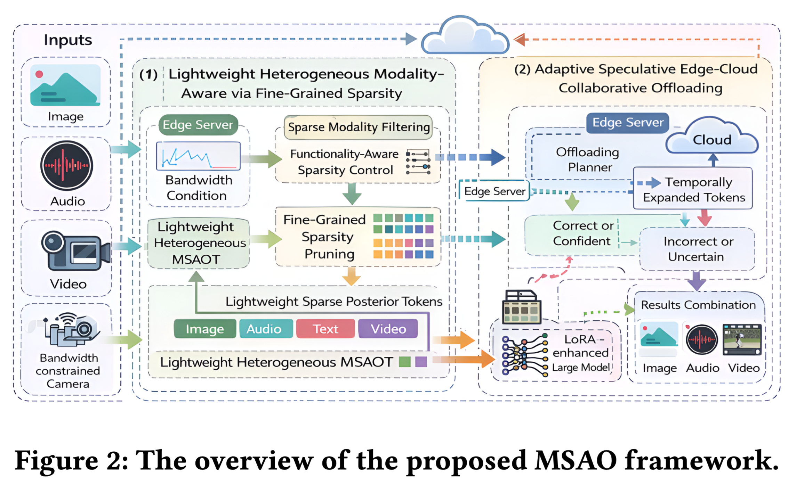
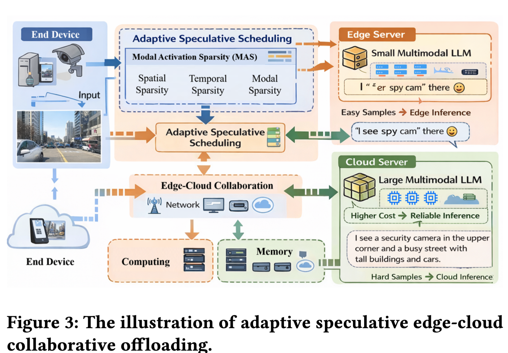
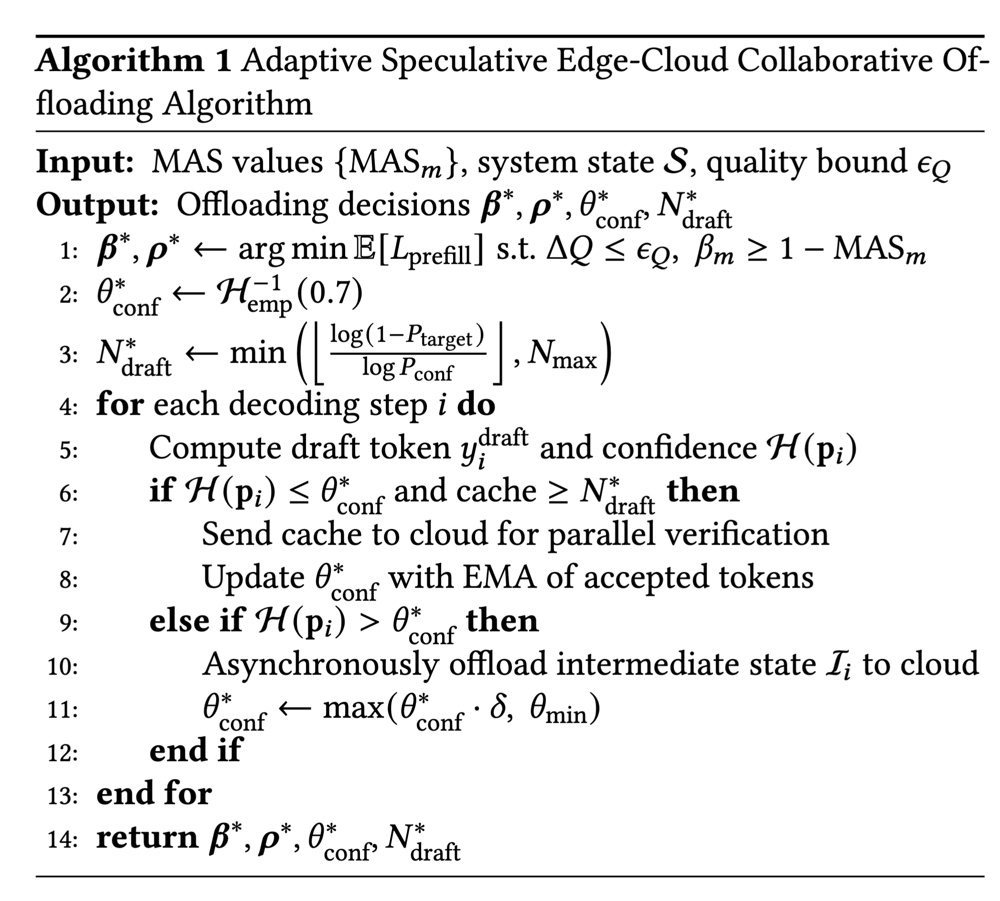

# 论文阅读

## 1、问题

多模态大模型（MLLM）把图像、视频、音频、文本编码后对齐进统一的 token 空间，交给 LLM 主干做跨模态推理。但它有个天然矛盾：

- **纯云端推理**：传输延迟大、占用带宽，尤其上行传视频很贵；
- **纯边缘推理**：响应快、数据不出本地，但算力受限，复杂任务效果差；
- **现有边缘-云协同**（如 PerLLM）：普遍采用**统一的卸载策略**，把不同模态一视同仁——这是论文认为的核心缺陷。

论文的关键观察是：**不同模态的"信息密度"差异极大**。比如图片通常有大片无关背景、视频有大量静态帧（时空冗余，可以狠压），而文本和音频往往语义密集（必须保真）。无视这种差异，就会要么浪费带宽传冗余图像、要么把该上云的算力活压在本地的边缘设备上。

## 2、框架

MSAO 分两大部件，核心理念是"**先用极小的代价判断哪些模态信息是冗余的，再据此决定在哪儿算、怎么算**"：

1. **轻量级异构模态感知模块（细粒度稀疏分析）** → 产出统一的 **MAS（Modality Activation Sparsity）指标**，量化每个模态在当前任务下的"必要性"；
2. **自适应推测式边缘-云协同卸载机制** → 根据 MAS 和实时系统状态，决定卸载哪些模态、何时触发推测解码，用"边端草稿 + 云端验证"把通信延迟藏进计算里。

## 3、方法

### 模块1：细粒度稀疏分析

**空间稀疏**
视觉编码器早期层的特征图 $F^{(l)} \in R^{(H \times W \times C)}$  已经携带空间结构，并且算的便宜。用轻量卷积头

$$M_{spatial} = σ(Conv1×1(AvgPool(F^{(l)})))$$
得到每个图像 patch 的重要性分数，然后定义空间稀疏率：
$$ρ_{spatial} = (重要性低于阈值 τ_s 的 patch 数) / (H×W)$$
低重要性的 patch 被视为非关键背景，下游可以激进剪枝或粗压缩。

**时间稀疏（针对视频）**

相邻帧特征（同样取自早期层）用**局部敏感哈希LSH**算相似度：

$$sim_t = (1/K) · Σ 𝟙[h_k(f_t) = h_k(f_{t−1})]$$
$$γ_t   = 1 − sim_t        （时间冗余分数）$$
$γ_t$ 低说明该帧和前帧高度重复 → 可以抽帧或只传残差。

**模态稀疏（跨模态相关性）**

判断"这个问题到底需要看哪路输入"。用一个轻量跨模态探针网络：把 prompt 嵌入 $p$ 和模态压缩表示 $z_m$ 拼接，过一个 MLP：

$$α_m = MLP([p; z_m])$$
$$β_m = softmax(\alpha)          \quad 各模态归一化后的任务相关度$$
如问"这个物体什么颜色" → 视觉 β 高；问"音频里说了什么" → 视觉可能几乎无关。

**统一指标 MAS**

$$MAS_m = 1 − β_m · (1 − λ_{Pspatial}·ρ_{spatial}^{(m)} − λ_{temp}·γ_{avg^{(m)}})$$

- **MAS 高** = 该模态冗余多或与任务无关 → 可以**激进压缩甚至省略**；
- **MAS 低** = 关键信息 → 必须**高保真保留**。

这个模块全程只走编码器早期层 + 几个轻量 head，实验测得其开销仅 **4.2–15.3 ms（不到端到端时延的 2%）**、FLOPs 只增加 **0.47%–1.23%**、显存只多 **0.12–0.28 GB**——这是它优点：稀疏性分析本身便宜到可以忽略。

### 模块2：自适应推测式协同卸载

场景设定：**边缘放轻量草稿模型**（Qwen2-VL-2B，只含部分层，出 token 快），**云端放完整大模型**（Qwen2.5-VL-7B，负责验证/纠错）。决策变量有四组：

- $\beta \in [0,1]^K$：各模态保留比例
- $\rho \in [0,1]^K$：各模态压缩率
- $\theta_{conf}$：触发推测执行的置信度阈值
- $N_{draft}$：推测解码长度

目标是最小化期望端到端延迟 $E[L_{e2e}]$，约束包括：质量退化 `ΔQ ≤ ε_Q`（ε_Q = 2%）、边缘显存上限、每模态通信延迟上限，以及关键约束 **`β_m ≥ 1 − MAS_m`**（低 MAS 的关键模态不能压缩太多）。
$$E[L_e2e] = max(D_{edge}^{prefill}, D_{cloud}^{prefill})      
         + Σ 𝟙_{offload}^{(m)}·T_{comm}^{(m)}                
         + E[N_{spec}]·T_{draft}                          
         + P_{conf}·T_{verify}                            
         + (1 − P_{conf})·T_{offload}                     $$
其中置信度用输出分布**熵** $H(p_i)$ 衡量：熵 ≤ $θ_{conf}$ 就触发推测（把草稿 token 缓存发给云端一次性并行验证）；熵 > $θ_{conf}$ 说明模型自己都没把握，就**异步把中间状态卸载给云端高质量生成**，同时把阈值衰减 $θ_{conf} ← θ_{conf}·δ$（δ=0.95），让系统更容易"交权"给云端。

双时间尺度（Algorithm 1）

| 尺度  | 频率     | 做什么                                                                                                                                        |
| --- | ------ | ------------------------------------------------------------------------------------------------------------------------------------------ |
| 粗粒度 | 每个请求一次 | 用 **贝叶斯优化（GP 代理 + Matérn 5/2 核）** 定 `β*、ρ*`（论文给子线性遗憾界 $O(√(T·log T))$）；$θ_{conf}$ 初始化为校准集熵分布的 70 分位；$N_{draft}$ 由目标接受率 $P_{target}=0.8$ 反推 |
| 细粒度 | 每个解码步  | 判熵阈值触发推测/卸载；用**接受 token 的 EMA** 在线更新 $θ_{conf}$（收敛性由 Eq. 16 保证）                                                                            |

复杂度分析：每步额外开销 $O(K·log K + N_{steps}·M_{draft})$，相对全模型 $O(N_{steps}·M_{full})$ 加速约 $M_{full}/M_{draft}$ 倍。

## 4、实验

大概看了一下实验，只有验证第一个模块的时候是有音频、视频信息的，其他部分都是只有两种模态

指标主要是latency、accuracy、memory overhead

# 思考

感觉像是两种方法的拼接一种是稀疏化、另一种就是投机采样

