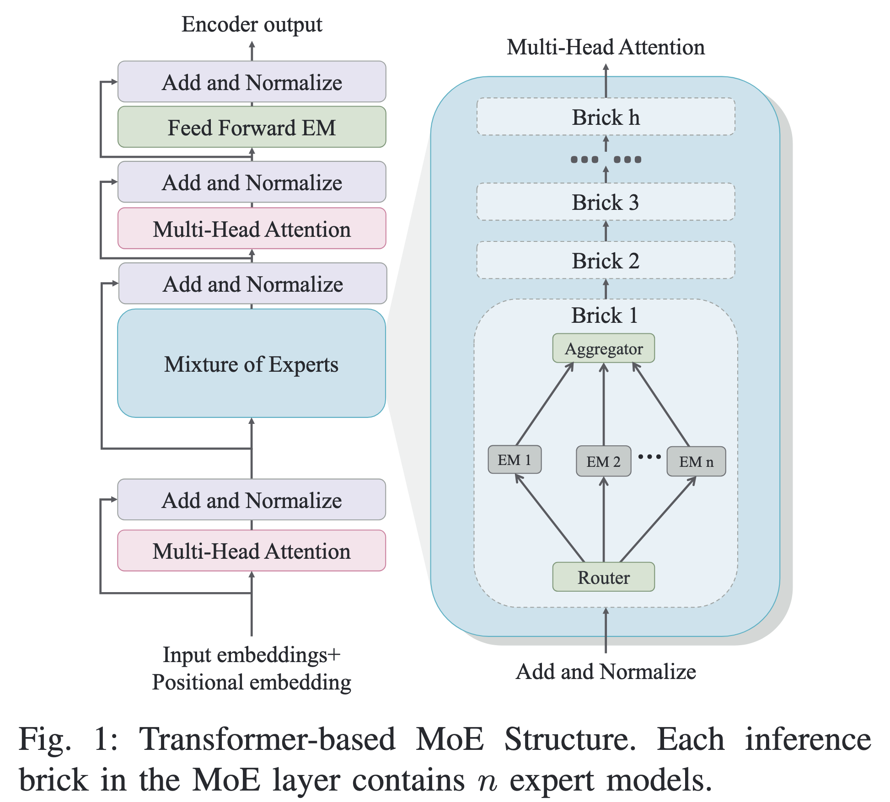
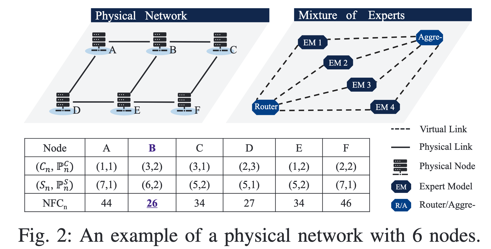
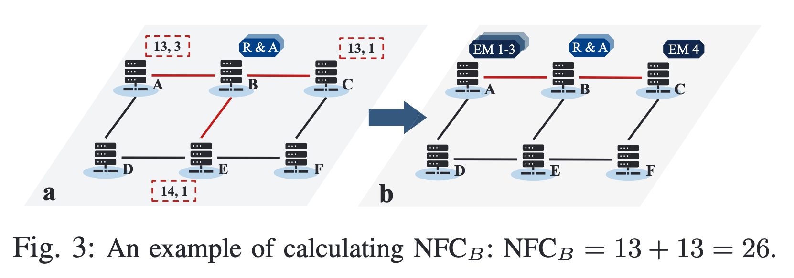

# 论文阅读

## 摘要

### 核心概述

本文研究边缘网络中的**混合专家模型部署**问题，论文题目为 _A Runtime- and Cost-Efficient Approach of Deploying Mixture-of-Experts in Edge Networks_，发表于 2025 IEEE GLOBECOM（Wu et al., 2025）。研究背景是：大型语言模型（Large Language Models, LLMs）集中部署在云端时，面对自动驾驶、智能制造等持续运行的机器用户，往往存在通信距离远、响应延迟高以及动态知识更新不及时等问题。因此，将 LLM 的部分计算任务迁移到边缘网络具有重要意义。

本文聚焦于**混合专家模型（Mixture-of-Experts, MoE）**的边缘部署。MoE 包含多个专家模型（Expert Models, EMs），每次输入只激活其中一部分专家，从而减少单次推理计算量。然而，边缘节点的计算、存储和网络资源有限，无法独立承载完整 MoE，因此必须将专家模型分散到不同边缘节点，并确定路由器（Router）和聚合器（Aggregator）的部署位置。

作者首先形式化定义了**边缘网络中的专家模型部署问题（Expert Model Deployment in Edge Networks, EMD-EN）**，目标是在满足计算、存储和带宽约束的前提下，最小化计算成本、存储成本与通信成本之和。随后，作者分析了暴力搜索方法的复杂度，并提出**邻居优先中心性（Neighbor-First Centrality, NFC）**指标以及基于 NFC 的 **NFC-MoED 算法**。该方法优先在候选路由器和聚合器附近的节点上部署专家模型，并以计算、存储和基于跳数估计的通信代价综合评价候选位置。

仿真结果表明，NFC-MoED 的部署成本与暴力搜索方法接近，但算法运行时间显著降低。论文报告其平均运行速度约为 BF-MoED 的 160,000 倍，并且在测试规模下始终维持约 10 ms 以下的运行时间。论文的核心结论是：在带宽充足、路由器和聚合器共址等假设下，NFC-MoED 能够以很小的成本牺牲换取巨大的部署规划效率提升。

### 一句话总结

本文不是提出新的 MoE 网络结构，而是提出一种快速决定“**MoE 的路由器、聚合器和专家模型应该部署在哪些边缘节点上**”的方法。

> 感觉这句话ai味太重了，不是xxx，而是xxx

## 背景

### 问题背景

边缘智能（Edge Intelligence）希望将人工智能模型部署在靠近数据源和终端用户的位置，以降低云端通信延迟并提高服务的实时性。论文特别关注机器类型用户（Machine-Type Users），例如自动驾驶车辆和智能制造设备。这些用户通常需要连续、实时地访问 LLM，集中式云部署可能无法满足低延迟和高并发需求。

但是，边缘网络的节点通常具有有限的计算能力、存储空间和链路带宽。一台边缘服务器可能无法保存完整的 LLM，更难以同时承载大量并发请求。因此，如何利用多节点协同部署大型模型，成为边缘智能系统中的重要资源管理问题。

### 学术语境

本文位于以下几个研究方向的交叉区域：

- **大型语言模型（Large Language Model, LLM）**
- **混合专家模型（Mixture-of-Experts, MoE）**
- **边缘计算（Edge Computing）**
- **网络资源管理（Network Resource Management）**
- **虚拟网络嵌入（Virtual Network Embedding, VNE）**
- **服务功能链嵌入（Service Function Chain Embedding, SFC Embedding）**

MoE 的稀疏激活特性减少了单次推理所需的计算量，但也引入了新的网络部署问题：不同专家模型可能位于不同节点，输入和中间结果需要在路由器、专家和聚合器之间传输。

### 研究动机

论文的直接动机是，现有研究通常分别关注 MoE 的计算效率、边缘部署的资源利用率或动态资源分配问题，但较少同时考虑：

1. 专家模型的分布式部署；
2. 路由器和聚合器的位置选择；
3. 计算、存储和通信成本；
4. 部署规划算法本身的运行时间。

作者认为，在动态边缘环境中，部署方案可能因用户移动、资源变化或知识库更新而频繁调整。如果每次都采用暴力搜索，虽然能够获得较优方案，但搜索时间过长，无法适应实际系统需求。

### 研究目标与研究空白

已有 MoE 研究主要回答“如何减少模型推理或训练开销”，但没有充分解决“如何在边缘网络中放置 MoE 组件”的问题。已有边缘部署研究主要研究服务链嵌入、资源分配和网络监控，但没有针对 MoE 的 Router-Expert-Aggregator 结构进行专门建模。

本文试图填补的空白是：

> 在保持 MoE 部署成本接近最优的同时，设计一个比暴力搜索更快的部署算法。

### 研究问题

论文没有明确以 Research Questions 的形式列出问题。根据论文内容，可以重构为：

1. **RQ1：** 如何形式化边缘网络中的 MoE 组件部署问题，并同时考虑计算、存储和带宽成本？
2. **RQ2：** 能否利用 MoE 的模块化结构，快速确定路由器和聚合器的部署位置？
3. **RQ3：** NFC-MoED 能否在不同网络规模、专家数量和激活数量下，保持接近最优的部署成本并显著降低算法运行时间？

### 研究假设

以下假设是基于论文内容重构的，并非论文显式列出的假设：

1. **H1：** 在带宽充足、路由器和聚合器共址的条件下，NFC-MoED 的部署成本接近暴力搜索方法。
2. **H2：** NFC-MoED 的运行时间随物理节点数量近似线性增长，而 BF-MoED 的运行时间会快速增长。
3. **H3：** 当激活专家数量增加、MoE 从稀疏状态逐渐趋向密集状态时，NFC-MoED 与最优方案之间的成本差距可能扩大。
## 论文中图阅读
### fig1

图 1 展示了一个**基于 Transformer 的混合专家模型（Mixture-of-Experts, MoE）结构**。它分为左右两部分：
- 左边：完整的 Transformer 数据处理流程；
- 右边：对其中 MoE 层的内部结构进行放大说明。

一、左边：完整的 Transformer 流程
左侧从下到上表示数据流动方向。

1.输入嵌入
最底部是：**Input embeddings + Positional embedding**
它包含两部分：
- **输入嵌入（Input Embedding）**：把词元或输入符号转换成向量；
- **位置嵌入（Positional Embedding）**：告诉模型每个词元在序列中的位置。
例如，句子中的“边缘”“计算”“网络”会被转换成向量，同时模型还需要知道它们的先后顺序。

2.多头注意力
输入经过第一个：**Multi-Head Attention，多头注意力机制**
它用于建模序列中不同词元之间的关系。例如，模型可以判断“部署”与“边缘节点”之间的语义联系。
“多头”表示模型可以从多个角度同时分析输入关系。

3.Add and Normalize
在注意力层和 MoE 层附近多次出现：**Add and Normalize**
它通常包括：
- **残差连接（Residual Connection）**：将子层输入直接加回输出；
- **层归一化（Layer Normalization）**：稳定特征分布，使模型更容易训练和运行。
可以把它理解为 Transformer 中的稳定化结构，帮助深层网络避免信息丢失和数值不稳定。

4.混合专家层
中间的蓝色模块是：**Mixture of Experts**
这是本文最关注的部分。普通 Transformer 通常使用一个固定的前馈网络，而 MoE 层包含多个专家模型，并根据输入动态选择其中一部分。

5.后续 Transformer 模块
MoE 层之后，数据还会继续经过：
- Add and Normalize；
- 第二个 Multi-Head Attention；
- Add and Normalize；
- Feed Forward EM；
- Add and Normalize；
- 最终得到 Encoder Output。
图中的 **Feed Forward EM** 可以理解为后续的前馈计算模块。论文用它表示 Transformer 后续的前馈专家或前馈网络结构。

二、右边：MoE 层的内部结构
右侧是对蓝色 MoE 模块的展开。
1.MoE 层由多个 Brick 组成
右侧从下到上可以看到：
- Brick 1；
- Brick 2；
- Brick 3；
- ……；
- Brick h。
这里的 **Brick** 可以理解为 MoE 层中的一个重复计算单元。整个 MoE 层可能由多个这样的 Brick 堆叠而成。
每一个 Brick 都包含：
1. Router；
2. 多个 Expert Models；
3. Aggregator。

2.Router：选择专家
每个 Brick 的底部是：**Router，路由器**
Router 接收来自前一层的隐藏表示，然后判断当前输入应该交给哪些专家模型处理。
假设一个 Brick 中有 `n` 个专家模型，Router 不会让所有专家都参与计算，而是只选择其中 `k` 个，其中：`k < n`
例如：
- 总共有 8 个专家；
- 对当前输入只激活 2 个；
- 其他 6 个专家不参与这次计算。
这个过程叫做**稀疏激活（Sparse Activation）**。
Router 的作用类似于“任务分发器”：它根据输入内容，把不同任务分给更适合的专家。

3.Expert Models：执行具体计算
图中间的：**EM 1、EM 2、……、EM n**
表示多个专家模型（Expert Models, EMs）。
每个专家可以理解为一个具有不同参数和特长的子网络。不同专家可能更擅长处理不同类型的输入，例如：
- 数学推理；
- 代码；
- 语言理解；
- 事实知识；
- 长文本关系。
需要注意的是，MoE 并不是每次都运行全部专家，而是只运行 Router 选中的少数专家。

4.Aggregator：合并专家输出
专家模型上方是：**Aggregator，聚合器**
它负责将被激活专家的输出进行合并，通常会根据 Router 给出的权重进行加权组合，然后生成一个统一的结果。
例如，Router 选择了 EM2 和 EM5，那么 Aggregator 就会把 EM2 和 EM5 的结果融合起来，再传递给后续 Transformer 模块。

三、图中的一次数据流动
假设当前输入进入第一个 MoE Brick，可以按以下过程理解：
1. 输入向量进入 Router；
2. Router 在 `n` 个专家中选择 `k` 个；
3. 被选中的专家并行处理输入；
4. 未被选中的专家不参与本次计算；
5. Aggregator 汇总被激活专家的输出；
6. 结果进入下一个 Brick；
7. 重复这一过程，直到通过整个 MoE 层；
8. 输出继续进入后面的 Transformer 模块。
可以简化为：`输入 → Router → 选择专家 → 专家计算 → Aggregator → 下一个 Brick`

四、为什么 MoE 对边缘部署有吸引力
MoE 的优势是：**每次推理只激活一部分专家，因此能够降低单次计算量**。
但 MoE 同时带来一个新的边缘部署问题：
- 所有专家模型仍然需要被存储；
- 不同专家可能需要部署在不同边缘节点；
- Router 需要把请求发送到相应专家；
- Aggregator 需要收集专家结果；
- 专家与 Router、Aggregator 之间会产生通信开销。
因此，MoE 解决了“每次推理计算太多”的问题，却引出了“多个专家应该部署在哪里”的问题。
### fig2

图 2 是一个六节点边缘网络中的 MoE 部署示例。它把两个对象并列展示：
- 左侧：真实存在的**物理网络（Physical Network）**；
- 右侧：需要部署的 **MoE 虚拟网络（Virtual MoE）**。
论文要解决的就是：如何把右侧的 Router、Aggregator 和 Expert Models 映射到左侧的物理节点上。

一、左侧：物理网络
左图包含 6 个物理节点：`A、B、C、D、E、F`
它们构成一个两行三列的网状结构：
- 上方：A-B-C；
- 下方：D-E-F；
- 垂直方向：A-D、B-E、C-F。
图中的实线表示**物理链路（Physical Link）**，黑色服务器图标表示**物理节点（Physical Node）**。
每个节点都有两类主要资源：
1. **计算容量**；
2. **存储容量**。
同时，每个节点还有对应的计算价格和存储价格。表格中的数据可以这样读：
- $(C_n, P_n^C)$：节点的计算容量和单位计算价格；
- $(S_n, P_n^S)$：节点的存储容量和单位存储价格。
例如：
- 节点 A：计算参数为 `(1,1)`，存储参数为 `(7,1)`；
- 节点 B：计算参数为 `(3,2)`，存储参数为 `(6,2)`；
- 节点 C：计算参数为 `(3,1)`，存储参数为 `(5,2)`。
这里的数值是论文为说明 NFC 算法而设置的抽象示例，不是实际服务器的真实规格。

二、右侧：MoE 虚拟网络
右图是待部署的 MoE 结构，包含：
- 一个 Router；
- 四个专家模型 EM1、EM2、EM3、EM4；
- 一个 Aggregator。
图中虚线表示**虚拟链路（Virtual Link）**：
- Router 到每个专家之间有逻辑连接；
- 每个专家到 Aggregator 之间也有逻辑连接。
这些连接并不是实际存在的物理线路，而是 MoE 在逻辑上的数据流。
实际部署时，论文需要完成两件事：
1. 将 Router、Aggregator 和 EM1-EM4 放置到左侧某些物理节点上；
2. 将右侧虚拟链路映射到左侧的物理链路路径上。
这就是一个类似**虚拟网络嵌入（Virtual Network Embedding, VNE）**的问题。

三、图 2 中的两个网络如何对应
可以把图 2 理解为“需求网络”和“资源网络”的对应关系：

| 图中对象          | 含义                |
| ------------- | ----------------- |
| 左侧物理节点        | 真正拥有计算和存储资源的边缘服务器 |
| 右侧 Router     | 负责选择专家的路由组件       |
| 右侧 EM         | 执行具体推理任务的专家模型     |
| 右侧 Aggregator | 汇总专家输出的聚合组件       |
| 左侧物理链路        | 实际传输数据的网络连接       |
| 右侧虚拟链路        | MoE 组件之间的逻辑通信需求   |

例如，如果 Router 放在节点 B，某个专家放在节点 A，那么 Router 到该专家的虚拟链路就需要映射到物理链路 B-A。

四、表格最后一行：NFC 值
表格最后一行是每个物理节点的：**NFC_n**
它表示“如果把 Router 和 Aggregator 部署在节点 n 上，整个 MoE 部署的估计成本”。
表中的数值为：
- A：44；
- B：26；
- C：34；
- D：27；
- E：34；
- F：46。
因此，节点 B 的 NFC 值最低：`NFC_B = 26`
所以，按照 NFC 方法，论文会选择：
> 将 Router 和 Aggregator 部署在节点 B。

需要注意，NFC 并不是传统图论中单纯根据度数或连接数量计算的中心性。它是论文提出的**面向部署成本的中心性指标**，同时考虑：
- 节点计算成本；
- 节点存储成本；
- 专家模型容量；
- Router 到专家的通信距离；
- 专家到 Aggregator 的通信距离。
因此，一个节点即使连接很多邻居，也不一定具有较低的 NFC 值。

五、为什么 B 被选中
节点 B 并不是每一项资源都最便宜。例如，节点 C 的单位计算价格比 B 低，节点 D 的某些资源价格也较低。
但是，B 的优势在于：
1. 它位于网络中间位置；
2. 它有较好的计算和存储容量；
3. 它的邻居 A、C、E 可以承载专家模型；
4. Router 和 Aggregator 放在 B 时，专家到 R&A 的整体通信距离较短；
5. 计算、存储和通信成本综合后，NFC 值最低。
因此，NFC 不是只寻找“资源价格最低”的节点，而是寻找部署整个 MoE 时综合代价最低的节点。

### fig3

图 3 具体演示了：**假设 Router 和 Aggregator 都部署在节点 B 上，NFC-MoED 如何选择专家模型的部署节点，并计算节点 B 的 NFC 值。**
它分为两个阶段：
- 图 3(a)：计算邻居节点的部署代价；
- 图 3(b)：按照代价从低到高部署 4 个专家模型。

一、图 3(a)：计算 B 的邻居代价
图中假设：
- 节点 B 部署 Router 和 Aggregator，即 R&A；
- MoE 一共有 4 个专家模型：EM1、EM2、EM3、EM4；
- B 的邻居节点是 A、C 和 E。
每个邻居节点上方的虚线框包含两个数：
$$g(m,n) × num_m^s , num_m^s$$
其中：
- $g(m,n)$：当 R&A 位于节点 B 时，把一个专家模型部署到节点 m 的平均成本；
- $num_m^s$：节点 m 根据存储容量最多可以放置的专家数量；
- $g(m,n) × num_m^s$：如果充分利用节点 m 的专家存储容量，其对应的总估计成本。
图中三个邻居的参数为：

| 邻居节点 | 平均部署成本 `g(m,B)` | 最大专家数量 `num_m^s` | 总成本 |
| ---- | --------------- | ---------------- | --- |
| A    | `13/3`          | 3                | 13  |
| C    | 13              | 1                | 13  |
| E    | 14              | 1                | 14  |

因此：
- A 每放置一个专家的平均成本约为 `4.33`；
- C 每放置一个专家的平均成本为 `13`；
- E 每放置一个专家的平均成本为 `14`。
NFC-MoED 会按照 `g(m,B)` 从小到大选择专家部署节点，所以顺序是：`A → C → E`
这里有一个重要细节：算法比较的是**每个专家的平均成本 `g(m,B)`**，而不是简单比较总成本。A 虽然总成本也是 13，但它可以容纳 3 个专家，单位专家成本最低，因此优先选择 A。

二、图 3(b)：实际部署专家模型
在图 3(b) 中，算法开始按照上述顺序放置专家。
第一步：将 EM1-EM3 放到 A
节点 A 最多可以容纳 3 个专家，因此先把：
- EM1；
- EM2；
- EM3；
部署到节点 A。
此时，A 的容量已经用满，还剩下 1 个专家模型 EM4 没有部署。

第二步：将 EM4 放到 C
节点 C 是剩余邻居中 `g(m,B)` 更小的节点，并且可以容纳 1 个专家，因此将 EM4 放到 C。
此时 4 个专家模型全部部署完成，算法不再使用节点 E。
所以最终部署结果是：
- B：Router + Aggregator；
- A：EM1、EM2、EM3；
- C：EM4；
- E：不部署专家。

三、如何得到 $NFC_B = 26$
根据论文的示例，节点 B 的 NFC 值由 A 和 C 上的专家部署成本组成：
$$NFC_B = g(A,B) × num_A^s + g(C,B) × num_C^s$$

代入图中的数值：
$$NFC_B = (13/3) × 3 + 13 × 1$$

因此：
$$NFC_B = 13 + 13 = 26$$

图 3 的标题所说的：
$$NFC_B = 13 + 13 = 26$$

就是这个计算过程。

需要注意，公式（21）还包含 R&A 自身的计算成本项，但图 3 的演示按照作者正文说明，重点展示的是专家模型部署成本，R&A 的额外成本没有在图中单独展开。

## 系统模型与问题定义
### 1.1 物理网络模型

论文把边缘网络抽象成一个无向图：$G = (N, L)$
其中：
- `N`：物理节点集合，每个节点代表一台边缘服务器；
- `L`：物理链路集合，表示边缘服务器之间的网络连接。
每个物理节点 `n` 具有：
- 计算容量 $C_n$；
- 存储容量 $S_n$；
- 单位计算价格 $P_n^C$；
- 单位存储价格 $P_n^S$。
每条物理链路 `l` 具有：
- 带宽容量 $bw_l$；
- 链路距离 $dis_l$；
- 单位带宽价格 $P_l$。
因此，论文不仅考虑“节点能不能放下模型”，还考虑“节点计算和存储是否便宜”以及“不同节点之间通信是否昂贵”。
### 1.2 MoE 模型组成
论文将一个 MoE 表示为：
$$MoE = (R, A, EM)$$
其中：
- `R`：Router，路由器；
- `A`：Aggregator，聚合器；
- `EM`：Expert Models，专家模型集合。
每个专家模型 $v$ 具有：
- 计算需求 $C_v$；
- 存储需求 $S_v$。
Router 和 Aggregator 也分别有计算和存储需求：
- Router：$C_R、S_R$；
- Aggregator：$C_A、S_A$。
此外，论文定义：
- $BWR$：Router 到专家模型的带宽需求；
- $BWA$：专家模型到 Aggregator 的带宽需求；
- $α_{num}$：一次推理最多激活的专家数量。

这里需要区分：

> MoE 中可能存在很多专家，但每次输入只激活其中 `α_num` 个专家。

这会减少单次推理计算量，但不会消除所有专家模型的存储需求。

### 1.3 需要决定什么

论文需要同时决定两类问题。
#### 节点放置问题
决定以下组件分别放在哪些物理节点：
- 每个专家模型放在哪个节点；
- Router 放在哪个节点；
- Aggregator 放在哪个节点。
论文用二进制变量表示放置关系：
- $Λ_n^v = 1$：专家 $v$ 部署在节点 $n$；
- $Λ_n^R = 1$：Router 部署在节点 $n$；
- $Λ_n^A = 1$：Aggregator 部署在节点 $n$。
每个专家、Router 和 Aggregator 必须且只能部署一次。
#### 路由问题
组件放置以后，还要决定它们之间通过哪些物理链路通信：
- Router 到各个专家的路径；
- 每个专家到 Aggregator 的路径。
论文用 `δ` 变量表示某条物理链路是否被某个逻辑连接使用。
因此，这不是单纯的模型放置问题，而是：
> 同时进行虚拟节点映射和虚拟链路映射。

这也是它与虚拟网络嵌入（Virtual Network Embedding, VNE）问题相似的原因。

### 1.4 资源约束
#### 计算约束
节点 `n` 上的计算消耗不能超过其计算容量：
$$min(α_{num}, 节点 n 上部署的专家数量) × C_v + Router 计算需求 + Aggregator 计算需求 ≤ C_n$$
其中使用 `min` 的原因是：
- 节点上可能存储了很多专家；
- 但一次推理只会激活其中最多 `α_num` 个；
- 计算成本与实际激活数量有关，而不是简单等于存储的专家总数。
#### 存储约束
节点存储消耗不能超过存储容量：
$$专家模型存储 + 共享基础模型存储 + Router 存储 + Aggregator 存储 ≤ S_n$$
论文还考虑了共享的**预训练基础模型（Pre-trained Foundation Model, FPM）**存储需求。
#### 带宽约束

Router 到专家的通信不能超过链路容量：
$$Router 到专家的带宽需求 ≤ 链路带宽容量$$
专家到 Aggregator 的通信则要把多个专家的带宽需求相加：

$$所有经过该链路的专家到 Aggregator 带宽需求之和 ≤ 链路容量$$
论文假设：
- Router 到专家的带宽在链路上是共享的；
- 专家到 Aggregator 的带宽需求是独立累加的。

### 1.5 优化目标

论文的总目标是最小化：
$$总成本 = 计算成本 + 存储成本 + 带宽成本$$
三部分含义如下：
#### 计算成本
由以下因素决定：
- 节点上部署和激活的专家数量；
- Router 的计算需求；
- Aggregator 的计算需求；
- 节点单位计算价格。
#### 存储成本
由以下因素决定：
- 专家模型占用的存储；
- 共享基础模型占用的存储；
- Router 和 Aggregator 占用的存储；
- 节点单位存储价格。
#### 带宽成本
由以下因素决定：
- Router 到专家的通信带宽；
- 专家到 Aggregator 的通信带宽；
- 通信路径距离；
- 链路单位带宽价格。
因此，最近的节点不一定是最优节点。如果某个节点虽然距离近，但存储价格很高、容量很小，整体成本仍可能较大。

## 本文方法概述

本文提出的方法叫做**基于邻居优先中心性的混合专家层部署算法（Neighbor-First Centrality-based Mixture-of-Experts Deployment, NFC-MoED）**。

它的核心目标是：

> 快速确定 Router 和 Aggregator 应该放在哪个边缘节点，并同时确定所有专家模型应该部署到哪些节点，使部署成本尽量接近最优。

需要首先明确：本文没有直接求解最一般形式的 EMD-EN，而是在两个重要条件下设计快速算法：

1. **Router 与 Aggregator 共址（Co-location）**，二者放在同一个物理节点，合称 R&A；
2. 网络提供充足带宽，不考虑不同专家数据流之间的严重带宽竞争。

在此基础上，本文的方法可以分成三个层次：
1. 用 BF-MoED 建立最优成本基准；
2. 提出邻居优先中心性 NFC；
3. 用 NFC-MoED 同时完成 R&A 选择与专家部署。

### 一、为什么先设计 BF-MoED

#### 1. BF-MoED 的基本思想

**BF-MoED（Brute-Force-based MoE Deployment）**是暴力搜索基准方法。

如果物理网络中有 `|N|` 个节点，BF-MoED 会依次执行：
1. 假设节点 A 承载 R&A；
2. 使用资源感知最短路径方法部署所有专家；
3. 计算这种方案的总成本；
4. 假设节点 B 承载 R&A；
5. 重新部署所有专家并计算成本；
6. 遍历所有节点；
7. 选择总成本最低的方案。

对于一个固定的 R&A 节点，专家模型的部署需要综合考虑：
- 候选节点是否有足够计算资源；
- 候选节点是否有足够存储资源；
- 从 R&A 到候选节点的路径是否可行；
- 节点部署成本与通信成本之和是否较低。
#### 2. BF-MoED 为什么能作为最优基准

在带宽充足的条件下，不同专家的通信路径不会严重竞争链路资源。因此，固定 R&A 位置以后，可以相对独立地为各个专家寻找低成本部署方案。
BF-MoED 又枚举了所有可能的 R&A 位置，因此，论文认为它能够在该简化条件下得到最优部署成本。
#### 3. BF-MoED 为什么太慢

BF-MoED 的问题在于重复计算：
- 枚举 `|N|` 个 R&A 位置；
- 每个位置处理 `|EM|` 个专家；
- 每个专家都要进行资源检查和路径搜索。

论文给出的总体复杂度为：
$$O(|EM| × |N|^4)$$
因此，BF-MoED 的作用主要是提供一个成本基准，而不适合大规模或需要频繁重新部署的边缘网络。

### 二、NFC 的设计思想

#### 1. 从全局搜索转向邻居优先

作者观察到，如果 R&A 部署在节点 `n`，专家模型通常优先部署在 `n` 附近更合理，因为这样可以缩短：
- Router 到专家的通信距离；
- 专家到 Aggregator 的通信距离；
- 中间结果经过的物理链路数量。

于是，作者不再对每个候选 R&A 节点反复运行完整最短路径算法，而是：
1. 先考察 R&A 的一跳邻居；
2. 一跳邻居容量不足时，再考察二跳邻居；
3. 继续向三跳、四跳邻居扩展；
4. 使用跳数近似通信成本。

这就是“邻居优先”的含义。
#### 2. NFC 不是传统图中心性

邻居优先中心性（Neighbor-First Centrality, NFC）不是只看节点的度数或连接数量。

它实际上是一个面向 MoE 部署的成本评分：
> 如果把 R&A 放在节点 `n`，并优先在它附近部署专家，预计需要多少计算、存储和通信成本？

因此：
- $NFC_n$ 越小，节点 $n$ 越适合承载 R&A；
- $NFC_n$ 越大，围绕节点 $n$ 部署整个 MoE 的预计成本越高。

### 三、计算候选专家节点的容量

假设当前正在评估：
- 节点 `n`：候选 R&A 节点；
- 节点 `m`：候选专家部署节点。

#### 1. 最多能存储多少专家

论文首先根据节点 `m` 的存储容量计算：

$$num_m^s = floor((S_m - S_MoE) / S_v)$$

其中：
- $S_m$：节点 `m` 的总存储容量；
- $S_{MoE}$：共享预训练基础模型的存储需求；
- $S_v$：单个专家模型的存储需求；
- $num_m^s$：节点 `m` 最多可以存储的专家数量。

为什么先减去 $S_{MoE}$？因为一个节点只要承载专家，就需要先保存专家依赖的共享基础模型，然后剩余存储空间才能用于保存专家参数。

#### 2. 最多同时激活多少专家

论文进一步定义：
$$num_m^α = min(num_m^s, α_{num})$$

其中 $α_{num}$ 是一次推理最多激活的专家数量。

例如：
- 节点能存储 10 个专家；
- 一次推理最多激活 2 个专家；
- 那么节点在一次推理中最多运行 2 个专家。

这体现了 MoE 的一个重要特点：
> 存储成本取决于部署了多少专家，而计算成本取决于最多会激活多少专家。

### 四、计算三类部署成本

对于候选 R&A 节点 `n` 和候选专家节点 `m`，论文分别估计计算、存储和通信成本。
#### 1. 计算成本

论文定义：
$$g_c(m,n) = num_m^α × C_v × P_m^C$$

其中：

- $num_m^α$：节点 `m` 最多同时激活的专家数量；
- $C_v$：一个专家的计算需求；
- $P_m^C$：节点 `m` 的单位计算价格。

它回答的是：

> 在节点 `m` 上运行可能被激活的专家，需要支付多少计算成本？

尽管函数写成 $g_c(m,n)$，该项本身主要由节点 `m` 决定，与 `n` 的关系不明显。

#### 2. 存储成本

论文定义：

$$g_s(m,n) = num_m^s × S_v × P_m^S + S_{MoE} × P_m^S$$

该项包括：
- 节点上所有专家模型的存储成本；
- 一份共享基础模型的存储成本。

它回答的是：
> 充分利用节点 `m` 的专家容量，需要支付多少存储成本？

#### 3. 带宽成本

论文定义：
$$g_bw(m,n) = hop_m,n × P_lm,n × (BW_R + BW_A × num_m^s)$$

其中：

- $hop_m,n$：节点 `m` 与候选 R&A 节点 `n` 之间的跳数；
- $P_lm,n$：相关链路的单位带宽价格；
- $BW_R$：Router 到专家方向的带宽需求；
- $BW_A$：单个专家到 Aggregator 方向的带宽需求。

这个公式体现了论文的带宽假设：
- Router 向专家分发的数据可以共享，因此 $BW_R$ 只计算一次；
- 多个专家返回 Aggregator 的输出需要累加，因此是 $BW_A × num_m^s$。

它回答的是：

> 如果 R&A 位于 `n`，专家位于 `m`，两者之间大约需要多少通信成本？

### 五、计算平均专家部署成本

作者将三类成本相加，再除以节点可存储的专家数量：

$$g(m,n) = [g_c(m,n) + g_s(m,n) + g_bw(m,n)] / num_m^s$$

`g(m,n)` 表示：

> 当 R&A 位于节点 `n` 时，在节点 `m` 上部署一个专家的平均估计成本。

例如，在图 3 中：

- `g(A,B) = 13/3`；
- `g(C,B) = 13`；
- `g(E,B) = 14`。

因此部署优先级是：

`A → C → E`

虽然 A 的总成本也是 13，但它能容纳 3 个专家，所以平均到每个专家的成本只有 `13/3`，显著低于 C 和 E。

### 六、NFC-MoED 的完整执行过程

#### 第一步：枚举候选 R&A 节点

算法仍然会依次评估每个物理节点：`n ∈ N`

但它不再为每个候选节点运行完整最短路径部署算法，而是计算 NFC。

#### 第二步：考察一跳邻居

对于候选节点 `n`，算法首先找出它的一跳邻居，并计算每个邻居的 `g(m,n)`。

假设 `n = B`，则图 2 中 B 的一跳邻居是：

- A；
- C；
- E。

#### 第三步：判断邻居容量是否足够

如果一跳邻居的总容量不足以容纳剩余专家，算法会：

1. 把这些一跳邻居的可用容量全部利用；
2. 更新尚未部署的专家数量；
3. 继续搜索二跳邻居。

如果一跳邻居的容量已经足够，算法会：
1. 按照 `g(m,n)` 从小到大排序；
2. 优先选择平均成本较低的节点；
3. 直到所有专家部署完成。

#### 第四步：必要时向更远邻居扩展

如果一跳邻居放不下全部专家，就继续处理：

- 二跳邻居；
- 三跳邻居；
- 更远的节点。

这实际上类似从 R&A 出发进行分层扩展，但在同一跳数内，还要按照 `g(m,n)` 对节点进行成本排序。

#### 第五步：计算候选节点的 NFC

当所有专家都成功部署后，论文计算：

$$NFC_n = Σ[g(m,n) × num_m^s] + C_R × P_n^C + C_A × P_n^C$$

前面的求和表示专家部署成本，后两项表示 Router 和 Aggregator 在节点 `n` 上的计算成本。

因此，$NFC_n$ 是以节点 `n` 为 R&A 中心时的整体估计成本。

#### 第六步：保存当前部署方案

计算 NFC 的过程中，算法已经确定：
- 哪些节点承载专家；
- 每个节点承载多少专家；
- 哪些链路需要预留。

作者称其为“**边计算边嵌入（Calculation While Embedding）**”。
这样，在选出最小 NFC 节点以后，不需要重新运行一次专家部署过程。

#### 第七步：选择 NFC 最小的方案

算法比较所有候选节点：

$$n* = arg min NFC_n$$

最终输出：

- R&A 的部署节点 $n*$；
- 与该节点对应的专家部署方案；
- 需要预留的通信链路资源。

# 总结与思考

这篇论文围绕 **MoE 在边缘网络中的快速部署**展开。其关键观察是：Router 与 Aggregator 构成整个 MoE 数据流的中心，R&A 的位置会同时影响专家模型的放置范围、节点资源成本和通信开销。因此，作者将复杂的联合部署问题转化为“选择 R&A 中心节点，并围绕该中心分配专家”的结构化优化过程。

本文最有价值的设计是**邻居优先中心性（Neighbor-First Centrality, NFC）**。NFC 为每个候选 R&A 节点计算一个部署评分：先估计周围节点能够容纳多少专家，再综合计算成本、存储成本和通信跳数，得到单位专家的平均部署成本 `g(m,n)`。算法优先使用平均成本较低的一跳邻居，容量不足时继续扩展到二跳及更远节点。最终，NFC 最小的节点被选为 R&A 位置。

这一设计的亮点主要体现在三方面：

1. **充分利用 MoE 的结构特征。** Router 分发任务、专家并行计算、Aggregator 汇总结果，形成天然的“中心—专家”通信结构。邻居优先策略正是从这一结构中推导出来的。
2. **正确区分部署容量与运行负载。** 所有专家都需要占用存储空间，但每次推理仅激活部分专家。论文分别建模存储需求和激活计算需求，使资源模型能够体现 MoE 的稀疏激活特征。
3. **评估候选节点时同步构造部署方案。** NFC 的计算过程同时决定专家放置位置，选出最优候选 R&A 后即可直接获得相应方案，减少了重复路径搜索。

> 复杂系统优化可以先寻找业务结构中的关键中心，再围绕中心构造具有资源含义的局部指标，以较低计算复杂度生成高质量方案。