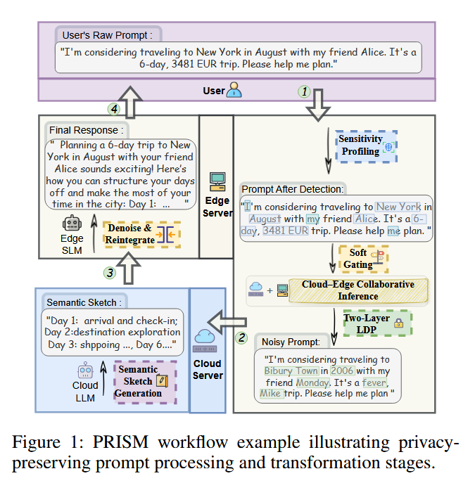
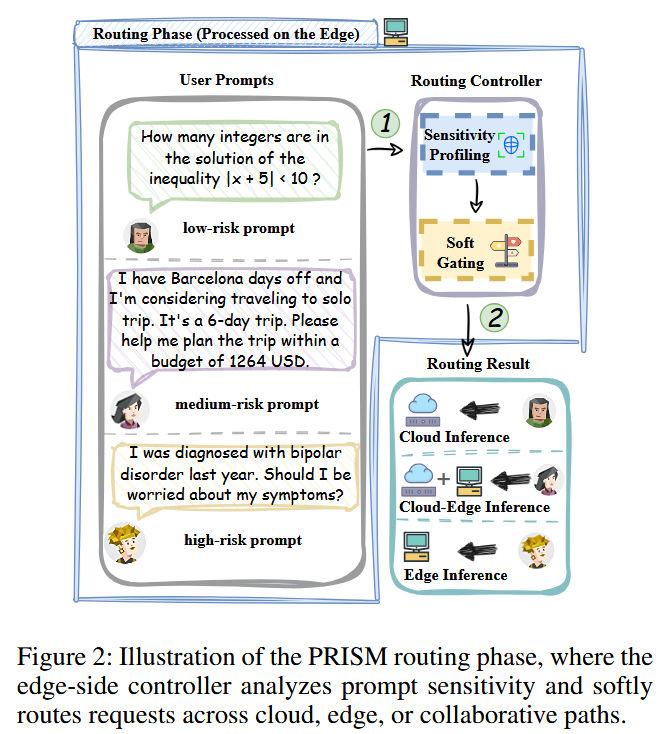
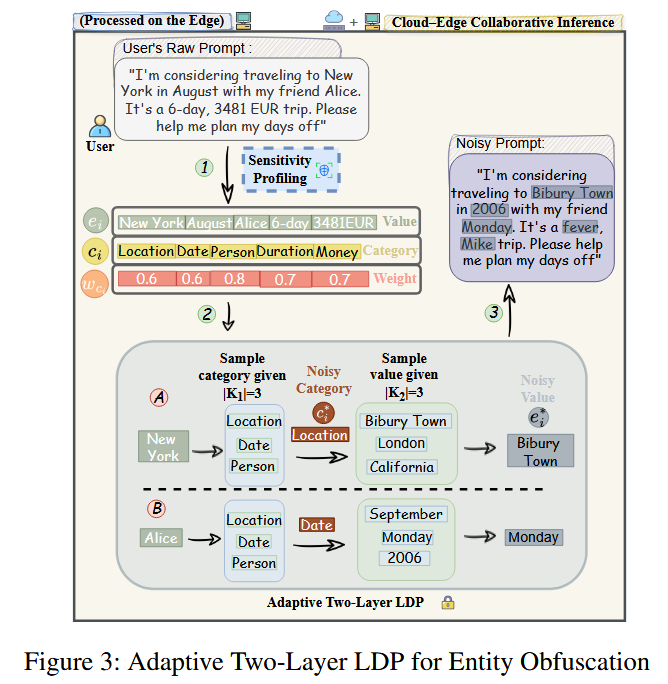
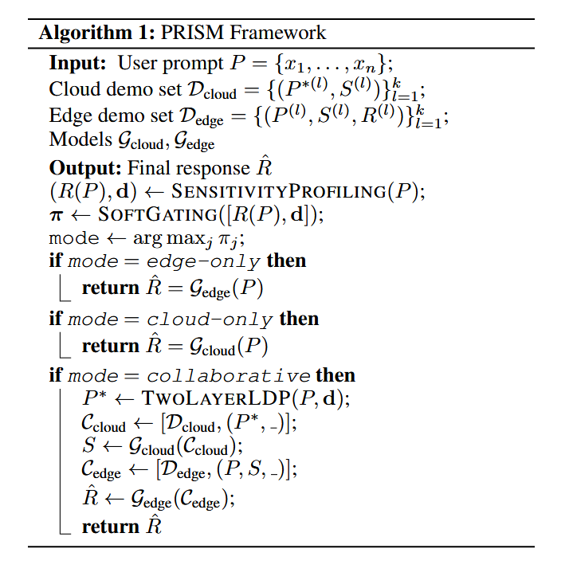
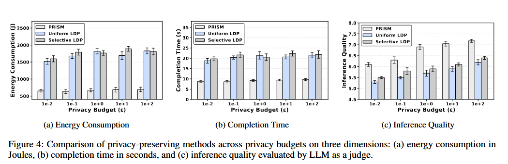

[TOC]

# 一、abstract

大语言模型（LLM）在自然语言理解与生成方面展现出卓越能力，但在云端部署时会带来较高的通信开销和隐私风险；而当其部署在边缘设备上时，又会受到计算能力和内存容量的限制。云边推理通过将敏感计算保留在本地设备上，已成为提升大语言模型服务隐私性的一个有前景的范式。

然而，现有云边推理方法通常采用统一的隐私保护策略，而不考虑输入内容的敏感程度。这会导致不必要的扰动，即使对于非敏感词元也会造成效用下降。

为解决这一问题，我们提出了**带语义调制的隐私感知推理路由方法**（Privacy-aware Routing for Inference with Semantic Modulation，PRISM）。这是一种上下文感知框架，能够动态平衡隐私保护与推理质量。PRISM 包含四个阶段：

1. 边缘设备分析实体级别的敏感度；
2. 同样部署在边缘端的软门控模块选择执行模式，即云端、边缘端或云边协同；
3. 对于云边协同路径，边缘端根据实体风险采用自适应双层本地差分隐私机制；
4. 云端大语言模型根据扰动后的提示词生成语义草图，再由边缘侧小语言模型（SLM）结合本地上下文进行细化。

实验结果表明，在多种场景下，PRISM 始终能够实现更优的隐私-效用权衡。与 Uniform LDP 和 Selective LDP 等基线方法相比，PRISM 将能耗和时延降低至基线方法的 **40%–50%**，同时在严格隐私约束下保持较高的输出质量。这些结论通过综合实验得到验证，实验涵盖真实场景提示词、实际能耗测量以及异构云边模型部署。

# 二、introduction

诸如 GPT-4o（Hurst 等，2024）、LLaMA 3（Grattafiori 等，2024）和 Qwen 3（Yang 等，2025）等大语言模型（LLM）在自然语言理解与生成方面取得了显著进展（Cai 等，2025a）。它们的能力已拓展到多种应用领域，包括代码合成（Chen 等，2021）、多模态推理（Alayrac 等，2022）、数学问题求解（Drori 等，2022）以及生物医学变异分类（Kweon 等，2024）。

为了大规模运行基于 LLM 的服务，服务提供商需要部署大型 GPU 集群，以支持高吞吐量的推理任务（Miao 等，2025；Cai 等，2025b；Lin 等，2025c）。因此，LLM 通常被部署在云端，在那里接收用户的完整提示词，并实时生成响应。这种云端部署模式主要源于当前先进 LLM 巨大的模型规模和计算需求，而这些需求往往超出本地设备的资源限制。

以云端为中心的 LLM 部署能够提供全球范围的访问能力，并支持集中式模型更新（Li 等，2024；Lin 等，2025b）。然而，这种模式也带来了显著的通信开销和隐私风险，因为用户的完整提示词必须通过网络传输（Lin 等，2025b）。在医疗、金融和个性化服务等隐私敏感领域，这些问题尤为突出，因为用户提示词通常包含敏感的个人信息。

与传统软件输入不同，提交给 LLM 的敏感领域提示词往往包含丰富的语义上下文，并可能隐含暴露用户的个人信息、意图和偏好（Staab 等，2024；Lin 等，2024）。例如，在医疗领域，用户可能会提出如下问题：

> “我上周检测出 HIV 阳性，并且一直发烧和腹泻。我需要担心继发感染吗？”

该提示词包含受保护的健康信息（PHI）。如果这些信息被截获或处理不当，可能会导致严重的隐私泄露。此外，并非所有提示词都具有相同的隐私敏感度。例如，“法国的首都是什么？”这类简单问题的隐私风险很低，可以安全地在云端处理（Acharya 等，2020）。

这些局限性表明，有必要设计新的推理范式，在保证效率的同时保护用户隐私，尤其是在语义复杂且隐私敏感的应用领域。

为缓解以云端为中心的推理所带来的隐私风险，近年来出现了一些云边协同框架，尝试将敏感信息保留在边缘设备上（Jin 和 Wu，2024；Zhu 和 Yang，2025；Zhan 等，2025）。一种常见的设计模式是：对于隐私敏感的提示词，在本地小语言模型（SLM）上执行推理；对于非敏感查询，则通过二元路由机制将其卸载到云端 LLM 进行处理（Li 等，2025）。

另外，一些系统采用了受加密思想启发的策略：在将用户的完整提示词发送至云端之前，先加入本地差分隐私（LDP）噪声，然后依靠边缘设备重建或细化云端生成的响应（Lin 等，2025a；Mai 等，2024）。

尽管这些方法能够提供基本的隐私保护，但它们在本质上仍属于粗粒度方案。首先，基于风险分数简单阈值判断的二元路由决策可能会错误分类用户请求，从而导致边缘设备负担过重，或造成隐私保护不足（Qu 等，2025）。

其次，Split-and-Denoise（Mai 等，2024）和 DP-Forward（Du 等，2023）等提示词级 LDP 方法，无论实际敏感程度如何，都会对所有词元或嵌入维度施加统一扰动。这种统一处理会造成不必要的效用下降，尤其会影响原本无害的查询。

此外，当噪声被不加区分地应用时，云端模型接收到的虽然在形式上仍具有语义意义，但实际内容已经被扭曲的指令，因而经常生成模糊、笼统或回避性的响应，例如：

> “我无法提供有关 [MASKED_ENTITY] 的信息。”

简而言之，现有架构缺乏根据每个提示词的具体语义来定制隐私保护机制的能力。这种低效性促使我们探索一种更加自适应的方法，根据提示词中的上下文线索动态选择隐私保护路径。

为此，我们提出了**带语义调制的隐私感知推理路由方法**（Privacy-aware Routing for Inference with Semantic Modulation，PRISM）。如图 1 所示，PRISM 是一种云边协同框架，能够根据提示词语义和上下文隐私风险，自适应地选择推理路径。

不同于对所有输入采用相同的保护策略，PRISM 在边缘设备上引入软门控机制，对每个用户提示词进行评估，并将其路由至以下三种执行模式之一：

1. 对低风险提示词执行直接云端推理；
2. 对中等敏感提示词执行基于语义草图的云边协同；
3. 对高风险、隐私关键型查询执行完全本地生成。

模式选择由一个基于 logit 的软分类器完成。该分类器综合利用命名实体识别（NER）、上下文线索（例如第一人称指代和实体类型）以及统计风险分数进行判断。

经过门控模块后，系统会沿三条执行路径之一运行。直接云端推理和仅边缘端生成的模式可以立即使用相应模型执行；而云边协同模式则会触发额外的隐私保护流程。具体而言，该模式下的提示词首先通过双层本地差分隐私机制进行扰动，然后由云端处理并生成语义草图，最后在边缘设备上进一步细化，以重建连贯且保护隐私的响应。

本文的主要贡献如下：

- 我们提出了 PRISM，一种面向自适应云边 LLM 推理的新型隐私感知路由框架。PRISM 将上下文感知的门控机制与三模式执行流程相结合，包括云端、边缘端和云边协同。在协同模式下，PRISM 引入语义调制策略，将自适应双层本地差分隐私与云端语义草图生成、边缘端响应细化相结合，从而实现细粒度的实体级隐私控制。
- 为支持该框架，我们构建了一个合成的、具有丰富上下文的指令数据集，覆盖医疗、旅游、银行和通用知识四个领域。该数据集设计反映了多种现实应用场景，并支持在不同隐私需求下进行评估。
- 我们在真实云边平台上实现了 PRISM，并在不同隐私预算下评估其性能，同时系统地测试多种边缘侧 SLM 与云端 LLM 的组合。实验结果表明，PRISM 能够适应异构部署环境。与统一隐私保护基线方法相比，它始终能够取得更好的推理质量、更低的时延以及更低的边缘侧能耗。

# 三、Framework Design

本节详细介绍 PRISM 隐私感知云边推理框架的设计。系统由三个部分组成：用户、本地边缘设备和远程云服务器。边缘设备运行一个小语言模型（SLM），云服务器提供大语言模型（LLM）的访问能力。

推理过程从用户向边缘设备发送提示词开始。边缘设备上的两个模块，即**敏感度分析**（Sensitivity Profiling）和**软门控**（Soft Gating），会分析隐私风险，并选择云端、边缘端或云边协同执行路径。对于需要协同处理的请求，PRISM 使用**自适应双层 LDP** 对敏感实体进行扰动，然后通过**云边语义草图协同**在云端生成抽象响应，再由边缘端进行细化并返回给用户。

## 面向上下文感知路由的敏感度分析

我们设计了一个轻量级的边缘侧模块，用于在路由之前评估用户提示词的隐私敏感度。给定一个包含 $n$ 个词元的提示词：

$$
P = \{x_1, x_2, \ldots, x_n\},
$$

该模块首先使用命名实体识别（NER）提取包含 $m$ 个命名实体的集合：

$$
E = \{e_1, e_2, \ldots, e_m\}.
$$

随后，模块输出两项结果：

1. 标量风险分数 $R(P)$，反映提示词整体的隐私敏感度；
2. 二值掩码 $d \in \{0,1\}^m$，指示哪些实体需要保护。

我们首先使用快速 NER 引擎（例如 Presidio Analyzer）提取实体集合 $E$。每个实体 $e_i$ 都具有一个类别标签 $c_i \in \mathcal{C}$，并根据其类别分配预定义的敏感度权重 $w_{c_i} \in [0,1]$。这些权重反映不同实体类别对隐私的重要程度，例如：

$$
w_{\mathrm{PERSON}} > w_{\mathrm{NATIONALITY}}.
$$

我们将提示词的风险分数定义为：

$$
R(P) = \sum_{i=1}^{m} w_{c_i} \cdot \mathbb{I}(e_i). \tag{1}
$$

其中，$\mathbb{I}(e_i)$ 表示实体 $e_i$ 是否出现在当前输入中。

为了纳入上下文信号，我们定义一个二值指示变量 $\Delta$。当检测到任意私密语言线索时，该变量被激活：

$$
\Delta = \max_{x_j \in P} \mathbb{I}(x_j \in \mathcal{F}). \tag{2}
$$

其中，私密上下文集合 $\mathcal{F}$ 包含第一人称代词以及检测到的 `PERSON` 类型实体。$\mathbb{I}[\cdot]$ 表示指示函数，该条件用于判断提示词 $P$ 中是否有词元与预定义的第一人称代词集合或此前检测到的 `PERSON` 类型实体重叠。

如果 $\Delta > 0$，则保守地将每个实体 $e_i$ 标记为需要保护，并生成如下二值掩码：

$$
d_i =
\begin{cases}
1, & \text{if } \Delta > 0,\\
0, & \text{otherwise},
\end{cases}
\quad \forall i \in \{1,2,\ldots,m\}. \tag{3}
$$

该模块同时捕获边缘设备上的统计信号和上下文信号。例如，在以下两个提示词中：

1. “我计划独自去东京旅行三天。”
2. “东京位于哪个国家？”

实体 `Tokyo` 在两个提示词中都出现，但只有第一个提示词由于包含第一人称代词“我”，体现了用户的私人意图。这些信号会被传递给后续路由控制器进行决策。

## 带熵正则化路由的软门控

为了自适应地平衡隐私、效用和能耗，我们提出了一种软门控机制，将敏感度指标映射为三个路由路径上的概率分布。

该方法不采用硬性的决策边界，而是通过生成软路由分数，实现细致且具有上下文感知能力的执行。门控模块接收一个特征向量 $z \in \mathbb{R}^{1+m}$，该向量由上一节的敏感度分析模块生成，其中包括风险分数 $R(P)$ 和敏感度掩码 $d$。这些特征首先经过轻量级线性变换 $f_\theta(\cdot)$，然后进行 softmax 归一化：

$$
\pi = \operatorname{softmax}(f_\theta(z)) \in \mathbb{R}^{3}. \tag{4}
$$

由此可以得到三个执行策略上的路由分布：

$$
\pi = (\pi_{\mathrm{cloud}}, \pi_{\mathrm{collab}}, \pi_{\mathrm{local}}),
$$

分别对应直接云端推理、云边协同和完整的边缘侧生成。

为了在保持灵活性的同时鼓励模型进行更有把握的路由，我们在输出分布上引入熵惩罚：

$$
\mathcal{L}_{\mathrm{gating}}
= \mathcal{L}_{\mathrm{task}} + \lambda \cdot \mathcal{H}(\pi). \tag{5}
$$

其中，$\mathcal{L}_{\mathrm{task}}$ 是下游任务损失（对于生成任务，它是交叉熵损失），$\mathcal{H}(\pi)$ 是软路由分数的熵：

$$
\mathcal{H}(\pi) = -\sum_j \pi_j \log \pi_j,
$$

而 $\lambda$ 是可调超参数。较低的熵会促使模型作出更有把握的决策，而较高的熵则能够容纳不确定或模棱两可的情况。

**图 2：** PRISM 路由阶段示意图。边缘侧控制器分析提示词敏感度，并将请求软路由至云端、边缘端或云边协同路径。

在推理时，我们从软路由分布 $\pi$ 中选择概率最大的路径，即：

$$
\operatorname*{arg\,max}_j \pi_j.
$$

这种确定性选择能够提供一致的隐私保证，并避免由于随机性将敏感提示词路由至保护程度较低的路径。由此，我们的公式为将符号化敏感度信号与软决策边界相结合提供了一个有原则且可解释的接口。

## 自适应双层本地差分隐私

在云边协同场景中，包含敏感实体的提示词在传输前必须得到加密保护。简单的匿名化策略，例如将姓名替换为通用词元 $\langle\mathrm{NAME}\rangle$，并不能缓解链接攻击的风险。

例如，考虑以下两条记录：

1. “$\langle\mathrm{NAME}\rangle$ 养了一只黑狗，并且经常在晚饭后带它散步。”
2. “那只黑狗的主人每周二都会扔垃圾。”

尽管用户姓名“Bob”已经被掩盖，但两条记录中共享的语义内容“黑狗”仍然允许攻击者将记录关联起来，并重新识别 Bob。更严重的是，这种跨记录推断还会暴露 Bob 的行为细节、日常习惯，从而使隐私风险超越单纯的身份泄露。

同样，在整个提示词上统一应用 $\epsilon$-LDP，或对所有实体类型统一应用 $\epsilon$-LDP，也会产生次优的权衡。前一种做法可能破坏语言连贯性，后一种做法则可能保护不足敏感实体，或对无害实体施加过强扰动，从而影响下游效用。此外，当噪声被不加区分地应用时，云端模型接收到的提示词虽然在句法上有效，但在语义上已经被扭曲，因而经常生成模糊或回避性的补全，例如：“我无法提供有关 $\langle\mathrm{MASKED\ ENTITY}\rangle$ 的信息。”

为解决这些问题，我们提出一种双层自适应 LDP 机制，使用独立分配的隐私预算 $\epsilon_1$ 和 $\epsilon_2$，分别对每个实体的类别和值进行扰动，同时保持总预算不变：

$$
\epsilon_{\mathrm{total}} = \epsilon_1 + \epsilon_2.
$$

隐私预算的分配由敏感度权重 $w_{c_i}$ 决定，该权重反映实体 $e_i$ 的类别 $c_i$ 有多敏感。该权重来自敏感度分析模块：

$$
\epsilon_1
= \epsilon_{\mathrm{total}}
\cdot
\frac{w_{c_i}}
{w_{c_i} + (1-w_{c_i})\cdot\alpha},
\qquad
\epsilon_2 = \epsilon_{\mathrm{total}} - \epsilon_1. \tag{6}
$$

其中，$\alpha \in (0,1]$ 是可调超参数。该公式保证高敏感度类别（例如 `NAME`）获得更多类别级保护，而低敏感度类型（例如 `NATIONALITY`）获得更多值级混淆。这种自适应分配遵循本地隐私中的组合规则，在不违反 $\epsilon$-LDP 保证的情况下实现灵活权衡（Duchi、Jordan 和 Wainwright，2013）。

当 $w_{c_i}$ 较高时（例如 `NAME`、`ID` 和 `DIAGNOSIS`），更多预算会分配给 $\epsilon_1$，以保护实体类型，降低推断敏感类别的风险。相反，对于较低的 $w_{c_i}$（例如 `ORGANIZATION`、`NATIONALITY` 和 `LOCATION`），该机制会将更多预算分配给 $\epsilon_2$，以便在匿名化实体值的同时保留语义效用。

类别层和数值层的扰动都遵循随机响应（Randomized Response，RR）机制。这是有限离散域中实现 $\epsilon$-LDP 的经典构造（Wang 等，2017）。

### （1）类别层 $\epsilon_1$-LDP

$$
p_1 = \frac{\exp(\epsilon_1)}{\exp(\epsilon_1)+K_1-1},
\qquad
c_i^* =
\begin{cases}
c_i, & \text{with probability } p_1,\\
c_i^* \neq c_i, & \text{with probability } \dfrac{1-p_1}{K_1-1}.
\end{cases}
$$

### （2）值层 $\epsilon_2$-LDP

$$
p_2 = \frac{\exp(\epsilon_2)}{\exp(\epsilon_2)+K_2-1},
\qquad
e_i^* =
\begin{cases}
e_i, & \text{with probability } p_2,\\
e_i^* \neq e_i, & \text{with probability } \dfrac{1-p_2}{K_2-1}.
\end{cases} \tag{7}
$$

**图 3：自适应双层 LDP 的实体混淆流程。**

图 3 展示了自适应双层 LDP 的工作流程。完成敏感度分析后，根据实体类别的敏感度权重 $w_{c_i}$ 为每个实体分配隐私预算。随后，实体依次经过两层扰动：第一层以概率 $p_1$ 从大小为 $K_1$ 的类别集合 $\mathcal{C}$ 中采样一个带噪类别标签；第二层以概率 $p_2$ 从相应的、大小为 $K_2$ 的值集合 $\mathcal{V}_{c_i}$ 中采样一个值。

为说明该方法的自适应性，我们展示两个代表性案例。类型 B 实体（例如 `NAME`）被赋予较高的敏感度权重，因此会进行更强的类别级混淆，以隐藏其语义类型。相比之下，类型 A 实体（例如 `LOCATION`）被认为敏感度较低；它们保留类别标签，但在值层面接受更强的扰动，从而保证提示词的语义连贯性。这种选择性策略能够实现更好的隐私-效用权衡，尤其适用于资源受限的云边部署环境。

我们的方法与有限离散域上的最优 $\epsilon$-LDP 设计相一致（Wang 等，2017），但通过类别感知的预算分配对其进行了扩展。当 $w_{c_i}\to 1$ 时，$\epsilon_1\to\epsilon_{\mathrm{total}}$，从而最大限度地保护类别；当 $w_{c_i}\to 0$ 时，情况相反，方法更注重保留效用。

与静态掩码或统一 LDP 相比，我们的风险自适应机制通过对高风险实体施加更强的选择性扰动，同时尽量减少对无害实体的失真，从而保持语义连贯性。

## 云边语义草图协同

在我们的架构中，每个输入提示词首先经过路由阶段。该阶段根据评估得到的隐私风险和资源约束，确定适当的执行模式：仅边缘端、云边协同或仅云端。

被路由至协同模式的提示词随后经过自适应双层 LDP 机制，生成扰动后的提示词 $P^*$。其中，$P^*$ 使用随机响应机制替换 $P$ 中的敏感实体。生成的带噪提示词以明文形式直接传输至云端，避免传输嵌入表示，也无需在设备之间同步词元化器或共享嵌入空间。

给定扰动后的提示词 $P^*$，云端 LLM $\mathcal{G}_{\mathrm{cloud}}$ 使用少样本上下文提示和示例集合生成语义草图 $S \in \mathcal{T}_{\mathrm{sketch}}$。云端示例集合定义为：

$$
\mathcal{D}_{\mathrm{cloud}}
= \left\{\left(P^{*(l)}, S^{(l)}\right)\right\}_{l=1}^{k}.
$$

生成上下文构造为：

$$
\mathcal{C}_{\mathrm{cloud}}
= \left[\mathcal{D}_{\mathrm{cloud}},(P^*,\_ )\right],
$$

其中下划线表示需要生成的语义草图。云端模型随后生成：

$$
S = \mathcal{G}_{\mathrm{cloud}}(\mathcal{C}_{\mathrm{cloud}}). \tag{8}
$$

语义草图采用简洁、结构化的格式，并省略 $P^*$ 中被混淆的敏感实体。这种设计保证了：

1. **语义对齐：** 即使输入包含噪声，也能保留原始意图；
2. **结构规律性：** 便于下游模块进行集成。

边缘侧 SLM $\mathcal{G}_{\mathrm{edge}}$ 接收到语义草图 $S$ 后，同时以 $S$ 和本地保留的原始提示词 $P$ 为条件，重建最终响应 $\hat{R}$。

类似地，边缘侧示例集合定义为：

$$
\mathcal{D}_{\mathrm{edge}}
= \left\{\left(P^{(l)}, S^{(l)}, R^{(l)}\right)\right\}_{l=1}^{k},
$$

生成上下文构造为：

$$
\mathcal{C}_{\mathrm{edge}}
= \left[\mathcal{D}_{\mathrm{edge}},(P,S,\_ )\right],
$$

其中下划线表示需要由边缘模型生成的最终响应。最终响应为：

$$
\hat{R} = \mathcal{G}_{\mathrm{edge}}(\mathcal{C}_{\mathrm{edge}}). \tag{9}
$$

这种协同推理设计利用语义抽象，在保护隐私的同时实现忠实且高效的响应生成。

为了统一整体决策和执行过程，我们在算法 1 中给出了完整的 PRISM 推理流程。该流程整合了敏感度感知路由、通过自适应 LDP 实现的实体级扰动，以及借助基于语义草图的语义对齐进行协同生成。该算法形式化描述了框架在所有执行模式下的端到端行为，包括仅边缘端、仅云端和云边协同。

## 四、Analysis

本节对选择性隐私云边推理框架的隐私性质进行严格分析。具体而言，我们建立双层扰动机制的本地差分隐私保证，并刻画敏感度权重如何影响隐私预算的分配。

### 定理 1：双层 LDP 隐私保证

设 $M$ 是应用于敏感实体 $e_i$ 的自适应双层机制，其中实体类别 $c_i \in \mathcal{C}$，类别集合大小为 $K_1$；实体值域为 $\mathcal{V}_{c_i}$，大小为 $K_2$。该机制依次执行：

1. 预算为 $\epsilon_1$ 的类别级随机响应机制 $M_1$，生成 $c_i^*$；
2. 预算为 $\epsilon_2$ 的值级随机响应机制 $M_2$，生成 $e_i^*$。

则复合机制

$$
M=M_2\circ M_1
$$

在实体对 $(c_i,e_i)$ 上满足 $(\epsilon_1+\epsilon_2)$-本地差分隐私。

**证明：** 根据 $\epsilon$-本地差分隐私的定义（Dagan、Glickman 和 Magnini，2006；Dwork，2006），对于任意两个不同的输入 $x,x'$ 以及任意输出 $y$，机制 $M$ 满足：

$$
\frac{\Pr[M(x)=y]}{\Pr[M(x')=y]}\leq \exp(\epsilon).
$$

下面分别验证每个组成部分。

#### 步骤 1：类别级隐私

我们在大小为 $K_1$ 的有限类别域 $\mathcal{C}$ 上使用标准随机响应机制。输出真实类别的概率为：

$$
p_1=\frac{\exp(\epsilon_1)}{\exp(\epsilon_1)+K_1-1},
$$

剩余概率质量 $1-p_1$ 在其他 $K_1-1$ 个类别之间均匀分配：

$$
\Pr[M_1(c_i)=c_i^*]
=
\begin{cases}
p_1, & c_i^*=c_i,\\
\dfrac{1-p_1}{K_1-1}, & c_i^*\neq c_i.
\end{cases}
$$

对于任意两个不同的输入 $c_i,c_i'\in\mathcal{C}$ 以及任意输出 $c_i^*$，似然比为：

$$
\frac{\Pr[M_1(c_i)=c_i^*]}
{\Pr[M_1(c_i')=c_i^*]}
=
\begin{cases}
\dfrac{p_1}{(1-p_1)/(K_1-1)}=\exp(\epsilon_1), & c_i^*=c_i,\\
\dfrac{(1-p_1)/(K_1-1)}{p_1}=\exp(-\epsilon_1), & c_i^*=c_i'.
\end{cases}
$$

无论哪种情况，该比值都满足：

$$
\frac{\Pr[M_1(c_i)=c_i^*]}
{\Pr[M_1(c_i')=c_i^*]}
\leq \exp(\epsilon_1).
$$

因此，$M_1$ 满足 $\epsilon_1$-LDP。

#### 步骤 2：值级隐私

在大小为 $K_2$ 的值域 $\mathcal{V}_{c_i}$ 上，随机响应机制 $M_2$ 输出的概率为：

$$
\Pr[M_2(e_i)=e_i^*]
=
\begin{cases}
p_2, & e_i^*=e_i,\\
\dfrac{1-p_2}{K_2-1}, & e_i^*\neq e_i,
\end{cases}
$$

其中：

$$
p_2=\frac{\exp(\epsilon_2)}{\exp(\epsilon_2)+K_2-1}.
$$

类似地可以证明，对于任意两个不同的值 $e_i,e_i'$，其似然比被 $\exp(\epsilon_2)$ 所界定，因此 $M_2$ 满足 $\epsilon_2$-LDP。

#### 步骤 3：组合

由于 $M_1$ 和 $M_2$ 独立地、依次作用于不相交的组成部分 $(c_i,e_i)$，根据顺序组合定理（Duchi、Jordan 和 Wainwright，2013），有：

$$
M(c_i,e_i)=M_2\circ M_1
\Longrightarrow (\epsilon_1+\epsilon_2)\text{-LDP}.
$$

该定理保证，对于每个被单独选中的敏感实体，自适应双层 LDP 都能提供有界的隐私泄露，并与所分配的总预算

$$
\epsilon_{\mathrm{total}}=\epsilon_1+\epsilon_2
$$

保持一致。

### 定理 2：敏感度权重对预算分配的影响

设 $w_{c_i}\in[0,1]$ 是类别 $c_i$ 的敏感度权重，且 $\epsilon_{\mathrm{total}}>0$ 是总隐私预算。定义预算分配为：

$$
\epsilon_1
= \epsilon_{\mathrm{total}}
\cdot
\frac{w_{c_i}}
{w_{c_i}+(1-w_{c_i})\cdot\alpha},
\qquad
\epsilon_2=\epsilon_{\mathrm{total}}-\epsilon_1,
$$

其中，$\alpha\in(0,1]$ 是控制值保护相对重要性的可调超参数。则有：

1. 当 $w_{c_i}=1$ 时，$\epsilon_1=\epsilon_{\mathrm{total}}$，$\epsilon_2=0$；
2. 当 $w_{c_i}=0$ 时，$\epsilon_1=0$，$\epsilon_2=\epsilon_{\mathrm{total}}$；
3. $\epsilon_1(w_{c_i})$ 在 $[0,1]$ 上单调递增，而 $\epsilon_2(w_{c_i})$ 单调递减。

**证明：** 考虑函数：

$$
\epsilon_1(w_{c_i})
= \epsilon_{\mathrm{total}}
\cdot
\frac{w_{c_i}}
{w_{c_i}+(1-w_{c_i})\cdot\alpha},
\qquad w_{c_i}\in[0,1].
$$

**边界情况：**

- 当 $w_{c_i}=1$ 时，分式为 $1/1=1$，因此 $\epsilon_1=\epsilon_{\mathrm{total}}$，$\epsilon_2=0$。
- 当 $w_{c_i}=0$ 时，分式为 $0/\alpha=0$，因此 $\epsilon_1=0$，$\epsilon_2=\epsilon_{\mathrm{total}}$。

**单调性：** 考虑 $\epsilon_1(w_{c_i})$ 关于 $w_{c_i}$ 的导数：

$$
\frac{d\epsilon_1(w_{c_i})}{dw_{c_i}}
= \epsilon_{\mathrm{total}}
\cdot
\frac{\alpha}
{\left((\alpha-1)w_{c_i}-\alpha\right)^2}.
$$

注意，分母是平方项，因此始终非负。它仅在以下条件成立时为零：

$$
(\alpha-1)w_{c_i}-\alpha=0
\Longleftrightarrow
w_{c_i}=\frac{\alpha}{\alpha-1}.
$$

由于 $\alpha\in(0,1]$，上述值位于有效定义域 $w_{c_i}\in[0,1]$ 之外（当 $\alpha=1$ 时分母同样始终为正）。因此，在整个有效定义域内，分母严格为正。此外，分子是 $\alpha\in(0,1]$ 与 $\epsilon_{\mathrm{total}}>0$ 的乘积，也严格为正。

因此，对于所有 $w_{c_i}\in[0,1]$，整个表达式严格大于零。这证明了分配函数 $\epsilon_1(w_{c_i})$ 单调递增，而由于

$$
\epsilon_2(w_{c_i})=\epsilon_{\mathrm{total}}-\epsilon_1(w_{c_i}),
$$

它严格递减。

该定理表明，较高的类别敏感度权重会将更多预算分配给类别级扰动 $\epsilon_1$，因为改变实体类别会造成更大的语义失真，从而为高敏感度类别提供更强保护。较低的权重则倾向于使用值级噪声 $\epsilon_2$，以保留低敏感度实体的效用。

# 五、Evaluation

## 实验设置

### 数据集

为了在隐私敏感场景下进行全面评估，我们构建了一个半合成指令数据集，用于模拟四个代表性应用领域中真实的用户与 LLM 交互：

1. **旅游规划：** 涵盖用户身份、旅行预算和目的地；
2. **医疗咨询：** 涉及人口统计属性和症状描述，其中部分数据改编自 PrivacyRestore 使用的数据集（Zeng 等，2025）；
3. **银行服务：** 包含交易历史、账户标识符和金融机构详细信息；
4. **通用知识：** 取自 MT-Bench（Zheng 等，2023），作为非敏感数据集。

每个领域包含 40 条提示词。这些提示词具有多样化的措辞和结构化实体分布，从而能够以可控方式改变上下文敏感度。该数据集支持对隐私感知 LLM 推理策略进行系统、细粒度的基准测试。

### 环境设置

我们在真实的云边部署环境中评估 PRISM，以反映实际的资源约束和时延特征。边缘侧模型部署在一台运行 Windows 10、配备 NVIDIA RTX 3070 笔记本 GPU 的本地工作站上。

我们使用 `llama_cpp_python` 后端运行量化 SLM，并将 GPU 卸载配置设置为 `gpu_layers=32`。云端模型通过 API 调用访问托管的 LLM。云端根据从边缘端接收到的扰动提示词生成语义草图，并返回抽象化草图，以供后续重建使用。

### 基线方法

我们将所提出的框架与以下代表性基线进行比较：

1. **Uniform LDP：** 向所有输入词元添加拉普拉斯噪声，将扰动后的提示词发送至云端进行推理，随后在边缘端进行细化，但不使用语义草图（Mai 等，2024）。
2. **Selective LDP：** 仅对 NER 模型识别出的实体应用 LDP（Shi 等，2022），然后以类似方式执行云端推理和边缘端细化。
3. **Cloud-only：** 将完整且未经修改的提示词发送至云端 LLM 进行推理。
4. **Edge-only：** 使用原始提示词，由边缘设备上的 SLM 在本地执行推理。

### 评估指标

我们使用三个关键指标评估每种方法：

1. **推理质量（Inference Quality，IQ）：** 使用 GPT-4o 进行 1 到 10 分的评分，以衡量生成响应的相关性、连贯性和信息量（Zheng 等，2023）。
2. **能耗（Energy Consumption，Ec.）：** 使用基于 Windows 的功耗监测工具，以焦耳为单位进行测量，表示推理期间边缘设备消耗的总能量。对于仅云端推理，由于实际模型在远程云端运行，该指标只包含边缘侧数据传输和系统空闲操作产生的能耗。
3. **完成时间（Completion Time，Ct.）：** 表示从输入提示词到获得最终响应的端到端时延，用于衡量系统响应速度。

## 实验结果

### 总体性能

表 1 显示，在采用隐私保护的方法中，PRISM 实现了最佳的综合效率，其完成时间仅为 7.92 s，能耗为 687.16 J。这种效率来源于其自适应路由机制：非敏感提示词被直接发送至云端，低风险提示词被路由至云边协同推理，而高度敏感的提示词则保留在本地处理。

虽然 Cloud-only 获得了最佳的原始性能，即完成时间为 5.13 s、能耗为 296.27 J、推理质量为 8.14，但它没有提供任何隐私保护。相比之下，PRISM 在所有方法中整体排名第二，其时延仅为 Cloud-only 的 1.54 倍，能耗为 Cloud-only 的 2.32 倍，因此实现了较好的隐私-效率权衡。

与此同时，Uniform LDP 和 Selective LDP 由于采用不加区分或基于实体的噪声注入，时延均超过 20 s，能耗超过 1700 J。

### 表 1  不同方法的性能指标

| 方法           | 完成时间 Ct.（s） | 能耗 Ec.（J） | 推理质量 IQ |
| -------------- | ----------------: | ------------: | ----------: |
| PRISM          |              7.92 |        687.16 |        6.88 |
| Uniform LDP    |             20.56 |        1707.6 |        5.72 |
| Selective LDP  |             21.22 |        1770.8 |        5.94 |
| Edge-only      |             17.84 |        1573.9 |        5.09 |
| **Cloud-only** |          **5.13** |    **296.27** |    **8.14** |

表 1：不同方法的性能指标，包括完成时间、能耗和推理质量。每项指标的最佳结果以粗体表示。

### 不同隐私预算下的性能

图 4 展示了三种隐私保护方法在不同隐私预算下的性能变化趋势。我们观察到，PRISM 在全部三个指标上始终优于 Uniform LDP 和 Selective LDP，具体表现为：

- 能耗明显更低，例如 652 J，而其他方法超过 1800 J；
- 完成时间更短，例如 8.8 s，而其他方法超过 21 s；
- 推理质量更高，最高达到 7.2，而其他方法不超过 6.2。

PRISM 在不同隐私预算下均表现稳定。这种鲁棒性源于其自适应路由和最小化扰动设计：该设计能够避免过度加噪和不必要的计算浪费，同时在严格的隐私约束下保持模型效用。

**图 4：** 不同隐私预算下隐私保护方法在三个维度上的比较：（a）以焦耳为单位的能耗；（b）以秒为单位的完成时间；（c）由 LLM 评审得到的推理质量。

### 不同云边模型组合的性能

表 2 展示了 PRISM 在八种云边模型组合下的性能。原文指出，所有组合都能在中等时延（7.08-8.60 s）和较低能耗（632-739 J）下实现较高的推理质量（IQ 不低于 6.9），体现了 PRISM 在异构部署环境中的灵活性。

具体而言，GPT-4o（L1）与 Qwen1.5-1.8B（S2）的组合取得了最快的推理速度（7.08 s）和最低能耗（632.24 J）；GPT-4o 与 StableLM（S3）的组合取得了 GPT-4o 组合中最高的推理质量（7.16）。与此同时，Qwen3-235B（L2）组合的响应速度略慢，但其生成质量与前者相当或更高，最高达到 7.22。这进一步体现了 PRISM 对不同云端和边缘侧模型能力的适应性。

### 表 2  不同云端 LLM 与边缘侧 SLM 组合下的 PRISM 性能

| 模型组合    | 完成时间 Ct.（s） | 能耗 Ec.（J） | 推理质量 IQ |
| ----------- | ----------------: | ------------: | ----------: |
| L1 + S1     |              8.29 |        683.83 |        7.00 |
| **L1 + S2** |          **7.08** |    **632.24** |        6.91 |
| L1 + S3     |              7.34 |        657.88 |        7.16 |
| L1 + S4     |              7.35 |        653.62 |        5.28 |
| **L2 + S1** |              8.59 |        738.88 |    **7.22** |
| L2 + S2     |              8.60 |        739.59 |        7.06 |
| L2 + S3     |              8.00 |        693.13 |        7.19 |
| L2 + S4     |              8.11 |        698.10 |        7.19 |

其中：

- L1：GPT-4o；
- L2：Qwen3-235B；
- S1：Phi-3.5-mini-3.5B；
- S2：Qwen1.5-1.8B；
- S3：StableLM-2-Zephyr-1.6B；
- S4：TinyLLaMA-1.1B。

# 六、Conclusion

本文提出了 PRISM，一种新型隐私感知云边推理框架。该框架能够根据提示词的语义敏感度，动态选择用户请求的执行路径。

通过整合自适应双层本地差分隐私机制与基于语义草图的协同协议，PRISM 能够在不牺牲模型效用的情况下，实现高效且保护隐私的推理。

在四个应用领域和八种模型配置上开展的综合实验表明，PRISM 实现了更优的性能权衡。与仅云端推理相比，PRISM 的时延和能耗分别为其 **1.54 倍**和 **2.32 倍**，同时仍能提供较强的隐私保证并保持较高的输出质量。

未来，作者计划扩展 PRISM，使其支持多个边缘设备之间的协同推理，其中每台边缘设备都配备一个小语言模型（SLM）。这种场景将带来路由、负载均衡以及云端与边缘设备之间协调等新问题。作者计划通过去中心化调度和联邦优化机制解决这些问题。