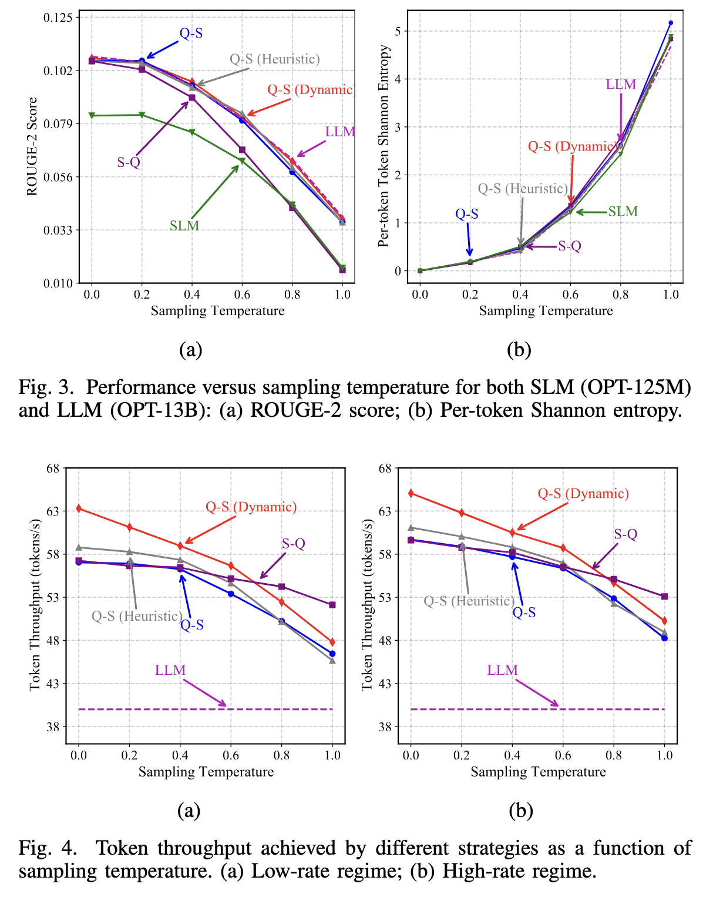

# 论文阅读

## 论文投稿

IEEE Communications Letters 期刊
ccf c

## 问题

边云投机采样中会有网络通信问题，边缘端需要上传草稿token和每个token对应的概率分布
假设词表大小为 $V$ ，每轮生成 $L$ 个草稿，那么需要上传大约:
$$
L × (token 标识所需比特数 + 概率分布所需比特数)
$$
当无线网络带宽较低或不断变化时，上传概率分布会引入明显通信延迟。因此需要对概率分布进行量化。但是，量化会产生一个问题。

先采样再量化（S-Q）的方法
$$原始概率分布 q \rightarrow 按照 q 采样草稿 token \rightarrow 将 q 量化为 \hat{q} -> 上传并由 LLM 验证$$
草稿 token 实际上来自 $q$ ，云端验证时使用的是量化后的 $\hat{q}$，$q$ 和 $\hat q$ 不完全相同。

>投机解码的理论正确性要求：验证过程中的草稿分布必须和采样时的分布一致。S-Q 中两者不同，所以最终输出分布可能不再等于云端 LLM 的输出分布，造成质量下降。

## 方法

### Q-S （quantize-Sample）

先量化再采样

$$
原始概率分布 q \rightarrow 先量化为 \hat q \rightarrow 按照 \hat q 采样草稿 token \rightarrow 上传并由 LLM 验证
$$
这样，采样和验证使用的是同一个量化后的分布 $\hat q$。
使用同一个分布可以保证投机解码的无损正确性

量化采用的是基于格点的量化（Lattice-Based Quantization）

假设选择一个正整数 $ell$ ，每个概率被表示成
$$q_i = \frac{o_i}{ell}$$
其中：
- $o_i$ 是非负整数
- 所有 $o_i$ 之和为 $ell$

所有可表示的概率向量组成一个离散的概率格点集合。量化时，算法寻找距离原始概率分布最近的格点。

论文给出的量化复杂度为： $O(V log V)$

量化精度和通信开销之间存在权衡：
- $ell$ 越大，概率表示越精确；
- 但需要更多比特；
- 上传时间也会增加。

### 自适应吞吐量优化

仅仅提出 Q-S 还不够，因为系统仍然要选择两个参数：

$$
动作 \quad a_t = (L_t, b_t)$$
其中：
- $L_t$：第 $t$ 轮生成多少个草稿 token；
- $b_t$：每个概率分布使用多少量化比特。

这里就有两个权衡一个是草稿长度的另一个是量化精度

作者这里使用强化学习来进行决策，使用 双重深度 Q 网络 (Double Deep Q-Network, DDQN)学习策略。

状态包括：

- 当前前缀中每个 token 的 SLM 置信度；
- 当前前缀的平均置信度；
- 当前上行信道速率。

动作是：

- 选择草稿长度 $L_t$；
- 选择量化比特数 $b_t$。

奖励定义为当前轮的期望吞吐量：

$$奖励 = \frac{当前轮期望接受的 token 数}{当前轮总延迟}$$
$$当前轮总延迟 = SLM 生成时间
+ 上行传输时间
+ LLM 验证时间
+ 下行传输时间$$

策略的目标是最大化整个生成过程中的 token 吞吐量。

### 实验

- Fig. 3：比较生成质量和随机性；
- Fig. 4：比较生成速度。

> Q-S 方法在保持 LLM 生成质量的同时，可以明显提高 token 吞吐量；动态 Q-S 还能根据文本不确定性和网络状态进一步优化速度。

fig3的a
1. **LLM 的 ROUGE-2 随温度升高而下降**
    温度越高，LLM 输出越随机，因此和参考答案的词组重合度下降。
2. **SLM 的质量明显低于 LLM**
    绿色曲线代表 SLM。它在各个温度下都低于 LLM，说明小模型生成质量较弱。
3. **S-Q 的质量在高温度下下降明显**
    S-Q 先按照原始概率分布采样 token，再对概率分布进行量化。这样会导致：
    - 采样时使用原始分布；
    - 云端验证时使用量化分布；
    - 两个分布不一致。
    因此它不能很好地保持 LLM 的输出分布，尤其在高温度时问题更明显。
4. **Q-S 与 LLM 的质量基本一致**
    蓝色、灰色和红色曲线分别表示 Q-S、Q-S Heuristic 和 Q-S Dynamic。它们整体接近 LLM 曲线。
    这说明 Q-S 虽然量化了 SLM 的概率分布，但由于先量化、再采样，采样和验证使用的是同一个分布，所以没有明显损失 LLM 的输出质量。

例如在温度接近 1.0 时：
- LLM 和 Q-S 的 ROUGE-2 大约仍在 `0.034` 附近；
- S-Q 和 SLM 则下降到约 `0.014`。

fig3的(b) Per-token Shannon Entropy

纵轴是 **每个 token 的 Shannon 熵**：
$$
H(p) = -Σ p_i log p_i
$$
它衡量概率分布的不确定性：

- 熵低：模型比较确定；
- 熵高：模型在多个 token 之间犹豫，输出更随机。

图中可以看到：
1. 所有方法的熵都随温度升高而增加；
2. 温度为 0 时，熵接近 0，说明生成几乎是确定性的；
3. 温度为 1 时，熵显著升高，说明输出随机性增强；
4. 这张图不是在比较“谁的质量更好”，而是在验证采样温度确实改变了输出的不确定性。

- Fig. 3(a) 看“生成得好不好”；
- Fig. 3(b) 看“生成得随机不随机”。

Fig. 4：生成吞吐量
纵轴是 **Token Throughput（token 吞吐量）**，单位是 tokens/s，越高越好。横轴仍然是采样温度。图中比较了：
- LLM：直接使用大模型；
- S-Q：先采样、后量化；
- Q-S：静态 Q-S；
- Q-S Heuristic：启发式动态 Q-S；
- Q-S Dynamic：强化学习动态 Q-S。

虚线 LLM 大约在 `40 tokens/s` 左右，表示直接用云端 LLM 自回归生成的速度。
 (a) 低速网络环境 平均上行速率约为 `350 kbps`。可以看到：
- 各种推测解码方法都明显快于直接使用 LLM；
- Q-S Dynamic 红线整体较高；
- 温度升高后，所有方法的吞吐量下降；
- Q-S Dynamic 仍然保持较强的速度优势。
原因是低带宽下通信延迟很重要。Q-S Dynamic 会动态选择：
- 本轮生成多少个草稿 token；
- 概率分布使用多少量化比特。
当网络较差时，它可以减少通信量；当 SLM 预测比较有把握时，则可以生成更长的草稿。

(b) 高速网络环境 平均上行速率约为 `4 Mbps`。
整体趋势和左图相似：
- 推测解码仍然比单独使用 LLM 快；
- Q-S Dynamic 通常保持较好的吞吐量；
- 高温度下吞吐量下降；
- 由于网络带宽更高，通信不再是最主要的瓶颈，因此动态调节带来的绝对收益相对减小。