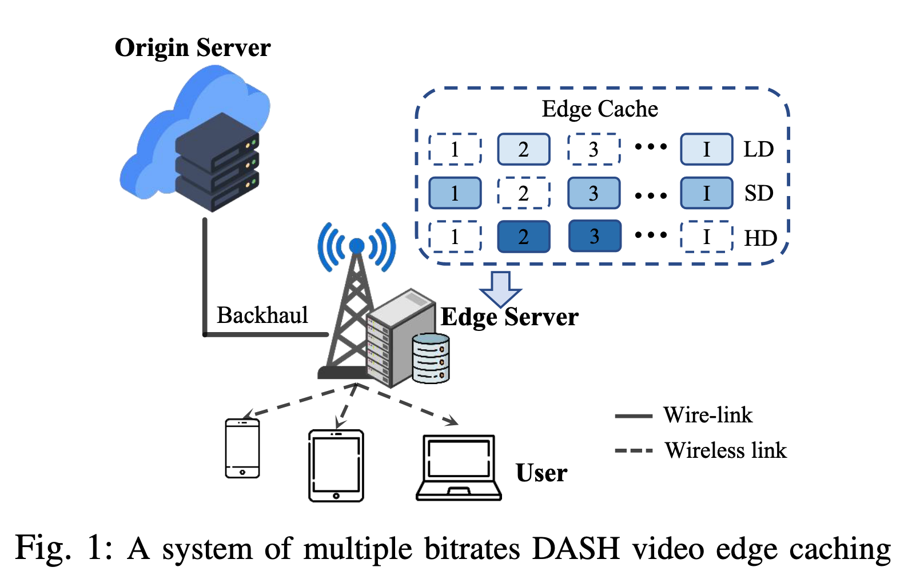
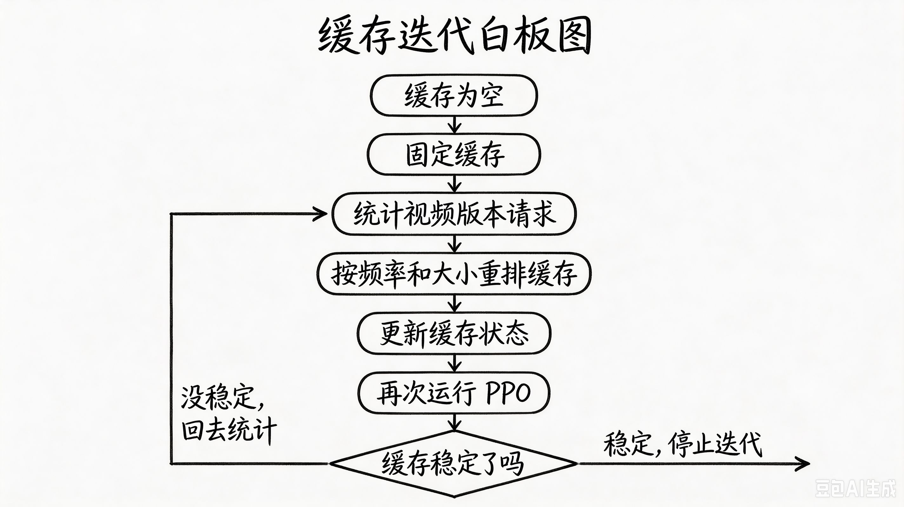
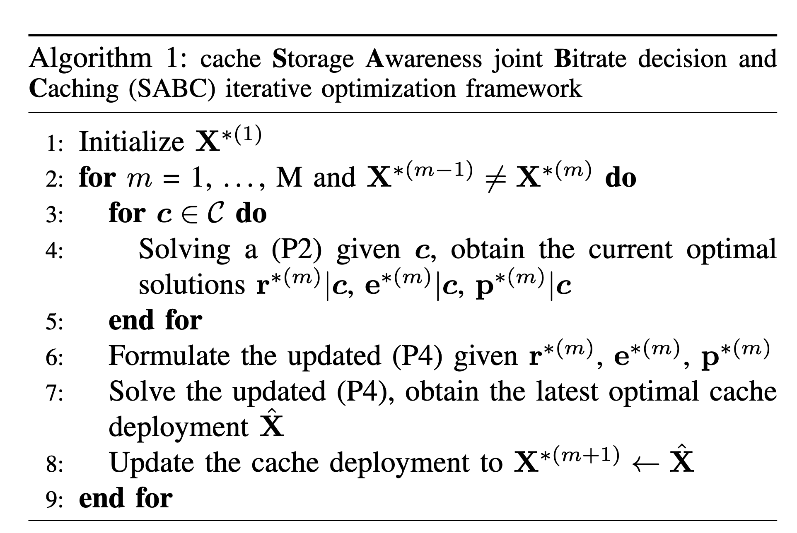
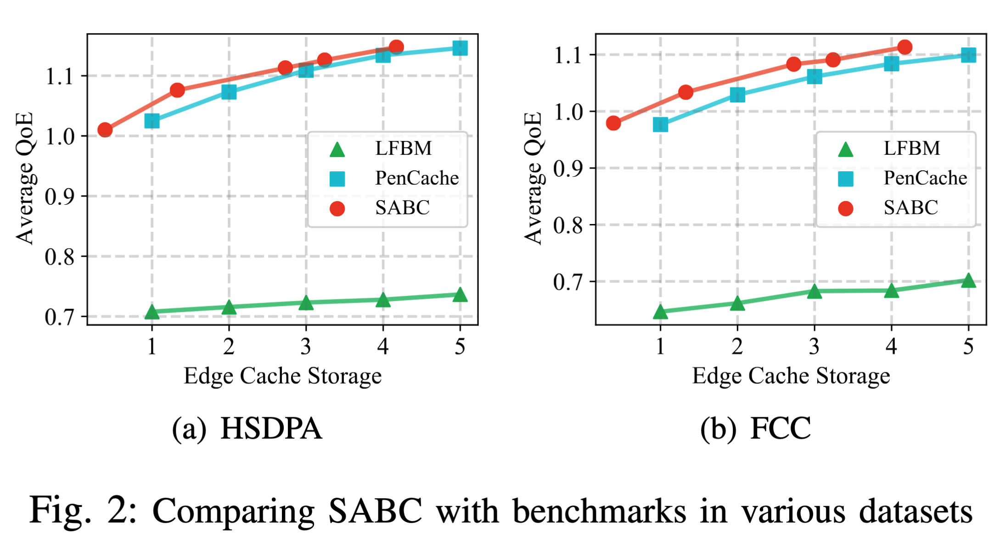
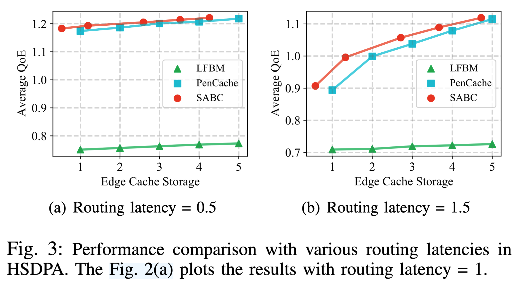

# 论文阅读
## 第一遍
### 标题

Intelligent Edge Caching for Enhanced Video Streaming Experience and Storage Efficiency
### 摘要

视频流量的指数级增长给现有的内容分发网络带来了巨大挑战。移动边缘计算（Mobile Edge Computing, MEC）通过在靠近用户的位置缓存视频内容，能够快速、直接地响应用户请求，因而成为一种可行的解决方案。然而，现有研究主要采用固定且相互独立的缓存策略，忽视了缓存部署与码率决策之间的相互影响，从而造成边缘缓存容量的浪费。

本文针对边缘缓存策略与多编码器码率决策的联合优化，构建了一个极小极大优化问题，目标是在为用户提供高质量观看体验的同时，提高缓存存储空间的使用效率。针对该极小极大问题具有 **NP 难（NP-hard）** 特性，作者将原问题分解为一个两阶段联合迭代优化问题，其中包括多编码器码率选择子问题和边缘缓存部署子问题。

作者使用真实网络轨迹数据集和视频文件进行了大量实验。与具有代表性的基准方法相比，本文提出的方法在额外提升 0.17% 至 0.36% **用户体验质量（Quality of Experience, QoE）的同时，将边缘缓存存储占用减少了 8.99% 至 57.96%。

其中，“extra QoE”更自然的理解是“QoE 额外提高了 0.17% 至 0.36%”，而不是增加了这么多绝对分值。

### I. 引言

《爱立信移动市场报告》预测，到 2028 年，视频流量预计将以接近每年 25% 的速度增长，并将占移动数据总流量的 70%。视频流量的快速增长给维持低延迟和高视频质量带来了挑战。这是因为在流量高峰期，源服务器与客户端之间的网络拥塞会进一步加剧，从而降低用户的**体验质量（Quality of Experience, QoE）**。为了解决这一问题，研究人员提出在**移动边缘计算（Mobile Edge Computing, MEC）** 服务器中预先缓存用户经常请求的视频，形成云边协同网络，以降低路由延迟和回传流量。然而，边缘服务器的容量有限，因此必须高效利用缓存空间。这也推动了针对视频级缓存策略和视频块级缓存策略的研究。

视频级缓存策略主要关注应该缓存哪些视频。文献 [1]、[2] 通过分析和预测视频内容未来的流行度来制定缓存决策。为了充分利用边缘缓存，文献 [3]-[5] 引入了转码或协同缓存机制，并据此更新缓存策略。然而，这些研究忽略了一个事实：随着移动网络的普及，当前的视频传输方式已经由下载完整视频后播放，转变为流媒体播放，其中具有代表性的系统是**基于 HTTP 的动态自适应流媒体（Dynamic Adaptive Streaming over HTTP, DASH）**[6]。

在 DASH 系统中，每个视频文件都会被编码成若干个离散的码率版本。码率越高，通常意味着视频质量越高，同时视频块的大小也越大。每个码率版本都会被分割成一系列有序且时长相同的视频块。播放器可以根据用户当前的网络状况和播放状态，分别下载这些视频块。因此，同一个视频中的不同视频块，以及同一个视频块的不同码率版本，都具有不同的点击率或请求率 [7]。如果仍然采用视频级缓存方法，就可能缓存热门视频中并不受欢迎的码率版本，造成缓存资源浪费，降低缓存效率，甚至影响用户体验 [8]。

近年来，一些研究开始转向视频块级缓存。考虑到用户的观看行为，文献 [9]、[10] 根据视频块的流行度和请求率对其进行分类，然后按照一定顺序进行缓存。为了应对边缘服务器缓存容量有限的问题，文献 [11]-[13] 引入转码机制来优化缓存部署，进一步提高缓存效率。然而，在大多数现有研究中，码率选择与缓存部署仍然是分别进行优化的，这会带来以下问题：
- 现有的码率自适应策略通常会预先下载更多视频块，以应对无线网络波动并保证流畅播放。但是，如果播放过程中本来就不会发生重新缓冲，预先下载更多视频块并不能进一步改善用户体验。事实上，降低下载延迟和增加预下载量往往要求边缘缓存保存更多视频块副本，从而浪费边缘缓存空间。
- 大多数现有缓存框架主要采用相互独立且固定的缓存策略，忽略了缓存部署与码率决策之间的相互影响。

本文针对自适应视频流，研究边缘缓存策略与多编码器码率决策的联合优化问题，目标是在保证较高 QoE 的同时，减少不必要的缓存使用。我们将该问题建模为一个**极小极大优化问题（min-max optimization problem）**，联合确定视频码率、编码器以及边缘缓存决策。据我们所知，本文是首个在**自适应码率（Adaptive Bitrate, ABR）** 机制中考虑缓存空间最小化问题的研究。

本文的主要贡献可以概括如下：

- 我们对多编码器码率决策和缓存部署进行联合优化，在保障用户体验的同时，提高边缘缓存空间的使用效率。
- 我们利用基于神经网络的编码器压缩率高但解码速度慢的特点，与传统编码器解码速度快但压缩率较低的特点形成互补，从而共同应对复杂、动态的无线网络环境。
- 为了解决极小极大问题的 NP 难特性，以及不同编码器的异构特性所造成的低迭代效率问题，我们将原问题等价地分解为一个两阶段联合迭代优化问题，其中包括多编码器码率决策阶段和缓存部署阶段。在此基础上，我们提出了 **SABC 算法**来分别求解相应的子问题。
- 我们进行了全面的实验，以验证 SABC 的性能和效率，并将其与其他基准方法进行比较。与现有的先进缓存框架 [14] 相比，SABC 在保证相同用户体验的情况下，将边缘缓存存储占用减少了 8.99% 至 57.96%。


本文其余部分的组织结构如下：第二节介绍系统模型，并给出同时考虑 QoE 和缓存空间的优化问题；第三节介绍 SABC 的设计；第四节通过大量实验评估 SABC 的性能；第五节对全文进行总结。

### 结论

**本文提出了SABC（存储感知联合多编解码器码率决策与缓存迭代优化框架）**，该框架采用**以源服务器为核心的响应范式**（Origin-centric Response Paradigm）。SABC充分利用了多编解码器码率决策与缓存策略之间的相互影响，实现了缓存部署的周期性动态更新。大量实验结果表明，**SABC在显著降低边缘缓存存储空间（降幅达8.99%至57.96%）的同时，还能额外提升0.17%至0.36%的用户体验质量（QoE）。**

> 这里说 **以源服务器为核心** 是指能去源服务器拿数据，就尽量去源头拿；边缘缓存（Edge Cache）是最后王牌，不能随便用。
> 这和传统的思维还不太一样，传统的想法是尽量把数据放进边缘缓存，同时让用户去边缘拿数据。而这篇论文提出了一个反直觉的观点，源服务器也是可以连的，只要网络带宽够用、用户缓冲区的视频够看，没有必要占用边缘比较小的存储空间

### 5C
- **Category（类别）**：**研究原型/算法设计类论文**（提出新的优化框架 SABC），属于系统与网络交叉领域。
- **Context（背景）**：与 **ABR（自适应码率）**、**MEC（移动边缘计算）**、**DRL（深度强化学习）** 相关。理论基于排队论和 NP-hard 优化。
- **Correctness（正确性）**：假设基于真实网络数据集（HSDPA/FCC），看起来有效。
- **Contributions（贡献）**：①首次联合优化多编解码器与缓存；②引入混合传统/AI编解码；③提出 SABC 算法求解。
- **Clarity（清晰度）**：结构规范，图表清晰，公式定义完整。

## 第二遍

### 系统和问题
#### fig1



Fig. 1 展示的是论文考虑的 **多码率 DASH 视频边缘缓存系统**。它描述了视频内容从源服务器到用户的传输路径，以及边缘缓存如何减少访问延迟。

> DASH是dynamic adaptive streaming over http
> DASH的核心三要素是：
> 	1. 视频被分成**若干时长相等的chunk**
> 	2. 每段都有多种规格（多码率编码），针对同一个chunk，服务器会同时准备好高清(1080p)、标清(720p)、流畅(360p)等多个版本
> 	3. 客户端自适应决策，客户端会在播放第1个chunk时，测一下当前网速，如果网速快就请求第二个chunk的高清版，如果网速变慢了就立刻改成请求第二个chunk的流畅版

| 图中元素              | 含义                              |
| ----------------- | ------------------------------- |
| **Origin Server** | 源服务器，保存所有视频块、所有码率版本，以及不同编码格式的视频 |
| **Edge Server**   | 边缘服务器，部署在靠近用户的基站附近，负责快速响应请求     |
| **Edge Cache**    | 边缘服务器中的有限缓存空间，只保存部分视频内容         |
| **User**          | 视频用户，可以是手机、平板或电脑                |
| **Backhaul**      | 源服务器与边缘服务器之间的回传链路               |
| **Wire-link**     | 有线链路，例如源服务器到边缘服务器的链路            |
| **Wireless link** | 无线链路，例如边缘服务器到用户的连接              |
缓存框中有三行：
- `LD`：低码率或低清晰度版本；
- `SD`：中等码率或标准清晰度版本；
- `HD`：高码率或高清晰度版本。

每一行中的：

```
1, 2, 3, ..., I
```

表示视频被切分后的第 1、2、3 到第 `I` 个视频块。
图中实心彩色方块可以理解为已经缓存的内容，虚线空框表示没有缓存的内容。论文中用变量 $x^k_{i,j}$ 对这种状态进行严格描述：
$$x^k_{i,j} = 1：第 i 个视频块、码率 R_j、编码格式 k 已缓存 $$
$$x^k_{i,j} = 0：该版本没有缓存$$

用户请求视频时有两种路径

假设用户请求第 `i` 个视频块的某个码率版本。

1. 情况一：缓存命中

```text
Edge Cache → Edge Server → User
```

如果边缘缓存中已经有用户请求的版本，边缘服务器可以直接发送给用户。

优点是：
- 不需要访问源服务器；
- 减少回传链路延迟；
- 降低下载时间；
- 更不容易发生卡顿。

2. 情况二：缓存未命中

```text
Origin Server → Backhaul → Edge Server → User
```

如果用户请求的版本没有缓存在边缘，边缘服务器需要从源服务器获取。这会产生额外的回源延迟，论文用 $T$ 表示这部分延迟。

因此，缓存未命中可能导致：
- 视频块下载时间变长；
- 播放缓冲区下降；
- 更容易出现重新缓冲，也就是卡顿；
- 用户 QoE 降低。


#### 公式2

$$f_{i,g_i}^{e_i} \leq \frac{1}{\tau_i} \int_{t_i}^{t_i + \tau_i} c_t \, dt,
\tag{2}$$
$r_i$：第 i 个视频块的码率
$e_i$：编码器
$p_i$：下载来源
$p_i = 0$：从源服务器下载
$p_i = 1$：向边缘服务器请求

视频块大小 ≤ 下载时间 × 平均可用吞吐量

网络吞吐量越高，同一个视频块下载所需时间越短；视频块越大，下载时间通常越长。

这个公式表达的是下面的意思：
> 无线网络带宽决定视频块的下载时间。

#### 公式3

$$\begin{aligned}
d_i &= \tau_i + (1 - p_i)T + p_i(1 - x_{i,g_i}^{e_i})T + o_{i,g_i}^{e_i}, \\
&= \tau_i + (1 - p_i x_{i,g_i}^{e_i})T + o_{i,g_i}^{e_i},
\end{aligned}
\tag{3}$$
总时间= 无线下载时间 + 可能的回源延迟 + 解码时间

| 情况         | $p_i$ | $x$ | 是否增加 $T$ |
| ---------- | ----- | --- | -------- |
| 直接请求源服务器   | 0     | 任意  | 是        |
| 请求边缘且缓存命中  | 1     | 1   | 否        |
| 请求边缘但缓存未命中 | 1     | 0   | 是        |
所以，只有当：$p_i = 1$ 且 x = 1 也就是“请求边缘并且缓存命中”时，才不需要承担回源延迟。
最后的 $o^{e_i}_{i,g_i}$ 是解码时间，$e_i$是编码器，i是第i个chunk，$g_i$ 是可选码率


#### 公式4

$$b_{i+1} = [b_i - d_i]^+ + L. \tag{4}$$
- $b_i$：开始下载第 `i` 个视频块时，播放器已有的缓冲时间；
- $d_i$：下载并解码该块所需时间；
- $L$：该视频块播放时长；
- $b_{i+1}$：完成该块后进入下一轮时的缓冲时间。


下载期间，播放器消耗 $d_i$ 秒缓冲
下载完成后，新增 $L$ 秒视频

#### 公式5

$$\begin{aligned}
q(c) &= \sum_{i=1}^{I} Q(r_i) - \mu \sum_{i=1}^{I} [d_i - b_i]^+ - \sigma \sum_{i=2}^{I} |Q(r_i) - Q(r_{i-1})| \\
&= \sum_{i=1}^{I} Q(R_{g_i}) - \mu \sum_{i=1}^{I} [d_i - b_i]^+ \\
&\quad - \sigma \sum_{i=2}^{I} |Q(R_{g_i}) - Q(R_{g_{i-1}})|.
\end{aligned}
\tag{5}$$
QoE = 视频质量收益 + 卡顿惩罚 + 画质变化惩罚
- $c$：表示在给定网络吞吐量的情况下
- $I$：表示一个视频有多少chunk
- $R$：表示候选码率的集合，$r_i$ 表示第i个视频chunk选择的具体码率
- $Q$：是一个把码率映射成视频质量的函数，只要求是一个不递减的

#### 公式6
$$
\begin{aligned}
&(\mathrm{P}1) \quad \min \; X \cdot F. \qquad (6) \\
&\text{s.t.} \quad X \in \Phi, \qquad (6a) \\
&\Phi = \arg\max_{x_{i,g_i}^{e_i} \in \{0,1\}} \mathbb{E}_{c \sim p(c)} \left[ \max_{\mathbf{r} \in \mathcal{R}, e \in \{0,1\}, p \in \{0,1\}} q(c) \right], \qquad (6b) \\
&f_{i,g_i}^{e_i} \leq \frac{1}{\tau_i} \int_{t_i}^{t_i + \tau_i} c_t \, dt, \quad i = 1, \dots, I, \qquad (6c) \\
&d_i = \tau_i + (1 - p_i x_{i,g_i}^{e_i}) T + o_{i,g_i}^{e_i}, \quad i = 1, \dots, I, \qquad (6d) \\
&b_{i+1} = [b_i - d_i]^+ + L, \quad i = 1, \dots, I. \qquad (6e)
\end{aligned}
$$
论文不是单纯最大化 QoE，也不是单纯压缩缓存，而是一个有先后关系的目标：

1. 第一优先级：QoE 要达到最优
2. 第二优先级：在这些高 QoE 方案中选择缓存最少的

### 方法

> 本文的方法是把一个难以直接求解的“缓存部署 + 播放决策”联合优化问题，拆成两个可以分别处理的子问题，再交替迭代。


#### 问题分解

作者把两个联合优化问题分成两个子问题求解
- 子问题 1：给定当前缓存，播放器应该如何选择？
- 子问题 2：给定播放器的请求行为，边缘服务器应该缓存什么？


#### 交替优化

第一步：固定缓存，优化播放器

先假设当前缓存状态已经确定，播放器面对每个视频块时，选择
$$
\begin{aligned}
码率: r_i  \\
编码器: e_i \\
下载来源: p_i
\end{aligned}
$$
目标是最大化 QoE。
用 PPO 强化学习来完成这件事。播放器看到的状态包括：
```text
最近的吞吐量和下载时间
当前缓冲区
下一视频块不同版本的大小
下一视频块哪些版本已经缓存
```
因此，这个 ABR 控制器不仅知道“网络怎么样”，还知道“边缘缓存里有什么”。

第二步：给播放器设计一个特殊奖励

如果奖励函数只追求当前视频块 QoE，播放器会倾向于尽量使用边缘缓存，因为边缘通常更快。

但这会造成缓存浪费：有些时候缓冲区已经很充足，即使从源服务器下载，也不会发生卡顿，这时使用边缘缓存并没有实际收益。

所以作者加入惩罚：当缓冲区充足时，如果仍然请求边缘，就扣分
$$当前 QoE - 不必要使用边缘缓存的惩罚$$
1. 缓冲区不足、可能卡顿时：
    使用边缘缓存
2. 缓冲区充足、回源不会影响播放时：
    可以直接从源服务器获取

第三步：固定播放器行为，重新设计缓存

经过上一步，系统已经知道播放器实际请求了哪些版本，例如：

```text
第 1 块 HD 被请求 2 次
第 2 块 SD 被请求 20 次
第 3 块 LD 被请求 8 次
```

接下来，缓存策略根据这些请求重新决定缓存什么。理想目标是：**在不降低原来 QoE 的前提下，尽可能少占用缓存**

直接求解比较困难，作者改成下面

$$缓存方案得分
= 期望 QoE - ω × 缓存大小$$
其中 $w$ 是一个权重
- ω 大：更重视省缓存
- ω 小：更重视 QoE

第四步：用请求频率和文件大小近似评估缓存价值

理论上，缓存某个版本的价值应该是：
```
缓存它以后，究竟能减少多少卡顿、提高多少 QoE？
```

但要精确计算每个缓存方案的 QoE，计算量太大。因此作者使用近似指标：
```
缓存价值 ≈ 请求频率 / 文件大小
```

这意味着：
```
请求越频繁，越值得缓存
文件越小，越值得缓存
```

所以缓存优化器倾向于选择：
```
高频、小体积的视频块版本
```

然后把这个选择转化成 0-1 整数规划：
```
x = 1：缓存
x = 0：不缓存
```

作者使用分支定界法求解这个缓存选择问题。

第五步：把两部分循环起来


```
初始化缓存，开始时可以为空
        ↓
固定缓存，用 PPO 选择码率、编码器和来源
        ↓
统计播放器实际请求了哪些视频版本
        ↓
根据请求频率和文件大小重新安排缓存
        ↓
更新缓存状态
        ↓
再次运行 PPO
        ↓
判断：缓存状态基本不再变化？
    ├─不满足 → 回到【统计播放器实际请求了哪些视频版本】
    └─满足 → 流程结束
```




### 实验

这篇论文实际做了两组主要实验，目的分别是：

1. 验证 SABC 在不同无线网络和不同缓存容量下，能否用更少的缓存获得相近或更高的 QoE。
2. 验证当源服务器到边缘服务器的回源延迟变化时，SABC 是否仍然有效。

论文使用了两个真实网络吞吐量数据集：
1. HSDPA
2. FCC

论文比较了2个方法：
1. LFBM
   LFBM 包含三部分：
	   客户端：基于速率的 ABR
	   边缘侧：学习算法决定从边缘还是云端获取
	   缓存侧：根据缓存命中率进行启发式缓存
2. PenCache
   PenCache 使用 Pensieve 强化学习模型进行码率决策，缓存部署则根据缓存命中率和论文中的缓存策略进行更新。
   
实验一：不同缓存容量和无线网络
作者在 HSDPA 和 FCC 两个网络数据集上，改变边缘缓存容量，比较三个方法的：
1. 平均 QoE
2. 边缘缓存占用



这个实验主要支持作者的第一个核心观点：
> 联合考虑 ABR 决策和缓存部署，比单独优化缓存命中率更节省存储，尤其是在缓存容量较小时更明显。

实验二：不同回源延迟

作者在 HSDPA 数据集上改变回源延迟：
1.  T = 0.5 秒
2. T = 1 秒
3. T = 1.5 秒



无论回源延迟取多少：SABC 都取得最高 QoE

同时，回源延迟越大，缓存是否命中的影响越明显。因为缓存未命中时，用户需要等待更长的回传时间。

这组实验支持第二个观点：
> SABC 不仅在某一个固定延迟设置下有效，在不同回源延迟下也具有一定鲁棒性。