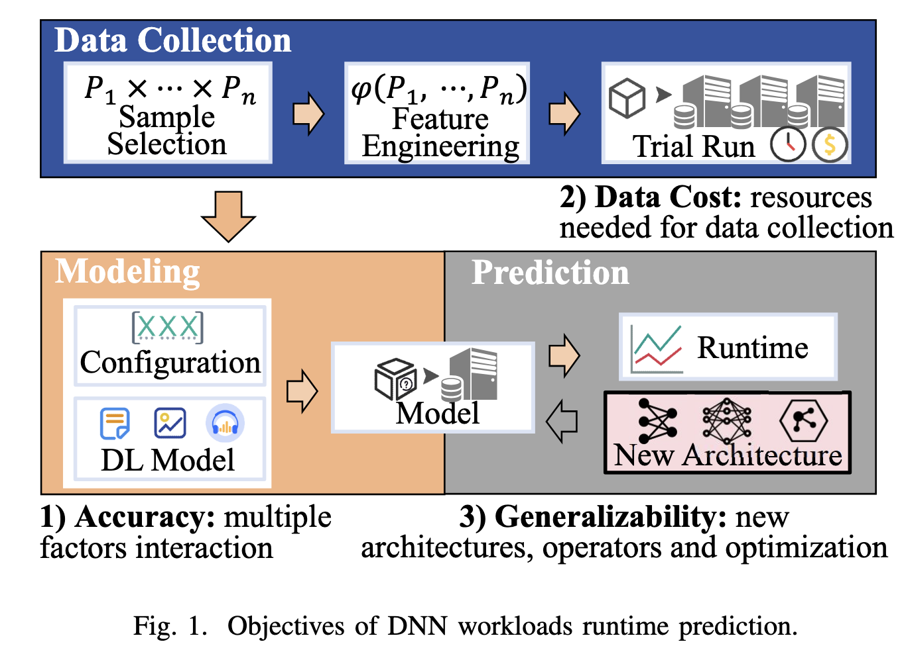
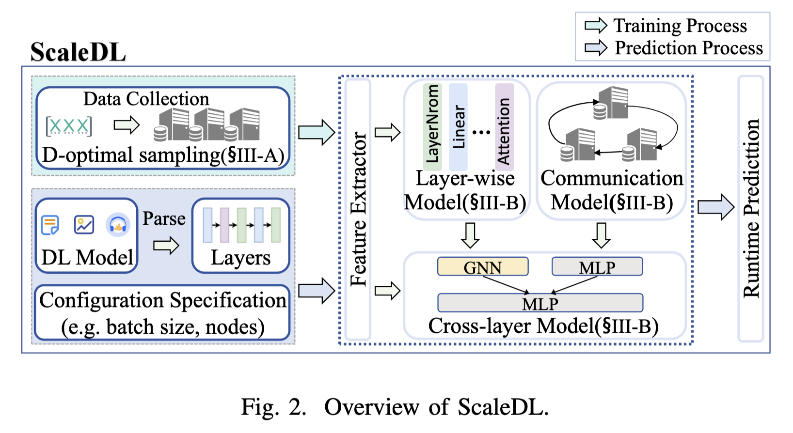
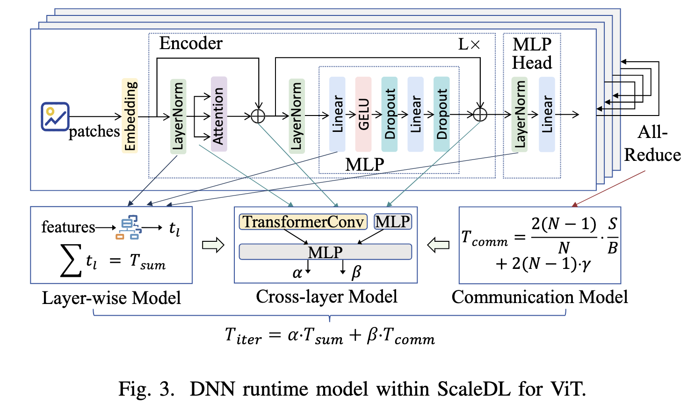
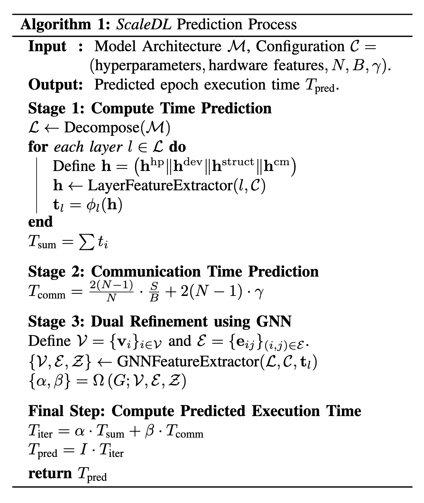
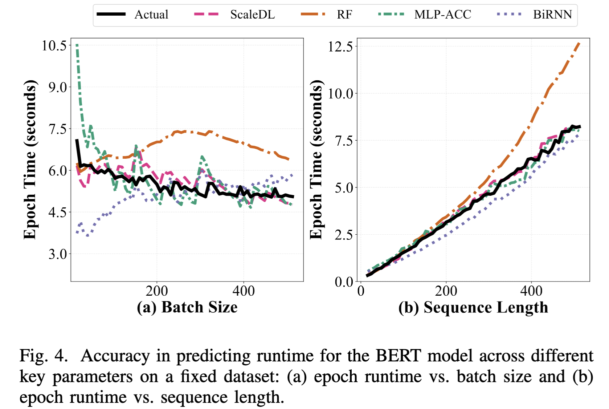
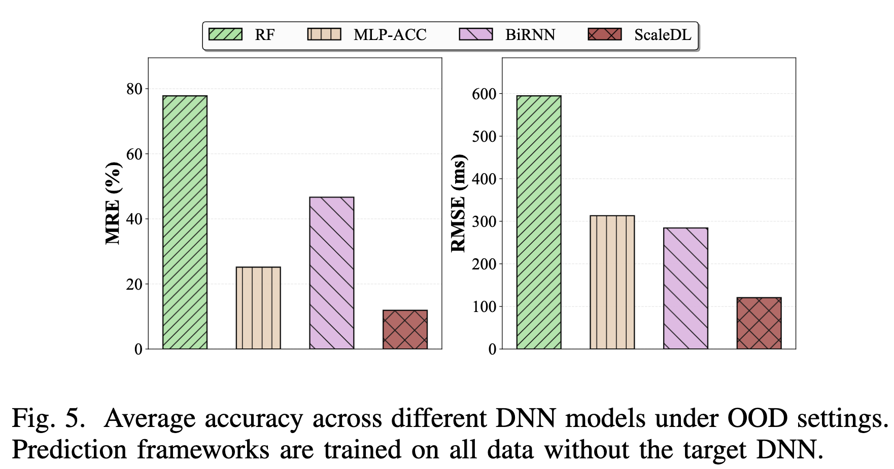
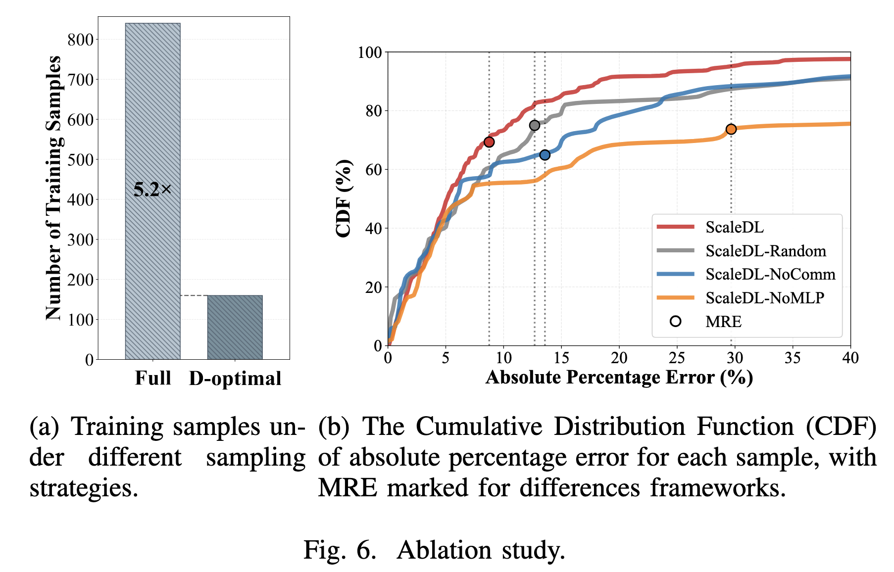

# 论文阅读

题目：ScaleDL: Towards Scalable and Efficient Runtime Prediction for Distributed Deep Learning Workloads

## Abstract

深度神经网络（Deep Neural Networks，DNNs）已经成为现代人工智能服务的基石，支持包括自动驾驶、聊天机器人和推荐系统在内的广泛应用。随着模型规模和复杂度不断增加，训练和推理等 DNN 工作负载对分布式计算资源提出了前所未有的需求，因此，准确预测运行时间对于优化开发过程和资源分配至关重要。

传统方法通常依赖加法式计算单元模型，这限制了其准确性和泛化能力。相比之下，图增强建模方法能够提升预测性能，但会显著增加数据采集成本。因此，当前迫切需要一种能够在准确性、泛化能力和数据采集成本之间取得平衡的方法。

为了解决这些问题，本文提出了 ScaleDL，一种面向分布式深度学习工作负载的全新运行时间预测框架。ScaleDL 将非线性的逐层建模方法与基于图神经网络（Graph Neural Network，GNN）的跨层交互机制相结合，从而实现准确的 DNN 运行时间预测，并能够在不同网络架构之间实现分层泛化。

此外，本文采用 D-optimal 方法来降低数据采集成本。在五种流行 DNN 模型的工作负载上进行的实验表明，ScaleDL 提高了运行时间预测的准确性和泛化能力。与基线模型相比，ScaleDL 的平均相对误差（Mean Relative Error，MRE）降低了约 6 倍，均方根误差（Root Mean Squared Error，RMSE）降低了约 5 倍。

## I. INTRODUCTION

DNN 已经成为现代人工智能服务的重要组成部分，并推动了推荐系统 [1]、计算机视觉 [2] 和自然语言处理 [3] 等领域的发展。随着模型规模和应用多样性迅速扩大，DNN 训练和推理产生了规模庞大且高度异构的工作负载，对计算能力、内存和通信带宽等分布式计算资源提出了前所未有的需求。

与此同时，DNN 的部署环境也变得越来越多样化，包括 GPU、TPU 以及定制化加速器。不同硬件通常具有各自不同的性能特征 [4]。在模型规模不断增长、加速器高度异构以及软件栈日益复杂的背景下，准确理解 DNN 工作负载的运行时性能，包括计算时间和通信开销，变得更加重要 [5], [6]。

运行时间预测已经成为大规模 DNN 工作负载进行系统级优化和模型开发的重要支撑技术 [7]。在系统层面，可靠的预测结果可以支持模型与设备的协同优化、云环境中的动态扩缩容，以及分布式训练中的高效调度 [8], [9]。

在实际开发过程中，运行时间预测还可以通过避免作业失败和过度资源消耗来降低风险，使开发者能够识别可行的配置、管理预算并加速实验过程。

近年来，DNN 工作负载运行时间预测研究取得了显著进展 [4], [10]-[15]。传统方法通常假设运行时间与浮点运算次数（Floating-Point Operations，FLOPs）之间存在线性关系 [10]。这类方法可以基于计算复杂度给出粗略估计，但无法捕捉内存瓶颈、激活函数等因素引起的非线性效应，因此预测准确性往往不够理想。

算子级建模方法 [4], [11], [12] 在此基础上进行了改进。它们以更细粒度的算子为单位对 DNN 进行建模，并捕获算子内部的额外非线性因素。然而，这些方法仍然忽略了不同算子之间的交互关系。

近年来，图结构建模方法，例如采用 GNN 的方法 [13], [14]，在捕获模型结构依赖关系方面展现出了优势。但是，这类纯神经网络方法通常需要较高的数据采集成本，并且在不同模型之间的泛化能力有限。

因此，当前迫切需要一种能够在以下三个目标之间取得平衡的运行时间预测框架，这三个目标如图 1 所示。

 1）准确性（Accuracy）
DNN 的运行时性能由多个因素共同决定，包括：
- 主要计算层；
- 配置参数，例如 batch size、输入和输出维度以及并行度；
- 硬件平台，例如 GPU 和 TPU；
- 软件框架，例如 TensorFlow 和 PyTorch；
- 系统层优化，例如内核融合和内存管理。

这些因素之间存在复杂的非线性交互关系，因此很难准确捕捉真实的运行行为，最终往往导致预测准确性不理想。

2）数据成本（Data Cost）
上述因素共同构成了一个规模巨大的配置空间，因此，对所有配置进行穷举式 profiling（性能剖析）是不现实的。
例如，对单个 ViT 训练配置进行基准测试可能需要数小时的 GPU 时间。如果枚举所有可能的参数组合，则可能需要更多 GPU 时间，甚至达到数千小时。
因此，一个有效的方法必须在数据效率和预测准确性之间取得平衡。

3）泛化能力（Generalizability）

随着 DNN 架构快速发展，新的算子和优化方法不断出现，静态的或针对特定模型的预测器很快就会过时。

因此，一个鲁棒的运行时间预测框架应该能够在只进行少量重新基准测试的情况下，泛化到未见过的模型，从而保证其在真实部署环境中的可扩展性和实用性。

为了解决上述问题，本文提出了 ScaleDL，一种面向分布式 DNN 工作负载的可扩展、高效运行时间预测框架。具体而言，ScaleDL 包含以下三项关键设计：
1. **逐层建模（Layer-wise Modeling）**：ScaleDL 不再把整个网络作为一个不可分割的整体进行建模，而是将 DNN 分解为独立的层，并分别预测每一层的执行性能。这种设计在减少数据采集需求的同时，也提供了较强的泛化能力。
2. **跨层交互建模（Cross-layer Interaction Modeling）**：ScaleDL 使用轻量级 GNN 捕获层与层之间的依赖关系，例如计算重叠、内核融合和内存复用。这些因素是传统线性模型或算子级模型难以表示的。
3. **数据高效训练（Data-efficient Training）**：ScaleDL 使用 D-optimal sampling 策略，只利用一部分具有代表性的配置训练模型，在 profiling 开销和预测准确性之间取得平衡。

本文的主要贡献总结如下：
- 提出了 ScaleDL，一种将细粒度逐层建模与基于 GNN 的跨层交互建模相结合的框架，用于准确预测分布式 DNN 工作负载的运行时间。
- 结合逐层建模和 D-optimal sampling，在不牺牲预测准确性的情况下，将所需的基准测试样本数量和总体数据采集成本最多降低约 5.2 倍。
- 在五种流行 DNN 模型的工作负载上进行实验，结果表明，与基线框架相比，ScaleDL 可以将 MRE 降低约 6 倍，将 RMSE 降低约 5 倍。

## II. SCALEDL SYSTEM OVERVIEW

A. ScaleDL 概述

图 2 展示了 ScaleDL 的整体架构。

首先，ScaleDL 将 DNN 工作负载的运行时间建模为**计算成本与通信延迟的组合**，以此预测 DNN 工作负载的运行时间。

随后，ScaleDL 使用图校正机制捕获跨层效应，例如内核融合（kernel fusion）和数据依赖关系，从而修正逐层成本模型和通信性能模型给出的初始估计结果。

为了进一步实现数据高效训练，ScaleDL 采用 D-optimal sampling 策略。通过优化所需的数据量，该策略能够确保模型高效地学习那些对于运行时间预测最有信息价值的模式。

图 2 中的主要流程
```
数据采集
  - D-optimal sampling

输入
  - DNN 模型
  - 配置说明，例如 batch size、节点数量

解析
  - 将 DNN 模型解析为多个网络层

特征提取
  - 提取层、配置和硬件相关特征

运行时间建模
  - 逐层模型
  - 通信模型
  - 基于 GNN 和 MLP 的跨层模型

输出
  - 运行时间预测结果
```


B. 运行时间模型

本文将一次深度学习训练 epoch 的运行时间定义为 $T_{epoch}$。该时间主要由这个 epoch 中所有迭代所消耗的时间决定。

在稳态执行阶段，排除数据加载和容器启动等预热活动后，每次迭代的执行时间近似保持不变。

假设 `I` 表示每个 epoch 中包含的迭代次数，本文使用单次迭代时间 $T_{iter}$ 计算整个 epoch 的运行时间：
$$
T_{epoch} = I · T_{iter}                                      \tag{1}
$$

单次迭代时间 $T_{iter}$ 被建模为：


$$T_{iter} = α · T_{sum} + β · T_{comm}                           \tag{2}$$

其中：

- $T_{sum}$ 表示 DNN 的计算时间；
- $T_{comm}$ 表示通信时间；
- $\alpha$ 表示计算时间的缩放因子；
- $\beta$ 表示通信时间的缩放因子。

通信时间的具体建模方法将在下一节中进一步说明。

为了描述计算与通信之间的相互影响，本文将 DNN 的一次迭代表示为一个有向无环图：
$$G = (V, E)$$

其中，每个节点 $v \in V$ 对应 DNN 中的一个网络层，边集合 `E` 则表示不同网络层之间的依赖关系。

这种基于图的架构用于描述每个网络层的计算如何同时依赖其前面的网络层和后面的网络层，并据此预测计算时间缩放因子 `α` 和通信时间缩放因子 `β`：

$$
\alpha, \beta= Ω(G; {v_i}_{i∈V}, {e_ij}_{(i,j)∈E}, Z)           \tag{3}
$$

其中：

- `Ω` 表示一个基于 GNN 的模型。该模型根据输入图 `G` 中的信息预测缩放因子。
- ${v_i}_{i∈V}$ 表示节点特征，用于描述网络层的重要属性，例如层类型、FLOPs 和预测执行时间。
- ${e_ij}_{(i,j)∈E}$ 表示边特征，用于编码不同网络层之间的依赖关系，例如数据传输量和数据传输方向。
- `Z` 表示全局超参数，例如 batch size、优化器类型以及硬件特征。

简而言之，这一节的运行时间模型可以概括为：

```
基础计算时间 T_sum
        +
基础通信时间 T_comm
        |
        v
GNN 根据整个 DNN 计算图预测 α 和 β
        |
        v
T_iter = α·T_sum + β·T_comm
        |
        v
T_epoch = I·T_iter
```

这里的 `α` 和 `β` 不是人工设定的固定常数，而是 GNN 根据模型结构、层间依赖、训练配置和硬件特征学习得到的动态校正因子。

## III. METHODOLOGY

### A. 高效的 D-optimal 采样

在数据采集阶段，本文的目标是在有限预算内获取具有较高信息量的性能样本，用于训练逐层预测器和基于图的模型。

由于配置空间维度很高，并且基准测试需要大量 GPU 资源，因此，穷举采样或均匀采样会导致很高的成本，效率也较低。

为了解决这一问题，本文在建模流程中采用 **D-optimal 实验设计**，在尽可能减少样本数量的同时，最大化样本在特征空间中的多样性和可辨识性。

假设每个候选配置都表示为一个特征向量 $a_i$，其中 $i \in [1,m]$，定义经验特征信息矩阵：
$$ M(\lambda) = \sum_{i=1}^{m} \lambda_i a_i a_i^{\top} \tag{4} $$

其中，$\lambda_i \in {0,1}$ 表示是否选择候选配置 $a_i$：

- $\lambda_i=1$：选择该配置；
- $\lambda_i=0$：不选择该配置。

最大化行列式 $\det(M(\lambda))$ 可以增加模型参数中包含的信息量，从而降低参数估计的方差。

在本文的非线性建模场景中，这一准则可以降低特征协方差的不确定性，使被选中的样本尽可能均匀且相互正交地覆盖整个特征空间。

在给定固定样本预算 $k$ 的情况下，本文求解以下组合式 D-optimal 子集选择问题：

$$ \begin{aligned} \max_{\lambda}\quad & \det(M(\lambda)) \\ \text{s.t.}\quad & \sum_{i=1}^{m}\lambda_i = k, \\ & \lambda_i \in \{0,1\}. \end{aligned} \tag{5} $$

为了解决这一问题，本文采用 **Fedorov-exchange 启发式算法**，并且只对满足 $\lambda_i=1$ 的配置执行基准测试。

这样可以保证逐层回归器 $\phi_l(\cdot)$ 和图级模型 $\Omega(\cdot)$ 都在信息量高、冗余较少的配置上进行训练。

通过结合 D-optimal 技术和多进程并发优化，ScaleDL 可以在两小时内完成网络层基准数据和 GNN 训练数据的采集，从而实现数据高效训练。

### B. DNN 运行时间模型（DNN Runtime Model）

准确的运行时间预测需要同时建模网络层的行为、层间依赖关系，以及计算与通信之间的相互作用。



如图 3 所示，ScaleDL 提出了一个由三个阶段组成的运行时间模型：

1. **逐层建模（Layer-wise Modeling）**：分析每种网络层的特征和计算需求，并使用针对不同层类型的逐层预测器，生成初始计算时间估计。
2. **跨层交互建模（Cross-layer Interaction Modeling）**：使用图级模型捕获内核融合、内存复用以及计算与通信之间的耦合关系，从而修正初始估计结果。
3. **通信性能建模（Communication Performance Modeling）**：使用具有可解释性的公式，对分布式训练中广泛使用的 all-reduce 通信模式进行建模，以估计通信开销。

#### 1. 逐层建模（Layer-wise Modeling）

本文首先预测每个网络层的计算成本，并将这些层的时延累加起来，从而估计一次迭代的总计算时延：
$$ T_{\mathrm{sum}} = \sum_{l\in V} t_l \tag{6} $$
其中，$t_l$ 表示第 $l$ 个网络层的计算成本。

>计算成本这里其实我不太明白
>是指一次前向传播的时间还是什么？
>一次迭代训练不是正常应该包括
>1. 前向传播
>2. 计算 loss
>3. 反向传播，计算梯度
>4. 多 GPU 之间 all-reduce 同步梯度
>5. 优化器更新参数
>
>这里的建模是把前向传播、计算loss、反向传播计算梯度、优化器更新参数归到计算时延里面，把多GPU之间all-reduce同步梯度归到通信时延里面？

为了预测每个网络层的计算成本，本文针对每个网络层分别建立一个 Random Forest 回归预测器，并考虑超参数、设备特征和网络层配置等相关因素。

对于每个网络层 $l$，其计算成本 $t_l$ 被预测为：
$$ t_l = \phi_l \left( h^{\mathrm{hp}} \Vert h^{\mathrm{dev}} \Vert h^{\mathrm{struct}} \Vert h^{\mathrm{cm}} \right) \tag{7} $$
其中：

- $h^{\mathrm{hp}}$：影响模型性能的核心超参数，例如 batch size 和序列长度；
- $h^{\mathrm{dev}}$：描述硬件计算能力的设备特征，包括峰值计算性能和内存带宽；
- $h^{\mathrm{struct}}$：网络层特定的配置特征，用于描述该层的架构和设计；
- $h^{\mathrm{cm}}$：与计算和内存相关的指标，例如 FLOPs 和张量字节数，用于描述该层的资源使用情况。

为了进一步说明 $h^{\mathrm{struct}}$ 和 $h^{\mathrm{cm}}$，本文以 Linear 层为例。

Linear 层的结构特征 $h^{\mathrm{struct}}$ 包括输入维度 $d_{\mathrm{in}}$ 和输出维度 $d_{\mathrm{out}}$。其计算和内存特征定义为：

$$ h_{\mathrm{Linear}}^{\mathrm{cm}} = \left( \mathrm{FLOPs}_{\mathrm{Linear}}, \mathrm{Params}_{\mathrm{Linear}} \right) \tag{8} $$

其中：

$$ \mathrm{FLOPs}_{\mathrm{Linear}} = 2bd_{\mathrm{in}}d_{\mathrm{out}} + bd_{\mathrm{out}} \tag{9} $$
$$\mathrm{Params}_{\mathrm{Linear}} = d_{\mathrm{in}}d_{\mathrm{out}} + d_{\mathrm{out}} \tag{10} $$

这里，$b$ 表示 batch size。

$\mathrm{FLOPs}_{\mathrm{Linear}}$ 包括 Linear 层中乘加运算和偏置加法所需的浮点运算次数。$\mathrm{Params}_{\mathrm{Linear}}$ 则根据参数数量表示内存使用情况。

这种方法为端到端运行时间预测奠定了基础。它首先估计计算时延 $T_{\mathrm{sum}}$，然后由 GNN 捕获网络层之间的依赖关系，对该估计结果进一步修正。

#### 2. 跨层交互建模（Cross-layer Interaction Modeling）

为了建模不同网络层之间，以及计算与通信之间复杂的相互作用，本文采用一种基于 Transformer 的 GNN 来捕获复杂的节点间关系。

该 GNN 包含一个 `TransformerConv` 层。它利用 DNN 的计算流程图，动态学习节点和边的特征表示：

- 节点表示 DNN 网络层；
- 边表示网络层之间的跨层交互。

在该层的核心部分，模型会为每一对节点计算注意力系数 $\epsilon_{i,j}$，并将边特征显式加入注意力分数中：

$$ \epsilon_{i,j} = \frac{ \left(W_Qv_i\right)^{\top} \left(W_Kv_j\right) }{ \sqrt{d_k} } + \operatorname{ReLU} \left( W_{\mathrm{edge}}e_{i,j} + b_{\mathrm{edge}} \right) \tag{11} $$

其中，公式中的两项分别表示：

1. 对节点特征 $v_i$ 和 $v_j$ 计算的缩放点积注意力；
2. 对边特征 $e_{i,j}$ 进行的可学习变换。

这种设计使模型能够利用层间的结构依赖关系。

随后，使用 softmax 函数将原始注意力分数归一化为概率分布 $\omega_{i,j}$：

$$ \omega_{i,j} = \operatorname{softmax}_j \left( \epsilon_{i,j} \right) = \frac{ \exp\left(\epsilon_{i,j}\right) }{ \displaystyle \sum_{k\in\mathcal{N}(i)} \exp\left(\epsilon_{i,k}\right) } \tag{12} $$

其中，$\mathcal{N}(i)$ 表示节点 $i$ 的邻居节点集合。

为了捕获更加丰富的关系模式，本文采用多头注意力机制。更新后的节点表示 $v_i'$ 由 $L$ 个并行注意力头的输出取平均得到：

$$ v_i' = \frac{1}{L} \sum_{\ell=1}^{L} \sigma \left( \sum_{j\in\mathcal{N}(i)} \omega_{i,j}^{(\ell)} W_V^{(\ell)} v_j \right) \tag{13} $$

其中，$\omega_{i,j}^{(\ell)}$ 和 $W_V^{(\ell)}$ 分别表示第 $\ell$ 个注意力头的注意力权重和值变换矩阵。

除了 `TransformerConv` 层之外，该 GNN 还通过一个 MLP 层加入了全局编码器和预测器。

全局编码器负责处理全局超参数 $Z$，而 `TransformerConv` 层则将节点表示 $v_i'$ 汇聚为图级嵌入。二者共同构成一个双分支架构。

随后，将两个分支得到的向量进行拼接，并通过最终预测器生成缩放因子 $\alpha$ 和 $\beta$。该过程可以表示为：

$$ \{\alpha,\beta\} = \operatorname{MLP} \left( \left[ \operatorname{Pooling} \left( v_i', i=1,\ldots,n \right) \Vert \operatorname{MLP}(Z) \right] \right) \tag{14} $$

其中，$\Vert$ 表示向量拼接。

这种双分支方法将 GNN 的图结构学习能力与 MLP 对全局信息的建模能力结合起来。论文认为，即使训练数据有限，这种方法也能够有效提高预测准确性。
#### 3. 通信性能建模（Communication Performance Modeling）

为了建模通信成本，本文关注 all-reduce 通信模式。该模式被广泛应用于各种分布式训练框架。

通信成本由两个部分组成：

1. 数据传输时间；
2. 通信延迟。

设：

- $N$ 表示参与通信的 GPU 数量；
- $S$ 表示数据大小，单位为 bit；
- $B$ 表示网络带宽，单位为 bit/s；
- $\gamma$ 表示通信延迟，单位为秒。

使用上述参数，通信成本可以表示为：

$$ T_{\mathrm{comm}} = \frac{2(N-1)}{N} \cdot \frac{S}{B} + 2(N-1)\cdot\gamma \tag{15} $$

其中，第一项：

$$ \frac{2(N-1)}{N} \cdot \frac{S}{B} $$

表示数据传输时间。

在 all-reduce 操作中，数据需要在所有节点之间进行交换。$\frac{S}{B}$ 表示根据网络带宽传输数据量 $S$ 所需的时间，而 $\frac{2(N-1)}{N}$ 则表示多个节点之间双向通信对应的数据传输系数。

第二项：

$$ 2(N-1)\cdot\gamma $$

表示通信延迟。

由于 all-reduce 是一种同步操作，每个节点都必须等待其他节点完成计算，因此会引入额外的通信等待时间。这里的 $\gamma$ 表示通信延迟，而 $2(N-1)$ 则反映了双向通信过程中的延迟因素。

其中，$\Vert$ 表示特征向量拼接，$\mathcal{N}(i)$ 表示节点 $i$ 的邻居集合，$\alpha$ 和 $\beta$ 是 GNN 根据 DNN 计算图和全局配置学习得到的计算与通信校正因子。

### C. Runtime Prediction and Evaluation

在使用 ScaleDL 框架之前，需要先指定目标 DNN 模型及其运行配置。

如算法 1 所示，首先将模型分解为多个网络层，并从这些网络层中提取结构特征和计算特征。

这些特征与配置参数共同组成统一的特征向量 $h$。随后，将 $h$ 输入预训练的逐层预测器，以估计各个网络层的执行时间，并将这些时间相加，得到基础计算时间 $T_{\mathrm{sum}}$。

>还是和前面的疑问一样这里每层的训练计算量是如何计时的？
>单独构建一个网络层用相同的输入输出维度、batch size、数据类型、GPU、硬件配置？
>还是对完整模型进行GPU profiler、CUDA events记录算子或网络层的时间？

接下来，根据理论公式（15）计算通信时间 $T_{\mathrm{comm}}$。其中，通信延迟因子 $\gamma$ 通过一次 all-reduce 测试进行测量。

在获得 $T_{\mathrm{sum}}$ 和 $T_{\mathrm{comm}}$ 后，ScaleDL 进一步提取相关的边特征、节点特征和超参数。

这些特征随后被输入已经训练好的 GNN 模型，由 GNN 输出计算时间和通信时间的缩放因子 $\alpha$ 和 $\beta$。

最后，将这两个缩放因子与公式（1）和公式（2）结合起来，计算最终的预测执行时间 $T_{\mathrm{pred}}$。

为了评估模型的准确性，本文使用两个指标：

- 平均相对误差（Mean Relative Error，MRE）；
- 均方根误差（Root Mean Squared Error，RMSE）。

MRE 定义为：

$$ \mathrm{MRE} = \frac{1}{n} \sum_{i=1}^{n} \frac{ \left| T_{\mathrm{epoch}}^{i} - T_{\mathrm{pred}}^{i} \right| }{ T_{\mathrm{epoch}}^{i} } \times 100\% $$

MRE 用于衡量预测运行时间与真实运行时间之间的相对差异。

RMSE 定义为：

$$ \mathrm{RMSE} = \sqrt{ \frac{1}{n} \sum_{i=1}^{n} \left( T_{\mathrm{epoch}}^{i} - T_{\mathrm{pred}}^{i} \right)^2 } $$

RMSE 用于衡量预测误差的绝对大小。

其中：

- $n$ 表示样本总数；
- $T_{\mathrm{epoch}}^{i}$ 表示第 $i$ 个样本的真实训练时间；
- $T_{\mathrm{pred}}^{i}$ 表示第 $i$ 个样本的预测运行时间。

MRE 和 RMSE 的数值越低，表示预测效果越好。

整个预测过程可以概括为：

$$ \text{DNN 模型} \longrightarrow \text{拆分网络层} \longrightarrow \text{提取层特征} \longrightarrow T_{\mathrm{sum}} $$

同时：

$$ \text{GPU 数量、数据量、带宽、通信延迟} \longrightarrow T_{\mathrm{comm}} $$

然后：

$$ \{T_{\mathrm{sum}},T_{\mathrm{comm}},\text{节点特征},\text{边特征},\text{全局配置}\} \longrightarrow \text{GNN} \longrightarrow \{\alpha,\beta\} $$

最后计算：

$$ T_{\mathrm{iter}} = \alpha T_{\mathrm{sum}} + \beta T_{\mathrm{comm}} $$$$ T_{\mathrm{pred}} = I T_{\mathrm{iter}} $$

其中，$I$ 表示一个 epoch 中的迭代次数。

> 关于GNN的训练是通过最终的时间误差进行的端到端训练吗？不然没有监督数据啊？


## IV. EXPERIMENT

### A. 实验设置（Experiment Setup）

实验在两台服务器上进行。服务器配备了 Intel Xeon E5-2690V4 CPU 和 NVIDIA H20 GPU。

本文对五种具有代表性的 DNN 模型进行了基准测试：
- T5 [16]；
- GPT-2 [17]；
- BERT [18]；
- ViT [19]；
- DeiT [20]。
本文重点分析 DNN 训练任务中的 epoch 时间 $T_{\mathrm{epoch}}$，因为这类工作负载计算复杂，并且包含完整的推理计算过程。

对于每种 DNN 模型，本文通过改变不同的运行配置，使用 D-optimal 方法收集了 200 个不同的样本。随后，将数据集划分为：
- 160 个训练样本；
- 40 个测试样本。
本文在 **同域（In-Domain，ID）** 和 **域外（Out-of-Domain，OOD）** 两种设置下评估 ScaleDL 的准确性和泛化能力，并计算 MRE 和 RMSE。
- **ID 设置**：训练和测试使用相同的 DNN 架构，用于评估模型的拟合能力。
- **OOD 设置**：训练时排除目标 DNN 架构，测试时使用训练过程中未见过的架构，用于评估模型的泛化能力。

本文选择了以下三个基线框架进行比较：
1. **Random Forest（RF）**：一种只使用超参数的简单回归模型，不考虑 DNN 的图结构；
2. **MLP-ACC** [12]：一种基于 MLP 的模型，将每个网络层的时间预测结果相加；
3. **BiRNN** [22]：一种双向循环神经网络，使用节点特征建模顺序依赖关系，但不包含边特征信息。
### B. 运行时间预测准确性（Accuracy of Runtime Predictions）

如表 I 所示，在不同 DNN 工作负载的训练时间预测任务中，ScaleDL 的表现优于所有基线方法。

ScaleDL 的总体结果为：
- MRE：9.39%；
- RMSE：43.66 ms。

与 RF 相比，ScaleDL 的 MRE 和 RMSE 分别降低了 73.7% 和 74.5%。

与 MLP-ACC 相比，ScaleDL 的 MRE 和 RMSE 分别降低了 40.6% 和 37.4%。

与 BiRNN 相比，ScaleDL 的 MRE 和 RMSE 分别降低了 52.5% 和 50.6%。

对于 T5、BERT 和 ViT 等具体 DNN 模型，ScaleDL 也持续取得了较好的结果。其中：

- BERT 的最佳 MRE 为 5.47%；
- ViT 的最低 RMSE 为 9.63 ms。

不过，在 GPT-2 的 RMSE 指标上，MLP-ACC 略优于 ScaleDL；但在 MRE 指标上，ScaleDL 仍然表现最好。

这些结果表明，ScaleDL 能够捕获跨层交互关系，因此相比其他模型具有更高的预测准确性。

表 I：不同模型上的运行时间预测准确性（ID 设置）

| 模型      | 指标        | ScaleDL | RF     | MLP-ACC | BiRNN  |
| ------- | --------- | ------- | ------ | ------- | ------ |
| Overall | MRE (%)   | 9.39    | 35.75  | 15.81   | 19.78  |
| Overall | RMSE (ms) | 43.66   | 170.89 | 69.77   | 88.41  |
| T5      | MRE (%)   | 9.45    | 33.84  | 14.57   | 20.15  |
| T5      | RMSE (ms) | 24.39   | 97.55  | 37.48   | 64.71  |
| GPT-2   | MRE (%)   | 13.88   | 42.78  | 18.68   | 23.47  |
| GPT-2   | RMSE (ms) | 118.13  | 155.81 | 46.51   | 150.84 |
| BERT    | MRE (%)   | 5.47    | 34.57  | 12.42   | 21.13  |
| BERT    | RMSE (ms) | 55.16   | 509.60 | 106.69  | 165.89 |
| ViT     | MRE (%)   | 7.74    | 23.95  | 15.89   | 16.69  |
| ViT     | RMSE (ms) | 9.63    | 48.44  | 29.07   | 37.77  |
| DeiT    | MRE (%)   | 10.39   | 43.63  | 17.47   | 17.44  |
| DeiT    | RMSE (ms) | 10.99   | 43.04  | 129.12  | 22.84  |



图 4 进一步展示了当 DNN 配置参数发生变化时，ScaleDL 预测执行时间变化趋势的能力。

在固定数据集上，图 4 展示了 BERT 在不同关键参数下的运行时间预测结果：

- 图 4(a)：epoch 运行时间随 batch size 的变化；
- 图 4(b)：epoch 运行时间随 sequence length 的变化。

随着 batch size 增大，由于并行能力增强，一个 epoch 的总运行时间会下降。

RF 无法捕捉这一变化趋势。BiRNN 和 MLP-ACC 的表现略好一些，但它们仍然难以准确预测运行时间，尤其是在 batch size 较小时。

对于 sequence length，运行时间会近似线性增加，所有模型都能够表现出类似的变化趋势。

不过，在 sequence length 较大时，RF 和 BiRNN 的预测偏差更加明显。MLP-ACC 的表现相对更好，但仍然落后于 ScaleDL。

相比之下，ScaleDL 能够准确跟踪运行时间随配置参数变化的趋势，体现出其对 DNN 运行时间进行建模的优越性。

### C. 运行时间预测的泛化能力（Generalizability of Runtime Predictions）

在 OOD 设置下，本文针对每一个目标模型执行泛化测试，然后计算所有模型上的平均预测指标，以评估模型的泛化能力。



如图 5 所示，ScaleDL 显著优于所有基线方法，并且相比 ID 设置取得了更大的优势。
具体来说：
- ScaleDL 的 MRE 为 11.88%，约为 RF 的 6 分之一；RF 的 MRE 为 77.81%；
- ScaleDL 的 RMSE 为 120.5 ms，约为 RF 的 5 分之一；RF 的 RMSE 为 594.7 ms；
- MLP-ACC 的 MRE 为 25.14%，RMSE 为 313.1 ms；
- BiRNN 的 MRE 为 46.65%，RMSE 为 284.3 ms。

MLP-ACC 的两个指标都至少是 ScaleDL 的 2 倍。BiRNN 的两个指标也明显高于 ScaleDL，其误差约为 ScaleDL 的 2.4 倍。

这些结果表明，ScaleDL 具有较强的泛化能力。作者认为，这主要得益于其逐层建模和跨层交互建模结构。

**图 5：OOD 设置下不同 DNN 模型上的平均预测准确性。**

在该设置中，预测框架使用除目标 DNN 之外的所有数据进行训练。
### D. 消融实验（Ablation Study）

本节通过比较不同的数据采样策略，并进行三组消融实验，分析 ScaleDL 中各个组件的作用。

#### 1. 数据高效训练（Data-efficient Training）

如图 6(a) 所示，在取得与 Full 策略相近的预测效果时，D-optimal sampling 只需要 Full 策略约五分之一的样本。

其中，Full 策略表示使用完整数据集进行训练。

此外，如图 6(b) 所示，ScaleDL-Random 在相同数据采集预算下，将 D-optimal sampling 替换成随机采样。结果表明，ScaleDL-Random 的 MRE 是原始 ScaleDL 的 1.4 倍。

上述结果说明，D-optimal sampling 可以在保持预测准确性的同时，降低 profiling 开销。

#### 2. 组件贡献（Component Contributions）

本文进一步评估了 ScaleDL 中不同组件的作用。
在 **ScaleDL-NoComm** 中，移除通信模型，使 ScaleDL 无法显式捕获通信开销。
在 **ScaleDL-NoMLP** 中，移除全局编码器，使 GNN 只能依赖节点和边进行局部信息整合。
实验结果说明了各个组件的重要性：
- ScaleDL-NoComm 的 MRE 是完整 ScaleDL 的 1.5 倍，说明通信建模非常重要；
- ScaleDL-NoMLP 的误差增幅最大，其 MRE 是完整 ScaleDL 的 3.3 倍；
- 这说明移除 MLP 分支后，模型处理全局信息的能力下降，跨层交互建模的效果也明显减弱。


# 思考与总结

这里比较有参考的是问题比较有价值，然后使用GNN去捕捉模型层之间的关系也比较有意思