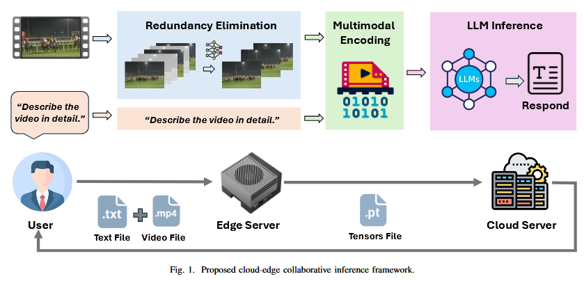
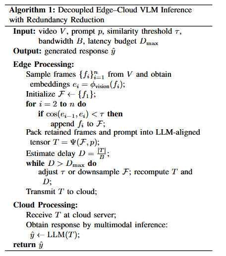
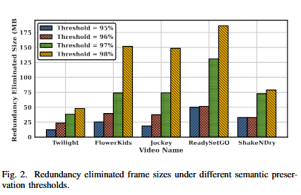
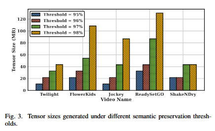
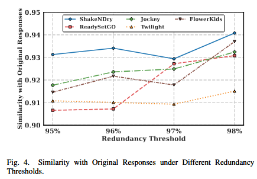
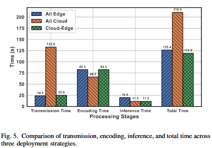

[TOC]

# 一、abstract

近年来，大语言模型（LLMs）的进展已将其能力扩展至视觉领域，使其能够理解图像、视频以及跨模态内容。与传统LLM不同，视频语言模型（VLM）不仅需要文本提示，还需要传输大规模视频数据用于推理。由于其巨大的计算和存储需求，这类模型通常部署在云服务器上。然而，将原始视频流上传至云端会带来显著的传输延迟，严重限制了其在实时场景中的适用性。为应对这一挑战，我们提出了一种面向云边协同VLM推理的解耦并行方法。具体而言，我们将VLM解耦为多模态编码器和大语言模型两部分。视频编码器部署在靠近用户的边缘设备上，而仅将紧凑的语义张量传输至云端供后续LLM推理使用。为进一步优化通信效率，我们引入了一种冗余缩减算法，用于消除语义相似的帧，从而在保留关键时空信息的同时大幅缩减张量大小。我们在广泛使用的Ultra Video Group（UVG）视频数据集上评估了我们的框架，该数据集提供高质量的视频序列，适用于实时视频处理系统的基准测试。在基准视频语言任务上的实验结果表明，与纯云端处理相比，我们的方法将传输量减少了高达75%，端到端延迟几乎降低了一半。重要的是，生成响应的语义保真度始终保持在90%以上，证实了所提框架能够有效平衡实时VLM应用的效率与准确性。

# 二、introduction

近年来，大语言模型在自然语言理解和生成方面取得了显著突破。在此基础上，研究者将LLM扩展至视觉领域，催生了视频语言模型，这类模型将多模态编码器与LLM主干网络相结合。与纯文本LLM不同，VLM同时接收自然语言提示和视频流作为输入，能够对时空视觉特征和文本上下文进行联合推理。这一能力使其特别适用于视频问答、视频内容交互式对话以及实时多媒体分析等任务。

由于模型规模庞大且推理过程计算密集，VLM通常部署在云服务器上，而由此产生的视频上传往往主导了端到端延迟。现有的云边协同研究试图通过动态卸载来降低延迟，但大多数方法仍将VLM视为不可分割的黑盒，以粗粒度进行计算卸载。这些方法并未改变VLM的内部推理结构，因此原始视频流的大量传输成本从根本上仍未得到解决。

为克服这一局限，我们提出了一种结构解耦的云边协同VLM推理框架。我们不将VLM视为一个整体模型，而是将其分解为：（i）部署在边缘的轻量级视频编码器，和（ii）托管在云端、负责多模态推理的LLM。边缘编码器将原始视频帧转换为紧凑的语义张量，该张量封装了后续VLM推理所需的关键视觉和时序特征。与传统的视频压缩或关键帧提取不同，这种语义张量传输范式明确与基于语言的推理需求对齐，使云端的LLM能够直接基于语义表示而非像素数据进行操作。通过传输张量而非原始视频流，我们的方法在保持生成响应质量的同时，大幅降低了通信开销。为进一步优化传输效率，我们引入了一种基于帧相似性的冗余消除算法。通过测量采样视频帧之间的相似性，移除不贡献新语义信息的冗余帧，从而减少编码帧数。该策略保留了准确推理所需的关键时空上下文，同时显著减小了传输张量的大小。

最后，我们在公开数据集中的多样化视频上评估了所提框架。实验结果表明，与纯云端推理相比，我们的方法将处理时间减少了两倍以上，同时推理正确性保持在90%以上。这些结果证实了解耦框架在同时提升效率和保持响应质量方面的有效性。

本文的主要贡献总结如下：

- 我们提出了首个结构解耦的云边协同VLM推理框架，实现语义张量传输而非完整视频流传输，从而解决了通信瓶颈问题。
- 为进一步优化效率，我们设计了一种基于帧相似性的冗余消除算法，从采样视频序列中移除语义冗余的帧。该策略有效减小了传输张量的大小，同时保持了准确多模态推理所需的时空上下文。
- 我们在公开的视频语言数据集上进行了大量实验，结果表明，与纯云端推理相比，我们的方法实现了高达两倍的端到端处理时间缩减，同时推理正确性保持在90%以上。这些结果凸显了所提框架在交互式视频分析和实时多媒体系统等延迟敏感应用中的实用性。

# 三、Related work

A. 视频大语言模型的发展

视频大语言模型近期作为大语言模型的扩展而出现，旨在联合建模时空视觉信息与自然语言，用于视频问答、细粒度描述和基于视频的对话等任务。近年来，越来越多的研究探索了不同的架构设计和训练范式以增强VLM的能力，涌现出若干代表性模型。

Zhang等人[5]提出了Video-LLaMA，引入双分支架构同时处理视频的视觉和听觉模态。视觉分支采用Video Q-Former捕捉跨帧的时间动态，而音频分支利用ImageBind将语音信号与LLM嵌入空间对齐，从而实现全面的音视频理解。Lin等人[6]提出了Video-LLaVA，强调通过在投影前对齐图像和视频特征来实现统一视觉表示。这种预对齐减少了模态不一致性，并通过图像和视频的联合训练，使LLM学习到共享表示，在多个视频推理基准上取得了优于单模态专用模型的性能。与此同时，Wang等人[7]提出了Tarsier，这是一系列基于简单架构构建的VLM，冻结CLIP-ViT进行帧级编码，并将时序推理完全委托给LLM。尽管架构简单，Tarsier通过大规模多任务预训练和指令微调，展现了最先进的细粒度视频描述能力，并引入了用于详细视频描述的DREAM-1K基准，在该基准上它超越了现有开源模型，甚至可与GPT-4V等专有系统媲美。

在这些基础之上，近期工作进一步将VLM扩展到实时和长视频理解领域。Chen等人[2]提出了VideoLLM-online，引入Learning-In-Video-Stream（LIVE）框架，以支持连续视频流中时间对齐、长上下文和实时对话。通过设计流式EOS预测目标、在线对话数据生成方案以及并行编码和解码的优化推理流水线，VideoLLM-online在长视频上以超过10 FPS的速度实现了高效准确的流输入交互，同时在离线基准上保持了强劲性能。作为补充，Ren等人[3]提出了TimeChat，一种用于长视频理解的时间敏感多模态大语言模型。TimeChat集成了一个时间戳感知的帧编码器，将视觉内容与时间信息显式关联，以及一个滑动视频Q-Former，可适应不同视频时长。结合TimeIT指令微调数据集，TimeChat在密集描述、时间定位和高光检测上展现了强大的零样本性能，在长视频推理任务上显著优于之前的VidLLM。

B. 云边协同中的视频大语言模型

在真实世界应用中部署VLM面临着重大挑战，这主要源于其高计算需求以及传输视频数据至云端的通信开销。为了解决这些问题，近期研究开始探索专为VLM定制的云边协同架构。

Hu等人[8]提出了一种面向多模态LLM的高级驾驶辅助系统的云边协同框架，其中轻量级模型运行在边缘，较大模型运行在云端，以联合优化延迟、能耗和服务质量。Zhuang等人[4]研究了MEC赋能的超大视觉模型服务，并提出了推理和任务卸载的联合优化框架，从而提升了效率并降低了延迟。Zhang等人[9]引入了VaVLM，一种专为VLM定制的边云协同系统，采用基于RoI的视频压缩、自适应推理触发和外部知识增强，显著降低了带宽和计算成本。

尽管取得了这些进展，现有工作主要聚焦于优化任务卸载策略、资源分配和传输压缩，但通常将VLM视为不可分割的黑盒。它们既没有显式地将多模态编码器与LLM主干网络解耦，也没有探索基于并行化张量的传输策略。相比之下，我们的工作提出了一种解耦并行方法，其中视频编码在边缘执行，仅将紧凑的语义张量传输到云端进行LLM推理。这种设计通过显式地将多模态编码器与语言模型主干网络解耦，并实现云边协同中通信高效的推理，填补了现有研究的空白。

# 四、SYSTEM AND PROBLEM FORMULATION

### A. 系统设计

我们设计了一种分布式云边协同推理架构，将VLM解耦为两个独立模块：部署在边缘的视频编码器和托管在云端的LLM。整体工作流包含四个核心组件：多模态编码、冗余消除、张量传输和云端推理，如图1所示。

在工作流开始阶段，用户将视频流和文本提示一起发送到最近的边缘设备。在边缘端，我们部署了当前最优视频语言模型Tarsier2‑Recap‑7b [7]的视觉主干网络，用于提取密集的帧级特征。给定输入视频，编码器首先以固定速率采样帧，以捕获时空上下文。为了进一步减小中间表示的尺寸，我们引入了一种针对视频数据定制的冗余消除算法。视频序列通常表现出高度的时序冗余，其中连续帧捕获的内容几乎相同。为缓解这种低效问题，我们采用了一种基于相似性的帧选择策略。具体而言，帧嵌入使用OpenAI提出的CLIP‑ViT‑B/32模型[10]提取。每一帧被投影到高维嵌入空间，并使用ℓ2ℓ2范数进行归一化以确保可比性。然后，利用`torch.nn.functional.cosine_similarity`计算连续帧之间的余弦相似度。如果相邻嵌入之间的相似度超过预设阈值，则丢弃后一帧。该过程确保只有代表性帧被保留用于LLM推理，从而在保留核心语义的同时有效压缩视频。

保留的帧连同文本提示随后被编码为紧凑的语义张量文件，作为从边缘传输到云端的中间表示。为确保无缝集成，边缘端的多模态编码器与云端LLM的输入接口对齐，使得生成的张量符合预期的嵌入空间和维度。这种设计保证了边缘产生的紧凑表示能够直接被LLM消费，无需额外的变换或重编码。处理后的张量文件随后从边缘设备传输到云服务器进行推理。在云端，我们也部署了Tarsier模型，其LLM组件接收对齐的张量以及文本提示，执行多模态推理并生成最终响应。与传输原始视频流相比，这种基于对齐张量的表示显著减少了通信开销，同时在云边协同工作流中保持了兼容性和推理精度。

### B. 问题形式化

我们将具有冗余感知能力的视频表示任务建模为一个约束优化问题。

给定一个由 $T$ 帧组成的视频：

$$
V = \{f_1, f_2, \ldots, f_T\},
$$

帧选择策略 $\pi$ 从中确定一个子集 $V_\pi \subseteq V$，其中保留帧的数量为 $T_\pi = \left|V_\pi\right|$。每个保留帧都被编码为一个视觉词元序列，并与时空元数据一起序列化为张量文件。

设 $s_f$ 表示每个编码帧的平均存储大小，单位为字节；$B$ 表示可用的上行链路带宽。张量文件的总大小为：

$$
S(V_\pi) = T_\pi \cdot s_f. \tag{1}
$$

相应的传输时延为：

$$
\mathcal{L}(V_\pi)
= \frac{S(V_\pi)}{B}
= \frac{T_\pi \cdot s_f}{B}. \tag{2}
$$

由于 $S(V_\pi)$ 与 $\mathcal{L}(V_\pi)$ 成正比，因此，最小化传输时延等价于最小化保留帧的数量 $T_\pi$。

为了识别冗余帧，我们使用视觉编码器计算帧级嵌入 $e_i \in \mathbb{R}^d$。对于连续帧 $f_i$ 和 $f_{i+1}$，其语义相似度被定义为余弦相似度：

$$
\operatorname{sim}(f_i, f_{i+1})
= \frac{e_i \cdot e_{i+1}}
{\lVert e_i \rVert_2\,\lVert e_{i+1} \rVert_2}. \tag{3}
$$

对于给定阈值 $\tau$，如果

$$
\operatorname{sim}(f_i, f_{i+1}) \geq \tau,
$$

则将帧 $f_{i+1}$ 视为冗余帧并予以丢弃。这种剪枝策略能够确保只保留语义上具有差异的帧。

设 $y^*$ 表示使用全部视频帧时 LLM 生成的文本输出，$y_\pi$ 表示仅使用 $V_\pi$ 中的帧时生成的输出。二者之间的语义相似度通过指标 $\mathcal{M}(y_\pi, y^*)$ 进行衡量。

例如，当采用 CLIPScore 时，相似度计算如下：

$$
\mathcal{M}(y_\pi, y^*)
= \frac{
\phi_{\mathrm{text}}(y_\pi) \cdot \phi_{\mathrm{text}}(y^*)
}{
\lVert \phi_{\mathrm{text}}(y_\pi) \rVert_2
\,\lVert \phi_{\mathrm{text}}(y^*) \rVert_2
}. \tag{4}
$$

其中，$\phi_{\mathrm{text}}(\cdot)$ 表示 CLIP 文本编码器。我们施加如下保真度约束：

$$
\mathcal{M}(y_\pi, y^*) \geq \delta, \tag{5}
$$

其中，$\delta$ 是预定义的相似度阈值。

因此，冗余消除任务可表述为：

$$
\min_{\pi}\ \mathcal{L}(V_\pi)
\quad \text{s.t.} \quad
\mathcal{M}(y_\pi, y^*) \geq \delta. \tag{6}
$$

在实际实现中，使用贪心剪枝算法近似求解该优化问题。该算法移除相似度超过阈值 $\tau$ 的视频帧，从而在保证生成描述正确性的同时，尽可能降低传输时延。

# 五、EVALUATION

A. 实验设置

所有实验均在混合云边平台上进行。对于边缘端仿真，我们使用了一台配备 NVIDIA RTX A6000 GPU 和 Intel Core i9-10850K CPU（3.60 GHz）的工作站。对于云端仿真，我们采用了配备 NVIDIA A100 GPU（40 GB）的 Google Cloud 实例。所有实现均在 Python 3.9 环境中开发和运行。

作为视频语言模型，我们采用了 Wang 等人提出的 Tarsier2-Recap-7b 模型 [7]。为了定量评估生成文本的语义一致性，我们使用了 Zhang 等人提出的基于参考文本的评估指标 BERTScore [11]。该指标利用预训练语言模型的上下文嵌入计算词元级相似度，适合评估超越表层词汇重叠的细粒度语义对齐程度。

在视频数据方面，我们从公开的 Ultra Video Group（UVG）数据集 [12] 中选取了五个具有代表性的视频序列。UVG 数据集包含 16 个多样化的 4K（3840 × 2160）视频序列，录制帧率为 50/120 fps，广泛用于视频处理任务的基准测试。表 I 总结了所选视频的主要参数。

### 表 I  所选 UVG 视频序列的详细信息

| 名称       |  时长 |    帧率 | 描述               |
| ---------- | ----: | ------: | ------------------ |
| Twilight   |  12 s |  50 fps | 黄昏时分有电车到达 |
| FlowerKids |  12 s |  50 fps | 女孩们采摘鲜花     |
| Jockey     |   5 s | 120 fps | 赛马，镜头向左摇摄 |
| ReadySetGo |   5 s | 120 fps | 赛马，闸门打开     |
| ShakeNDry  | 2.5 s | 120 fps | 狗抖动身体并行走   |

## B. 冗余削减对通信和准确性的影响

本节研究所提出的冗余削减算法对通信开销和语义保持的影响。我们的目标是评估：在传输前消除冗余帧会如何影响数据量，同时确保保留足够的时空信息以进行准确推理。

为此，我们分析五个视频序列在四个处理阶段的数据大小：

1. 原始视频；
2. 帧提取；
3. 冗余消除；
4. 张量构建。

实验在不同冗余阈值（95%、96%、97% 和 98%）下进行，以考察压缩率与信息保留之间的权衡。较低的阈值（例如 95%）表示：相似度高于 95% 的连续帧将被丢弃，因此会移除大量冗余帧并实现更高的压缩率。相比之下，较高的阈值（例如 98%）只会移除相似度超过 98% 的帧，因此大多数帧会被保留，能够保存更多时间信息，但代价是传输数据量更大。

我们首先考察实验中使用的五个 UVG 视频的原始大小以及相应的提取帧大小。表 II 给出了原始视频大小（范围为 355.8 MB 至 1066.7 MB）以及经过均匀帧提取后的大小。尽管帧提取能够移除编码开销并显著减少数据量（例如，Twilight 从 1066.7 MB 降至 248.4 MB，ReadySetGo 从 516.4 MB 降至 248.9 MB），但提取后的序列仍然较大。因此，需要通过冗余削减模块，在构建语义张量之前进一步移除语义上重复的帧。

### 表 II  所选 UVG 视频序列的原始大小和提取帧大小

| 名称       |  原始大小 | 提取帧大小 |
| ---------- | --------: | ---------: |
| Twilight   | 1066.7 MB |   248.4 MB |
| FlowerKids |  846.1 MB |   237.5 MB |
| Jockey     |  673.9 MB |   275.2 MB |
| ReadySetGo |  516.4 MB |   248.9 MB |
| ShakeNDry  |  355.8 MB |   321.4 MB |

**图 2：不同语义保持阈值下的冗余消除后帧数据大小。**

图 2 展示了在四种语义保持阈值下，应用基于相似度的冗余消除后剩余帧数据的大小。对于全部五个视频序列，随着语义保持阈值从 95% 升高到 98%，剩余数据量单调增加。这是符合预期的：较高的阈值更加保守，允许被移除的帧更少。

例如，在 95% 阈值下，Jockey 提取后的 275.2 MB 数据减少至约 18.2 MB，ReadySetGo 从 248.9 MB 降至约 49.9 MB，Twilight 从 248.4 MB 降至约 12.3 MB。这种大幅削减表明，许多连续帧具有极高的语义相似度，说明这些视频中的场景变化有限或视觉过渡较为缓慢。换言之，视频内容中有很大一部分具有时间冗余，因此非常适合采用基于相似度的剪枝。

相比之下，削减幅度较小的视频通常包含更丰富的运动变化或更频繁的场景切换。例如，ShakeNDry 在所有阈值下都保留了相对更多的数据，这是因为物体的快速运动会引入持续的视觉变化，从而降低相邻帧超过相似度阈值的可能性。

冗余消除之后，保留下来的帧由边缘端视频编码器处理，以生成紧凑的语义张量。图 3 展示了相同阈值下生成的张量大小。由于编码器的压缩作用，张量大小总体上呈现出与冗余消除后帧数据大小相似的变化趋势，但始终更小。

在 95% 阈值下，Jockey 生成的张量约为 10.9 MB，FlowerKids 约为 20 MB，Twilight 降至 15 MB 以下。即使在更加保守的 98% 阈值下，ReadySetGo 和 FlowerKids 的张量大小仍低于 130 MB，而 ShakeNDry 保持在约 20 MB。总体而言，张量化在冗余消除之外又带来了额外 20%–40% 的数据削减。与表 II 中的原始视频相比，最终张量的总大小减少了 75%–99%，从而能够支持云边推理流程中的高效传输。

**图 3：不同语义保持阈值下生成的张量大小。**

为了进一步考察数据量减少是否会损害推理质量，我们评估了压缩输入生成的响应与原始视频生成的响应之间的语义相似度。图 4 展示了不同冗余阈值下的结果。总体而言，五个视频序列的相似度得分始终较高，即使在最激进的剪枝设置下也保持在 0.9 以上。

随着阈值从 95% 升高到 98%，相似度保持稳定或略有提升。这表明，移除高度冗余的帧不会降低语义理解能力，甚至可能减少噪声。例如，在 ReadySetGo 序列中，相似度从 95% 阈值下的 0.9 稳步提升至 98% 阈值下的 0.93 以上。ShakeNDry 和 Jockey 序列也呈现出类似的稳定或上升趋势，在 98% 阈值下分别达到 0.94 和 0.932。

这些结果证实，冗余削减策略能够在保持生成响应高保真度的同时，显著减小传输数据量。

**图 4：不同冗余阈值下生成响应与原始响应的相似度。**

## C. 云边协同 VLM 推理的性能

本小节首先评估所提出的云边协同框架用于 VLM 推理的整体效果。为突出其优势，我们比较了三种部署策略：

1. **All Edge（全边缘）：** 视频编码和 LLM 推理均在本地执行；
2. **All Cloud（全云端）：** 将原始视频流传输至云端，由云端完成全部处理；
3. **Cloud-Edge（云边协同）：** 采用本文提出的协同方案，在边缘端执行视频编码，仅将紧凑的中间张量传输至云端进行 LLM 推理。

在评估端到端推理时延之前，我们首先考察不同边缘端视频编码器对所传输张量大小的影响。表 III 报告了三种常用编码器 ViT、ResNet-50 和 EfficientNet 在不同冗余阈值下生成的张量大小。

首先，在所有阈值下，ResNet-50 和 EfficientNet 生成的张量都小于 ViT，主要原因是前两者的特征维度更低。例如，在 95% 阈值下，ResNet-50 编码器只产生 3.2 MB 张量数据，EfficientNet 只产生 2.2 MB，而 ViT 产生 10.9 MB。其次，随着阈值从 95% 收紧至 98%，张量大小单调增加，这反映出被剪枝的帧数量逐渐减少。

### 表 III  不同编码器在不同冗余阈值下生成的张量大小

| 编码器       |     95% |     96% |     97% |     98% |
| ------------ | ------: | ------: | ------: | ------: |
| ViT          | 10.9 MB | 21.7 MB | 32.6 MB | 43.4 MB |
| ResNet-50    |  3.2 MB |  4.0 MB |  6.0 MB |  8.0 MB |
| EfficientNet |  2.2 MB |  6.4 MB |  9.6 MB | 12.8 MB |

接下来，我们评估云边协同推理方案的端到端性能。实验结果如图 5 所示。

首先可以观察到，All Cloud 策略产生了最高的传输开销，达到 133.0 s，因为原始视频数据必须完整上传至云端。这一传输开销主导了端到端时延，使总时延达到 210.6 s，尽管云端编码和推理相对高效。

相比之下，All Edge 策略消除了传输开销，但需要承担大量本地计算，其仅编码一项就耗时 82.5 s。因此，总时延降低至 126.4 s，但由于边缘设备资源有限，整体时延仍然较高。

相比之下，本文提出的 Cloud-Edge 框架实现了最优的权衡。通过基于张量的通信，传输时延大幅降低至 25.0 s，同时编码开销保持在适中的 66.0 s。整体时延为 119.0 s，显著低于另外两种基线策略。

这些结果清楚地表明，云边协同策略能够有效平衡计算与通信，使 VLM 推理效率优于全边缘处理或全云端处理。

**图 5：三种部署策略在传输、编码、推理和总时延方面的比较。**