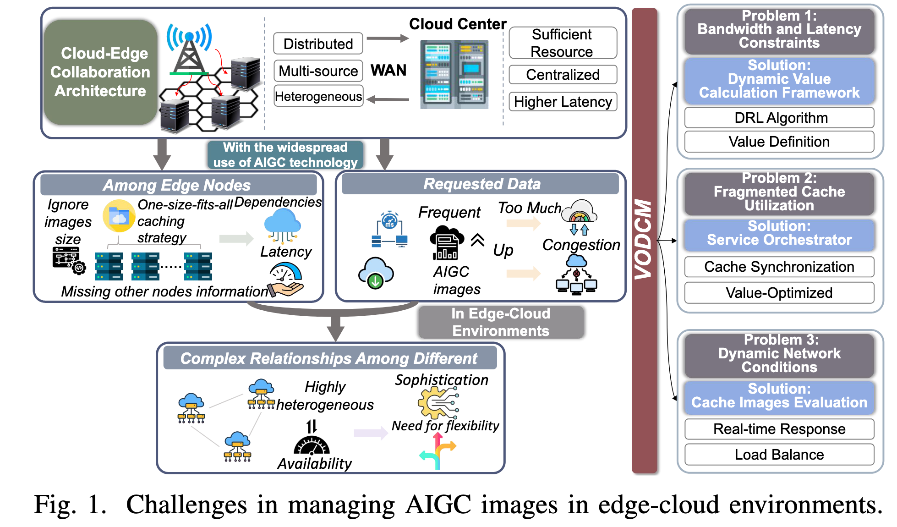
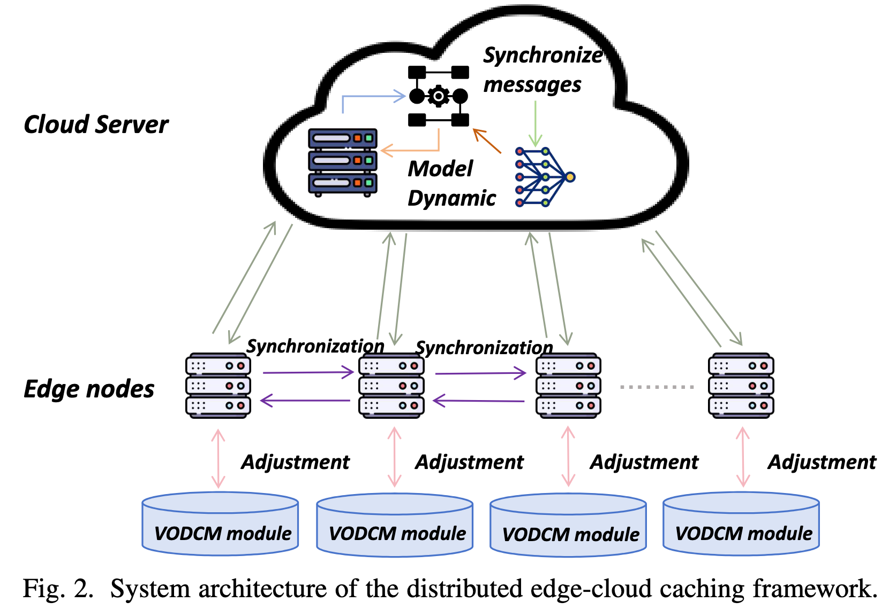
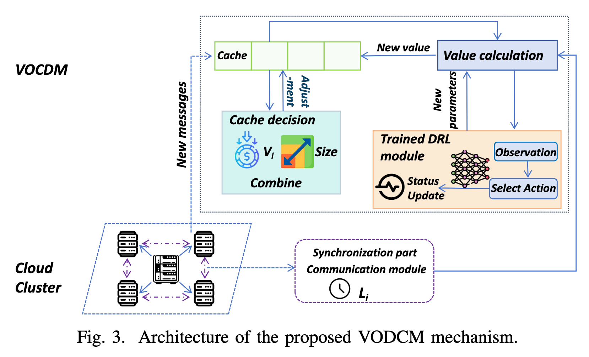
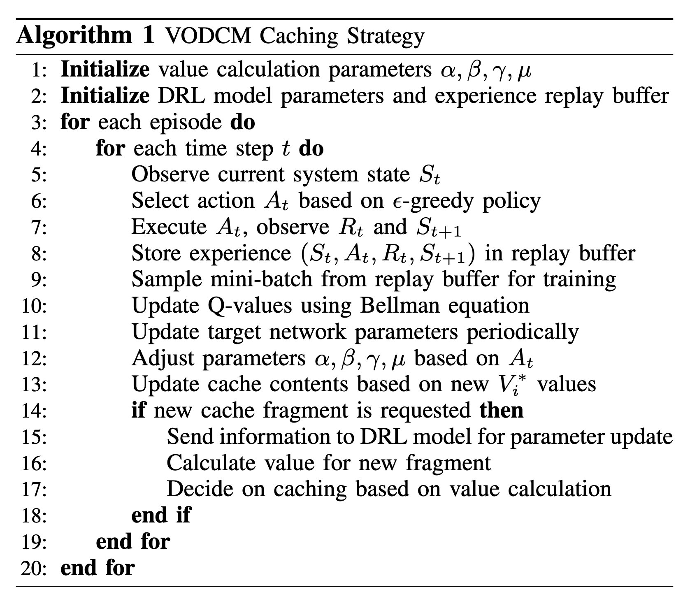
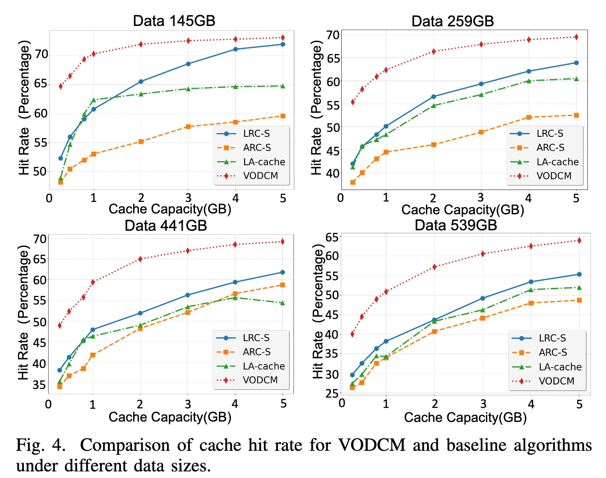
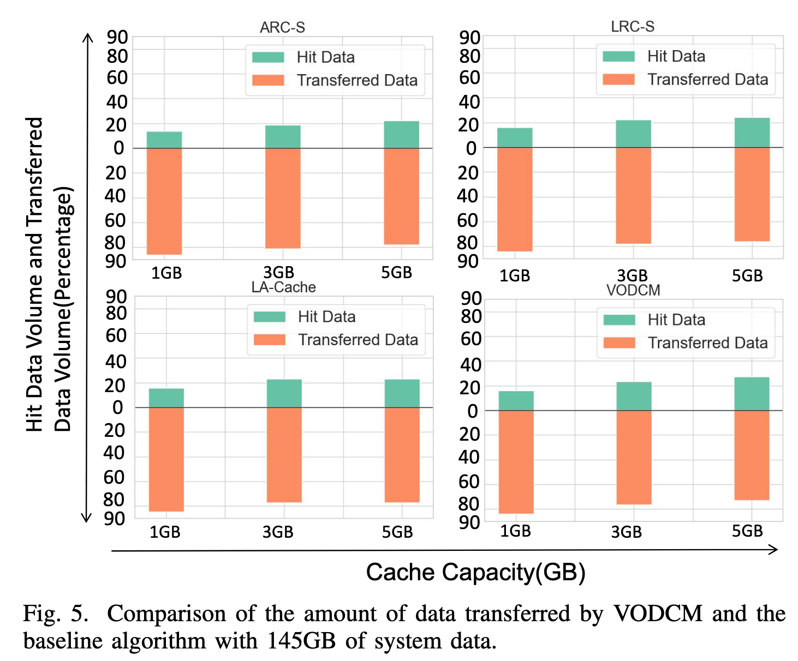

论文题目： VODCM: Value-Optimized Distributed Caching Mechanism for Containerized AIGC  Services in Edge-Cloud Environments
# 论文阅读
## abstract

随着人工智能生成内容（AIGC）服务的兴起，在边云环境中部署此类服务正变得越来越普遍。容器化具有资源隔离、轻量化部署和可移植性等优势，因此非常适合用于部署 AIGC 服务。然而，AIGC 服务通常依赖体积较大的容器镜像，导致部署时延增加，并消耗大量带宽资源。

对真实运行轨迹的分析表明，镜像请求具有明显的长尾效应，即少量热门镜像占据了大多数请求。这说明缓存机制具有很大的优化潜力。尤其在高负载情况下，这种请求模式可能导致频繁的缓存未命中，并增加带宽消耗。

本文提出了一种**价值优化分布式缓存机制**（Value-Optimized Distributed Caching Mechanism，VODCM）。该机制将价值驱动框架与深度强化学习（DRL）相结合，动态优化缓存策略。VODCM 根据访问频率、镜像层大小和网络时延对高价值镜像进行优先缓存，从而显著提高缓存命中率并降低网络开销。

初步评估结果表明，VODCM 能够提高缓存效率，降低网络和资源需求，为边云环境中的 AIGC 镜像管理提供一种有效的解决方案。

## I. 引言

随着人工智能生成内容（Artificial Intelligence Generated Content，AIGC）服务的迅速兴起，利用边云基础设施部署此类服务受到了越来越多的关注 [1]–[3]。边云架构具有降低时延、增强数据隐私以及提供本地化处理能力等独特优势，能够较好地满足 AIGC 应用对高强度计算和实时性的要求。因此，学术界和工业界都开始探索在边云系统中高效部署 AIGC 服务的方法，以提升服务效率和用户体验。

为了在分布式边云环境中快速部署 AIGC 服务，容器化成为一种颇具前景的技术。容器化具有资源隔离、架构轻量和可移植性强等优点，可以提高部署效率。然而，这些服务通常依赖体积较大的容器镜像，从而增加部署时延并消耗大量带宽资源，进而影响边云系统的整体运行效率。

针对上述问题，对真实镜像请求日志的分析表明，请求分布呈现明显的长尾效应，即少量热门镜像占据了大多数请求 [4]。这一现象说明，在镜像密集型应用中，缓存机制具有显著的资源效率提升和内容分发优化潜力。

现有缓存算法往往没有考虑一些会显著影响其效果的关键因素。例如，这些算法经常忽略系统中不同镜像层的大小、获取数据时产生的传输时延，以及不同用户需求所带来的多样化访问模式 [5], [6]。这种忽视会导致缓存利用率不理想，使现有资源无法得到充分利用，进而造成性能下降。此外，随着边云集群规模不断扩大，这些问题会变得更加突出。网络状况的动态变化以及数据访问模式的不确定性，使高效的缓存管理变得更加复杂，因此需要更具适应性和响应能力的缓存策略。

如图 1 所示，在边云环境中优化缓存性能仍面临以下几个关键挑战：

- **带宽和时延限制：** AIGC 应用会产生大量数据，因此需要从远程仓库下载镜像，这将消耗大量带宽，并可能造成网络拥塞。在大规模容器部署场景中，这一问题尤为严重，因为传输时延会对应用的响应能力产生负面影响 [7]。
    
- **缓存利用碎片化：** 现有缓存策略通常忽略镜像层大小和传输时延等关键因素，导致缓存利用效率较低。在分布式系统中 [8]，缓存镜像可能不均匀地分布在各个节点上，从而导致不同的访问时延；对于缺失的镜像层，系统也会更加依赖云端存储。这不仅会加剧网络拥塞，还会显著降低应用的响应速度，表明系统亟需更有效的缓存机制。
    
- **动态网络状况：** 边云环境具有高度异构性，不同节点之间的网络时延、计算能力和可用带宽均存在显著且动态的差异 [9]。这种资源差异进一步增加了统一缓存策略的应用难度 [10]，因此需要更加灵活、智能的自适应解决方案，以有效响应实时运行状况。
    

为应对这些挑战，本文提出了一种新的**价值优化分布式缓存机制**（Value-Optimized Distributed Caching Mechanism，VODCM）。该机制基于价值计算框架动态调整缓存策略。VODCM 采用价值驱动的方法，综合考虑镜像层大小、传输时延和节点自身状况等因素，对容器镜像进行优先级排序。该机制能够智能分配缓存资源，从而提高缓存命中率并降低系统开销。

本文的主要贡献如下：

- **动态价值计算框架：** 提出一种根据多项指标评估缓存镜像的框架，从而更加有效地利用缓存资源。
    
- **可扩展性与适应性：** 所提出的方案能够随分布式系统复杂度的增加而扩展，并可实时适应不断变化的网络状况和工作负载需求。
    
- **仿真性能评估：** 初步仿真实验表明，在边云场景下，VODCM 在缓存效率和系统稳定性方面具有优于传统基线方法的潜力。
    

在后续章节中，本文将首先详细介绍系统模型和问题建模，随后通过仿真实验评估 VODCM 在边云基础设施中的性能，并讨论其在不同条件下的表现。

## II. 系统模型与问题建模

### A. 系统架构

本系统旨在优化边云基础设施中的 AIGC 容器镜像缓存。如图 2 所示，该架构由多个相互连接的云节点和边缘节点组成，每个节点都具备本地缓存和计算能力 [11]。系统的主要目标是提高缓存命中率。缓存命中率可以通过减少传输时延和带宽消耗，对系统性能的提升发挥关键作用。为了最大限度地利用本地缓存并减少对远程数据获取的依赖，需要在这些节点之间对镜像层进行高效的管理与分配。

系统中的每个节点都维护一个本地缓存，用于存储经常被访问的镜像层。各节点通过高速网络进行通信，共享自身的缓存状态，并实时协调资源分配。该架构能够根据网络状况和工作负载需求的变化动态调整缓存，因此非常适合处理具有动态性和异构性的边云 AIGC 工作负载。

### B. 价值计算模型

在分布式缓存系统中，要有效确定应该缓存哪些镜像层，需要建立一种能够适应网络状况和访问条件变化的动态模型。LRC-S（Least Recently Cached with Size-based Eviction，考虑大小的最近最少缓存淘汰策略）和 ARC-S（Adaptive Replacement Cache with Size-based Eviction，考虑大小的自适应替换缓存策略）等现有模型，通过引入机器学习来优化缓存替换决策，相比传统方法已经取得了一定改进。

>

然而，这些方法通常过于关注缓存容量限制或访问频率中的某一个因素，而忽略了网络时延、数据流行度和访问新近性之间的复杂关系 [12]。

在这些研究的基础上，本文提出的 VODCM 引入了一种动态的价值驱动框架。该框架根据多个实时因素评估缓存镜像层，包括访问新近性 $T_i$、系统流行度 $P_i$ 和网络时延差 $\Delta L_i$。镜像层 $i$ 的价值计算如下：

$$ V_i=\alpha\cdot\frac{1}{T_i}+\beta\cdot P_i-\gamma\cdot\Delta L_i \tag{1} $$

$V_i$ 由以下三个关键因素决定：

- $T_i$ 表示自镜像层 $i$ 上次被访问以来经过的时间，用于反映该镜像层的访问新近性。$T_i$ 越小，$1/T_i$ 越大。
- $P_i$ 表示镜像层 $i$ 的流行度，用于反映整个系统对该镜像层的总体需求。
- $\Delta L_i$ 表示从本地缓存获取该镜像层与从远程节点获取该镜像层之间的时延差。

这三个因素通过权重参数 $\alpha$、$\beta$ 和 $\gamma$ 组合起来，形成镜像层的总体价值 $V_i$。

为了进一步完善价值计算，本文引入了复合加权函数 $\phi_i$。该函数能够根据系统当前的运行状况，动态调整 $T_i$ 和 $P_i$ 的影响：

$$ \phi_i=\alpha\cdot\frac{1}{T_i^\rho}+\beta\cdot P_i^\sigma \tag{2} $$

其中，$\rho$ 和 $\sigma$ 是敏感度参数，分别控制访问新近性和流行度所占的权重。

较大的 $\rho$ 会提高模型对访问新近性的敏感程度；较大的 $\sigma$ 则会增强流行度对计算结果的影响。这种灵活性使模型能够动态适应不同的工作负载和系统状态。

最终，镜像层 $i$ 的价值 $V_i^*$ 计算如下：

$$ V_i^*=\phi_i-\gamma\cdot\Delta L_i \tag{3} $$

LRC-S 主要关注缓存容量限制，ARC-S 则根据过去的访问频率调整缓存替换决策。与它们相比，本文的模型在决策过程中进一步引入了网络时延，从而优先处理那些访问频繁且重新获取成本较高的容器镜像。

这种额外的灵活性使 VODCM 更适用于网络状况和访问模式均会发生显著变化的环境。

### C. 问题建模

本文缓存策略的目标是在不超过给定缓存容量 $C$ 的前提下，尽可能提高缓存命中率。

由此，可以将问题表示为以下优化问题。是否缓存镜像层 $i$ 由二元变量 $X_i$ 表示：

$$ \underset{X}{maximize} \quad \sum_{i=1}^{N}V_i^*\cdot X_i \tag{4} $$

约束条件为：

$$ \sum_{i=1}^{N}S_i\cdot X_i\leq C \tag{5} $$$$ X_i\in\{0,1\}, \qquad i=1,2,\ldots,N \tag{6} $$

其中：

- 当 $X_i=1$ 时，表示镜像层 $i$ 被缓存；
- 当 $X_i=0$ 时，表示镜像层 $i$ 不被缓存；
- $S_i$ 表示镜像层 $i$ 的大小；
- $C$ 表示缓存总容量。

约束式（5）保证所有已缓存镜像层的总大小不会超过缓存容量 \(C\)。

该优化问题需要在镜像层价值 $V_i^*$ 与可用缓存容量之间取得平衡。镜像层的价值综合考虑了访问新近性、流行度和网络时延。这个问题的主要难点在于：需要动态调整权重参数 $\alpha$、$\beta$ 和 $\gamma$，以最大化整个价值函数。

为此，本文引入了一种深度强化学习框架 [13]。该框架根据系统的实时反馈，学习 $\alpha$、$\beta$ 和 $\gamma$ 的最优取值。

与 LRC-S 和 ARC-S 等近期算法相比，本文方法可以在高度动态的环境中更加精细地控制缓存决策。下一节将介绍该强化学习框架，并详细说明用于比较 VODCM 与这些先进缓存算法的仿真实验设置。

## III. 所提出的 VODCM 机制

VODCM 通过动态优化缓存策略，解决边云环境中的缓存管理问题 [14]。AIGC 工作负载和分布式基础设施具有高度动态性，因此需要一种能够实时适应网络状况、数据访问模式和缓存需求变化的解决方案。

VODCM 将价值计算模型与深度强化学习（DRL）框架相结合，对不同镜像层进行智能排序和管理，从而提高缓存命中率，并降低系统整体时延。

VODCM 由三个核心模块构成：

- **价值计算模块**
- **基于 DRL 的决策引擎**
- **缓存管理模块**

这些模块相互协作，评估镜像层的重要性、学习最优缓存策略 [15]，并根据 DRL 引擎做出的决策执行缓存操作 [16]。VODCM 的整体架构如图 3 所示。

### A. 价值计算框架

第 II 节介绍的价值计算模型综合考虑了访问新近性、流行度和网络时延等因素，为确定镜像层的缓存优先级提供了基础。

然而，在动态边云环境中，这些因素的影响程度必须持续调整，才能反映网络状况、访问模式和工作负载的变化。为此，VODCM 引入了一种基于 DRL 的动态调整机制 [17]，以保证能够实时、准确地评估每个缓存镜像层的价值 [18]。

考虑动态因素后，镜像层 $i$ 的改进价值 $V_i^*$ 计算如下：

$$ V_i^* = \alpha_t\frac{1}{T_i} +\beta_tP_i -\gamma_t\Delta L_i\theta_i +\mu_tD_i \tag{7} $$

其中，$\alpha_t$、$\beta_t$、$\gamma_t$ 和 $\mu_t$ 是随时间变化的权重系数。DRL 模型会在每个时间步 $t$ 动态调整这些权重，以实时反映以下因素的重要程度：

- $T_i$：镜像层 $i$ 的访问新近性；
- $P_i$：镜像层 $i$ 的流行度；
- $\Delta L_i$：本地与远程获取该层的时延差；
- $D_i$：镜像层 $i$ 的数据冗余程度。

参数 $\theta_i$ 是时延调整因子，用于根据具体传输路径微调网络时延的影响。$D_i$ 是数据冗余因子，表示分布式系统中可用的镜像层 $i$ 的副本数量 [19]。

通过综合这些因素，VODCM 可以根据实时网络状况和系统需求，动态调整每个镜像层的重要程度。在需要优化缓存利用率、降低传输时延并提高缓存命中率的环境中，这种机制尤为重要 [20]。

### B. 基于 DRL 的缓存决策引擎

基于 DRL 的缓存决策引擎通过持续调整关键参数 $\alpha_t$、$\beta_t$、$\gamma_t$ 和 $\mu_t$，学习最优缓存策略。

该过程使用深度 Q 网络（Deep Q-Network，DQN）实现。DQN 根据系统运行表现进行学习，目标是最大化长期累积奖励 [21]。

#### 1. 状态空间

状态空间 $S_t$ 表示当前系统状态，包括：

- **缓存占用情况 $O_t$**：记录缓存中镜像层的数量和大小；
- **镜像层访问频率 $F_t$**：记录特定时间窗口内各镜像层的访问频率；
- **网络时延 $L_t$**：表示节点之间的通信时延；
- **价值计算参数 $\Theta_t$**：实时控制访问新近性、流行度、时延和冗余度等因素的权重。

#### 2. 动作空间

动作空间 $A_t$ 定义了时间步 $t$ 可以执行的所有参数调整操作，用于控制访问新近性、流行度、时延和冗余度所对应的权重 $\alpha_t$、$\beta_t$、$\gamma_t$ 和 $\mu_t$。

对于每个权重，动作包括：

- 增大权重；
- 减小权重；
- 保持权重不变。

这种动态调整方式使 DRL 模型能够探索不同的参数组合，并在不断变化的运行条件下优化缓存性能。

#### 3. 奖励函数

奖励函数 $R_t$ 通过平衡多项关键性能指标来驱动 DRL 模型的学习过程。这些指标包括缓存命中率 $H_t$、系统时延 $L_t$ 和缓存利用率 $U_t$。

奖励函数鼓励较高的缓存效率，同时使用惩罚项 $P_t$ 对过于频繁的缓存替换进行惩罚，从而保证缓存策略在改善系统性能的同时，不会引入不必要的额外开销：

$$ R_t = \eta H_t -\xi L_t +\zeta U_t -\lambda P_t \tag{8} $$

其中，$\eta$、$\xi$、$\zeta$ 和 $\lambda$ 用于控制不同优化目标之间的权衡。该奖励函数综合平衡缓存命中率、系统时延、资源利用率和缓存替换开销，引导 DRL 模型逐渐学习最优缓存策略。

#### 4. 策略

策略 $\pi$ 是 DRL 模型根据当前状态 $S_t$ 选择动作的完整规则。该策略的主要目标是最大化一段时间内获得的累积奖励，使模型能够学习出有效的缓存管理方法。

当 DRL 模型与动态系统持续交互，并通过奖励函数获得反馈时，它会逐渐改进自己的策略，从而做出越来越合理的缓存决策，提高系统的整体性能和运行效率。

### C. 动态缓存更新机制

VODCM 的动态缓存更新机制根据 DRL 模型的决策实时调整缓存内容。随着系统条件发生变化，该机制会保留高价值镜像层、淘汰低价值镜像层，从而优化缓存效率和系统性能。

通过持续适应不断变化的系统状态，VODCM 可以提高资源分配效率并降低时延，最终改善用户体验和系统响应能力。

该机制包括以下四个环节：

- **缓存监控：** 持续跟踪缓存状态，包括镜像层价值、访问模式和网络状况。系统使用这些信息更新价值计算参数，并判断是否需要调整缓存，从而根据实时运行状况主动管理缓存资源。

- **策略调整：** 根据 DRL 模型给出的建议，动态更新价值计算参数 $\alpha$、$\beta$、$\gamma$ 和 $\mu$。通过这种调整，缓存策略能够与当前访问模式和网络需求保持一致。

- **缓存管理：** 根据重新计算得到的 $V_i^*$ 和当前可用缓存容量，添加、替换或删除镜像层。价值较高的镜像层会被优先保留，价值较低的镜像层则会优先被替换，从而优化缓存空间及其使用效率。

- **反馈循环：** 定期通过奖励函数中的指标评估缓存管理效果，并将结果反馈给 DRL 模型，以进一步优化参数。这使缓存策略能够随时间持续调整并改善性能。

通过上述动态更新机制，VODCM 能够主动适应网络状况和工作负载模式的变化，维持较优的缓存配置，持续提升系统性能并减少不必要的数据传输，最终提高边云部署的运行效率并降低运行成本。

### D. VODCM 实现算法

该机制的核心是一套综合考虑多种缓存性能指标的价值计算公式。公式中的参数由训练后的 DRL 模型动态调整。DRL 模型通过持续与系统交互进行学习，并不断改进参数调整策略。

当系统请求一个新的镜像层时，模型会根据相关输入信息更新参数，并重新校准价值计算方式。系统随后计算新镜像层的价值，并将其潜在收益与当前缓存内容进行比较，以确定是否应该缓存该镜像层，从而做出较优决策。

完整的伪代码如算法 1 所示。

## IV. 实验评估

在实验中，本文使用分布式仿真平台，对不同缓存算法进行了详细的性能分析。仿真实验基于 IBM 数据中心连续 75 天的观测数据集 [12]，并从中选择了四个具有代表性的数据集，其总容量分别为 145 GB、259 GB、441 GB 和 539 GB，用于模拟真实工作负载。

本次评估的主要目标是模拟云边环境，并比较 LA-cache [22]、LRC-S 和 ARC-S 三种缓存算法在资源利用效率和缓存命中率优化方面的效果。为了评估这些算法在不同数据规模和缓存容量限制下的性能，本文采用以下评价指标。

### A. 评价指标

为了评估缓存算法的性能，本文主要关注以下两个指标。

#### 1. 缓存命中率

缓存命中率表示能够直接由本地缓存提供服务的数据请求占全部请求的比例，用于反映每种缓存策略保留高频访问数据的能力。

较高的缓存命中率意味着算法可以减少从远程节点获取数据的需求，从而降低访问时延并提高系统响应速度。

#### 2. 数据传输效率

数据传输效率通过两个相关的子指标进行评估：

- **命中数据量（Hit Data Volume）：** 从本地缓存中成功获取的数据总量。
- **传输数据量（Transferred Data Volume）：** 为处理缓存未命中而通过网络传输的数据总量。

较高的命中数据量与较低的传输数据量相结合，意味着系统具有更高的带宽利用效率和更低的网络负载。这反映了算法优化数据放置并减少不必要数据传输的能力。

### B. 实验结果与分析

#### 1. 缓存命中率

图 4 展示了在四种不同数据规模下，VODCM 与基线算法 LA-cache、LRC-S 和 ARC-S 的缓存命中率对比。

实验结果表明，VODCM 在所有数据集上都能持续获得最高的缓存命中率。这种性能提升在较大规模的数据集，即 441 GB 和 539 GB 数据集上尤为明显。在这些数据集上，VODCM 的性能显著优于 LRC-S 和 ARC-S。

其主要原因在于，VODCM 采用动态的价值驱动方法，同时考虑访问频率和数据大小，从而优化高价值镜像层的保留策略。这可以减少缓存淘汰次数，并提高缓存命中率。

具体而言，从图 4 中各条曲线的变化趋势可以看出：对于 441 GB 数据集，当缓存容量为 5 GB 时，VODCM 的缓存命中率接近 70%，分别比 LRC-S 和 ARC-S 高约 12% 和 17%。

对于规模更大的 539 GB 数据集，VODCM 的缓存命中率也始终高于其他基线算法。这一表现说明 VODCM 的缓存策略具有较强的稳健性和适应能力，尤其适合处理复杂访问模式和大规模数据环境。

#### 2. 命中数据量与传输数据量

为了进一步评估 VODCM 的效率和有效性，本文针对规模较小的数据集，例如 145 GB 数据集，分析了命中数据量和传输数据量，结果如图 5 所示。

实验结果表明，与基线算法相比，VODCM 能够获得显著更高的命中数据量以及明显更低的传输数据量。即使在较小的数据规模下，这种优势仍然较为明显。

在相同的 5 GB 缓存容量下：

- VODCM 的数据传输量比 LA-cache 约低 5%；
- VODCM 的数据传输量比 ARC-S 约低 7%。

对于 145 GB 数据集，VODCM 的命中数据量达到 39.45 GB，高于 LRC-S 的 35.11 GB 和 ARC-S 的 32.04 GB。

这一结果表明，VODCM 能够优化缓存空间的利用并降低网络负载，因此非常适合带宽受限或数据量较大的应用场景。较低的传输数据量说明该算法能够有效减少不必要的数据移动，从而提升系统整体性能并降低数据传输成本。

总的来说，在缓存命中率和数据传输效率方面，VODCM 的性能优于传统方法，尤其是在大规模分布式环境中。

VODCM 的自适应缓存策略能够根据数据特征、访问模式和网络状况进行动态调整，从而减少数据传输开销并优化资源利用。这样的适应能力使系统能够在工作负载变化和资源受限的条件下保持较高效率，因此 VODCM 可以作为一种提高现代分布式缓存系统吞吐量的可靠解决方案。

# 思考

这篇论文感觉比较有意思的点就是以往强化学习都是直接学习如果决策，具体对于缓存而言的话就是学习缓存替换策略，而论文则是通过让强化学习学一组重要性权重，然后学到的这个重要性权重结合统计信息进行加权得到一个值根据这个值来决策